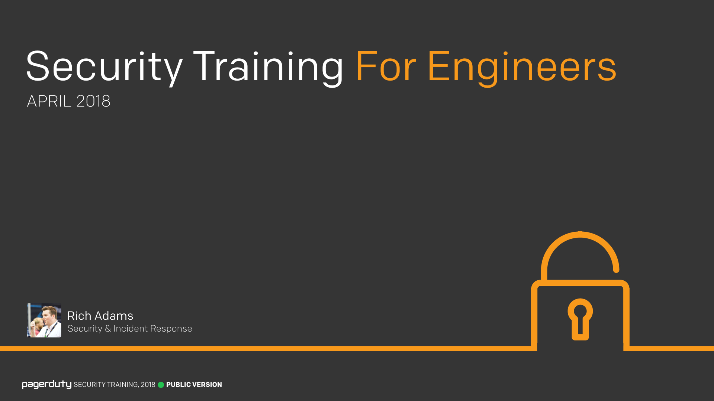
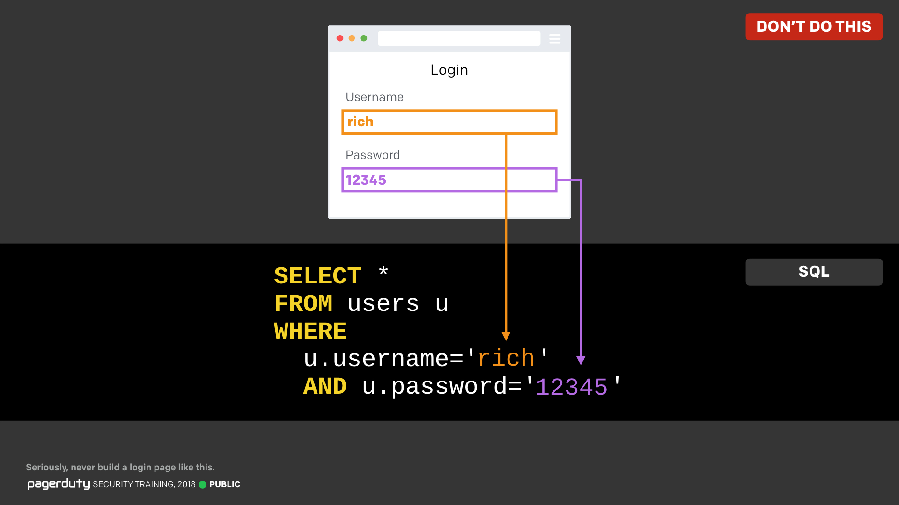
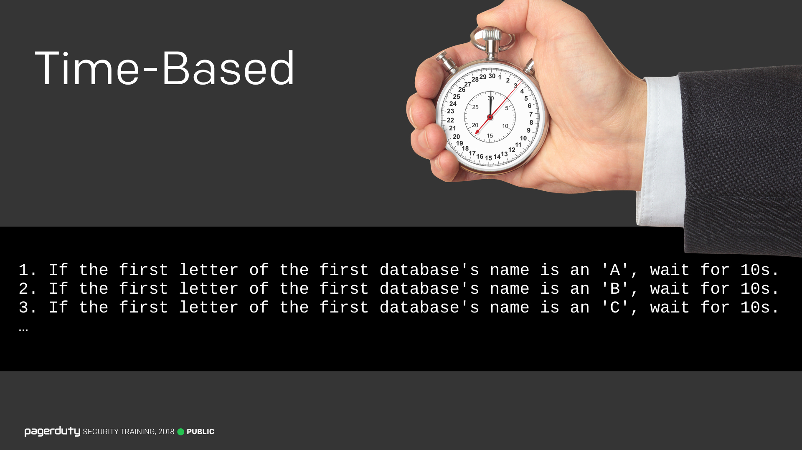
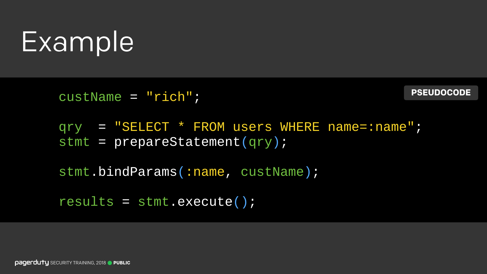
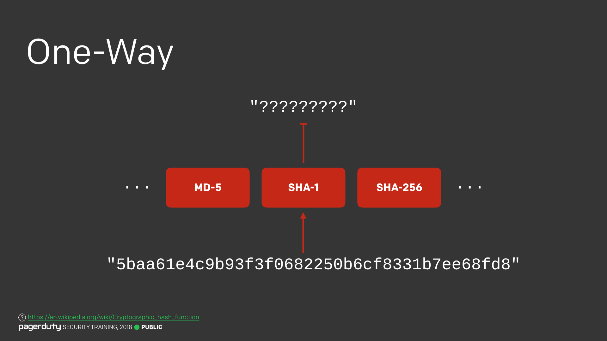
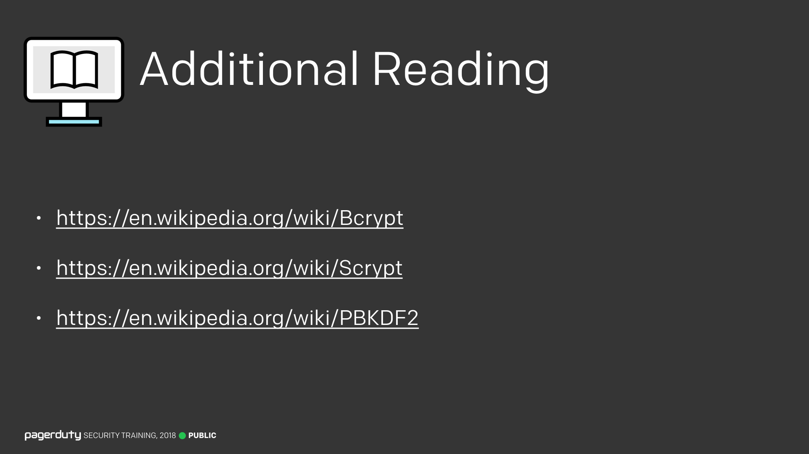
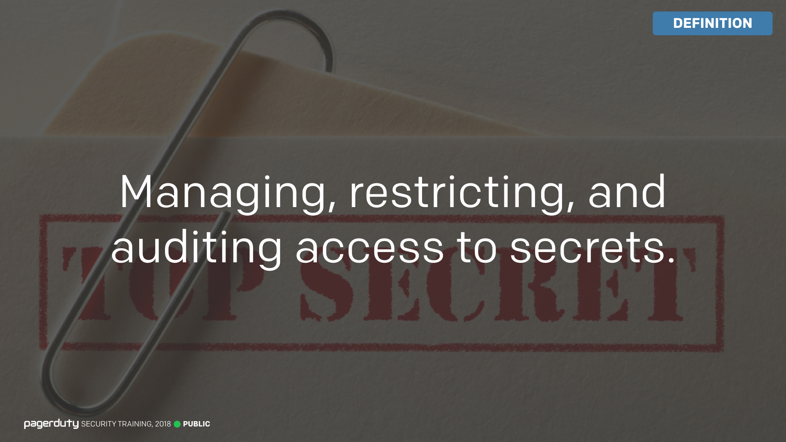
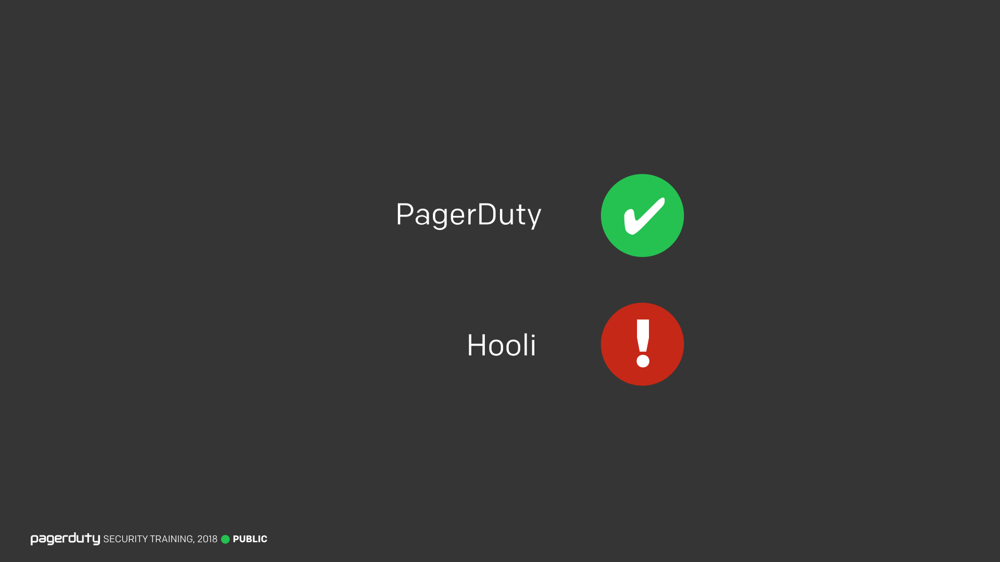
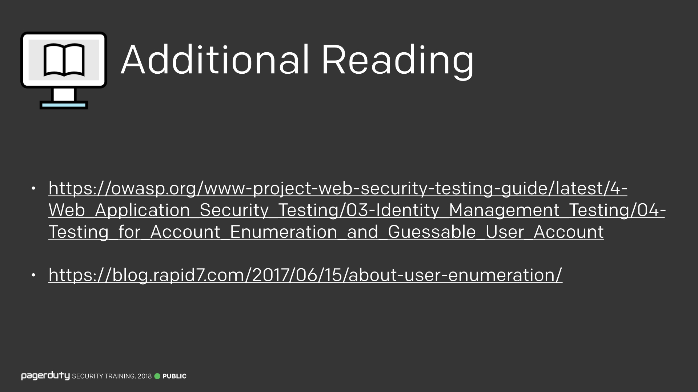
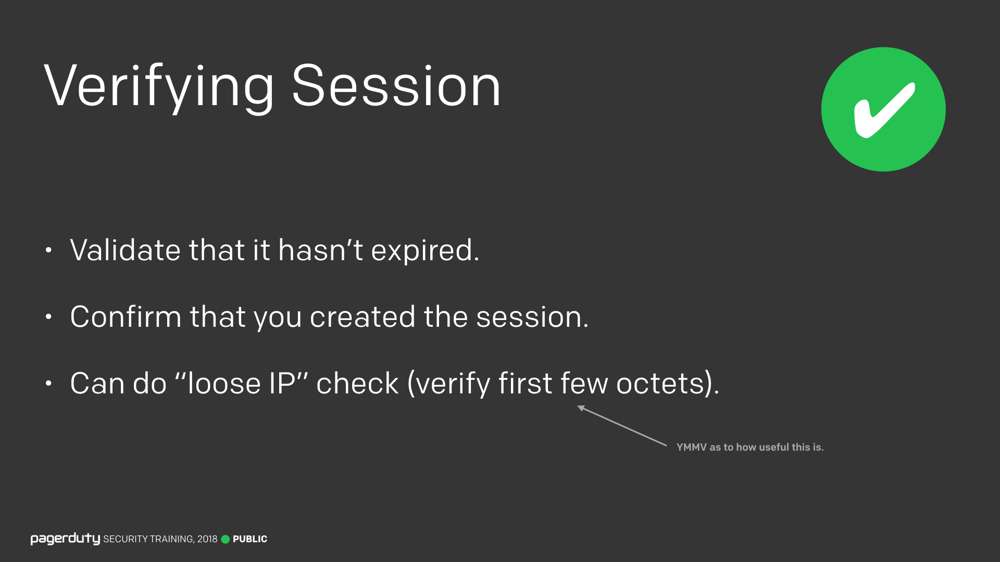

!!!info "Security Training for Engineers"
    This is an [open-source](https://github.com/pagerduty/security-training) version of "Security Training for Engineers", PagerDuty's internal technical security training, open to all PagerDuty employees as part of our continuous security training program.

    Unlike our course [for everyone](/for_everyone/), this course covers more technical topics and is more applicable to those in an engineering role. While it delves into various technical topics, it has been designed in such a way as it should be useful regardless of your skill level, whether you've just started your engineering career, or you've been doing this for years.

    While some of the material we present internally contains sensitive PagerDuty information, the majority consists of generic security lessons, presented in a light-hearted and informative way. Many employees asked for a version of the training they could share with friends and family. This site is the culmination of our efforts to do just that.

    The text presented here is a semi-accurate transcription of how the training was delivered.

---

### Introduction

<input type="checkbox" id="001" /><label for="001"></label>
_001. "Security Training for Engineers, April 2018"_

Welcome to "Security Training for Engineers". This talk is specifically geared towards engineers, and is going to be a bit more technical than the [last training](/for_everyone/). If you're not an engineer though, don't worry, you're more than welcome to stay. While the topics will be technical in nature, it should be informative no matter what your skill level is, whether you're just getting started, or are a seasoned engineer with years of experience.

For those who've not met me yet, "Hi, I'm Rich". I work on security and incident response, and make lots of silly jokes. You'll get used to it.

Anyway, let's get stuck in.

---

### Testimonial

<input type="checkbox" id="002" /><label for="002"></label>
_002. Testimonial quote._

If you've joined PagerDuty in the last year, then this will be your first time going through this particular training course. It's had rave reviews in the past, as you can see here from this completely genuine testimonial quote, which I totally didn't make up in any way.

---

### Classification

<input type="checkbox" id="003" /><label for="003"></label>
_003. Classification ratings for these slides._

Before we delve into the main content, I wanted to give you all a quick reminder of our slide classifications. We went through this at the last training, but the same applies to this one too. Please respect the classifications that are added to these slides and don't share ones which shouldn't be shared. As with our previous training, this one will also be open-sourced so you can share it with friends and family, and the internal version will be available on the wiki along with the recording.

---

### Goal

<input type="checkbox" id="004" /><label for="004"></label>
_004. Goal of the training._

So why are you all here today? The goal of today's training is to give you the opportunity to learn about a variety of common security vulnerabilities that are relevant when developing software. I'm not just going to show you what they are, and how to stop them, but I'm also going to show you how to exploit them too. Exploiting these vulnerabilities is usually the best way to really learn how they work, and is an important part of knowing how to stop them. Plus it's more fun to show you how to exploit them.

---

### Topics

<input type="checkbox" id="005" /><label for="005"></label>
_005. List of topics we'll be covering._

I’m going to be covering a **lot** of different topics. Don't be put off by the quantity here, some I’ll go into quite a bit of depth on, but others I’ll just be touching on briefly. Some of these may already be familiar to you, but hopefully you’ll still learn something new if that's the case.

---

### Warning

_<input type="checkbox" id="006" /><label for="006"></label>_
_006. Warning sign._

But I want to kick things off with some quick warnings...

---

### Framework

<input type="checkbox" id="007" /><label for="007"></label>
_007. "The framework takes care of that for me..."_

I often hear this statement from developers, that their framework of choice takes care of all the nitty gritty security things for them, so they don't need to understand how they work. I'm here to tell you that that is completely not the case. Rails, Akka, Symphony, whatever you use, you can't just blindly assume your framework or library of choice has you covered. Yes, it's convenient that they do all the heavy lifting for you, but you can't just abdicate your responsibility to understand and be able to repair security issues yourself.  

---

### Framework Issues

<input type="checkbox" id="008" /><label for="008"></label>
_008. Rails vulnerabilities. [Reference](https://www.cvedetails.com/vulnerability-list/vendor_id-12043/product_id-22568/Rubyonrails-Ruby-On-Rails.html)_

Because even though frameworks are great, they are not immune to security issues (Spoiler: No software is immune to security issues). If a new vulnerability is publicly announced, you can't always just sit around and wait for an official patch. You will need the knowledge of how the security vulnerability works so that you can patch it yourself. Because attackers aren't going to wait around, they're going to start exploiting them immediately.

Now, I'm certainly not advocating against using frameworks, you definitely should, I'm merely saying that you should never assume the framework will always protect you.

---

### Don't Trust Blindly

<input type="checkbox" id="009" /><label for="009"></label>
_009. Don't trust frameworks blindly._

Basically, you shouldn't blindly trust frameworks. It’s important to understand the underlying principles, so you can tell when the framework isn’t doing what it should, and so you can quickly fix things when it turns out they’re not.

---

### Hackday

<input type="checkbox" id="010" /><label for="010"></label>
_010. It's just for a Hackday._

Another statement I hear occasionally is "It's just temporary for a Hackday", often used as an excuse for attempting to ignore security best practices.

---

### Hackday Security

<input type="checkbox" id="011" /><label for="011"></label>
_011. Hackday security._

Just because it's a Hackday, it doesn't mean you can ignore the rules. I know you want to make something work quickly, and you don't want to mess about with all this "security" stuff. But it's important and should not be ignored. You shouldn't be trying to disable firewall rules for Hackdays (and yes, we do get immediately paged if you try), and you shouldn't use a public code repository to develop your Hackday idea, it's fine to open-source it later, but sometimes you can give away information we don't want to be public yet.

Finally, you should never ever be using customer data for your Hackdays, unless you're at the stage where it's getting pushed to production. We went over this on our last training, but I'll reiterate it again, customer data should never, under any circumstances, leave our production environment.

---

### Story Time

_<input type="checkbox" id="012" /><label for="012"></label>_
_012. Story Time._

With that out of the way, let's jump into a bit of story time.

---

### Critical Bug

<input type="checkbox" id="013" /><label for="013"></label>
_013-020. Redacted slides._

Redacted
> This series of redacted slides went through the story of how a critical security vulnerability was responsibly disclosed to us by a security researcher. We went over how the bug was reported to us, how we confirmed its validity, showed exactly where in our code the bug was (and why it was an issue), and how it was fixed. Due to the sensitive nature of the bug, we've chosen to redact this section.
>
> One thing worth sharing though is that one of the lessons in the redacted slides was related to the fact the bug was caused by a missing check in the code. This type of bug is very difficult to detect with automated tools, since the existing code itself is perfectly valid, the vulnerability comes from the absence of code.
>

---

### Every System Has Security Issues

<input type="checkbox" id="021" /><label for="021"></label>
_021. Every system has security issues._

The point I'm trying to make here is that we're not perfect. Every system in the world has security issues. An external researcher with no access to our source code (we hope) was able to find this bug. It's up to all of us to be on the lookout for things like this ourselves too.

It's not all doom and gloom though, there was a happy ending here...

---

### Happily Every After

<input type="checkbox" id="022" /><label for="022"></label>
_022. Redacted slide._

Redacted
> This slide showed details of our response to the security issue, including how long it took us to resolve it from the initial report (3h 47m), and some of our correspondence with the researcher (which is the reason for redacting this slide).

---

### SQL Injection

_<input type="checkbox" id="023" /><label for="023"></label>_
_023. SQL Injection._

OK, let's get started with some actual technical content. Our first main topic is SQL injection.

---

### SQL Injection Definition

<input type="checkbox" id="024" /><label for="024"></label>
_024. SQL injection definition._

What actually is it? This is the simplest one-liner I could come up with. It's any user input which is being _executed_ in an SQL query at runtime. That means the user is able to manipulate a database query based on their input.

---

### Login Page (1)

<input type="checkbox" id="025" /><label for="025"></label>
_025. Login page SQL._

Let's take a look at a quick example, using the query for a hypothetical (and very bad) login page. Seriously, never design a login page like this, I'm just using this as a contrived example to demonstrate.

When logging in, this will lookup the user record based on the username and password that is entered. If a result is returned, it will log that person in. Pretty simple, and there are actually login pages out there that work this way (unfortunately).

---

### Login Page (2)

<input type="checkbox" id="026" /><label for="026"></label>
_026. Login page working example._

So let's login with a real user to see how this works under normal conditions. The username and password get put into the query, which will then execute using those values.

---

### Login Page (3)

<input type="checkbox" id="027" /><label for="027"></label>
_027. Login page results._

The SQL statement is valid. The username and password are correct, so a single result is returned for the user, and they would now be logged in as this user.

> The keen eyed amongst you will have spotted that passwords should never be stored this way. We'll talk about properly storing passwords later. Remember, there's a big red icon in the corner here, never implement a login page like this!

OK, so that's all well and good. That's how the developer intended it to work.

---

### Login Page (4)

<input type="checkbox" id="028" /><label for="028"></label>
_028. How an attacker uses it._

But honest people aren't always going to be the ones using such a login form. Some users will be attackers, and they won't play by the rules. So let's say we have an attacker, and they now enter something like this instead. They have a username of `admin`, but a password of `' OR 1=1 --`.

As before, the username and password get replaced in the SQL statement. But something different has happened here. Because this code is susceptible to SQL injection, the query being executed has actually changed from what the developer wanted. You can see in the red box here that the SQL query is now different.

---

### Login Page (5)

<input type="checkbox" id="029" /><label for="029"></label>
_029. SQL has changed._

This new SQL statement has an extra condition in it, which means this query will return the row for the admin user, even though the correct password wasn't entered. The query added an `OR 1=1`, which will always evaluate to `true` (since 1 is always equal to 1). Since `OR true` will always be `true`, it doesn't matter what else the user entered, they will automatically get the correct result.

This user would now be logged in as an administrator even though they didn't know the password. That's not great.

---

### Login Page (6)

<input type="checkbox" id="030" /><label for="030"></label>
_030. Dropping a table from a login page._

This can get out of hand very quickly. Hopefully you can start to imagine other ways in which this could be dangerous if your code is susceptible to SQL injection.

---

### Bobby Tables

<input type="checkbox" id="031" /><label for="031"></label>
_031. Little Bobby Tables. [Reference](https://xkcd.com/327/)_

You may have come across this XKCD comic before, about a boy called Little Bobby Tables. If you didn't know what SQL injection was before, you should hopefully now start to have an idea of what's going on here.

---

### Companies House

<input type="checkbox" id="032" /><label for="032"></label>
_032. UK SQL injection company. [Reference](https://beta.companieshouse.gov.uk/company/10542519)_

There’s even a (completely legitimate) company in the UK with an SQL injection as their name. The Companies House site isn't susceptible to SQL injection, so this all works perfectly fine.

---

### Users Shouldn't Modify SQL

<input type="checkbox" id="033" /><label for="033"></label>
_033. Users shouldn't modify SQL._

The key takeaway here is that you should never let your users directly modify the SQL being executed. Users should be providing values only, and not be allowed to alter the structure of your query. If you need to have different queries executed based on some value the user picks, then they should be two distinct queries in your code.

---

### Lookup by ID

<input type="checkbox" id="034" /><label for="034"></label>
_034. Lookup by ID._

Now that we've seen a ridiculous and contrived example, let's look at something a little more realistic. Here's a typical query you might see which looks up a person's name based on their ID. This is a pretty standard pattern you'll see in a lot of codebases.

---

### Typical Usage

<input type="checkbox" id="035" /><label for="035"></label>
_035. How it's intended to be used._

Under normal conditions, you're meant to provide an ID number, and you'll get the user's name in return. This is how it's intended to be used. But if it's susceptible to SQL injection, there's a lot more information you can get out...

---

### Wildcard

<input type="checkbox" id="036" /><label for="036"></label>
_036. Wildcard._

What if we use a wildcard `%` instead of an ID number? Now we'll be able to see everyone's name from your user table. Something like this could allow an attacker to steal a full list of your users. But it's not too bad right? They can only get names and nothing super important like passwords...

---

### Union

<input type="checkbox" id="037" /><label for="037"></label>
_037. Union._

Unfortunately, once you have a single instance of SQL injection, it's pretty much game over and you can grab almost any data that you want. Here we can use a `UNION` to steal the usernames and passwords for every user too. But it's not too bad right? You can't access files on the filesystem or anything...

---

### Load File

<input type="checkbox" id="038" /><label for="038"></label>
_038. Load file._

Like I said, it's pretty much game over once you have an SQL injection point. You could use `LOAD_FILE` to load things from the filesystem too.

> It's worth noting that this isn't always possible, it will depend on permissions and any extra security the operating system has, but it's feasible at least.

---

### Blind Injection

<input type="checkbox" id="039" /><label for="039"></label>
_039. Blind Injection._

So far this example has required the output to be presented directly to the user in order to be useful. But even if that's not the case, you can still extract information, it just takes a bit longer. There's a technique called "Blind Injection" which can accomplish this. There are two main types...

---

### Boolean

<input type="checkbox" id="040" /><label for="040"></label>
_040. Boolean._

The first is boolean, where you can tell the database to throw an error depending on if a certain value is true or false. It'll take a while, but can easily be scripted to extract data.

---

### Time-Based

<input type="checkbox" id="041" /><label for="041"></label>
_041. Time-Based._

The other is time-based, where you can use the same technique, but add a time-delay and use that to extract the true or false value. Once you have an SQL injection, attackers can be very sneaky in the way data is exfiltrated.

---

### Escaping?

<input type="checkbox" id="042" /><label for="042"></label>
_042. Escaping?_

So how can we start to protect against SQL injection? Some folks like to try and add checks that will stop a statement from executing if it has "bad" words like `DROP` in it. Unfortunately, that isn't going to work. Not only would you need to maintain such a blacklist, and be careful to make it case-insensitive, etc. But there's always going to be ways around it.

Likewise, you might think that you can just escape all quotes from user input in order to stop the query being modified. Depending on the language you're using, these types of checks can also be bypassed in various sneaky ways. There's always going to be some strange [Unicode](https://en.wikipedia.org/wiki/Unicode) character you hadn't thought of that gets interpreted as a quote, or something silly like that. It's not really worth investing in these types of checks.

---

### Parameter Validation?

<input type="checkbox" id="043" /><label for="043"></label>
_043. Parameter Validation?_

What about parameter validation instead? If we only expect a field to contain an integer, we can just reject any input that's not what we expect it to be. This would certainly work for integer fields.

If a field only expects alphanumeric characters, again you can just restrict to those characters. This would also work, but you're going to start running into issues where users really do need to enter other characters. What about hyphens in people's names? What if you're running a website like [Stack Overflow](https://stackoverflow.com/) and you need to allow users to enter actual code samples in their comments?

Surely there's a better way?!

---

### Use Prepared Statements

<input type="checkbox" id="044" /><label for="044"></label>
_044. Use prepared statements._

We want to use something called "Prepared Statements" to solve this problem. This is one of the most surefire ways to protect against SQL injection.

---

### Prepared Statements?

<input type="checkbox" id="045" /><label for="045"></label>
_045. Prepared statements? [Reference](https://en.wikipedia.org/wiki/Prepared_statement)_

But what are they? Well, they're essentially an SQL template, where user values are substituted at runtime and can't modify the query. There's an added bonus here where this can also improve performance, as you can execute similar queries repeatedly with high efficiency.

---

### Prepare

<input type="checkbox" id="046" /><label for="046"></label>
_046. Step 1: Prepare._

Let's look at how prepared statements work. The first step is to "prepare" the query. This is where you define how your SQL statement will look, but the value is left blank, and instead you define a "placeholder" (there are other names that can be used here too).

---

### Optimize

<input type="checkbox" id="047" /><label for="047"></label>
_047. Step 2: Optimize._

The query is then sent to the database management system, where it’s compiled and optimized, but not executed (since it doesn't have any values yet).

---

### Execute

<input type="checkbox" id="048" /><label for="048"></label>
_048. Step 3: Execute._

The final step is when we come to execute the query. We "bind" the placeholders to a real value (or variable), and then tell the DBMS to execute the query with those values. Since the DBMS has already compiled the query, the user values cannot be interpreted as SQL, they can only be used as a value. Which is exactly what we want to stop SQL injection.

---

### Benefits

<input type="checkbox" id="049" /><label for="049"></label>
_049. Benefits._

Because the parameter values are transmitted later using a different protocol, they don't need to be correctly escaped. Assuming the original statement template is not derived from external input, SQL injection cannot occur.

We also get some optimization benefits from using this method as it’s compiled once on the DB and executed many times with different data.

---

### Prepared Statement Example

<input type="checkbox" id="050" /><label for="050"></label>
_050. Full prepared statement example._

Here's a quick pseudocode example of how it would all look when tied together.

---

### SQL Injection - Additional Reading

<input type="checkbox" id="051" /><label for="051"></label>
_051. Additional Reading._

SQL injection is one of the more common vulnerabilities that exist, and it can be devastating if exploited. There's lots of nuance involved and lots more I could have talked about. But since we don't have all day, here are some additional reading links if you're interested in understanding more about SQL injection and how to exploit it. The cheat sheets are particularly eye-opening.

* <http://pentestmonkey.net/cheat-sheet/sql-injection/mysql-sql-injection-cheat-sheet>
* <https://www.owasp.org/index.php/SQL_Injection_Prevention_Cheat_Sheet>
* <http://www.sqlinjection.net/time-based/>
* <https://www.owasp.org/index.php/Blind_SQL_Injection>
* <https://ckarande.gitbooks.io/owasp-nodegoat-tutorial/content/tutorial/a1_-_sql_and_nosql_injection.html>

---

### Storing Passwords

_<input type="checkbox" id="052" /><label for="052"></label>_
_052. Storing passwords._

In the first SQL injection example, I showed passwords that were passed to an SQL query in plaintext. That's obviously a very bad way to store passwords. I also talked about how to crack passwords in the [previous training](/for_everyone/). So what's the proper way to store passwords?

---

### Hashing

<input type="checkbox" id="053" /><label for="053"></label>
_053. Hashing. [Reference](https://en.wikipedia.org/wiki/Cryptographic_hash_function)_

First, let's quickly reHASH (get it?) what we covered in the last training.

A hash will take a value, and give you some seemingly random gibberish as an output. Given the same input, it will always give you the same output.

---

### One-Way

<input type="checkbox" id="054" /><label for="054"></label>
_054. One-Way. [Reference](https://en.wikipedia.org/wiki/Cryptographic_hash_function)_

They are essentially a one-way mathematical function. The idea is that it's very easy to take a value, and get a repeatable hash of it. But it's very difficult to have just the hash and reverse it back into the password.

Imagine trying to multiply two large prime numbers, multiplication is pretty easy and that wouldn't take too long. But what if you had the final number, and you had to discover which two prime numbers were multiplied to get it? That's going to be much harder to do. That's pretty much what's going on here.

So once you have a hashed value, you essentially can't get back to the password, unless you already have a mapping from hash back to password.

---

### Rainbow Tables

<input type="checkbox" id="055" /><label for="055"></label>
_055. Rainbow tables. [Reference](http://project-rainbowcrack.com/table.htm)_

This is what a rainbow table is. A precomputed list of hashes back to their original value. It allows you to quickly reverse hashes. You can get rainbow tables for all of the common hashing algorithms in use. I used SHA-1 in all my examples from the last training.

---

### Salting?

<input type="checkbox" id="056" /><label for="056"></label>
_056. Salting?_

I said in the previous training that there's something called "salting" which can protect against this type of attack. So what is this "salting" stuff?

---

### Salt Definition

<input type="checkbox" id="057" /><label for="057"></label>
_057. Definition of a salt. [Reference](https://en.wikipedia.org/wiki/Salt_(cryptography))_

A salt is some random data that's appended to a password before it's hashed, that's different every time. That means a salt should never be re-used, and shouldn't be the same for every user on your site (I'll talk more about this in a moment).

It's very important that the salt is different every time you create or change a password. Why?

---

### Salting

<input type="checkbox" id="058" /><label for="058"></label>
_058. Salting. [Reference](https://en.wikipedia.org/wiki/Salt_(cryptography))_

Let's look at a typical example of how it works. I would take the user's password, append a random piece of data to it (that's the salt), and hash it the same way you would have hashed the password.

---

### Salting (2)

<input type="checkbox" id="059" /><label for="059"></label>
_059. Same password, different hash. [Reference](https://en.wikipedia.org/wiki/Salt_(cryptography))_

Where this really comes into play is when you have two users with the same password. Since the salt is going to be different every time, that means two users with the same password will now get a completely different hash result at the end of it all.

---

### Database

<input type="checkbox" id="060" /><label for="060"></label>
_060. Database._

In our database, we would store the salt, along with the resulting hash. We store the salt so that we can still verify that a user has entered the correct password. So why bother with a salt at all? If an attacker has access to it, how does this help us?

Well, every one of the users in this database has exactly the same password. But because of salts, the resultant hash is different for everyone. This means you can no longer use a rainbow table to crack these passwords, since you'd have to make a custom rainbow table for each user (at which point you may as well just brute force things).

---

### Rainbow Tables Infeasible

<input type="checkbox" id="061" /><label for="061"></label>
_061. Rainbow tables are infeasible thanks to salting._

Thanks to using a salt, we've now made rainbow table attacks completely useless. This is why the salt **must** be different for every single password, otherwise it defeats the point.

---

### Salt is Public

<input type="checkbox" id="062" /><label for="062"></label>
_062. Salt is public._

You’ll notice that the salt was in plaintext in the database I showed, and that’s exactly as it should be. **Salts are not secrets** and should not be treated as such. They’re there to make rainbow table attacks infeasible, nothing more. Remember, that what we're doing here isn’t encryption, the salt is not a secret key or anything like that.

---

### Pepper?

<input type="checkbox" id="063" /><label for="063"></label>
_063. Pepper? [Reference](https://en.wikipedia.org/wiki/Pepper_(cryptography))_

There's also another piece of data that can be used to make password storage stronger. This is called a "Pepper", or I've sometimes seen it referred to as a "Site-wide Salt". A pepper is a piece of random data that's appended to every password, similar to how the salt was, however the difference is that the pepper is the same for everyone and isn't stored in the database. The pepper is treated as a secret and is kept on disk, or as part of whatever secret storage solution you happen to be using.

Why is a pepper useful? Well, in order to be able to try and brute force any stolen hashes, you’d need not only the database (which has the salt), but also the pepper. If you’ve stolen the database via SQL injection, it’s unlikely (but not impossible) you can also steal the pepper which is stored on disk. It can make it more difficult for an attacker, but it can also make it more difficult for you too. For example, rotating a compromised pepper can be a difficult challenge, and generally you just have to keep track of every pepper you’ve ever had.

---

### Pepper

<input type="checkbox" id="064" /><label for="064"></label>
_064. Pepper._

So if you wanted to use a pepper, the process would now look like this. You take the password, append the salt, append the pepper, and then hash that. That would then be the result you store in your database.

Whether you use a pepper or not though, there's still more to do.

---

### Slow Down

<input type="checkbox" id="065" /><label for="065"></label>
_065. Slow down!_

We still have a problem...if someone is able to steal the database and the pepper, they are still able to brute force those passwords just by trying every combination. They can't pre-compute them into a rainbow table, but they can do them in realtime.

Why is this possible? Because hashing is too fast! So far I've only shown you general purpose hashing functions, MD5, SHA-1, etc. The original purpose of these algorithms is to quickly compute a value so that you can use it to check and verify the integrity of a file. In those cases, you want it to be as fast as possible. But they weren't designed for secure password storage, where speed means that an attacker can try more combinations more quickly.

---

### Slow it Down

<input type="checkbox" id="066" /><label for="066"></label>
_066. Slow it down. [Reference](https://en.wikipedia.org/wiki/Key_stretching)_

So there's another step we need to make here. We want to slow down how quickly our hashing works. We typically don't like to slow things down as engineers, but in this case it's warranted.

If it takes 1 second for a user to be able to login, the user isn't really going to notice. But an attacker who wants to try to guess passwords, only being able to try 1 every second is going to make it very tedious for them.

The way we slow it down is by just running the hashing algorithm multiple times (called rounds). Each iteration should rely on the output of the previous one so that it can't be parallelized. We're not just spinning CPU cycles here, we are actually calculating something. This process is called "Key Stretching".

In this example, we're going to run the hash 100,000 extra times.

---

### Key Stretching

<input type="checkbox" id="067" /><label for="067"></label>
_067. Why do key stretching?_

Why do we do this? Well, because we’ve just made it 100,000 times harder for an attacker to brute force those passwords offline. Before they could try 100,000 passwords a second. Now they can only try one. For a user, this isn't a big deal, but for an attacker, we've just make it much more painful for them.

---

### Key Stretching (2)

<input type="checkbox" id="068" /><label for="068"></label>
_068. Things get flipped._

Unfortunately, we still have a problem. Hardware is always getting better. What's true today, might not be true in a year's time. An attacker might break out some GPUs and instead of mining Bitcoin, maybe they'll start hashing passwords instead. So how can we keep up?

---

### Adaptive Hashing

<input type="checkbox" id="069" /><label for="069"></label>
_069. Adaptive hashing._

We need to use something called adaptive hashing instead.

---

### Adaptive Hashing Definition

<input type="checkbox" id="070" /><label for="070"></label>
_070. Adaptive hashing definition._

Basically, adaptive hashing is the ability to change the number of rounds as time goes on. But 'rounds' are a strange concept, the speed is based on how fast your CPU is. So let's put this into other terms.

---

### Cost

<input type="checkbox" id="071" /><label for="071"></label>
_071. Cost. [Reference](https://www.tarsnap.com/scrypt/scrypt.pdf)_

Instead, what we really care about is the cost, or effort involved. There are algorithms where you can specify a "work factor", or "cost" value. Since what we really care about is how much time and money it's going to take an attacker to crack your passwords.

There's a great table here showing the different costs associated with cracking passwords using various different algorithms. PBKDF2, bcrypt, and scrypt are all purpose-built password hashing algorithms. They were designed specifically for passwords, so unlike MD5 or SHA-1, they are purposefully slower.

They also do pretty much everything I just talked about automatically. Salting and key stretching are built-in.

---

### Use Bcrypt

<input type="checkbox" id="072" /><label for="072"></label>
_072. Use bcrypt._

So the key takeaway here is to use an adaptive hashing algorithm specifically designed for storing passwords. `bcrypt`, `scrypt`, or `PBKDF2` are all good choices. We use `bcrypt`.

It's also important to reevaluate your "cost" value every so often. It's no good just setting a cost factor and leaving it for years, because eventually hardware will catch up.

---

### Bcrypt Example

<input type="checkbox" id="073" /><label for="073"></label>
_073. Bcrypt example._

Here's an example of how to use `bcrypt` in Ruby. That `$` delimeted string it gives you has all of the necessary information as part of it. The algorithm being used `2a`, the cost/work factor `13`, and a salt and resultant hash. So it takes care of all the details for you.

---

### Storing Passwords - Additional Reading

<input type="checkbox" id="074" /><label for="074"></label>
_074. Additional reading._

If you want to know more about these algorithms, here are links to their wiki pages.

* <https://en.wikipedia.org/wiki/Bcrypt>
* <https://en.wikipedia.org/wiki/Scrypt>
* <https://en.wikipedia.org/wiki/PBKDF2>

---

### Encryption

_<input type="checkbox" id="075" /><label for="075"></label>_
_075. Encryption._

OK, it's time for our next topic, encryption.

---

### Encryption Definition

<input type="checkbox" id="076" /><label for="076"></label>
_076. Definition of encryption._

Hopefully you should all be familiar with what encryption is, but if not, encryption is about encoding information in such a way that only authorized parties can read it.

---

### Encryption Comic

<input type="checkbox" id="077" /><label for="077"></label>
_077. XKCD on encryption. [Reference](https://xkcd.com/257/)_

The biggest problem with encryption is that it’s very easy to convince yourself your encryption is great. It's easy to come up with an encryption scheme you yourself can't break. It doesn't mean that no one else can.

---

### Don't Write Your Own

<input type="checkbox" id="078" /><label for="078"></label>
_078. Don't write your own._

For this reason, the best encryption advice is to never write your own encryption. Ever (Well.. unless it's actually your job). Leave it to the experts who do it for a living. Use a library, or pre-defined encryption algorithms. This is one area you want to very much leave to the professionals.

---

### Encryption Types

<input type="checkbox" id="079" /><label for="079"></label>
_079. Types of encryption._

There are various different types of encryption, each suitable for different tasks.

---

### Encryption Types Definitions

<input type="checkbox" id="080" /><label for="080"></label>
_080. Plain English._

Let’s try and translate these into plain English.

* **Symmetric/Asymmetric** refers to whether the key used to encrypt and decrypt the message is the same or different. So if the same key can both encrypt and decrypt the data, it's symmetric. If they're different, it's asymmetric.
* A **block cipher** is a type of encryption where the data is encrypted in chunks. Most of the encryption algorithms you've probably heard about are block ciphers; DES, AES, etc. They also have various different modes of operation, CBC, GCM, etc. I'm not going to go into all the different modes, since we'll be here all day, but you can read more about them on wikipedia.
* **Public/Private** key encryption is where you have a private key, and everyone else has a public key. This allows anyone to encrypt a message to you, that only you can decrypt. It also allows you to sign pieces of data, and everyone else can verify that you were the one who signed it.
* **Stream ciphers** are where the data is encrypted "on-the-fly" as a raw data stream, rather than in blocks like a block cipher.

There are various details and differences between types, and a lot more examples. This is a huge field of study, and as much as I would love to cover it all, we need to stop somewhere. So these are the main types you are likely to come across.

We need to use encryption for two important things...

---

### Encryption in Transit

<input type="checkbox" id="081" /><label for="081"></label>
_081. Encryption in transit._

The first is called "encryption in transit"...

---

### Encryption in Transit (2)

<input type="checkbox" id="082" /><label for="082"></label>
_082. Encryption in transit._

The idea is that we want to be sure that if any of our communications are intercepted, they cannot be read. Importantly, we also want to make sure they can't be read in the future even if our keys get leaked. So if someone intercepts our communications now, but doesn't yet have the key to decrypt it, they might store it on the off-chance the do get the key later, then go back and decrypt it when they do. You want to use a technique called "Perfect Forward Secrecy" to prevent that from happening.

Everything at PagerDuty is encrypted in transit automatically, we use HTTPS/TLS for all endpoints, and all other communication is encrypted by IPsec in transport mode by default. You need to try very hard to send something unencrypted around our infrastructure.

> Shameless plug: Two ex-PagerDuty engineers, Doug Barth and Evan Gilman, literally wrote the book on [Zero Trust Networks](http://shop.oreilly.com/product/0636920052265.do), which is the methodology PagerDuty uses for our network. If you're interested in learning more about our IPsec mesh network, [Doug gave a talk on it at Velocity Conf in 2015](https://speakerdeck.com/dougbarth/ipsec-mesh-network-perfect-for-the-cloud).

---

### Encryption at Rest

<input type="checkbox" id="083" /><label for="083"></label>
_083. Encryption at rest._

The next main use of encryption is called "encryption at rest"...

---

### Encryption at Rest (2)

<input type="checkbox" id="084" /><label for="084"></label>
_084. Encryption at rest._

We want to be sure that if someone gains access to our systems, that they cannot access any data while it’s sitting around in our own infrastructure.

So we want to be sure that all information is encrypted when it's stored on disk or in S3, etc. You may have heard that your laptops all have "Full Disk Encryption" enabled, this means that your laptops are encrypted at rest. If someone were to yank out the hard disk from your laptop in order to steal information, they wouldn't be able to, since the disks are encrypted.

---

### Should I Encrypt That?

<input type="checkbox" id="085" /><label for="085"></label>
_085. Should I encrypt that?_

So what information should you be encrypting at rest and in transit? What’s the most sensitive data we have? (Spoiler alert: it's customer data).

---

### Base64 a Password

<input type="checkbox" id="086" /><label for="086"></label>
_086. You wouldn't base64 a password._

You wouldn’t base64 a password, so don’t store customer data in the clear either.

---

### Data Classification

<input type="checkbox" id="087" /><label for="087"></label>
_087. Data classification._

A quick reminder of our data classification policy. We have three distinct types of data at PagerDuty.

* **General Data** is anything that is _intentionally_ available to the public. The key being intentionally. If something gets leaked, it doesn't automatically become general data.
* **Business data** is anything used to operate our business. Examples would be our employee list, payroll information, etc.
* **Customer data** is any data provided to us by the customer.

Customer data is by far the most valuable and protected data we have at PagerDuty, and is subject to our most stringent security rules.

---

### Data Handling

<input type="checkbox" id="088" /><label for="088"></label>
_088. Data handling._

How we handle data depends on what type of data it is. For example, general data does not need to be encrypted, as it's considered public. All other types of data should always be encrypted in transit and at rest however.

You can view a more detailed description of our data handling policies on the wiki.

> Note: When originally presented, this slide contained links to our internal wiki with more detailed information. Those internal links have been removed from the public version.

---

### Customer Data

<input type="checkbox" id="089" /><label for="089"></label>
_089. Customer data._

So, customer data should always be encrypted in both transit, and at rest. Always.

---

### AWS Encryption

<input type="checkbox" id="090" /><label for="090"></label>
_090. AWS encryption. [Reference](https://aws.amazon.com/blogs/security/tag/server-side-encryption/)_

Our automated tooling takes care of most of this for you, but there are some edge cases where you may need to select a specific option to enable it yourself. Especially if you're using new services or tools in AWS, please make sure they're encrypted. It’s usually just a single click, and is super easy to enable.

We typically get paged if you create a new unencrypted resource, and your newly created object will likely get automatically terminated and you’ll have to create it again. So save yourself the hassle and always enable encryption.

---

### Third-Party Systems

<input type="checkbox" id="091" /><label for="091"></label>
_091. Third-party systems._

What about third-parties that we need to give our data to? Do they need to have encryption too? Yes, absolutely! Third-parties need to follow the same rules as us. If we encrypt our customer data but a third-part doesn't, that's just as bad as us not doing it. This is why we perform vendor risk assessments, to make sure that our vendors have the necessary security requirements in place to be able to handle our data. If they don't, then we can't use them.

So please make sure to get a vendor risk assessment completed before you try and start using a third-party tool.

---

### Encryption - Additional Reading

<input type="checkbox" id="092" /><label for="092"></label>
_092. Additional reading._

Like I said before, encryption is a huge area, and I only really touched the surface here. So here's some additional reading links if you want to learn more.

* <http://www.networksorcery.com/enp/data/encryption.htm>
* <https://www.owasp.org/index.php/Guide_to_Cryptography>
* <https://gist.github.com/tqbf/be58d2d39690c3b366ad>

---

### Secret Management

_<input type="checkbox" id="093" /><label for="093"></label>_
_093. Caption._

Alright, next topic is Secret Management.

---

### Secret Management Definition

<input type="checkbox" id="094" /><label for="094"></label>
_094. Definition of secret management._

What does that mean? Well, secret management is all about protecting and auditing access to secrets. We want to make sure that no one evil can look at our secrets, but that if they do we have a record of it. We also want to know who's looking at our secrets, even if they're allowed to.

---

### Secrets?

<input type="checkbox" id="095" /><label for="095"></label>
_095. Secrets?_

But what do we mean by "secrets"?

The best way to manage a secret is to not have one in the first place. But that isn't always possible. A decent rule of thumb is that anything with the words "token", "key", "password", or "secret" in the name should be considered a secret. That doesn't cover all cases, but most things fall under those categories.

---

### ಠ_ಠ

<input type="checkbox" id="096" /><label for="096"></label>
_096. ಠ_ಠ_

What we absolutely don't want is secrets hardcoded into our source code. It can be tempting to hardcode things like this, but it's never a good idea. The reason this is bad is that anyone with access to the source code gets access to the secret. Generally, the developers building the software don't need to know the secrets that are used to operate that software. Ideally, you want all that to be automated with humans never even seeing the secrets at all. But at the very least, you want the secrets decoupled from the source code.

---

### Vault

<input type="checkbox" id="097" /><label for="097"></label>
_097. Vault._

So how should secrets be stored? You need a dedicated system for managing them. Just like how you use password managers to manage passwords, you should use a secret manager to manage secrets. We use [Vault](https://www.vaultproject.io/) for secret management at PagerDuty, which allows us to securely store secrets, easily rotate them when necessary, and gives us a full audit log of when they were accessed, and who accessed them.

---

### Vault UI

<input type="checkbox" id="098" /><label for="098"></label>
_098. Vault UI._

You don't need to interact with it on the command-line in a terminal, we have a UI for it installed in all our environments so that you can manage it visually instead. We have plenty of documentation about this on our wiki, so check that out if you're interested in the details.

> The internal wiki link has been removed from these public slides.

---

### Use Vault

<input type="checkbox" id="099" /><label for="099"></label>
_099. Use Vault._

The main takeaway here is that we should always be using Vault to store secrets for our applications or systems. Don't hardcode things or come up with any other strange methods of getting secrets into your applications.

---

### Need The Password

<input type="checkbox" id="100" /><label for="100"></label>
_100. "I need the password for..."_

On the subject of secrets, I occasionally see messages like this in Slack: _"I need the password for..."_

We should try and get out of this habit, as it not only assumes that we have a shared password for everything (which obviously isn't the case), but it's subconsciously encouraging passwords to be sent over Slack.

Very rarely is there a "password" for something that needs to be shared. We should all have individual accounts to things so that we have accountability. So the question should really be _"I need access to..."_ instead. Even then, if a secret needs to be shared, it needs to be done the correct way.

---

### Never Share Secrets Insecurely

<input type="checkbox" id="101" /><label for="101"></label>
_101. Never share secrets over insecure channels._

Remember that secrets should never be shared over insecure communication channels. Slack is an insecure communication channel, so is email. If there's a secret that needs to be shared, it should be in Vault, or in 1Password, or some other dedicated secure secret delivery tool.

---

### Don't Share Secrets

<input type="checkbox" id="102" /><label for="102"></label>
_102. I'll say it again._

I'll say it again, because this really is important. **Do not share secrets on Slack**.

---

### Slack Secrets

<input type="checkbox" id="103" /><label for="103"></label>
_103. Sharing secrets on Slack._

But what happens if you do it accidentally? As shown in this completely made up and totally not real scenario.

It can happen, you had something in your clipboard and paste without realizing. By the time you hit enter and spot it, it's too late.

Well, don't panic. We all make mistakes. You're not going to get into trouble. I've accidentally posted secrets in chat tools before, I'm sure most people have. What matters is what you do next...

---

### Notify Security

<input type="checkbox" id="104" /><label for="104"></label>
_104. Notify the security team._

...you need to let the security team know immediately. We'll walk you through how to rotate the credential and get things back to normal. Now, we're not going to do the rotation for you, we're going to show you how to do it yourself. So don't just think you can pass off the work to us :)

Importantly, we will never name and shame you if you do something silly like paste a password into Slack. Never be afraid to come to us if you've accidentally done something that's not secure. As anyone who's already done this knows, we keep it to ourselves. We will usually do a post-mortem, but you will never be mentioned by name or any other identifier. We all make mistakes, and our job isn't to make you feel bad if you happen to make one too.

---

### Secrets in Logs

<input type="checkbox" id="105" /><label for="105"></label>
_105. Secrets in logs._

Another part of managing secrets is to make sure they never appear in places they shouldn't. Logs are typically where this happens by accident. You enable some sort of debug-level logging, and all of a sudden tokens, API keys, and passwords start appearing in log files. Even worse, they're not passwords we control, so we can't just rotate them. They're likely to be customer passwords. Which means we'd have to notify those customers to change their credentials.

We have automation in place to redact anything that even remotely looks like a secret, but it's not perfect and you shouldn't rely on it.

---

### Be Mindful of What You Log

<input type="checkbox" id="106" /><label for="106"></label>
_106. Be mindful of what you log._

Be mindful of what you're logging, and if it's a secret, don't log it. If you need to do any sanitizing, make sure it happens **before** the log is written to disk or uploaded to our centralized logging tools.

---

### Secret Management - Additional Reading

<input type="checkbox" id="107" /><label for="107"></label>
_107. Additional reading._

If you're interested in learning more about secret management, our very own Max Timchenko wrote up a big overview of various secret managements tools. It's well worth a look.

* <https://gist.github.com/maxvt/bb49a6c7243163b8120625fc8ae3f3cd>

---

### Cross-Site Scripting

_<input type="checkbox" id="108" /><label for="108"></label>_
_108. Cross-site scripting._

Our next topic is "Cross-Site Scripting", which you'll usually see abbreviated as XSS.

---

### XSS Definition

<input type="checkbox" id="109" /><label for="109"></label>
_109. XSS definition._

So what is it? Cross-site scripting is all about injecting little bits of code onto web pages that will be viewed by other people. The injected code then gets executed by them without them realizing. It allows an attacker to steal pretty much anything if executed properly.

---

### XSS Example (1)

<input type="checkbox" id="110" /><label for="110"></label>
_110. Awesome website._

Let's look at a quick example. Say I've got a website, where I'm storing some user-defined data. In this case, just a comment.

---

### XSS Example (2)

<input type="checkbox" id="111" /><label for="111"></label>
_111. Enter a malicious comment._

A malicious user enters a comment that contains some JavaScript, which will popup a message saying "hello", and submits that comment to the site.

---

### XSS Example (3)

<input type="checkbox" id="112" /><label for="112"></label>
_112. Uh oh!_

If the site is vulnerable to XSS, whenever anyone visits that page, their browser will now show them a popup message saying "hello".

So OK, that's kind of annoying, but it's not really that dangerous is it?

---

### Dangerous

<input type="checkbox" id="113" /><label for="113"></label>
_113. It's kind of dangerous._

Actually, yeah, it's pretty dangerous.

---

### Stealing Cookies

<input type="checkbox" id="114" /><label for="114"></label>
_114. Stealing cookies._

Because an attacker could use this to steal all sorts of information, maybe even your cookies (We'll be talking more about what those are later), which means the attacker could login to the website as if they are you, and the website wouldn't know the difference.

If they can't steal cookies, they could surreptitiously steal information about your account instead, post comments as you, etc. Whatever JavaScript they can think of, they could execute as you.

---

### Sanitizing Inputs

<input type="checkbox" id="115" /><label for="115"></label>
_115. Sanitizing inputs._

Some common advice for dealing with XSS is to make sure you're sanitizing all your inputs. That's generally good advice anyway, but it won't cover all cases for XSS and can still leave you vulnerable.

While validating you have an integer when you expect an integer is good, (or alphanumeric when you expect it, etc). It doesn't always work for other fields, like descriptions or comments. You'll end up stripping things that shouldn't be stripped. For example, what if someone _wants_ to post code as a comment? Sometimes you really do need to present what the user entered verbatim.

---

### Encode on Output

<input type="checkbox" id="116" /><label for="116"></label>
_116. Encode on output._

Instead, the only surefire way to protect against XSS is to encode all user information when it is rendered back to the user, such that it cannot be executed by the browser. All characters would be encoded so the browser displays them as is, and doesn't interpret them as raw code to be executed.

---

### HTML

<input type="checkbox" id="117" /><label for="117"></label>
_117. HTML._

If our previous example was encoding on output, it would have looked like this in the HTML, and would never have shown the popup message to users. That's what we want.

---

### Ember

<input type="checkbox" id="118" /><label for="118"></label>
_118. Ember. [Reference](https://gist.github.com/jamesarosen/478db5faef370eac43fb)_

So how to you do this encoding? It depends on the language you're using. We use a lot of Ember here at PagerDuty, and in Ember you just need to wrap variables with `{{ }}`. But, add one more `{ }` to the mix, and it will no longer encode your output. So you need to be very careful that you use the appropriate method.

---

### HAML

<input type="checkbox" id="119" /><label for="119"></label>
_119. HAML. [Reference](https://rorsecurity.info/portfolio/xss-protection-in-haml-templates)_

We also have lots of HAML, which similarly can encode output for us. In this case, just make sure to use `=` and not `!=` when outputting a variable. The `!` would disable the encoding and make it susceptible to XSS.

---

### Encode User Data

<input type="checkbox" id="120" /><label for="120"></label>
_120. User supplied data should always be encoded on output._

The key takeaway here is that user supplied data should always be encoded when it's output back to a browser. Never let a user control what can be executed on your site.

---

### Not Just HTML

<input type="checkbox" id="121" /><label for="121"></label>
_121. Not just HTML._

Even though it's what I focussed on here, it's not just HTML output that needs to be encoded. You can't just HTML encode output and put it anywhere, the way you encode needs to change based on where it is. If the user value is getting placed between some `<script>` tags, or inside CSS, then HTML entity encoding won't be enough to protect you. They all need to be encoded too, and each in their own special ways.

---

### Use a Library

<input type="checkbox" id="122" /><label for="122"></label>
_122. Use a library._

So you'll want to use a library to do this for you. I have some warnings about using libraries and frameworks earlier, but that doesn't mean you shouldn't use them, just don't _blindly_ rely on them.

---

### XSS - Additional Reading

<input type="checkbox" id="123" /><label for="123"></label>
_123. Additional reading._

If you want to read more about cross-site scripting, here are some good links with more information. CSP or Content Security Policy is something I didn't get time to cover, but is another way to prevent XSS if implemented correctly. So I encourage you to read up on that.

* <https://www.owasp.org/index.php/Cross-site_Scripting_(XSS)>
* <https://developers.google.com/web/fundamentals/security/csp/>
* <https://en.wikipedia.org/wiki/Content_Security_Policy>

---

### Cross-Site Request Forgery

_<input type="checkbox" id="124" /><label for="124"></label>_
_124. Cross-Site Request Forgery._

OK, next topic. Cross-Site Request Forgery, usually abbreviated to CSRF.

---

### CSRF Definition

<input type="checkbox" id="125" /><label for="125"></label>
_125. Definition._

CSRF is all about tricking a user into performing an action they didn't want to perform (or didn't realize they were performing). It can be a little tricky to wrap your head around, so let's start with a quick example.

---

### Pretend To Be An Attacker

<input type="checkbox" id="126" /><label for="126"></label>
_126. Let's pretend to be an attacker._

Let's start off by pretending to be an attacker.

---

### Forum

<input type="checkbox" id="127" /><label for="127"></label>
_127. Forum._

We have a forum where people can post comments. Here you can see a user called Rich has posted some comments, and now the attacker (that's us) is going to add one too.

---

### Posting an Image

<input type="checkbox" id="128" /><label for="128"></label>
_128. Posting an image._

We're going to post an image, but rather than link to an actual image file, we're going to set the link as the URL to logout instead.

---

### Switch To User

<input type="checkbox" id="129" /><label for="129"></label>
_129. Switching to the user._

Let's change perspectives now and view things from the user's point of view.

---

### Rich

<input type="checkbox" id="130" /><label for="130"></label>
_130. Rich._

When Rich visits the page, they're going to see a broken link. But in the background, their browser made a request to get the image. Let's see what's happening behind the scenes...

---

### Behind The Scenes

<input type="checkbox" id="131" /><label for="131"></label>
_131. Behind the scenes._

Behind the scenes, Rich's browser has seen that the user wants to load an image. It knows the website it's requesting an image for, and has some cookies for that site (we'll talk more about these in a moment), so it makes the request and sends along the cookies.

From the website's point of view, the user, from their own browser, with all their authentication information, just asked them to logout. So what does it do? It logs them out!

---

### Logged Out

<input type="checkbox" id="132" /><label for="132"></label>
_132. Logged out._

So the outcome is that Rich has been logged out from the site, just by visiting an unrelated web page. Now logout isn't necessarily a nefarious action, but this could certainly become annoying for users.

---

### Do it as a POST?

<input type="checkbox" id="133" /><label for="133"></label>
_133. Do it as a POST request?_

When demonstrating CSRF using GET requests, one of the frequent comments is "Couldn't we do this as a POST request to stop it?", since the user will then need to actually click a button instead of just visiting the page. In the previous example that may have helped, but only because of the example I was using. So let's look at a different example of CSRF against POST requests.

---

### Delete Account

<input type="checkbox" id="134" /><label for="134"></label>
_134. Delete account._

In this example, we've crafted a form which will delete an account on example.com. We've put the text of the button to say "Click here to win a prize!". All we have to do is trick a user into clicking the button, which can be done a variety of different ways using social engineering. We can present the button anywhere, it doesn't have to be on the same website. We could host it on an internal wiki if we wanted. Once they click it though, if the example.com site is susceptible to CSRF, then their account would get deleted.

---

### Panic

<input type="checkbox" id="135" /><label for="135"></label>
_135. Panic._

That's pretty scary. You click a random button on a website, and an account you have on a completely unrelated website gets deleted. It's an extreme example, but it gives you an idea of how scary these types of vulnerabilities can be.

---

### Synchronizer Token

<input type="checkbox" id="136" /><label for="136"></label>
_136. Synchronizer token._

So how do we protect against CSRF? We use something called a "synchronizer token", or "CSRF token". This is a hidden field you include on every single form for a user, which contains a value that's private to a particular user's session.

---

### Token Should Be

<input type="checkbox" id="137" /><label for="137"></label>
_137. The token should be..._

We want these tokens to be unique per user and session, be a large random value, and generated by a cryptographically secure random number generator. Basically, we don't want these tokens to be at all guessable, or shared with anyone else.

---

### Server-Side

<input type="checkbox" id="138" /><label for="138"></label>
_138. On the server-side._

So how do they work? Well, once you've assigned one of these tokens to a user's session, you make sure to include it on every form that's presented to a user, where it will contain the value for that specific user.

Then on the server-side, whenever you receive a request from that user, you verify that a token is present, that it's the user's token, and that it hasn't expired. (You can also make the tokens single-use, and validate it's not already used. That's a bit more complicated though and not always necessary).

If any of these checks fail, then the request should be aborted, since it could be a potential CSRF attack.

---

### Rails

<input type="checkbox" id="139" /><label for="139"></label>
_139. Rails. [Reference](https://blog.sourceclear.com/when-rails-protect_from_forgery-fails/)_

Thankfully, all of this logic is usually built into most frameworks. In Rails all you need to do is add `protect_from_forgery` to your controllers. But at least now you know what it's doing behind the scenes!

---

### Revisit The Example

<input type="checkbox" id="140" /><label for="140"></label>
_140. Revisiting the earlier example._

Now if we revisit our earlier example, you can see how the attacker would no longer be able to craft a form that would work, since they would have no way of knowing the correct token without already having access to the user's session (which if they did, it would be game over anyway). So we've made it impossible for them to perform a CSRF attack against those requests.

---

### Always Use CSRF Tokens

<input type="checkbox" id="141" /><label for="141"></label>
_141. Always use CSRF tokens._

So the key takeaway here is to always use CSRF tokens whenever you're performing state changing operations. That is essentially anything that's not a "READ".

---

### GET

<input type="checkbox" id="142" /><label for="142"></label>
_142. Don't use GET for state changes._

Actually, quickly on that subject, also make sure not to use GET requests for state changing operations. I remember a fun story that made the rounds a few years ago where there was an administrative panel which allowed you to delete rows from a database. The "Delete" links were all `GET` requests. A user visited the admin overview page, and their browser went a pre-fetched all of the links on the page in order to speed things up. But of course, since it followed the links, it went ahead and deleted the entire database. Fun times.

---

### Clickjacking

<input type="checkbox" id="143" /><label for="143"></label>
_143. Clickjacking._

One final type of attack I wanted to cover, that's similar to XSS and CSRF is something called "Clickjacking".

---

### Clickjacking Example

<input type="checkbox" id="144" /><label for="144"></label>
_144. Clickjacking example. [Reference](https://www.tinfoilsecurity.com/blog/tags/clickjacking)_

This is where you render a website in an iframe, put your own stuff on top of it, but pass through any clicks the user makes. So for example, you render eBay in the background on a product you're trying to sell, and line up the "Buy It Now" button with a fake button you've added that says something else. If you trick the user into clicking the page, and they're logged into eBay, it would purchase your item and send you some money.

Another method is moving a window or showing a popup just as you go to click, etc. So you end up clicking something else.

---

### X-Frame-Options

<input type="checkbox" id="145" /><label for="145"></label>
_145. X-Frame-Options._

Thankfully this is pretty easy to defend against. There's a HTTP header we can include in our responses which tell a browser whether it's allowed to render our website in a frame or not. The two main options which prevent clickjacking are `SAMEORIGIN`, which means it can only be loaded into a frame if we're the ones doing it. Or `DENY` which entirely prevents the site from loading in a frame.

---

### Every Logged In Page

<input type="checkbox" id="146" /><label for="146"></label>
_146. Every logged in page._

So the key here is to make sure this header is set to `SAMEORIGIN` or `DENY` on every logged in page.

---

### CSRF - Additional Reading

<input type="checkbox" id="147" /><label for="147"></label>
_147. Additional reading._

If you're interested in learning more about cross-site request forgery, here are some links you can check out.

* <https://www.owasp.org/index.php/Cross-Site_Request_Forgery_(CSRF)>
* <https://en.wikipedia.org/wiki/Cross-site_request_forgery>

---

### Account Enumeration

_<input type="checkbox" id="148" /><label for="148"></label>_
_148. Account Enumeration._

Next topic is Account Enumeration, and this is a nice short one.

---

### Account Enumeration Definition

<input type="checkbox" id="149" /><label for="149"></label>
_149. Definition._

So what's this all about? Account enumeration is where you can extract a list of users or customers from a website. It's very useful for social engineering, but can also lead to security issues too if you're able to extract email addresses.

Let's take a look at some quick examples.

---

### Email Login Form (1)

<input type="checkbox" id="150" /><label for="150"></label>
_150. Login with bad password._

Let's say we have a login form, where I try and login as myself with a bad password. It takes 3 seconds before it comes back with an error message.

---

### Email Login Form (2)

<input type="checkbox" id="151" /><label for="151"></label>
_151. With a different email._

I try again with a different email address, but this time it comes back almost immediately with an error.

What can we infer from this?

---

### Confirming Emails

<input type="checkbox" id="152" /><label for="152"></label>
_152. Confirming emails._

We can infer that the first is a user with an account on this site, and the second isn't. What's happening in the background is that in the first instance, the user was found, and the website attempted to hash the password to validate it. That took 3 seconds before it knew the password was wrong and showed an error.

In the second case, the website couldn't even find the user, so never attempted to hash the password, it just failed immediately.

Little things like this can give away lots of information.

---

### PagerDuty Account

<input type="checkbox" id="153" /><label for="153"></label>
_153. PagerDuty account._

Let's look at another example. Let's say I visit the subdomain for a PagerDuty account I suspect exists. It loads the login page. OK great.

---

### Not a PagerDuty Account

<input type="checkbox" id="154" /><label for="154"></label>
_154. Not a PagerDuty account._

But now if I visit one that doesn't exist, I get a different experience.

---

### Confirming Accounts

<input type="checkbox" id="155" /><label for="155"></label>
_155. Confirming accounts._

From this I can infer that the first company has a PagerDuty account, but the latter doesn't. Now this obviously isn't 100% foolproof, nothing says someone has to chose a subdomain that matches their company, in fact a lot don't. But we've actually had competitors exploit this particular behavior in the past in order to identify companies that use us, and then contact those existing customers asking them to switch to their own product! (I know, cheeky right?!)

So why is it still this way? Surely the fix is easy, just show a login page every time. That would indeed solve this issue, but it also presents other problems, as we discovered first-hand. If a customer mistypes their subdomain, then attempts to login, they get login failures. The first assumption is that their account is disabled or PagerDuty isn't working, and they reach out to our support team. Showing a clear error that the subdomain is wrong stops us getting these types of requests, and lets users know that they got the wrong subdomain.

The point I'm trying to make here is that there's sometimes a trade off between security and having a better user experience, and sometimes the better user experience makes more sense.

---

### Preventing Enumeration

<input type="checkbox" id="156" /><label for="156"></label>
_156. Preventing enumeration._

We can infer lots of little bits of information based on how we display things back to users. It's very difficult to fully prevent these types of problems. There's usually always at least some way to figure out if an account is real. For example, another common trick is to try a password reset, and the website will tell you if they sent the email or not, etc.

But in general, you want to make sure failure paths still follow a similar flow. In the user login case, hash the password even if you already know the user is wrong, so it takes roughly the same amount of time.

If you can, you also want to try and avoid any boolean tests for if an account or customer exists. As mentioned before though, these usually exist to make the user experience better, so the trade off can be worth it. For example, you can test if a Google account is genuine by trying to login. If you get to the password screen then an account exists, if it doesn't you'll get an error saying the account doesn't exist.

---

### Be Mindful

<input type="checkbox" id="157" /><label for="157"></label>
_157. Be mindful._

But as a general rule, just be mindful of the type of data you might accidentally give an attacker insight into.

---

### Account Enumeration - Additional Reading

<input type="checkbox" id="158" /><label for="158"></label>
_158. Additional reading._

If you want to know more about this and why it's an issue, here are some pages you can visit.

* <https://www.owasp.org/index.php/Testing_for_User_Enumeration_and_Guessable_User_Account_(OWASP-AT-002)>
* <https://blog.rapid7.com/2017/06/15/about-user-enumeration/>

---

### Session Management

_<input type="checkbox" id="159" /><label for="159"></label>_
_159. Session Management._

OK, you've heard me talk about cookies a few times. So now we're going to talk about Session Management, where I'll go over just exactly what these "cookie" things are.

---

### Session Management Definition

<input type="checkbox" id="160" /><label for="160"></label>
_160. Definition._

First, what do we mean when we talk about "Session Management". Well, we're talking about being able to identify a user over multiple requests. We want to know if the person we're talking to now, is the same person we were talking to a moment ago.

---

### HTTP is Stateless

<input type="checkbox" id="161" /><label for="161"></label>
_161. HTTP is stateless._

This is an issue because HTTP is a stateless protocol. What does that mean exactly?

---

### Stateless

<input type="checkbox" id="162" /><label for="162"></label>
_162. Stateless._

In a world without session management, each HTTP request happens in complete isolation. So let's say a user goes to login to a website. They say "Hi, I'm Bob, here's my password". The website see's their password, checks that it's them, and replies in the affirmative.

The user might then want to take a look at their profile. But without any session management, this new request has no previous context whatsoever, so the website would have no idea who they're talking to.

---

### Cookies

<input type="checkbox" id="163" /><label for="163"></label>
_163. Cookies._

To solve this problem, we use something called cookies. No, not this type of cookie.

---

### What are cookies?

<input type="checkbox" id="164" /><label for="164"></label>
_164. What are cookies?_

Cookies are essentially just a piece of data that a server asks the client to remember. The client is then supposed to send that piece of data back to the server if it ever makes a request to it again. There are a few caveats involved, where there are some additional checks that take place, but that's essentially the gist of it.

---

### Session Example

<input type="checkbox" id="165" /><label for="165"></label>
_165. Session example._

So let's look at our original example, but in a world where cookies exist.

The initial request from the user is the same, they tell the website who they are and that the want to login. The server checks that their password is correct, but before they respond to the user, it will create a "session". It will create a record of who the user is and that they're logged in, and will assign a unique identifier to this "session". The server will now reply to the user as before, but will include the cookie in it's response, telling the user's browser to remember that session identifier and to use it on all subsequent requests.

The client will then remember that information and store it in the browser.

---

### Session Example (2)

<input type="checkbox" id="166" /><label for="166"></label>
_166. Showing the profile._

Now when it comes to the second request, where the user wants to see their profile, the browser will now contact the server, but this time it will include that unique identifier it was told to include. When the server receives the request, it will see this ID, and look it up in it's little database of sessions. If it finds a match, it can now see all the state about that user it needs to. It knows the user logged in previously, and then knows who's profile it should return. It can now send the response back to the user with the data they asked for.

The user is happy, since now they can finally see their profile.

---

### User Identification

<input type="checkbox" id="167" /><label for="167"></label>
_167. User identification._

Some things to note about the user identification. We want to be sure to only store the unique session identifier in the cookie. The session data itself should be kept on the server side. Client-side session cookies (this is cookies where you store the entire session state in them) should be avoided, since it can be very tricky to remotely revoke them. The control is entirely on the user's side. You don't want your users to be able to manipulate their session data, since they could start telling you they're someone else for example. Usually you would add some sort of integrity check to the client-side session cookie so you know it's not been tampered with, but that still doesn't get around the problem of revoking it.

---

### Store Session on Server

<input type="checkbox" id="168" /><label for="168"></label>
_168. Store all session data on the server side.._

The main takeaway here is to never give the user the option to manipulate sessions, always store session data on the server-side.

---

### Session Hijacking

<input type="checkbox" id="169" /><label for="169"></label>
_169. Session hijacking._

So what are some of the problems you can have with session management? The main problem is something called "Session Hijacking".

---

### Session Hijacking Info

<input type="checkbox" id="170" /><label for="170"></label>
_170. Session hijacking._

This is where an attacker can take over the session of another user. This can happen in several different ways. Either they were able to steal your session identifier, so they can tell the server that they're you. Another way is by just guessing session identifiers (this is why they should be random!), another way is by manipulating cookies that weren't stored properly. If a cookie was made accessible more widely that it should have been, an attacker might be able to manipulate it to steal your session, or have you change from your own session to their session...

---

### Session Fixation

<input type="checkbox" id="171" /><label for="171"></label>
_171. Session fixation._

Which brings me to another attack, session fixation. This is where an attacker is able to start a session themselves, then have you use that session without you realizing. Then once you login, they get logged in as you too. This used to be really easy when session IDs where passed as GET parameters, which is why you no longer see that (at least you shouldn't!)

---

### Cookies Are User Data

<input type="checkbox" id="172" /><label for="172"></label>
_172. Cookies are user-supplied data._

One of the key things here is that cookies are user-supplied data. You should never blindly trust them, treat them like you would any other user input. You should always verify the authenticity and integrity of a cookie before you start using it, especially when using for session management. So how do we secure sessions?

---

### Verifying Session

<input type="checkbox" id="173" /><label for="173"></label>
_173. Verifying session._

The first step is to verify the session data. This is as simple as adding a few extra pieces of information to the session data you store on your side, and then verifying things against that when a user says it's their session. You want to add an expiration date, so you can expire the session if it's too old. You also want to confirm that you actually created the session, and it's not just a random ID an attacker is trying.

You can also do something called a loose IP check, where you verify the first few octets of their IP address match what the user was using (this would spot things where a user suddenly connects from a different country, etc). There are some problems with that though, where it can give you some false positives, so use with caution.

All of these checks allow you to kill potentially suspicious sessions ahead of time. It catches the low hanging fruit, but isn't a 100% way of stopping attacks.

---

### Protecting Session IDs

<input type="checkbox" id="174" /><label for="174"></label>
_174. Protecting session IDs. [Reference](https://martinfowler.com/articles/session-secret.html)_

We also want to protect our session IDs so that we limit the potential for them to be stolen by an attacker. As already mentioned, we want to be sure they're both unique and random. If an attacker can guess or reuse a session identifier, that can lead to the session being taken over.

When passing a cookie to the client, we want to be sure we set the `secure` and `httpOnly` flags on those cookies. This ensures that the session ID is only ever sent over a secure connection, and cannot be accessed via a client-side script (reducing the risk of it being stolen if someone exploits an XSS vulnerability for example). We also want to be sure we specify a domain, so that the cookie won't be shared with anyone else but us.

The final things is to always make sure you generate a completely new session ID and send that to the user if their privileges ever get elevated (i.e they login). This helps to prevent session fixation, since the user would be in a new session once they've logged in.

---

### Protecting Session Data

<input type="checkbox" id="175" /><label for="175"></label>
_175. Protecting session data._

We also need to protect the actual session data we're storing. As I mentioned earlier, we want to be sure we're storing it all server-side. We want to make sure that we have an expiration data in our session data itself, we shouldn't be relying on a user's cookie to expire to end the session, we need to make sure we proactively expire it on our side. Remember that a cookie is user supplied data, they can change the expiration date if they want.

Finally, when a user logs out, we want to completely destroy their session on the server side, so there's no chance of it accidentally keeping a user (or attacker) logged in.

---

### Never Trust User Input

<input type="checkbox" id="176" /><label for="176"></label>
_176. Never trust user input._

As with most of the vulnerabilities today, the common theme is to never trust user input. Cookies, input fields, anything the user controls should never be trusted. Don't forget that this can include data a user has already stored in our database!

There are lots of examples where users can do things you don't expect.

---

### Example (1)

<input type="checkbox" id="177" /><label for="177"></label>
_177. "Using JavaScript as your only form of input validation"._

This example is titled "Using JavaScript as your only form of input validation".

---

### Example (2)

<input type="checkbox" id="178" /><label for="178"></label>
_178. "A secure bike storage solution"._

Here's a "secure" bike storage solution. Users will always find ways to bypass checks you have in place.

---

### Example (3)

<input type="checkbox" id="179" /><label for="179"></label>
_179. SQL license plate._

You just can't trust users. They'll try anything.

---

### Session Management - Additional Reading

<input type="checkbox" id="180" /><label for="180"></label>
_180. Additional reading._

As is has become tradition in each section, here are some links you can read if you want to know more about session management.

* <https://www.owasp.org/index.php/Session_Management_Cheat_Sheet>
* <http://www.browserauth.net/channel-bound-cookies>
* <https://tools.ietf.org/html/draft-west-origin-cookies-01>
* <https://tools.ietf.org/html/rfc5929>

---

### Permissions

_<input type="checkbox" id="181" /><label for="181"></label>_
_181. Permissions._

OK, I know we've been here a while, I only have two more sections left though. This is one is a quick refresher on permissions.

---

### Piping to Sudo

<input type="checkbox" id="182" /><label for="182"></label>
_182. Totally legit._

What’s wrong with this picture? You're sending some random script over an insecure channel and executing it with root permissions on your shell. Hopefully you can all see why this isn't an ideal situation.

---

### With Great Power

<input type="checkbox" id="183" /><label for="183"></label>
_183. With great power..._

Remember, with great power comes great responsibility. Don't use `sudo` for things where you don't have to. Better yet, don't have the power at all if you don't need it. Use it wisely if you do.

---

### Be Mindful of Your Power

<input type="checkbox" id="184" /><label for="184"></label>
_184. "This is too much power for one person"._

You want to always be mindful of how much power you have, and the environment you're wielding it in. If you just need to read some data, try using read-only permissions instead of something that gives you complete administrative access.

---

### Revoke Privileges

<input type="checkbox" id="185" /><label for="185"></label>
_185. Revoke privileges you don't need._

And revoke privileges if you don't need them. Don't just acquire an endless list of permissions you don't use. If you don't need `sudo` on a system, revoke it. If you don't need access to AWS Production, revoke it. The most secure accounts are the ones which don't exist in the first place.

---

### Be Mindful

<input type="checkbox" id="186" /><label for="186"></label>
_186. Be mindful._

If you're running some reports on a DB, try a read-only user instead. If you're deleting things from S3, don't use a role that has permissions to delete an EC2 instance, use a role that is limited just to the bucket you need, etc.

---

### Least Permissive Access

<input type="checkbox" id="187" /><label for="187"></label>
_187. Least permissive access._

The key takeaway here is to always use the least permissive access you can to accomplish what you need. This reduces the changes of accidentally doing something you didn't want, and also means if an attacker gets the credentials that they are also limited in what they can do.

---

### Buffer Overflows and Other Classics

_<input type="checkbox" id="188" /><label for="188"></label>_
_188. Buffer Overflows and Other Classics._

OK, so I know I've been speaking to you all for a while now, but I wanted to end with something that might not be super relevant in your day to day roles, but which I thought was interesting nonetheless. I wanted to cover some classic vulnerabilities that aren't necessarily web app related, just a bit of fun and history.

---

### Buffer Overflow (1)

<input type="checkbox" id="189" /><label for="189"></label>
_189. Contrived buffer overflow example._

A buffer overflow is one of those vulnerabilities you hear about a lot. But what actually is it? Essentially it's when a piece of data is allowed to be stored somewhere it shouldn't be able to access.

Let's look at a super contrived and completely silly example. Suppose I have an application where you can enter your name, and you get $5,000. It stores this information in a ledger. So in this case, it might be stored as a line that contains your name, and the amount I'm going to pay you.

---

### Buffer Overflow (2)

<input type="checkbox" id="190" /><label for="190"></label>
_190. Contrived buffer overflow example._

Suppose I now enter my name, but then a load of null values, followed by a much higher amount of money. If the ledger is susceptible to a buffer overflow, this would get stored and would look like I'm now owed that amount of money instead.  We've effectively overwritten some data we shouldn't have been able to.

---

### Example Buffer

<input type="checkbox" id="191" /><label for="191"></label>
_191. Example buffer. [Reference](https://arstechnica.com/information-technology/2015/08/how-security-flaws-work-the-buffer-overflow/)_

So why does that matter? Well, let's switch to a much more realistic example, where instead of some text ledger, we're doing it with memory. Here we have an example buffer.

---

### Peter

<input type="checkbox" id="192" /><label for="192"></label>
_192. "Peter". [Reference](https://arstechnica.com/information-technology/2015/08/how-security-flaws-work-the-buffer-overflow/)_

Under normal operation, you'd type in some text and it would be stored in memory. In this case, the string "Peter" (null-terminated).

---

### Overflow

<input type="checkbox" id="193" /><label for="193"></label>
_193. There's an overflow. [Reference](https://arstechnica.com/information-technology/2015/08/how-security-flaws-work-the-buffer-overflow/)_

But if there's a buffer overflow vulnerability, we can overwrite the things after the buffer. Things like the return address, which tells the processor which bit of memory to start executing next.

---

### Return Address

<input type="checkbox" id="194" /><label for="194"></label>
_194. Return address. [Reference](https://arstechnica.com/information-technology/2015/08/how-security-flaws-work-the-buffer-overflow/)_

This allows us to write some processor instructions into memory, then point the return address to where we just wrote those things to. The instructions we just stored in memory will then get executed! This means we can pretty much do whatever we want on a system (get a root shell for example). But how do you know where to point the return address to? If you don't get it exactly right, it won't execute your code.

---

### NOP Sled

<input type="checkbox" id="195" /><label for="195"></label>
_195. NOP sled._

For that, we can use something called a NOP sled.

---

### NOPs

<input type="checkbox" id="196" /><label for="196"></label>
_196. Buffer of NOPs. [Reference](https://arstechnica.com/information-technology/2015/08/how-security-flaws-work-the-buffer-overflow/)_

A NOP sled is where you fill the buffer with NOPs (`0x90` in Intel x86) before the code you want to run. You then just need to get a return address that goes to anywhere in that sequence of NOPs. You don't need to find an exact position, just anywhere in your sea of NOPs will work, since then the processor will just execute nothing all the way until it hits the code you wanted to execute. Very cool.

---

### Shellcode

<input type="checkbox" id="197" /><label for="197"></label>
_197. Shellcode. [Reference](http://phrack.org/issues/49/14.html#article)_

If there's a buffer overflow vulnerability, you can essentially use this technique to get a root shell quite easily. The post linked here has lots of examples of this technique, called "Smashing the Stack", and I highly recommend giving it a read. The code example here is taken directly from there. Remember, don't just run random code from the internet, take a look at the article first and understand what's going on.

---

### Path Traversal

<input type="checkbox" id="198" /><label for="198"></label>
_198. Path traversal. [Reference](https://github.com/rubyzip/rubyzip/issues/313)_

Another classic vulnerability is called "path traversal". This is where you can escape out of the directory a web server is running from in order to access files from elsewhere on the filesystem. For example, you might be able to dump the list of users and their password hashes from a host.

One of our dependencies had a path traversal vulnerability a while back. It's important to remember that our dependencies can have vulnerabilities too, which is why we do vulnerability scanning on all the dependencies we use.

---

### Side-Channel Attacks

<input type="checkbox" id="199" /><label for="199"></label>
_199. Side-channel attacks. [Reference](https://www.youtube.com/watch?v=FKXOucXB4a8)_

Side-channel attacks are where you can use some information that's not normally part of an encryption process to infer some data and potentially compromise that process. There are a few different types, with the main ones being timing attacks, power analysis, acoustic cryptanalysis, and data remanence. Let's try and explain these in plain English.

---

### Side-Channel Attacks Explanations

<input type="checkbox" id="200" /><label for="200"></label>
_200. Side-channel attacks in plain English. [Reference](https://www.youtube.com/watch?v=FKXOucXB4a8)_

* A **timing attack** is where you can use the timing of certain operations to infer data about what's happening. For example, if I know a multiplication takes twice as long to execute as an addition. I can perhaps infer the mathematical operations a processor is performing when it decrypts some data, and gain some insight into how the decryption works.

* **Power analysis** is really cool, it's where you can analyze the power consumption of a processor (or anything really), and figure out what it's doing behind the scenes. There's a technique called "Differential Power Analysis", which is where you can statistically figure out what is going on by taking lots of power measurements.

* **Acoustic analysis** is also really cool, and that's what the [YouTube link](https://www.youtube.com/watch?v=FKXOucXB4a8) at the bottom of this slide is an example of. This is where you can analyze sounds to figure out what is going on. For example, maybe I could place a microphone near you and figure out your password from the different sounds the keys on your keyboard make.

* Finally **data remanence**, where you can recover sensitive data after it has supposedly been deleted. This is why you can find lots of "Secure Erase" tools which will overwrite your hard disk multiple times with random data, to prevent anything being able to be recovered later.

---

### Additional Reading

<input type="checkbox" id="201" /><label for="201"></label>
_201. Additional reading._

If you're interested in some security history, or other classic vulnerabilities, there's some great material at these links.

The story of the NSA's involvement in the development of DES is particular interesting. Back in the 70's they basically stepped in and slightly modified DES before it was released and wouldn't tell anyone why. Naturally people were a _little_ suspicious. 30 years later a new type of attack called differential cryptanalysis came to light, but it was found that DES was surprisingly resilient to it, it turns out due to the changes the NSA had made. They knew about the attack and wanted to make DES resilient to it, but couldn't tell anyone much more without revealing they knew about differential cryptanalysis.

There's another fun story about how DirecTV managed to counteract some hacked satellite TV smart cards in what was called the "Black Sunday Hack". It's really interesting how they did it, by basically loading some code piece by piece over 60+ updates, which individually seemed innocuous, but when activated would make any hacked card completely unusable. They chose to activate the hack a week before the Super Bowl.

Anyway, lots of interesting reading!

* <https://en.wikipedia.org/wiki/Data_Encryption_Standard#NSA's_involvement_in_the_design>
* <http://simson.net/ref/1994/coppersmith94.pdf>
* <https://en.wikipedia.org/wiki/Differential_cryptanalysis>
* <https://en.wikipedia.org/wiki/Power_analysis>
* <https://www.nsa.gov/news-features/declassified-documents/cryptologic-histories/assets/files/cold_war_iii.pdf>
* <https://www.theregister.co.uk/2001/01/25/directv_attacks_hacked_smart_cards/>

---

### Would you like to know more?

_<input type="checkbox" id="202" /><label for="202"></label>_
_202. Would you like to know more?_

And that's it! I know that was a huge amount of information to cover in such a short amount of time. But I hope that you all learned something useful, or at the very least had a good laugh at some of the jokes.

---

### Recommended Reading

<input type="checkbox" id="203" /><label for="203"></label>
_203. Recommended reading._

Security is a huge topic, and there are lots of specialty areas. Here are a few books I thought would be most relevant to engineers, and ones I can wholeheartedly recommend. It's well worth using some of your training budget on them if you're interested in learning more.

---

### Contact Security Team

<input type="checkbox" id="204" /><label for="204"></label>
_204-208. Caption._

Redacted
> These slides gave an overview of how folks can reach the security team, and links to our internal wiki pages, Slack rooms, and details on when we run office hours.

---

### Questions?

<input type="checkbox" id="209" /><label for="209"></label>
_209. Questions?_

So with that, I'll open it up to questions. Thanks very much!

> If you have questions about this training material, feel free to ask me on Twitter, I'm [@r_adams](https://twitter.com/r_adams).

---

### Image credits

<input type="checkbox" id="210" /><label for="210"></label>
_210. Image credits._

> Here are the credits for all the images used throughout this training material.

---

!!!question "Spotted a Problem?"
    Security is hard, and we're not perfect. There may be mistakes or misunderstandings in this training material. If you find a problem, please help us correct it! This project is [open-source on GitHub](https://github.com/pagerduty/security-training) and we appreciate all friendly contributions.

*[DBMS]: Database Management System
*[SQL]: Structured Query Language
*[DES]: Data Encryption Standard
*[AES]: Advanced Encryption Standard
*[CBC]: Cipher Block Chaining
*[GCM]: Galois/Counter Mode
*[CSRF]: Cross-Site Request Forgery
*[XSS]: Cross-Site Scripting
*[HTTP]: Hypertext Transfer Protocol
*[PBKDF2]: Password-Based Key Derivation Function 2
