!!! info "Security Training for Everyone"
    This is an [open-source](https://github.com/pagerduty/security-training) version of "Security Training for Everyone", PagerDuty's internal employee security training, given to all PagerDuty employees as part of our annual security training program.

    The main topics covered in this training are,

      * **[Social Engineering](#social-engineering)** - _Primarily phishing and how to detect and report such attacks._
      * **[Passwords](#passwords)** - _A crash course in how passwords are cracked, and why it’s important to have strong passwords._
      * **[Physical Security](#physical-security)** - _Guidelines for maintaining the security of our offices and equipment._
      * **[Data Handling](#personally-identifiable-information-pii)** - _The different types of data we have and how to properly handle that data._
      * **[Compliance](#compliance)** - _How compliance affects our day-to-day operations._

    While some of the material we present internally contains sensitive PagerDuty information, the majority consists of generic security lessons, presented in a light-hearted and informative way. Many employees asked for a version of the training they could share with friends and family. This site is the culmination of our efforts to do just that.

    The text presented here is a semi-accurate transcription of how the training was delivered.

---

### Introduction

<input type="checkbox" id="001" /><label for="001"></label>
_001. "Security Training for Everyone, February 2018"_

Welcome to "Security Training for Everyone", hopefully you all fall under the category of "Everyone", if not, then you're probably in the wrong place. This is our annual employee security training session, and is a requirement to both satisfy our obligation to customers, but also to pass our compliance audits. This stuff is really important, so I'd like to ask you all to pay as close attention as you can. If you get paged and have to leave, that's fine, I'll follow up with you after to fill in the things you missed.

For those who've not met me, "Hi, I'm Rich". I'm on the security team here at PagerDuty, and was formerly on the Operations team before it became known as the SRE team. If you've been going through our Incident Commander training, then you will likely have met me there already. If not, then ... you should come to our Incident Commander training, it's great. You might also have seen me in that [BabyDuty blog post](https://www.pagerduty.com/blog/babyduty/) from last year where I basically compared being a parent to managing an incident response process.

Anyway, enough with introductions, let's get started!

---

### Goal

<input type="checkbox" id="002" /><label for="002">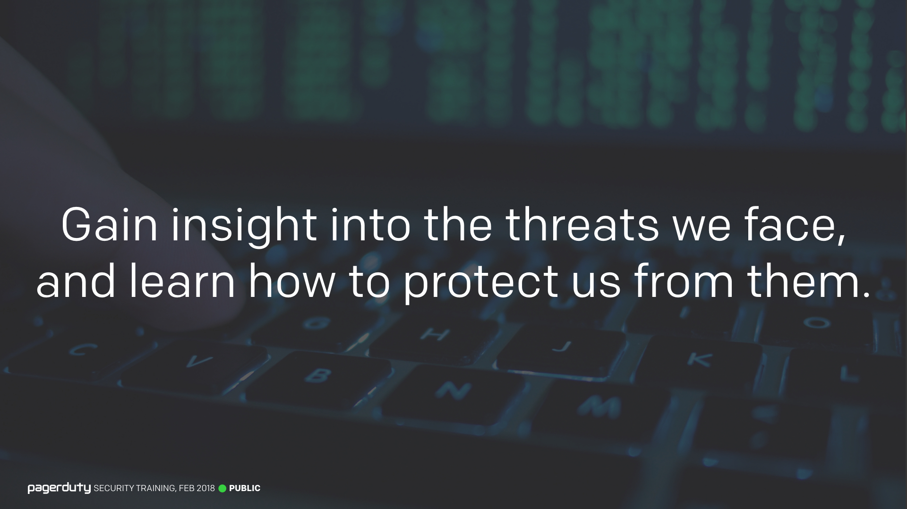</label>
_002. Goal of the training._

Why have I brought you all here today? What's the point of all this?

The goal of today's training is to make sure that we can maintain and build customer trust by having a staff who are well trained against the most common security threats that we face. It's not just about knowing what threats we're up against, it's about knowing how to protect us from those threats too.

Despite our best efforts, the security team can't have eyes everywhere. We rely on all of you to help us spot security issues and let us know about them.

---

### Testimonial

<input type="checkbox" id="003" /><label for="003"></label>
_003. Testimonial for the training._

If this is your first year at PagerDuty, then this training will be new to you. In past years it has received rave reviews, in fact Arup himself has praised it many times, as you can see here with this completely genuine quote.

???+ comment "Presenter's Comment"
    I actually showed Arup this slide ahead of time and asked him to read it out loud to make sure it sounded OK. Of course, as soon as he'd finished reading it aloud, it became a genuine quote that I could use. We'll be talking more about social engineering later.

In all seriousness though, as I said at the start, this is very important. I've tried to make this as entertaining and enjoyable as possible, and it's my hope that you don't feel this is a waste of your time. The material I'm going to present should be useful no matter what skill level you already have. Whether you're just joining us as an intern, or are a seasoned security expert.

---

### Classification

<input type="checkbox" id="004" /><label for="004">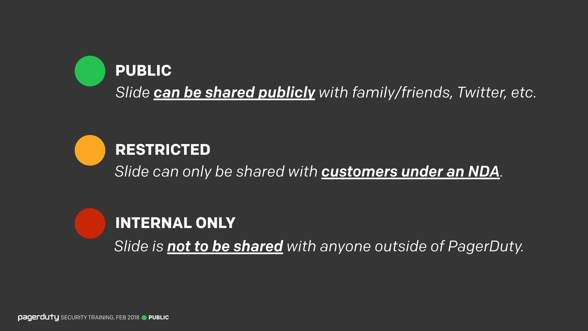</label>
_004. Classification ratings for these slides._

Something new this year to start with. In previous years, many of you have asked for a public version of the slides that you can share with family and friends. This year, each slide contains a classification level based on the information present in the slide. I'll be producing three versions of the training at the end, one of which will be a public version you can share however you like. The plan is to publish this information on a website similar to our [response docs](https://response.pagerduty.com).

Any slide with a green icon and the word "public" can be shared however you like. If it's orange and says "restricted", then it can only be shared with customers who have signed an NDA. Finally, if it's red and says "internal only", it's not to be shared with anyone outside of PagerDuty under any circumstances.

I've included real examples of ongoing attacks in some of the material, and we want to be sure we don't tip our hand to attackers that we're on to them.

---

### Classification Demo

<input type="checkbox" id="005" /><label for="005">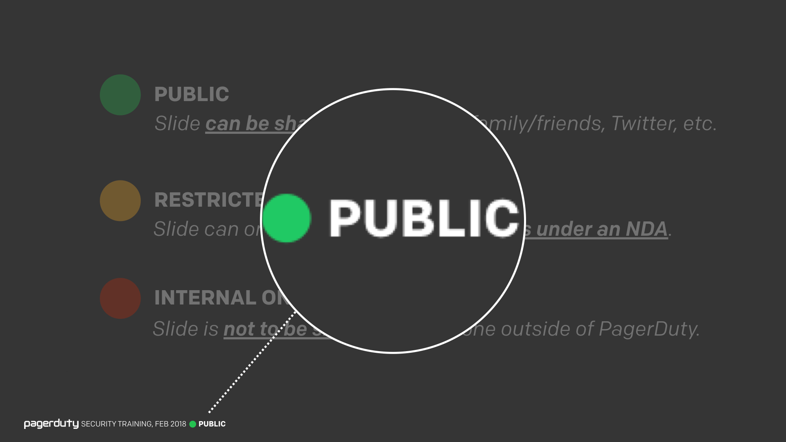</label>
_005. Showing where slide classifications are located._

If you're unsure where to look, it's down here in the bottom left. For example, this slide is "public".

---

### The Security Team

<input type="checkbox" id="006" /><label for="006"></label>
_006. Redacted slide._

???+ warning "Redacted Content"
    This slide showed the PagerDuty security team, who they are, and what they each do. Not only was the photo of Rich massively embarrassing, but we'd rather not provide a lookup table of the security team for the world to see, so this slide is not available in the public version of our slides. If you want to see that photo of Rich, you'll just need to [get a job at PagerDuty](https://www.pagerduty.com/careers).

---

### Our Job

<input type="checkbox" id="007" /><label for="007"></label>
_007. Our job as a security team._

Why does the security team even exist? Despite what you may think, we’re not here to say “No” to everything, or to chastise you for doing something "wrong". We’re here to keep PagerDuty secure, and to make it easy for you to do the right (i.e. secure) thing automatically. Never be afraid to come to us for help, or to let us know you may have done something that put us at risk. We’d rather know about it than not! If we've implemented a security feature that has made your life unnecessarily more annoying, we want to know about that too, since our goal isn't to add features that make your life harder.

We're not here to be a bottleneck either, you'll notice that user access reviews don't go through the security team, and we don't have to sign-off on everything security related. Teams are trusted to make their own decisions (within reason).

---

### Tracking Attendance

<input type="checkbox" id="008" /><label for="008">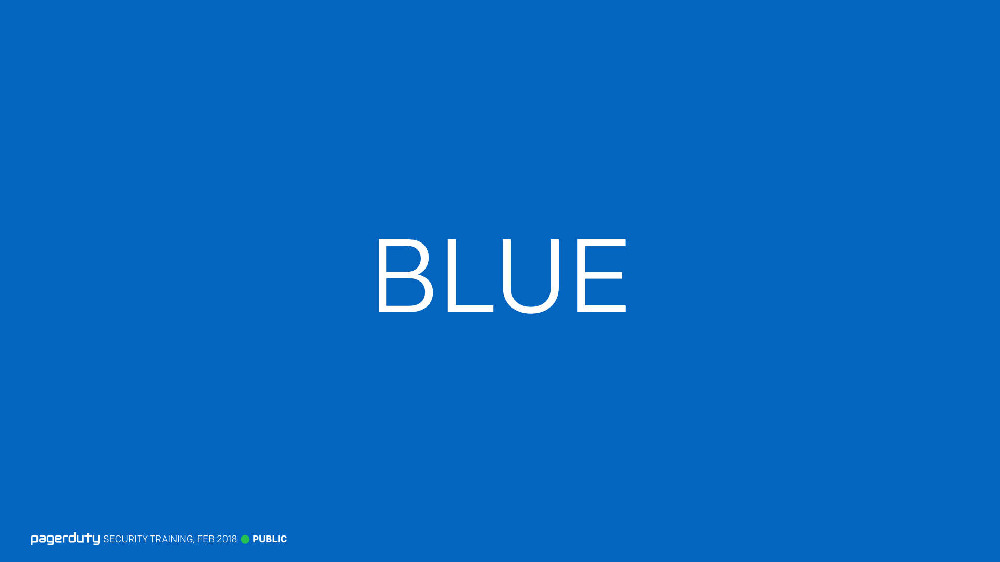</label>
_008. Blue._

One of the new things this year, due to our size, is that we need to track attendance for this training. Typically this is done by either getting everyone to scan their access cards, or by taking roll call. Sometimes it's about sending a survey asking questions about the material and if you answer incorrectly you have to resit the training. We're not going to do any of that, because.. well, because I didn't like any of those options.

Instead, I'm going to satisfy the constraint of tracking attendance in the silliest way possible. At the end of this training, you will get a survey with only two questions. "What was the colour?" and "What was the animal?". Yes, there will be a slide at the end with an animal on it.

By answering both questions correctly, this will "prove" you attended the entire training.

Of course, yes, I know this can be gamed. Yes, I know you can cheat. This seemed more fun than any of the other options, and at least makes a good faith attempt at providing evidence you stayed for the entire training. Honour system here folks, I'm trusting you all to help me out here and make this easy.

---

### Question

<input type="checkbox" id="009" /><label for="009">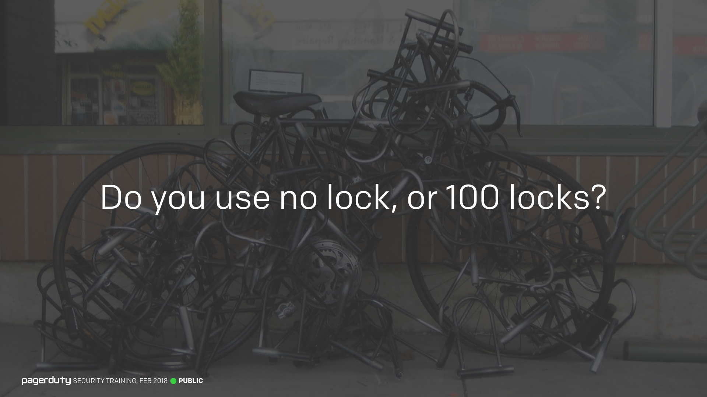</label>
_009. Bike locks._

Now a quick question to get things rolling. Let's say you're the healthy type, and you like to cycle around the city. _(As you can probably tell from my physique, I am not one of these types)_. You are somewhere around the streets of San Francisco, and need to secure your bike. You have two choices, you can just leave it on the street without any lock at all, or you can take the morning off work and use 100 locks instead. Which do you chose?

Hopefully you've realised that both of these answers are absurd and not going to work. Using no lock leaves you with no security at all and your bike won't be there when you return, whereas using 100 locks will leave your bike very secure, but you'll need to take the day off in order to lock and unlock it.

---

### Security vs Convenience

<input type="checkbox" id="010" /><label for="010">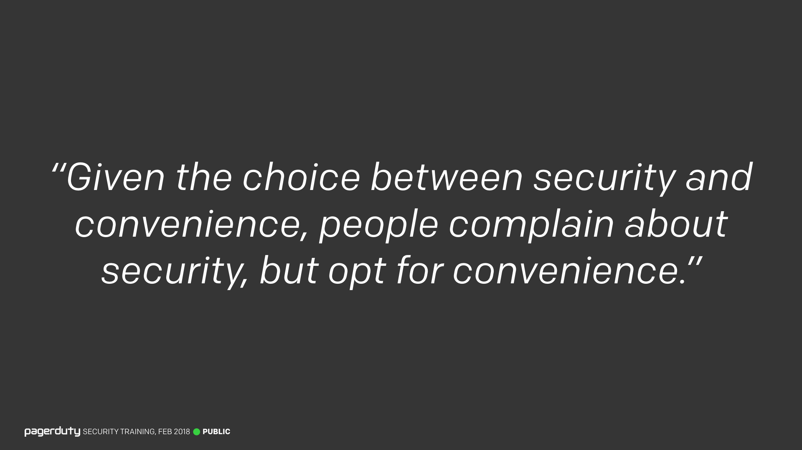</label>
_010. Security vs convenience._

The point I'm trying to make is that there's a trade-off between security and convenience, with two extreme ends of a spectrum. Too far one way, and we're not secure, too far the other, and we're secure but completely unusable. If you get a bunch of people in a room and ask them if they want to be secure, they'll say yes. But given the choice between being secure and having convenience, most folks opt for convenience.

---

### Be Secure, But Usable

<input type="checkbox" id="011" /><label for="011">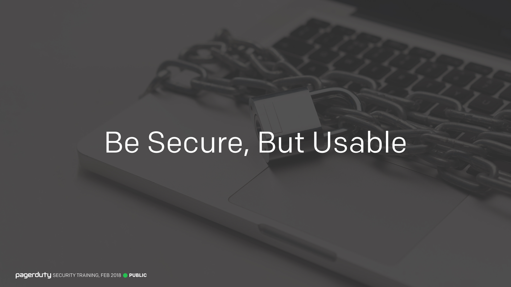</label>
_011. Be secure, but usable._

Our job is to strike a good balance between the options. We want to make sure that PagerDuty as a product, and as an office environment, is both secure and usable. Our goal is not to add friction to your day-to-day jobs, but we can't sit entirely at the convenience end of the scale either. So while we may force you into following certain procedures, please know that it's not because we like annoying you, but it's because we don't really have a choice.

---

### No Faking

<input type="checkbox" id="012" /><label for="012">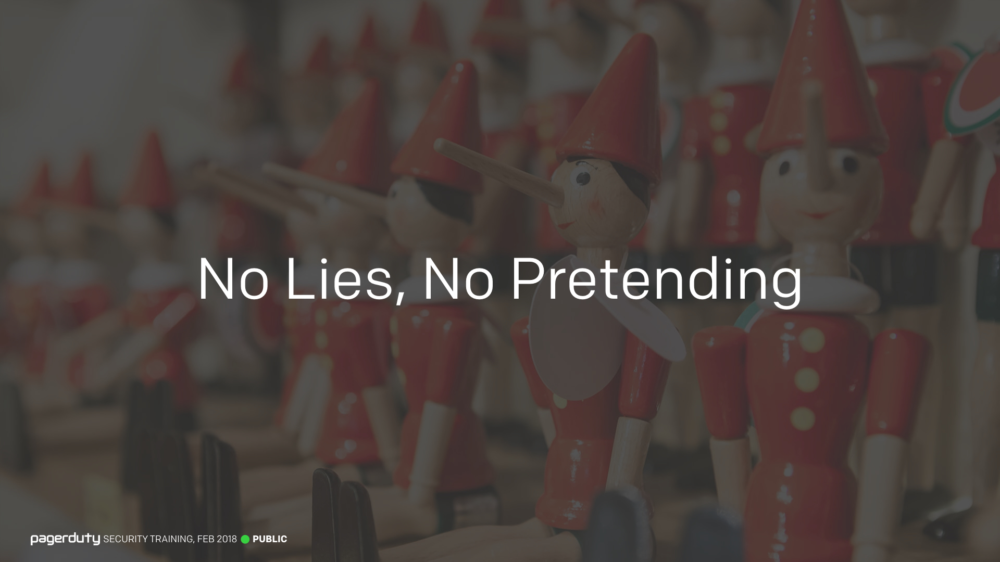</label>
_012. No faking._

Importantly, we never want to fake security. Putting a sign saying you have a burglar alarm on your front lawn when really you don't might deter a few criminals, but anyone who really wants to steal something will just ignore it anyway.

---

### Faking is the Path to the Dark Side

<input type="checkbox" id="013" /><label for="013">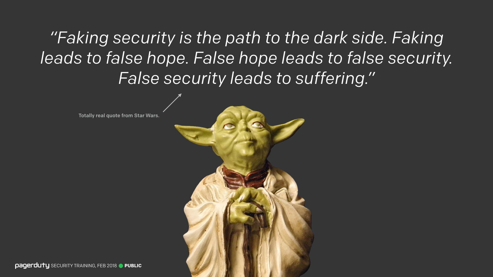</label>
_013. Yoda, dropping some knowledge on fake security._

Faking security leads us down a dark path, and will give us a false sense of security. There are multiple ways to fake security. Some terms you may have heard of are "Security Through Obscurity", where the secrecy of the implementation is being relied upon. Imagine a padlock manufacturer coming out with a padlock they say is unbreakable. You want to look inside to see how it works, but they say "No no no, you can't do that, that would give away the secret. You're not allowed to look inside!". Criminals, of course, being well known for following the rules.

Another term you may have heard of is "Security Theatre"...

---

### Security Theater

<input type="checkbox" id="014" /><label for="014">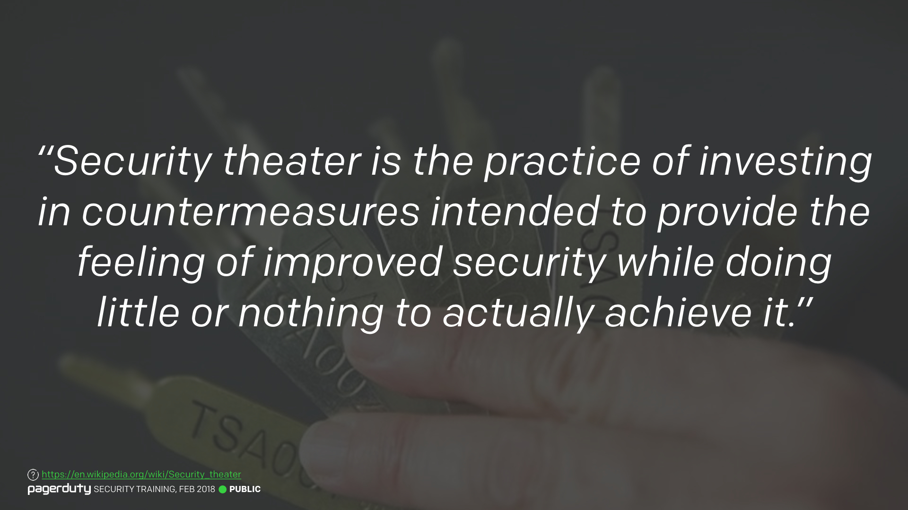</label>
_014. What is security theater? [Reference](https://en.wikipedia.org/wiki/Security_theater)_

This is where you spend time and effort on things which merely give the _appearance_ of improved security, without actually providing it. A lot of people hold up the TSA as an example of this, but I want to use the TSA as another example of where bad security came to bite them.

A "backdoor" is another type of fake security. This refers to when there's a supposedly secret method of bypassing the security of something, typically only given to a few people.

---

### TSA Baggage Locks

<input type="checkbox" id="015" /><label for="015">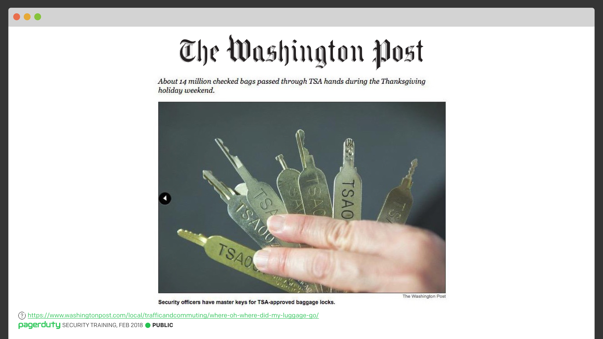</label>
_015. Story in the Washington Post. [Reference](https://www.washingtonpost.com/local/trafficandcommuting/where-oh-where-did-my-luggage-go/)_

You may remember a news story a few years ago in the Washington Post. It was around Thanksgiving, and they had an article all about how the TSA keep your bags safe during the holiday period. They held up TSA locks as an example. You've probably seen these locks, where you have a code or key to unlock it, but the TSA also has master keys to unlock it. The article included a photo of these master keys. Quite a high resolution photo in fact. So I'm sure you can guess what happened next.

---

### 3D Print TSA Master Keys

<input type="checkbox" id="016" /><label for="016">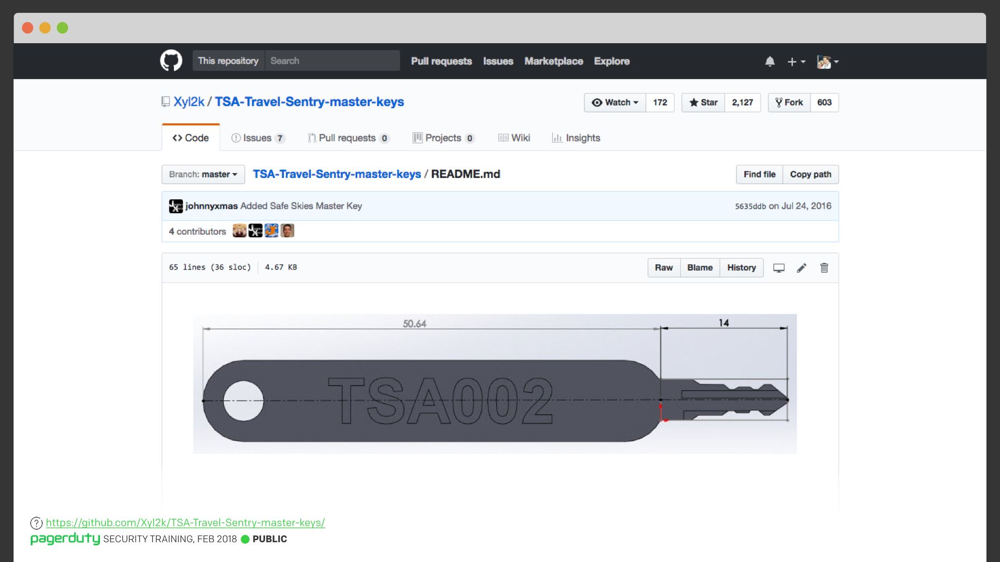</label>
_016. Print your own TSA master key from the comfort of your own home. [Reference](https://github.com/Xyl2k/TSA-Travel-Sentry-master-keys/)_

Yep, you can now 3D print your own TSA master keys in the comfort of your own home.

Any security provided by these locks are now ineffective. You might still deter a few folks, but anyone who's determined to get in your bags will now have a much easier time of doing it.

Backdoors pop up all over the place. Do any of you have a modem provided by your ISP? Pretty much every one of them has a backdoor on them for the purposes of customer support. A secret password that the customer support agents know, usually derived from your modem serial number in some way, that gives them the ability to change settings if you call them up. A lot of times attackers can figure out the patterns used and also get access to your modem. Google ["ARRIS modem backdoor"](https://encrypted.google.com/search?q=ARRIS+modem+backdoor) if you want to read about one example.

Hopefully you're starting to see why faking security is a bad thing, and something we want to stay away from.

---

### Social Engineering

_<input type="checkbox" id="017" /><label for="017">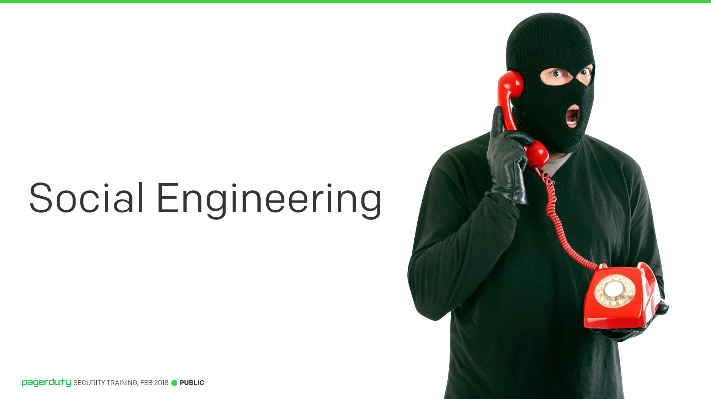</label>_

Social Engineering is our first topic of the day, and that stock image is quite possibly my favourite ever. Seriously, why wear a balaclava while on the phone? It makes no sense!

---

### What is Social Engineering?

<input type="checkbox" id="018" /><label for="018">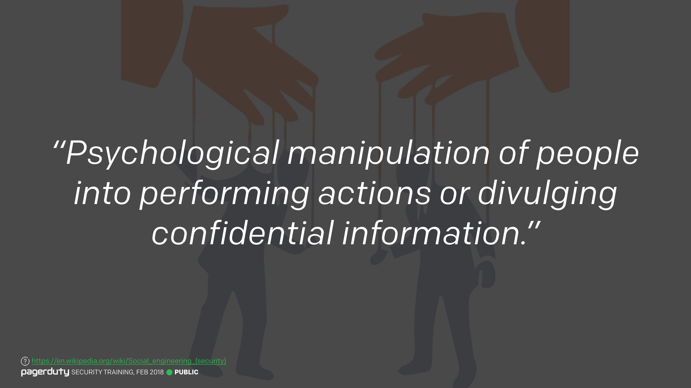</label>
_018. What is social engineering? [Reference](https://en.wikipedia.org/wiki/Social_engineering_(security))_

For those who've not heard the term before, here's a quick definition of what social engineering is. Basically it's a type of confidence trickery. Convincing people to give up information either without them realizing it, or by making them believe you're someone else.

---

### Catch Me If You Can

<input type="checkbox" id="019" /><label for="019">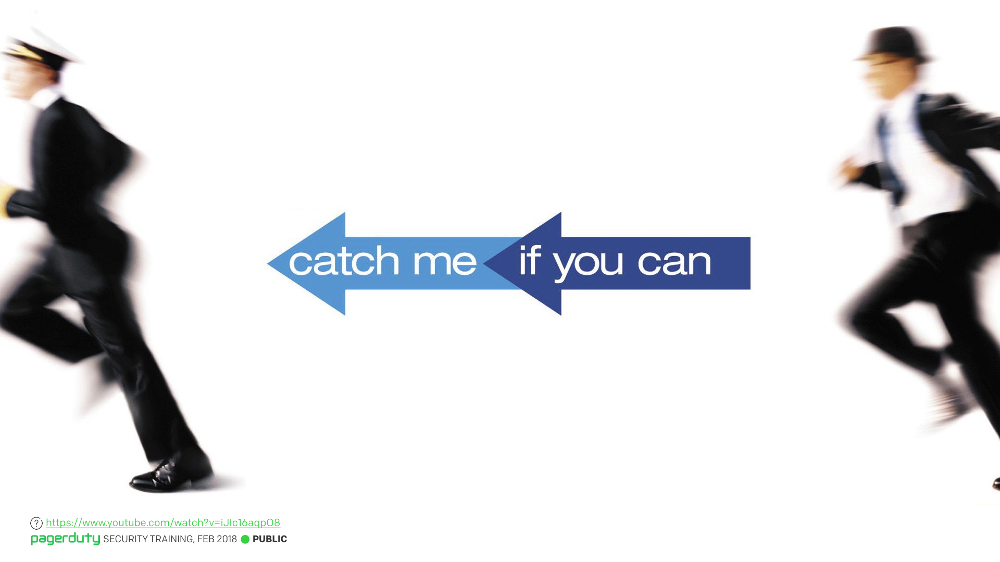</label>
_019. Catch Me If You Can. [Reference](https://www.youtube.com/watch?v=iJIc16aqpO8)_

If you've ever seen the movie ["Catch Me If You Can"](https://www.imdb.com/title/tt0264464/) (or read the book) you will have seen lots of examples of social engineering. "[Ferris Bueller's Day Off](https://www.imdb.com/title/tt0091042/)" is another one. If you've not seen either of those movies, I'd highly recommend giving them a watch. The link at the bottom of the slide here is to a [talk by Frank Abagnale Jr](https://www.youtube.com/watch?v=iJIc16aqpO8), the real person on which Catch Me if You Can is based. He tells the story of his exploits. It's quite entertaining and eye opening.

---

### Building Trust

<input type="checkbox" id="020" /><label for="020">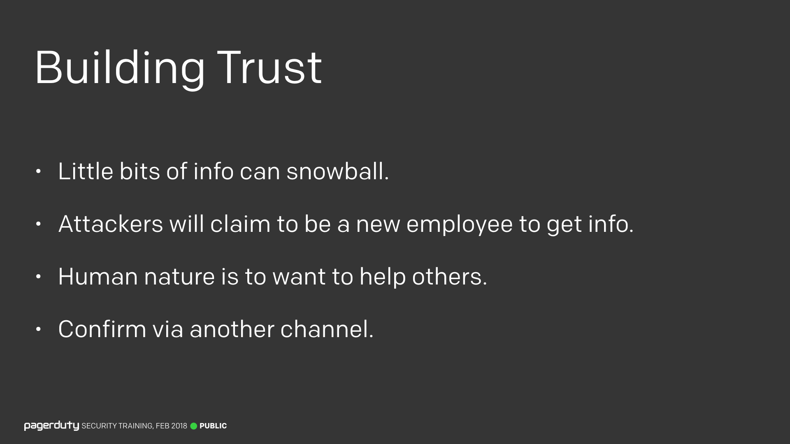</label>
_020. Building Trust._

Social engineering is mostly about building trust. If I wanted to social engineer the CEO of PagerDuty, Jenn would not be my first phone call. I'd start by calling a low-level employee claiming to be a new employee needing help, or I'd call a new employee and claim to be an established employee asking for help. I'd learn some little bits of information, maybe a bit of internal lingo that's being used. Then the next person I call would be slightly higher up the chain, I'd use the information I learned on the first call to sound more credible. And so on and so on.

By the time I call the CEO, I'd have so much internal knowledge and language for the company that it would sound like I was an employee anyway.

This is hard to defend against, since human nature is to want to help others. So if someone contacts you claiming to be an employee, and you've never heard of them before, verify they are who they say they are via another channel. If they email you, ping them on Slack to check (and vice versa).

---

### Employee Directory

<input type="checkbox" id="021" /><label for="021"></label>
_021. Redacted slide._

???+ warning "Redacted Content"
    This slide gave information on our internal employee directory and how to use it to verify who you're speaking to.

---

### ~~Fishing~~ Phishing

_<input type="checkbox" id="022" /><label for="022">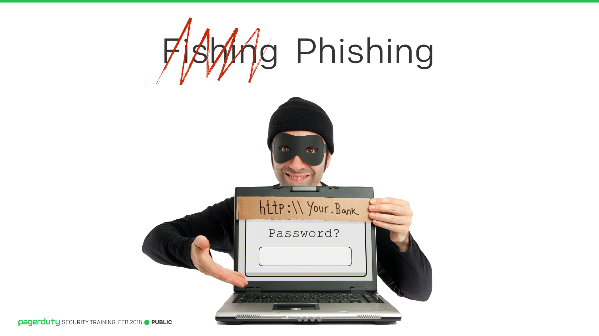</label>_
_022. ~~Fishing~~ Phishing._

I'm going to focus on one particular type of social engineering attack that we get exposed to, phishing (with a P-H), and again, this is another one of my favourite stock images. The term comes from "fishing for information", and generally involves receiving an email designed to trick you into giving up information. As we get larger as a company, we become more of a target for these types of attacks.

---

### Nigerian Prince Scam

<input type="checkbox" id="023" /><label for="023">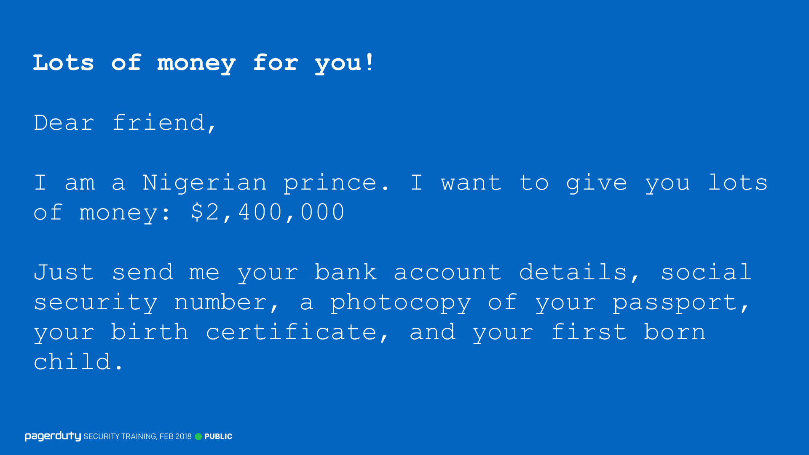</label>
_023. Nigerian Prince Scam._

Some phishing attacks can be pretty easy to spot. You've all likely heard of the Nigerian Prince Scam. This is where an email claiming to be someone who can give you lots of money is sent to lots of people. This is a very "spray and pray" approach to scamming. Maybe 1 or 2 people will bite, but that makes it worthwhile enough for the scammer. These are pretty easy to spot, and not something we really worry about. Hopefully none of you would ever fall for something like this.

---

### Is My Credit Card Stolen?

<input type="checkbox" id="024" /><label for="024">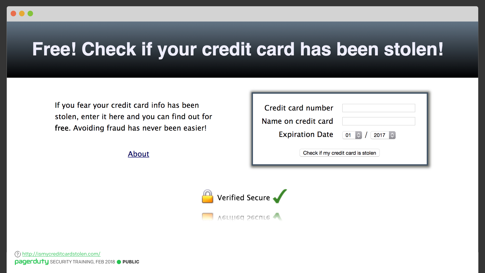</label>
_024. ismycreditcardstolen.com. [Reference](http://ismycreditcardstolen.com/)_

But you don't even have to send emails to people, sometimes you can just lay a trap and people will gladly provide you with information instead. Here's a great website, [ismycreditcardstolen.com](http://ismycreditcardstolen.com). You just enter your credit card information, and it'll helpfully tell you if it's been stolen or not. Of course, as soon as you enter the details, your credit card information has in fact been stolen.

But it has that nice "Verified Secure", with the padlock and green tick, so it must be OK, right?

???+ comment "Presenter's Comment"
    I should be clear that this isn't really a bad website, and is safe to visit. It's made to point out to people that they shouldn't fill in their details on random sites.

---

### Need a Debit Card?

<input type="checkbox" id="025" /><label for="025">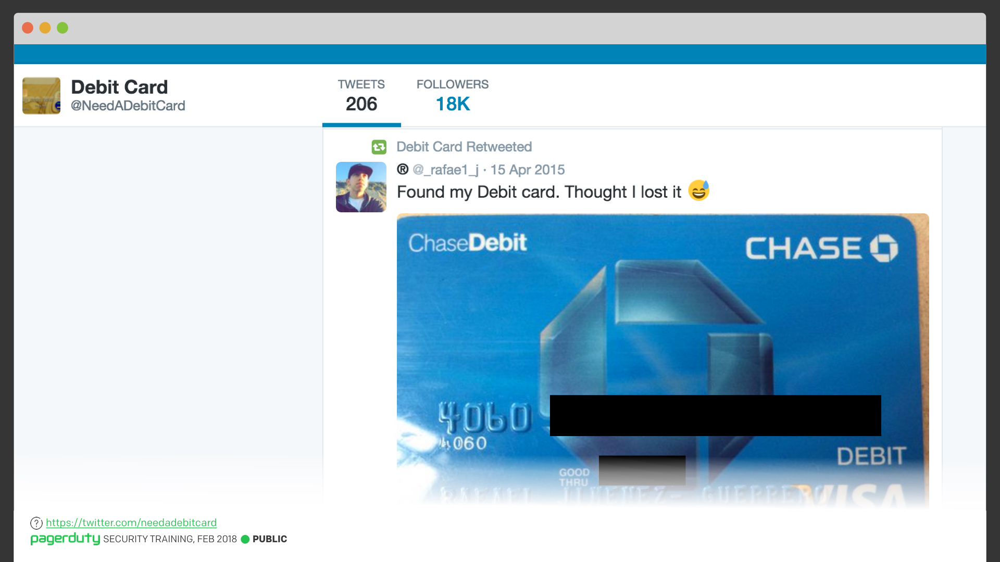</label>
_025. twitter.com/needadebitcard. [Reference](https://twitter.com/needadebitcard)_

Taking it a step further, sometimes you don't even need to lay a trap, you can just search the internet for the information you want. There's a great Twitter account called [@NeedADebitCard](https://twitter.com/needadebitcard), which retweets people who post pictures of their debit cards to Twitter.

It gets better, because often the replies will be _"Looks great, what does the back look like?"_, and then they'll go and post a picture of the back too!

I really hope that none of you would fall for anything like this.

These are all interesting to see, but the type of attack we care most about are the more targeted ones.

---

### Reel or Fish?

<input type="checkbox" id="026" /><label for="026">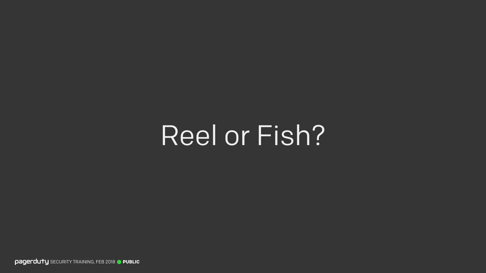</label>
_026. Reel or Fish?._

So I'd like to play a quick game with you all now. I know, audience participation, right? But don't worry, it's a fun game, honest.

It's a game I've called "Reel or Fish?"

---

### Real or Phish?

<input type="checkbox" id="027" /><label for="027">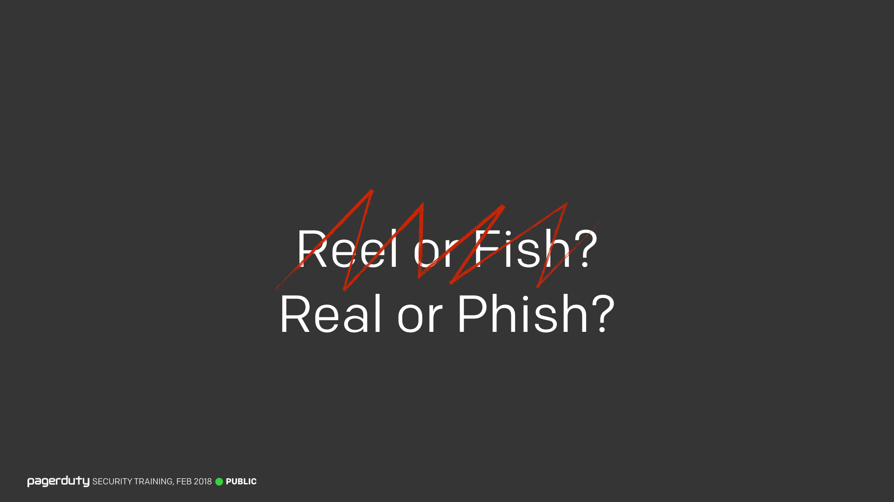</label>
_027. Real or Phish?._

Sorry, I mean "Real or Phish?"

???+ comment "Presenter's Comment"
    It's worth noting there were groans from the audience at this point.

I'm going to show you some genuine emails that have been sent to PagerDuty employees (shared with the recipients permission of course), and it's your job to tell me if you think it's a real email, or a phishing attempt.

---

### Your account has a debt and is past due.

<input type="checkbox" id="028" /><label for="028">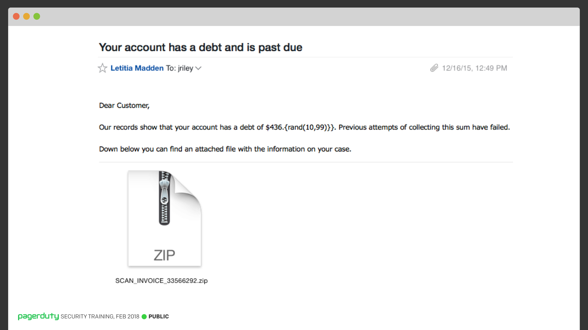</label>
_028. Your account has a debt and is past due._

Let's start with this one, which was sent to a member of our SRE team.

_"Our records show that your account has a debt of $436.{rand(10,100)}}. Previous attempts of collecting this sum have failed."_

What do we think?

???+ comment "Presenter's Comment"
    Audience shouts "Phishing!"... less enthusiastically than the presenter would have liked.

---

### Phish!

<input type="checkbox" id="029" /><label for="029">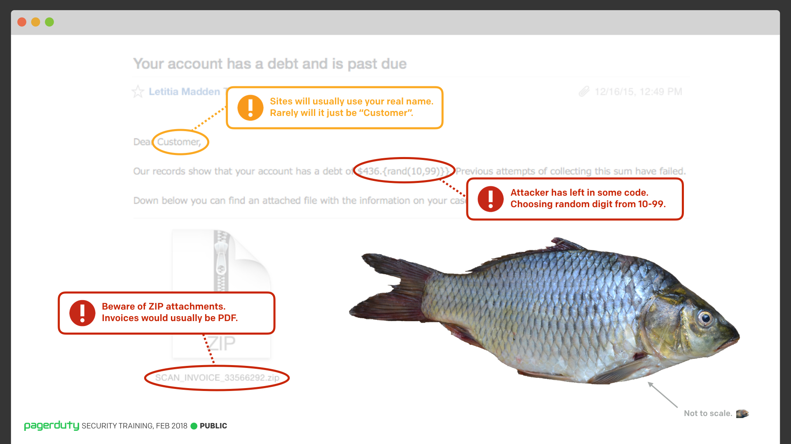</label>
_029. Phish!._

Yes, of course this is a phishing attempt. Quite an easy one to spot thanks to the fact the attacker left in their templating code rather than putting in the cents value. But there were some other indicators here too,

* A yellow flag in that it said "Dear Customer", most emails now will be personalized with your name if they know it.
* A red flag in that there's a `.zip` attachment for an invoice, as these would typically be a PDF.

But of course, the primary red flag is the templating code.

---

### DocuSign?

<input type="checkbox" id="030" /><label for="030">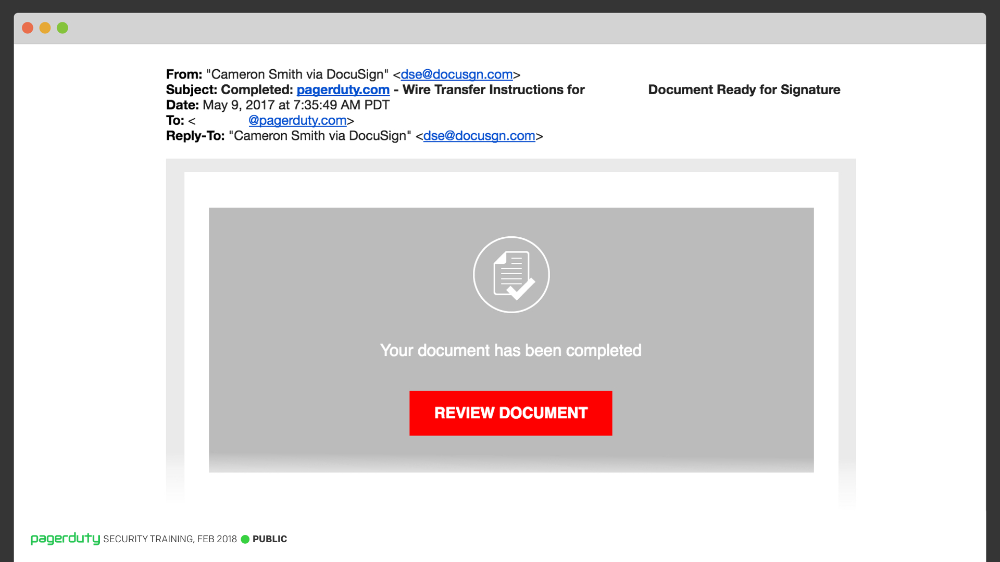</label>
_030. DocuSign?_

Ok, let's try another one. What do we think about this email from DocuSign?

Looks like a genuine DocuSign email, has the usual style, same big "Review Document" button. Anything suspicious here?

---

### DocuSgn

<input type="checkbox" id="031" /><label for="031">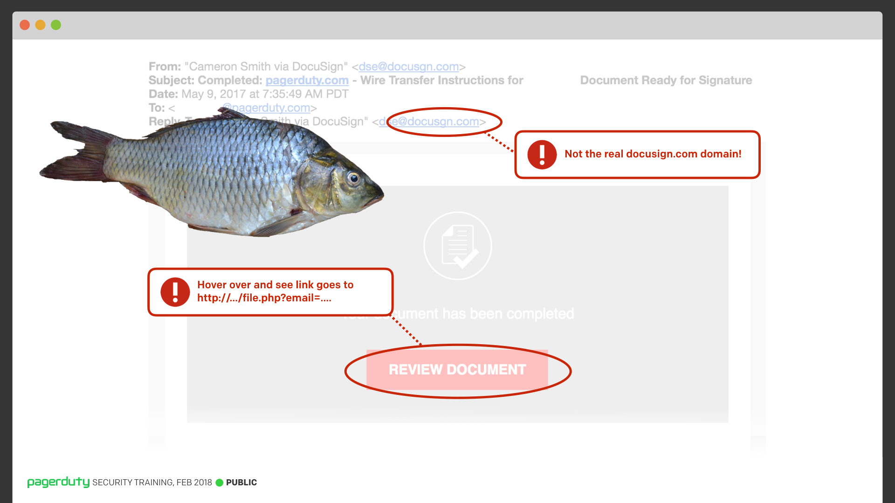</label>
_031. DocuSgn._

This is another phishing email. If you look closely at the domain name in the email, you'll see that it's not the real `docusign.com` domain, but rather `docusgn.com` (Note the missing `i`). An attacker specifically registered a domain similar to the real one, and sent emails that for all intents and purposes look like the real thing, in order to try and steal your DocuSign credentials. Attacks like these are becoming more and more common.

One thing you wouldn't have been able to tell from my screenshot, but would if you were viewing this in your email client, is that the "Review Document" link doesn't actually go to a DocuSign domain either. It went to some completely different domain (it wasn't even close to docusign.com) and had some parameters at the end which included your email address.

One takeaway here is to be sure to hover over any links to see the real address they go to _before_ you click on them. Just because the text in the email says one thing, it doesn't mean that's where the actual link may go. Never click on any links in email that are even remotely suspicious. Sometimes all it takes is a click to do bad things.

???+ comment "Presenter's Comment"
    Top tip: If it’s a shortened URL with bit.ly, you can append a `+` to the URL to see where it goes without actually following it.

If you do accidentally click a link in a phishing email, please let us know immediately, as it can affect how we respond to the incident. Don't lie to us to save face, we're not going to ridicule you or shout at you for clicking it, we want to know so that we can properly respond to any potential exploit that could have happened.

---

### More Phishing Examples

<input type="checkbox" id="032" /><label for="032"></label>
_032-036. Redacted slides._

???+ warning "Redacted Content"
    A series of slides have been redacted here. They gave examples of more sophisticated phishing attacks that have been waged against PagerDuty employees, and the indicators we used to detect them. We are not including them in the public version to avoid tipping our hand that we detected them.

---

### Spear Phishing

<input type="checkbox" id="037" /><label for="037">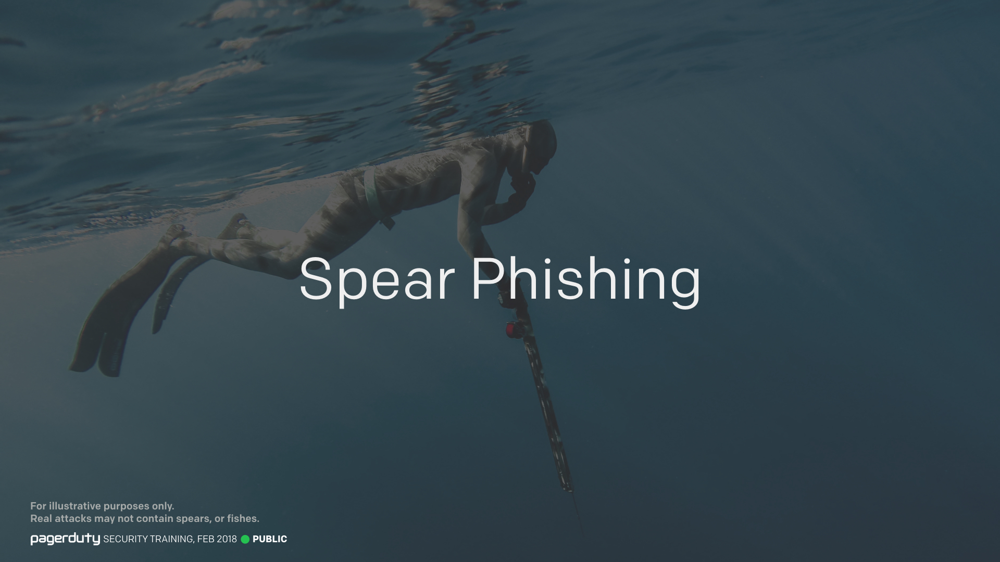</label>
_037. Spear phishing._

These much more targeted attacks are called "[Spear Phishing](https://en.wikipedia.org/wiki/Phishing#Spear_phishing)". An attacker spent a lot of time learning about our internal org structure and crafting a legitimate looking email in order to try and get lots of money from us. These are the types of attacks we care the most about protecting against.

If you're interested in more of the types of attacks we get, please take a look at our Phishing Archive.

---

### Phishing Archive

<input type="checkbox" id="038" /><label for="038"></label>
_038. Redacted slide._

???+ warning "Redacted Content"
    This redacted slide showed an image of our internal "Phishing Archive" where we document all of the phishing attacks against us that we've detected, what the indicators were, and how we were able to detect them (whether automated, or via employee report). We've chosen not to share this slide, again, to avoid tipping our hand on some types of attacks.

---

### Protecting Yourself

<input type="checkbox" id="039" /><label for="039">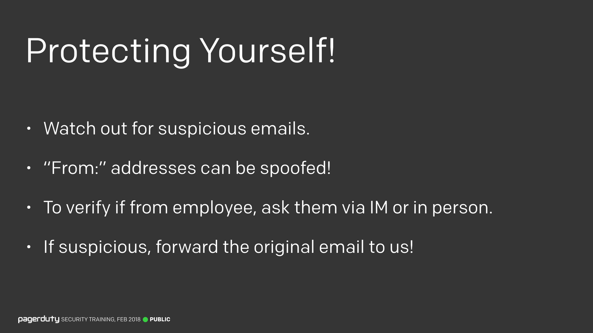</label>
_039. Protecting yourself._

So how do we protect ourselves from this type of attack? Unfortunately there's no golden rule I can give you. It's up to us all to remain vigilant and watch for the signs of suspicious emails. Some things to take care with, the "from" address of email can easily be spoofed. There are technologies that can help to prevent this, but they're not implemented everywhere. So while a misspelled domain is a strong indicator of phishing, a real domain isn't a 100% indicator that it's genuine.

It's like postal mail, you can put whatever you want as the return address, doesn't mean it really came from there. (In fact, this used to be an old scam, you could swap the return and mail-to address, mail it without postage, and the post office would return to the "sender". I would strongly advise against trying this though, since mail fraud is a federal offense here in the US).

Don't forget that if you get a communication from someone which sounds suspicious, confirm with them via another channel (Slack, etc). Especially if money is involved!

And if you suspect you've received a phishing attempt, send it on over to the security team so we can improve our filters (and add it to the Phishing Archive).

Finally, remember to **never click on any links in a mail you think may be phishing**.

---

### Reporting Phishing

<input type="checkbox" id="040" /><label for="040">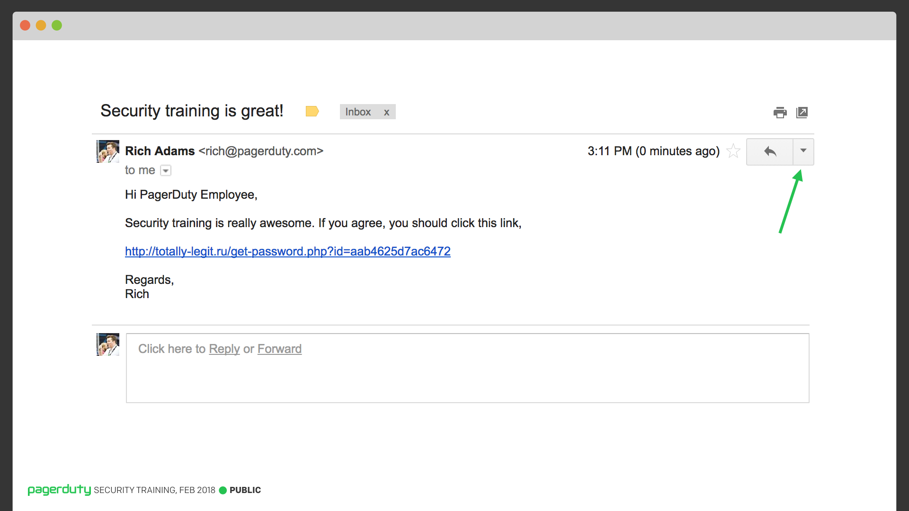</label>
_040. Reporting phishing._

If you do need to report phishing to us, it helps if we have the entire email that was sent to you, including some things called "headers", which you don't normally get to see. So to report phishing to us, first select the menu in the top-right of your screen.

---

### Reporting Phishing (2)

<input type="checkbox" id="041" /><label for="041">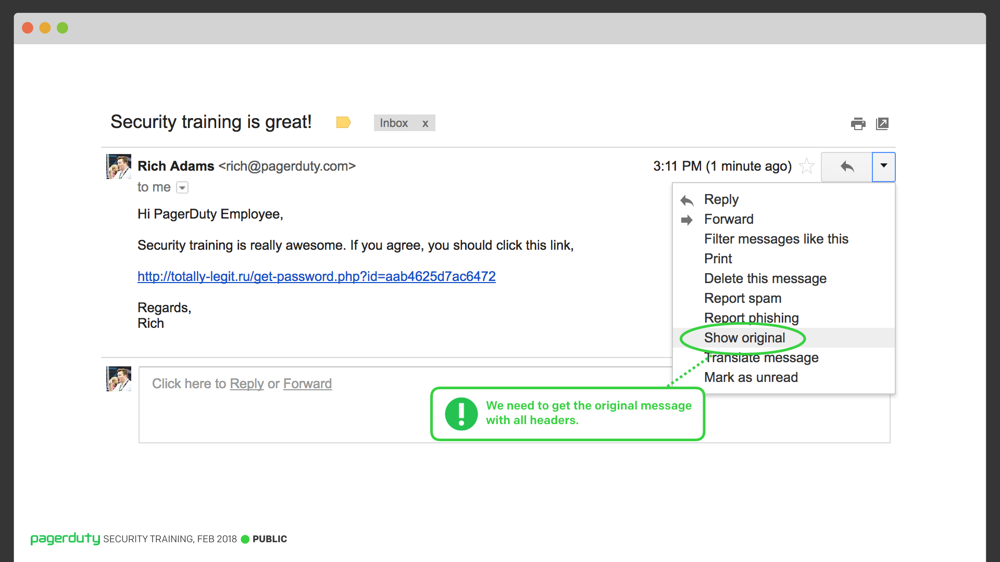</label>
_041. Reporting phishing._

Then click "Show Original".

---

### Reporting Phishing (3)

<input type="checkbox" id="042" /><label for="042">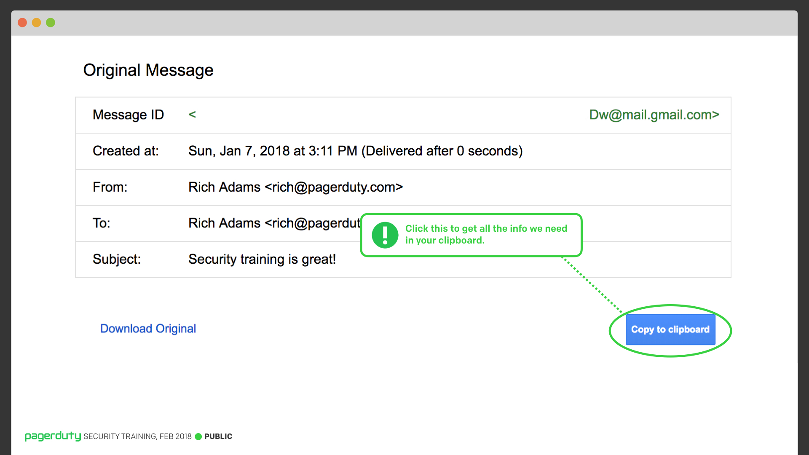</label>
_042. Reporting phishing._

This will show you a load of random looking text and lots of interesting technical information. All you care about is the big blue button at the top which says "Copy to clipboard". Click that, then close the page and go to start a new email.

---

### Reporting Phishing (4)

<input type="checkbox" id="043" /><label for="043">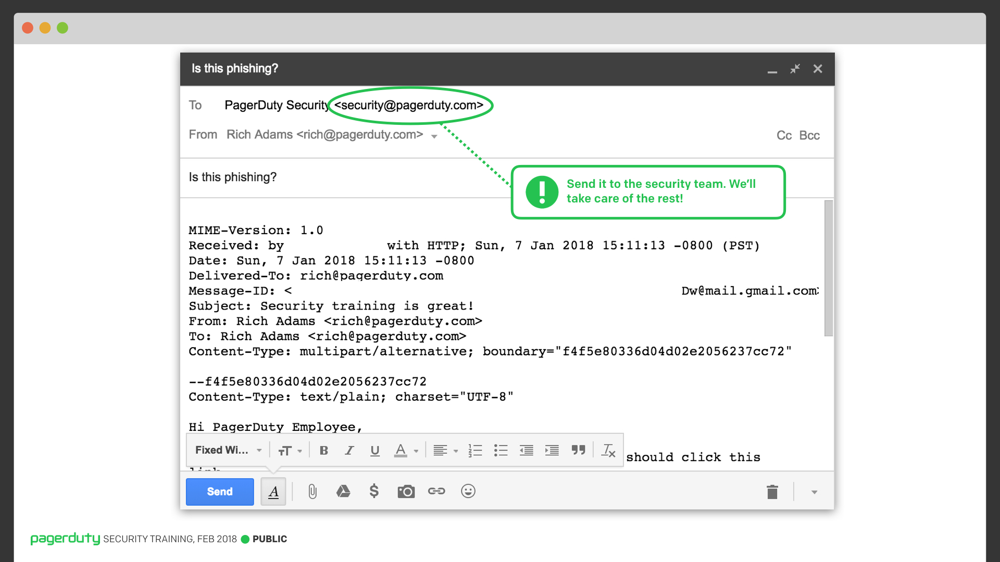</label>
_043. Reporting phishing._

Paste from your clipboard into the new email, and send it on over to us. We'll take care of the rest and let you know if there's anything you need to worry about. This is all documented on the wiki too, so don't worry too much about remembering all those steps.

---

### You Are Our Greatest Asset!

<input type="checkbox" id="044" /><label for="044"></label>
_044. You are our greatest asset!_

We don't read your emails, and automatic filtering only gets us so far. It's up to all of you to be able to spot suspicious emails and send them to us. The good news is that you're already great at this! We managed to preemptively block several phishing attacks last year thanks to quick employee reports. Most were deleted from your inbox before you even read them. Don’t assume someone else has already sent us the example, do it anyway. We’d rather have 300 duplicate reports than no report at all.

---

### Not Just Phishing

<input type="checkbox" id="045" /><label for="045">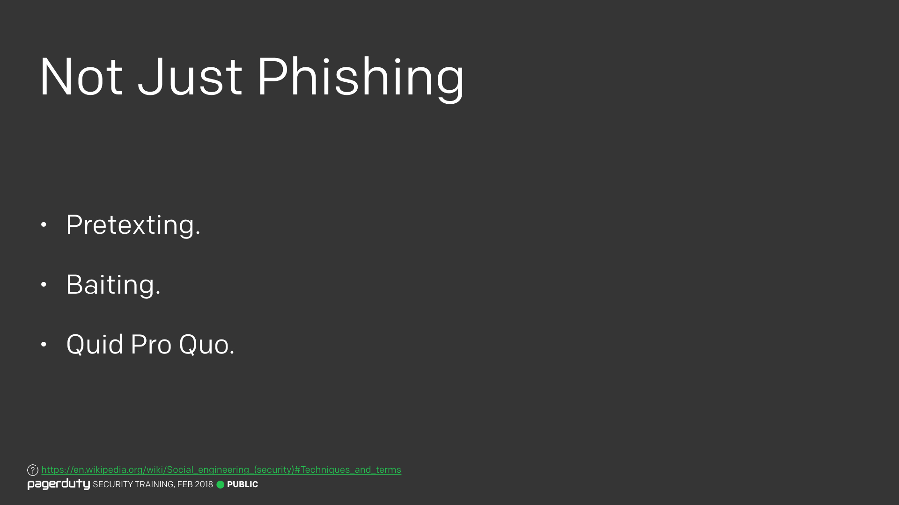</label>
_045. Not just phishing. [Reference](https://en.wikipedia.org/wiki/Social_engineering_(security)#Techniques_and_terms)_

Social engineering isn't just about phishing, even though that's what I focused on here. There are many more types of social engineering attacks we can face.

For example, the meeting invite for this training said that there would be free cake and desserts served. Sorry to disappoint, but that was a lie, and is an example of "Baiting".

Another type of social engineering is called "Pretexting", pretending to be someone else to get information. For example, let's say you're on sales and you receive a phone call: "Hi, this is Tim from [large customer], we're having trouble with our account. I need to speak to our account manager right now, this is urgent, we're losing $100,000's every minute here!", you'd probably say "Sure, let me put you in touch with [account manager for large customer]", and now you just gave away that [large customer] is a customer, to someone who hadn't verified who they are. Very easy to get tricked this way, but very hard to defend against without being confrontational.

One thing to beware of is a forced sense of urgency. In the above example, the attacker threw about the fact they were losing $100,000's every minute, in order to try and add urgency to the situation and force you to make rash decisions. I don't have a perfect way to solve this, just be vigilant, and report anything suspicious.

Another trick social engineers like to pull is to force you into a particular communications channel. For example, if you receive an email claiming to be from an employee, but they say they're uncontactable by phone today and would rather you communicate via email. This is why it's important to verify via another channel if you're unsure.

One final example of social engineering would be leaving a USB drive lying on the floor with a virus on it. People love to pick up free USB drives for some reason. Scatter them outside of the office and see if anyone plugs them in, getting you access to a corporate network. If you find a USB drive on the floor and it's not yours, please don't let it anywhere near your computer.

---

### Ask us!

<input type="checkbox" id="046" /><label for="046">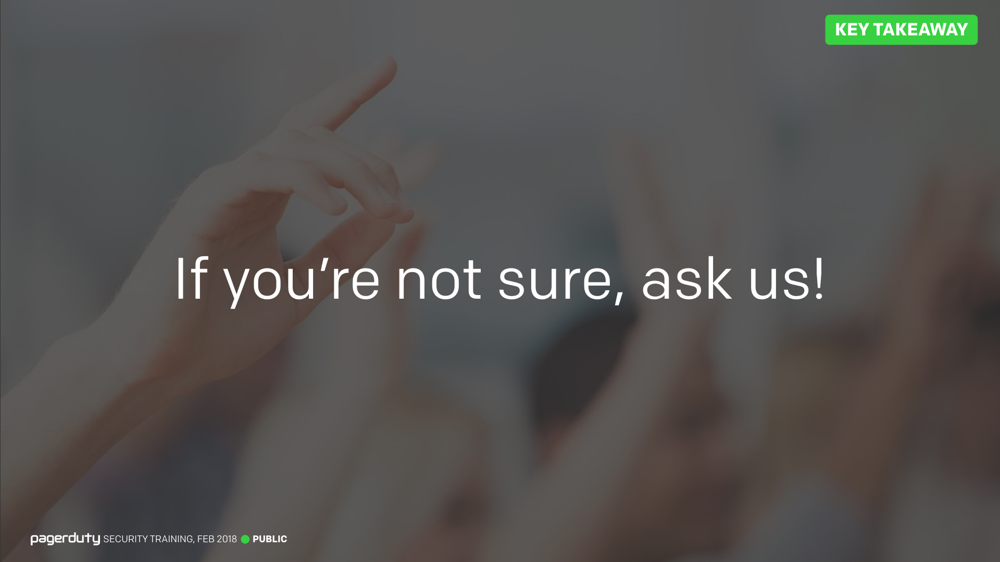</label>
_046. Ask us._

As with anything security related, if you're not sure if you've encountered a social engineering attack, or if you're curious to know more, just ask us! We don't bite! (Well, not all of us).

---

### Passwords

_<input type="checkbox" id="047" /><label for="047">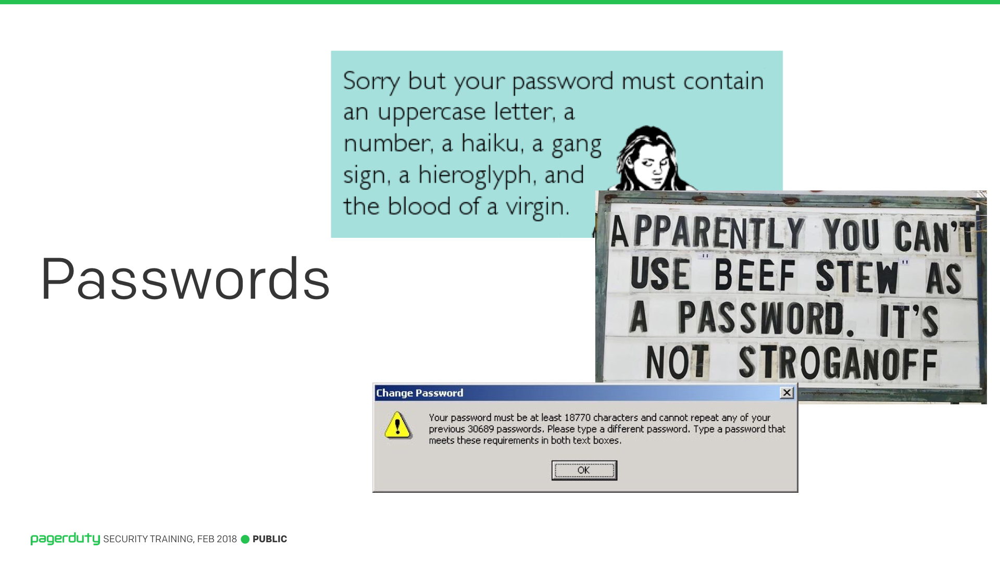</label>_
_047. Passwords._

It's time for our next topic, everyone's favourite, Passwords.

---

### What are passwords?

<input type="checkbox" id="048" /><label for="048">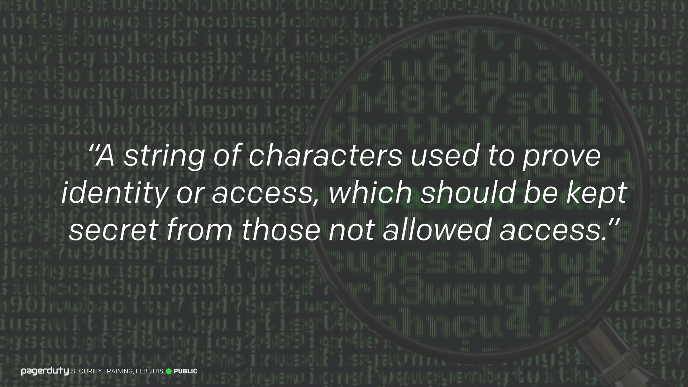</label>
_048. What are passwords?_

Hopefully you all know what a password is, but just in case you don't, here's a quick definition. Basically they're those things you have to type in all the time in order to do anything on a computer.

---

### T3h 1337 Haxx0rs!!!111one!

<input type="checkbox" id="049" /><label for="049">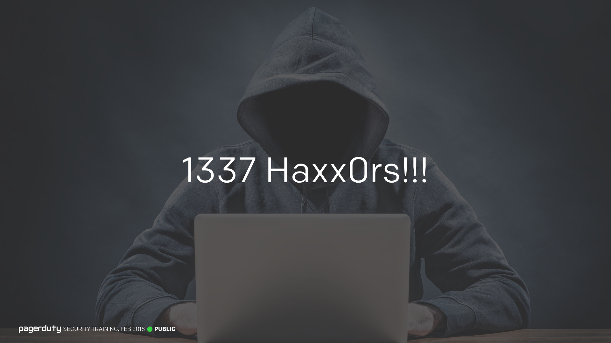</label>
_049. T3h 1337 Haxx0rs!!!111one!_

Rather than just give you a list of rules for how to pick good passwords, I want to try something a bit different here. I'm going to teach you all how to be hackers, just like in the movies. I'm going to teach you how to crack passwords. Don't worry, I see some wide eyes in the audience, I'm going to keep this as untechnical as I can.

I do need to talk about one technical concept first though...

---

### Hashing

<input type="checkbox" id="050" /><label for="050">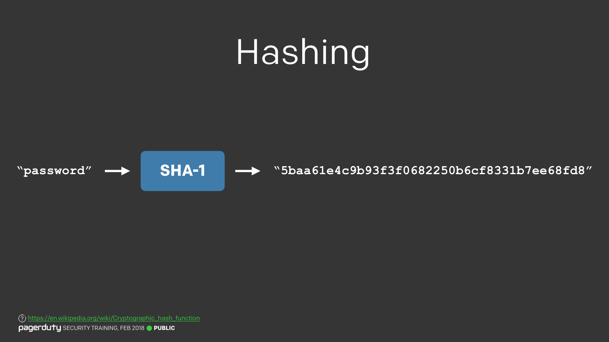</label>
_050. Hashing. [Reference](https://en.wikipedia.org/wiki/Cryptographic_hash_function)_

...and that's something called "Hashing".

---

### ~~Hashing~~

<input type="checkbox" id="051" /><label for="051">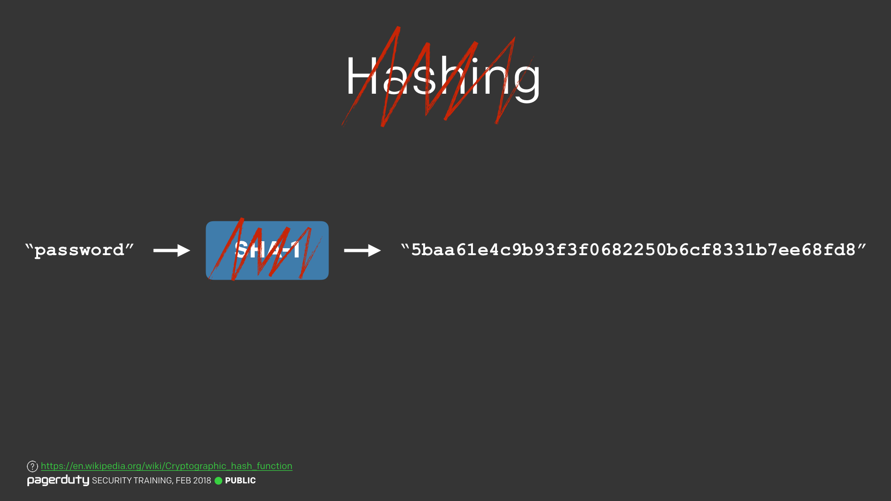</label>
_051. ~~Hashing~~. [Reference](https://en.wikipedia.org/wiki/Cryptographic_hash_function)_

Actually, you don't need to know the name.

---

### Magic

<input type="checkbox" id="052" /><label for="052">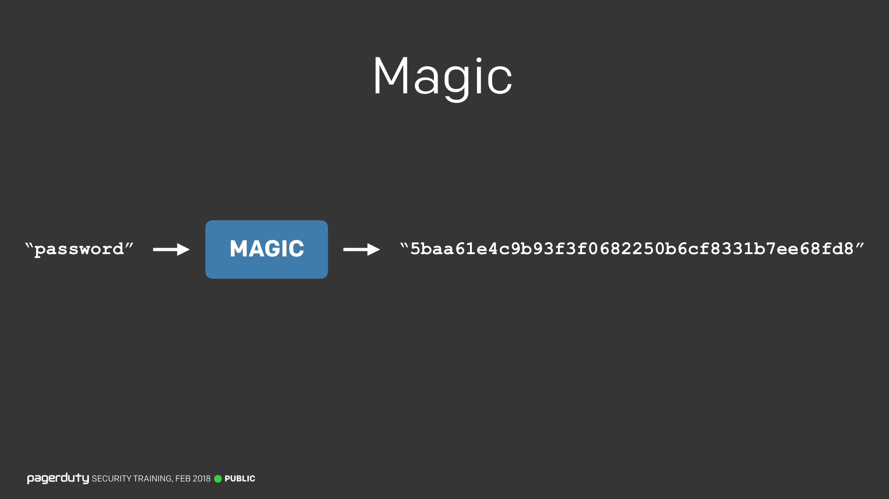</label>
_052. Magic._

For the purpose of this discussion, it's "Magic". What this magic does is take a password, does "stuff" to it, and gives you a magic string of characters at the end.

This magic process has two important features that we care about.

---

### Repeatable

<input type="checkbox" id="053" /><label for="053">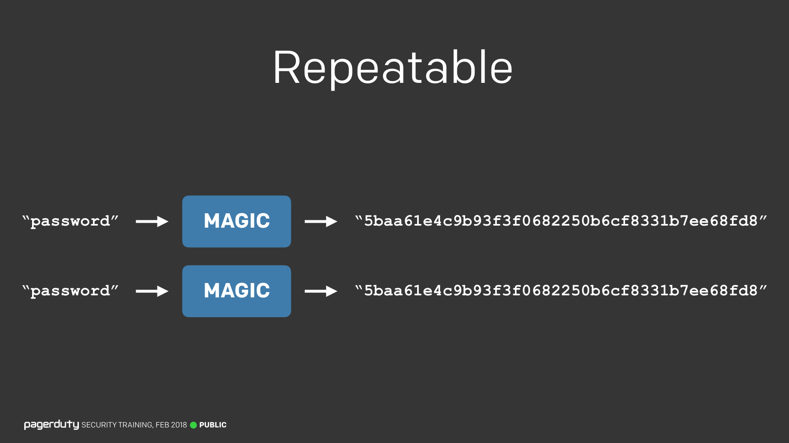</label>
_053. Repeatable._

The first is that it's repeatable. If you give it the same password, it will always give you the same magic string. Always.

---

### Irreversible

<input type="checkbox" id="054" /><label for="054">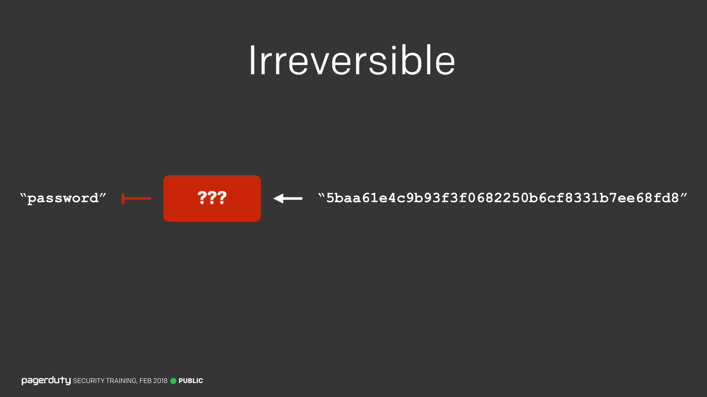</label>
_054. Irreversible._

The second is that it's irreversible. If you only have the magic string, there's no amount of fancy mathematics or algorithms that can get you back to the password.

The only way you know that password goes to that magic string, is if you already knew that passwords goes to that magic string.

---

### Create Account

<input type="checkbox" id="055" /><label for="055">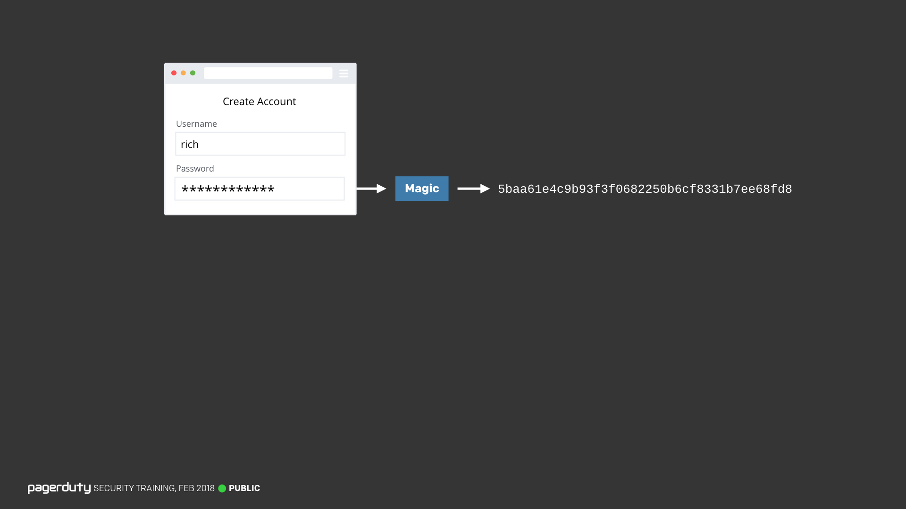</label>
_055. Creating an account._

So why am I telling you this? Well, it may surprise you to know that websites don't actually store your password (at least, they shouldn't). When you create an account on a website, they do this "magic" to your password, and store the result in their database instead of your password.

Why do they do this? Well, there's always at least one employee who can see the values stored in the database. If they were to store the real passwords, anyone with access to the database could have them, and not everyone is honest.

---

### Login

<input type="checkbox" id="056" /><label for="056">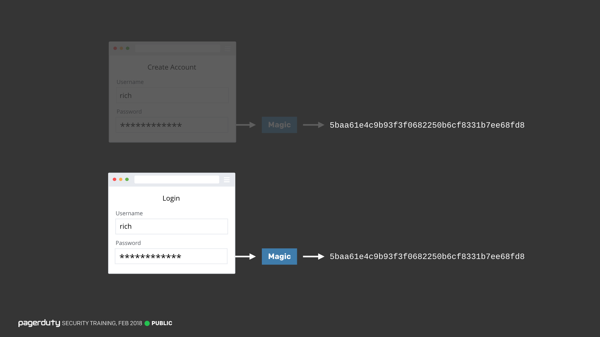</label>
_056. Logging in to an account._

But if they've only stored the magic string, how do you login to websites? Well, they do the same thing again. They perform the magic on whatever you enter, and get the result.

---

### Matches?

<input type="checkbox" id="057" /><label for="057">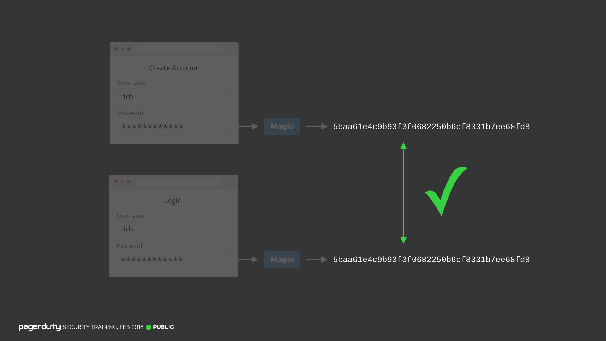</label>
_057. Did you enter the same thing?_

If the result matches what's in their database, then they know it's you and the login succeeds.

Websites don't really care about your password. They only care that you entered the same thing you did when you registered. So there's no need to store your actual password, they can just store a representation of it, safe in the knowledge that no one can reverse it back to a password.

Except that's what we're going to do now...

---

### Evil Corp

<input type="checkbox" id="058" /><label for="058">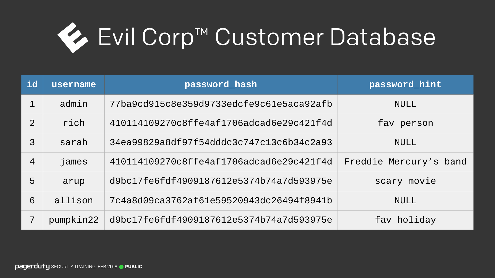</label>
_058. EvilCorp customer database._

Last night I went ahead and stole a customer database. Doesn't matter where I got it from. For all you know this could be the PagerDuty customer database, after all I'm an engineer who has access to that, aren't I? (It's not, but if that scared you for a moment, then you should familiarize yourself with our access control policies).

This stolen database contains usernames, password hashes (that's the magic string), and a password hint. Some of you may be thinking that the password hint is cheating here. Websites don't store password hints, right? Well, some do. But you're right, most don't. So you can think of them as "Answers to Security Questions" if it makes you feel better (I'll talk more about security questions later).

We're now going to get the passwords for all of these users.

---

### pumpkin22

<input type="checkbox" id="059" /><label for="059">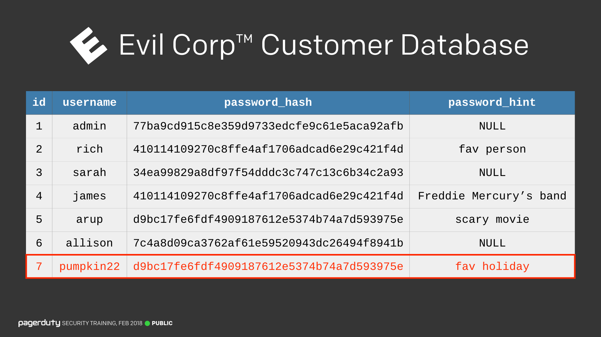</label>
_059. pumpkin22._

The first thing you might notice, is that sometimes the username itself can give things away. Let's take a look at this user first. "pumpkin22", and their password hint is "fav holiday". Hrm... pumpkins, holiday. I think I have a pretty good idea of what their password is.

But remember when I told you about the two important properties of the "magic", the first was that given the same password, you always get the same magic string. So we actually have more information to help us here.

---

### arup

<input type="checkbox" id="060" /><label for="060">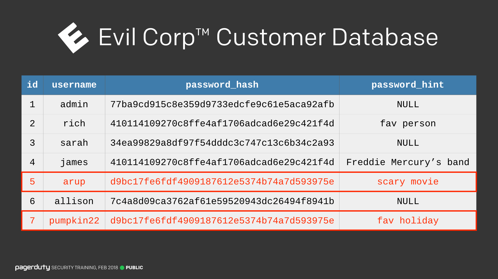</label>
_060. arup._

We can see that this user "arup" has exactly the same password as "pumpkin22".

???+ comment "Presenter's Comment"
    This isn't always the case, there's something called "Hash Collision" which can occur. But I'm ignoring that here in order to keep things simple.

So now we can use "arup"'s password hint as an extra bit of information. So, "pumpkin", "holiday", "scary movie". Hopefully by now you've guessed that this password is `halloween`.

---

### halloween

<input type="checkbox" id="061" /><label for="061">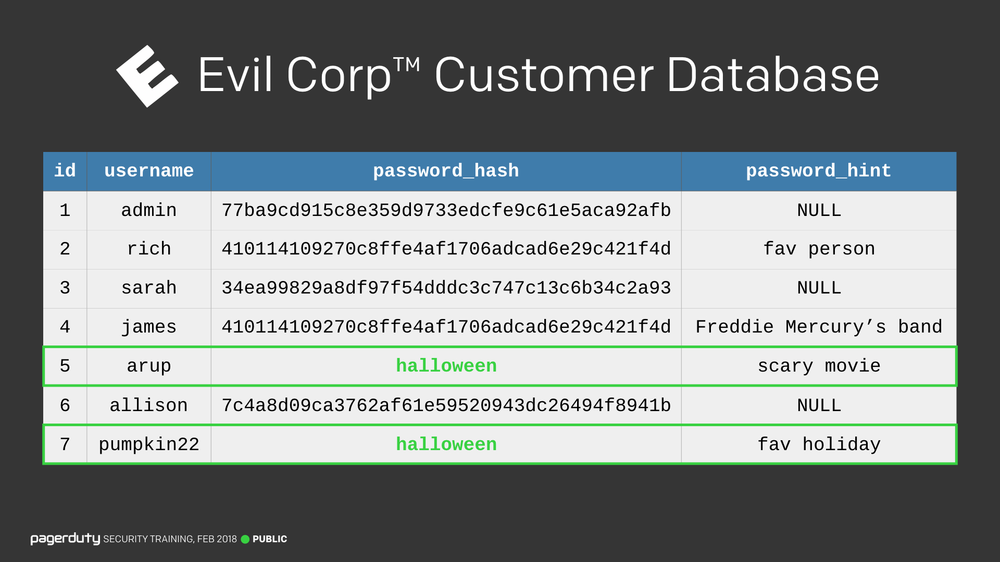</label>
_061. halloween._

So there we are, we just broke a 9 character password in less than a minute, without writing any code. Pretty cool, right?

Let's try another one.

---

### rich

<input type="checkbox" id="062" /><label for="062">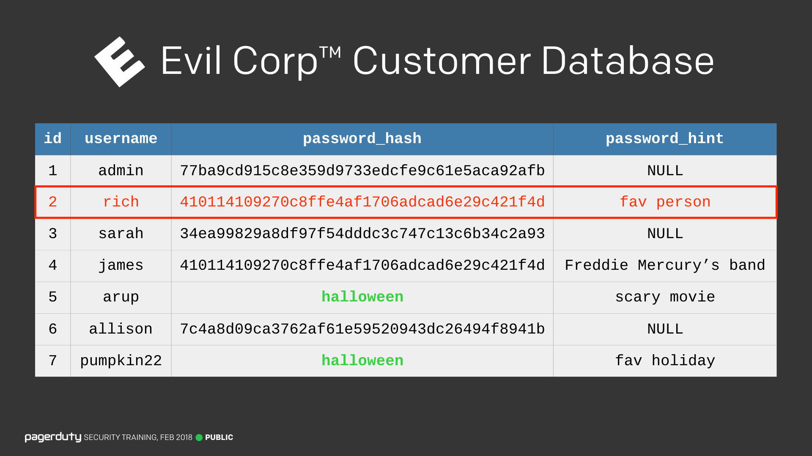</label>
_062. rich._

Let's look at the user "rich". Their password hint is "fav person". Well, that's not really much help to us. We don't know who "rich" is, and we have no idea who their favourite person is. In fact, that user probably thinks they're pretty safe, since only close friends would know the necessary information. There's no way a random attacker looking at the database could figure it out.

Unfortunately for them, another user has picked the same password.

---

### james

<input type="checkbox" id="063" /><label for="063">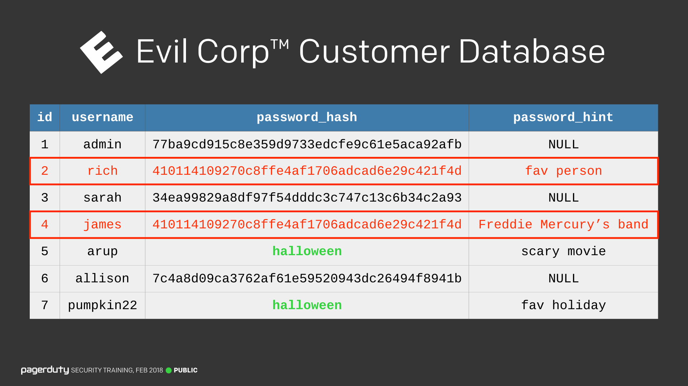</label>
_063. james._

The user "james" has picked the same password, and has a much more obvious password hint. We can use this information to break the password for both users. Hopefully you can figure out that the password in this case is `queen`.

---

### queen

<input type="checkbox" id="064" /><label for="064">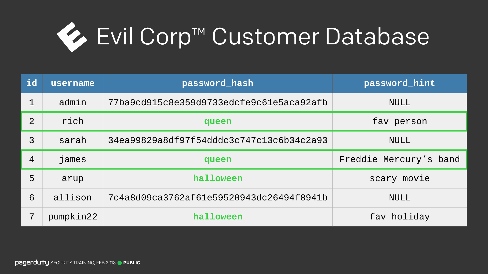</label>
_064. queen._

So even though "rich" thought they were safe, because of the way this website is storing user's password information, we could use the fact someone else has the same password in order to break theirs. Remember, just because you think you haven't provided much information, someone else may have. I've seen answers to security questions that include the user's password before.

Anyway, we've now broken 4 of these 7 users' passwords in less than a few minutes, and we've still yet to write any code or look like cool hackers from the movies.

---

### No more hints.

<input type="checkbox" id="065" /><label for="065">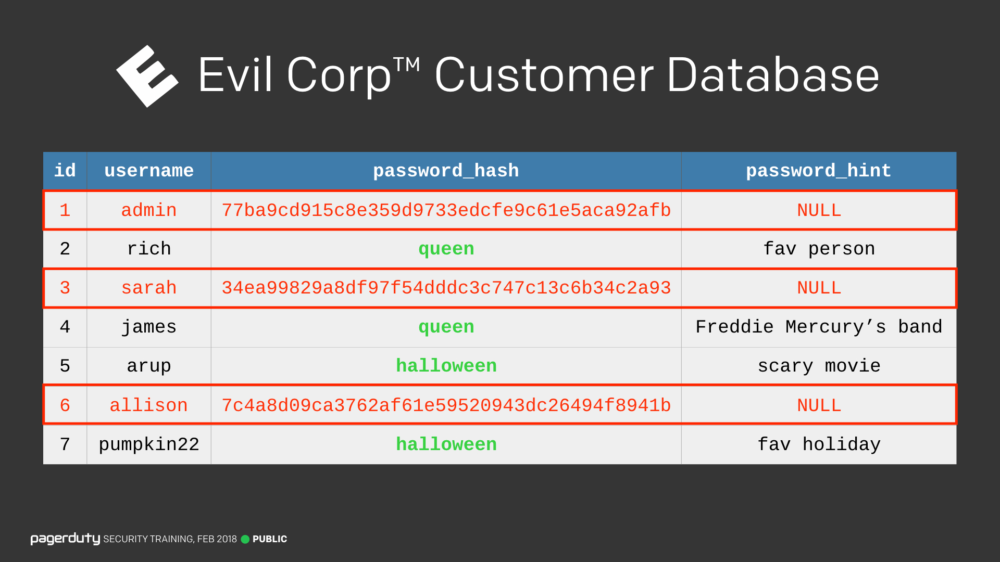</label>
_065. No more hints._

But now we've got a problem. There are no more password hints to help us. These users have been a bit smarter and not provided any additional information. There are no other duplicate passwords to help us, we're on our own.

So how can we break these? I said at the start that the magic was irreversible, so there's no way to get the password if you only have the magic string. I did give one caveat though. If you already know a password goes to the magic string.

I think that a lot of people use numbers in their passwords. Dates, PIN codes, etc.

---

### Hashing All The Numbers

<input type="checkbox" id="066" /><label for="066">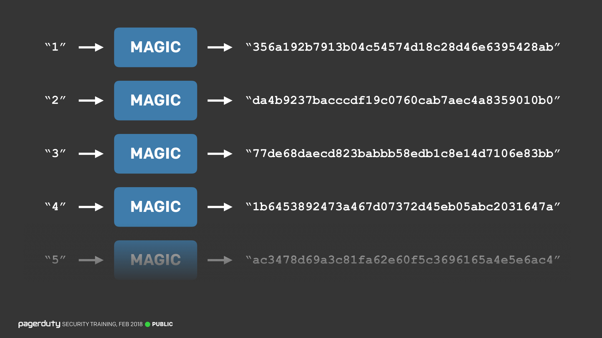</label>
_066. Hashing all the numbers._

So let's just run the magic on every number from 1 to 1 million. This will give us a nice directory of magic string back to password if anyone is using dates.

You might think this takes a while, and if you were doing it on pen and paper you'd be right. However, we have computers, and they're pretty fast at this kind of stuff. It took my laptop less than a second to get the first million magic strings.

---

### Nerd Alert

<input type="checkbox" id="067" /><label for="067">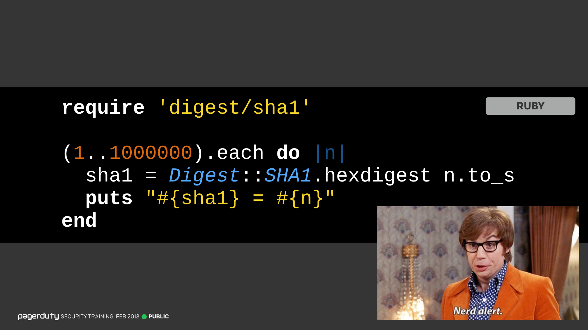</label>
_067. "Nerd alert"._

You may be thinking the code is complex and you need to be a master programmer to pull off this kind of feat. Alas, it's only a few lines of code in most modern languages.

---

### 1337

<input type="checkbox" id="068" /><label for="068">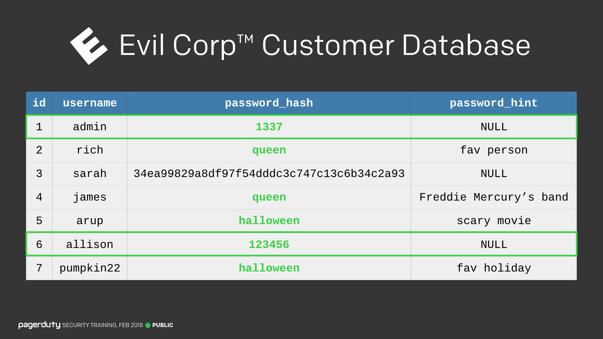</label>
_068. 1337._

So in less than a second of computational power, we've now cracked an additional two passwords. Not bad, right?

---

### sarah

<input type="checkbox" id="069" /><label for="069">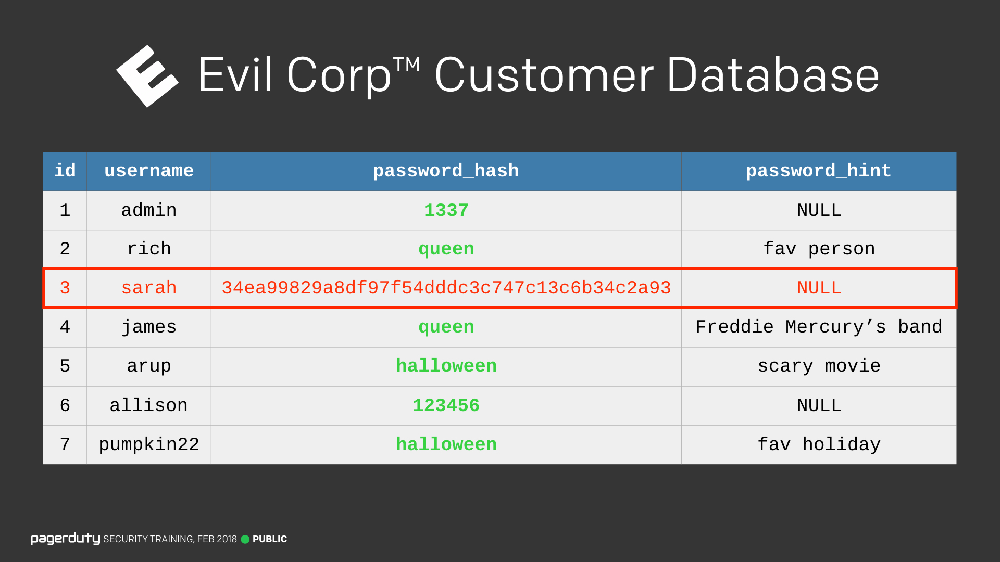</label>
_069. sarah._

But now we've got another problem. There's still one user left (there's always one!). Now, we could keep going with our numbers game, all the way up to 1 trillion or further. But let's switch gears. I want to use the same technique, but not just for numbers. A lot of people use real words as their passwords, so perhaps we can try that.

---

### Hashing All The Words

<input type="checkbox" id="070" /><label for="070">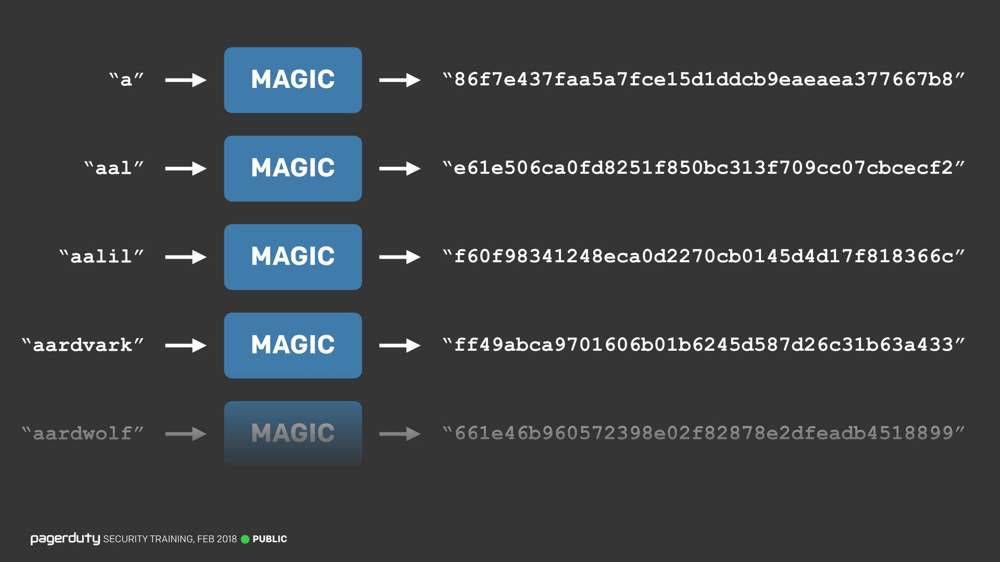</label>
_070. Hashing all the words._

Let's run our magic on every word in the English dictionary, and do the same thing as before. Again, you may be thinking this takes a while, but again, my laptop can do it in less than a second.

And, in less than a second...

---

### No luck

<input type="checkbox" id="071" /><label for="071"></label>
_071. No luck._

...oh, we didn't find anything. That's a bummer.

Well, we can keep using this same technique at least. We could try every possible combination of numbers and uppercase/lowercase letters up to say.. 9 characters long. I wonder how many possibilities there are?

---

### Trying everything takes too long

<input type="checkbox" id="072" /><label for="072">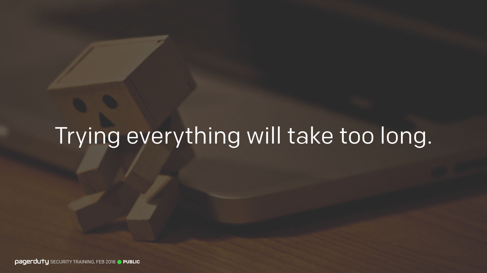</label>
_072. Trying everything will take too long._

It's around 13 quadrillion possible combinations. That's a lot. Far too many for my laptop to handle. In fact, it's far too many for most computers to handle in any reasonable amount of time.

Luckily for us, someone has already done the hard work.

---

### Magic Lists

<input type="checkbox" id="073" /><label for="073">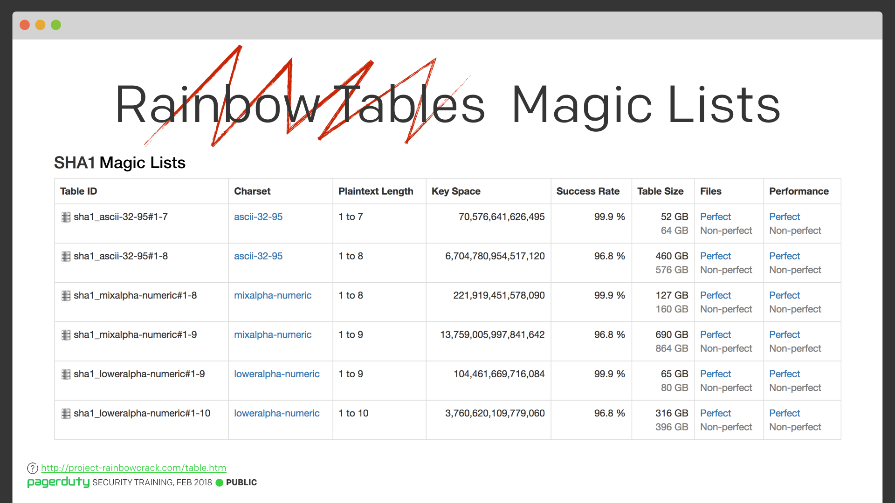</label>
_073. Magic Lists. [Reference](http://project-rainbowcrack.com/table.htm)_

There are things called "Rainbow Tables", in our parlance, "Magic Lists". There are massive files that have the full collection of magic strings for all sorts of situations. The one we're interested in is the 4th down from the top, every mixed-case alphanumeric up to 9 characters long. It's a 690GB file, which isn't too bad. We can just download that to an Amazon Web Services instance, and pay by the hour to try and crack our remaining password.

And in less than an hour...

---

### Cracked

<input type="checkbox" id="074" /><label for="074">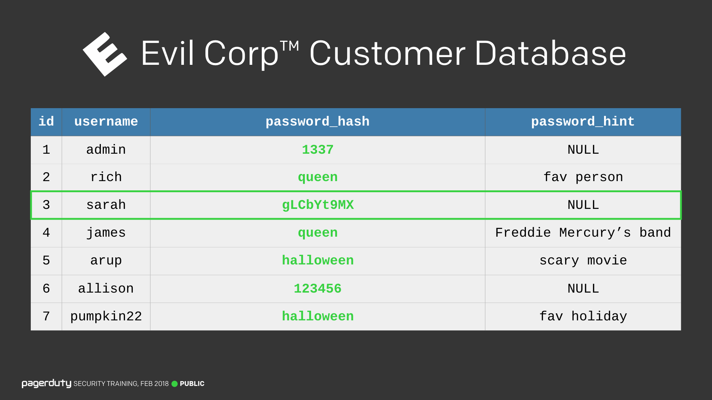</label>
_074. Cracked._

...we'll have broken our final password.

Pretty cool, right? Everyone feel like a movie hacker now?

Some of you may be looking at that password and getting pretty scared. I mean, it's a pretty good password to be fair.

---

### gLCbYt9MX

<input type="checkbox" id="075" /><label for="075">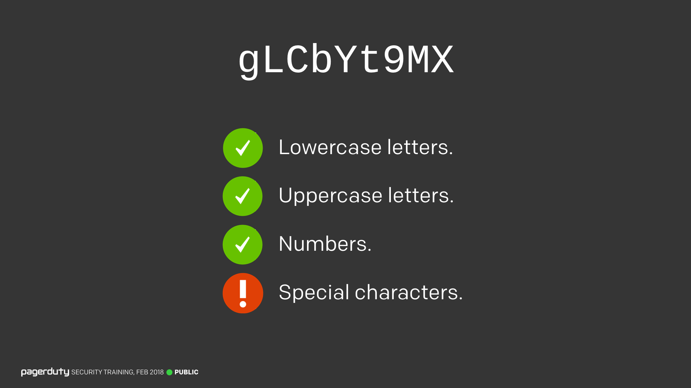</label>
_075. gLCbYt9MX._

There's a mixture of cases, it's 9 characters long, there are numbers in it, it's not a real word. The only thing really missing are special characters. I would wager that a lot of you might use worse passwords than this for a lot of things, and thought your passwords were safe. How do you feel about that now?

I'm not showing you all this to scare you. Well, I guess I am a bit. But I should apologise, because I've actually let you all astray ever so slightly. The type of attack I just showed, using "Magic Lists", is not too hard to defend against.

---

### Salting

<input type="checkbox" id="076" /><label for="076">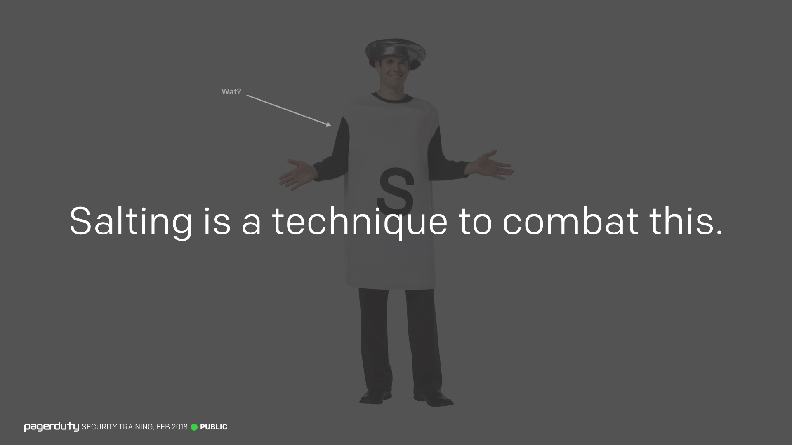</label>
_076. Salting._

There's a technique called "salting" which can stop this type of attack from working. You don't need to know what it is, just that it works, and it's been around since at least the 1970's, probably earlier. (Another one of my favourite stock images by the way).

So great, this technique has existed forever, and stops this attack. So we're safe? No one would ever not use this "salting" stuff on their modern website.

---

### Password Leaks

<input type="checkbox" id="077" /><label for="077">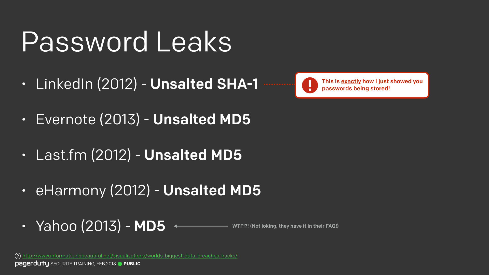</label>
_077. Password leaks. [Reference](http://www.informationisbeautiful.net/visualizations/worlds-biggest-data-breaches-hacks/)_

Unfortunately not. Lots of companies are using unsalted hashes to store their passwords. Does everyone remember the LinkedIn breach from 2012? I'm sure you all still get SPAM from it. Well, they were storing passwords _exactly_ how I just showed in the EvilCorp example. If your password was "halloween", then what you saw was exactly how they were storing it in their database.

These others here used something called "MD5", that's just the name of the "Magic" being used. MD5 is older and weaker than SHA-1, which is what I showed in my example.

Hell, even Yahoo used MD5, they had it in their FAQ for the recent breach. They didn't specify if it was salted or not, which means it probably wasn't.

If you're interested in the correct way to store passwords, come along to our [next training session for engineers](/for_engineers/) where I'll go into this in a lot more detail.

---

### What happens when passwords are leaked?

<input type="checkbox" id="078" /><label for="078">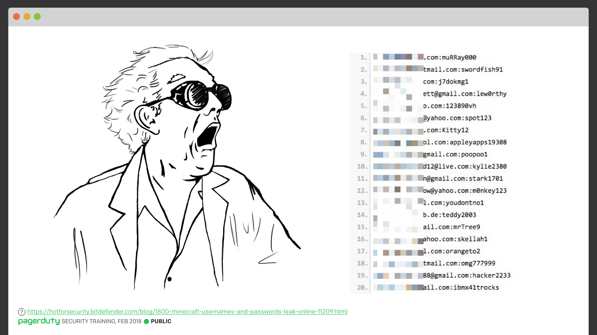</label>
_078. What happens when passwords are leaked? [Reference](https://hotforsecurity.bitdefender.com/blog/1800-minecraft-usernames-and-passwords-leak-online-11209.html)._

So what happens when these passwords leaks take place? Generally, once an attacker has stolen a database, they'll run it against those "Magic Lists" to produce a list of email and password combinations. They might not be able to break all the passwords, but they'll get a good chunk of them.

Most people reuse their email and password combinations for other things. So the attacker will start logging into all the other accounts they can, whether it's to steal information, or money. This can all be done _very_ quickly after a database is stolen.

It's usually months before the breach is known, by which point it's already too late.

The point I'm trying to make is that you can't control another website's security. You have absolutely no control over how another website stores your password or protects their database. So you need to protect yourself instead.

---

### Best Practices

<input type="checkbox" id="079" /><label for="079"></label>
_079. Best practices._

By following best practices with your passwords, you can massively reduce the chance that you'll succumb to an attack on another website, regardless of how they store your information.

If you use a different password everywhere, then only the password for that service is broken. Since the attacker will likely already have all the information stored with that service, they're not going to get any additional information they didn't already have.

So, your passwords should all be long, random, unique, and private. Now, a lot of you will likely be thinking the same thing right now, and I assure you that I'll get to the elephant in the room soon. But first, I want to talk about each of these criteria, and why they're important.

---

### Long

<input type="checkbox" id="080" /><label for="080">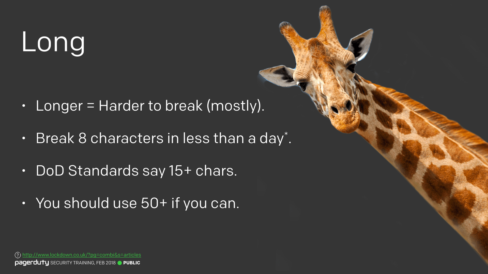</label>
_080. Long. [Reference](http://www.lockdown.co.uk/?pg=combi&s=articles)_

First, your passwords should be long. Hopefully it's mostly intuitive that the longer a password is, the harder it will be to break. At least in general. If your password is 20 of the same character, then that changes things a little.

It's worth noting that it's now possible to break 8 character passwords in less than a day with current computation power, regardless of how it's stored. Now, your average attacker won't have access to this kind of power, we're talking more about nation state actors here.

Current Department of Defense standards recommend 15 or more characters for your password. I recommend 50 or more. I see some wide eyes in the audience, don't worry, I know what you're thinking, and I'll get to it shortly.

---

### Random

<input type="checkbox" id="081" /><label for="081">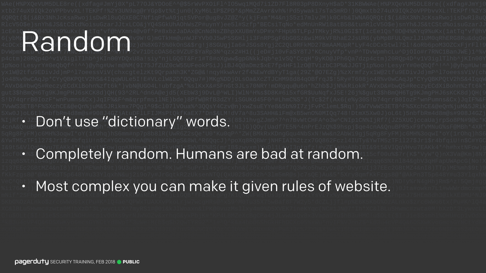</label>
_081. Random._

Next, your passwords also need to be random. I've said here not to use dictionary words, but "dictionary" is in quotes. I don't just mean the English dictionary. There are things called password dictionaries too. Remember a few slides ago, I showed you some email and password combinations that had been broken. When big websites get breached, the broken passwords get added to a password list and sorted by popularity. These can then be used to brute force (i.e. try every possibility until it works) other people's accounts.

So while words like `letmein` aren't in the English dictionary, they will be near the top of any password dictionary. It's just as important not to use these kinds of words.

You need to make them completely random, and humans are very bad at random. Even mashing your keyboard you're probably alternating your right and left hands, meaning there's patterns that can be implied. Computers are the thing that's going to be breaking your passwords, so a computer should be the one generating it too.

Finally, not all websites let you make completely random passwords, unfortunately. Some of them won't let you use certain characters, because of the way their systems work (this is usually an indication they're not storing passwords properly). You need to work within these restrictions, but use as many of the other available characters as you can in your passwords.

---

### Unique

<input type="checkbox" id="082" /><label for="082">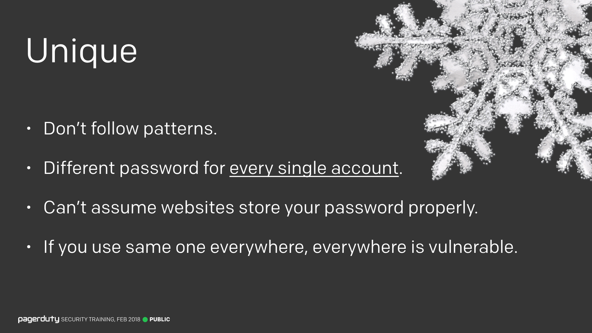</label>
_082. Unique._

Your passwords should be completely unique. Every single account you have should get its own password, and you shouldn't follow patterns. I see advice sometimes where you just pick one password, then append the name of the website to it, that way you get a different password everywhere. This is bad advice, please don't follow it. Firstly, if I break one of your passwords, it's trivial to figure out your pattern, and secondly if you ever need to rotate your password on one site, you're going to have a bad time.

You can't assume anything about how a website stores your password. For all you know they could be storing the password directly (we call this "in the clear", or "in plaintext"). So you need to use a completely unique password for every single login. Anywhere you use the same password becomes vulnerable as soon as one of those sites gets breached. And remember, you may not know about a breach until years later.

---

### Private

<input type="checkbox" id="083" /><label for="083">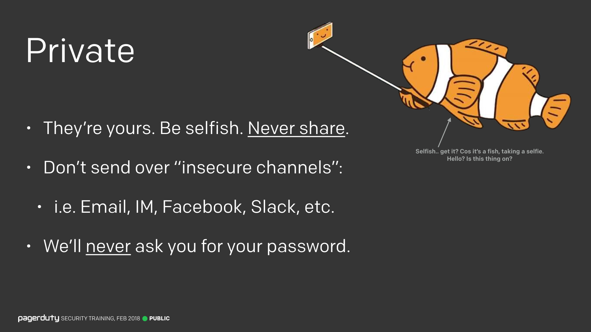</label>
_083. Private._

Finally, your passwords are private. Never ever share them with anyone. Not your loved ones, not your barber, not your Lyft driver. If you do things properly, even you probably won't know your own passwords (I'll get to how in a moment).

Also, you should never send your passwords over insecure channels. Don't email passwords to people, don't send them over IM, or Slack. If we need to share an initial password for you to login to a tool for the first time, we share it using a dedicated tool specifically designed for password management. If you ever accidentally post your password to somewhere that's not secure, you should consider it compromised and change it as soon as possible.

And finally, we will _never_ ask you for your password, under any circumstances. It should be a giant red flag if anyone at PagerDuty ever asks for your password. Never give it out.

---

### Treat passwords like toothbrush.

<input type="checkbox" id="084" /><label for="084">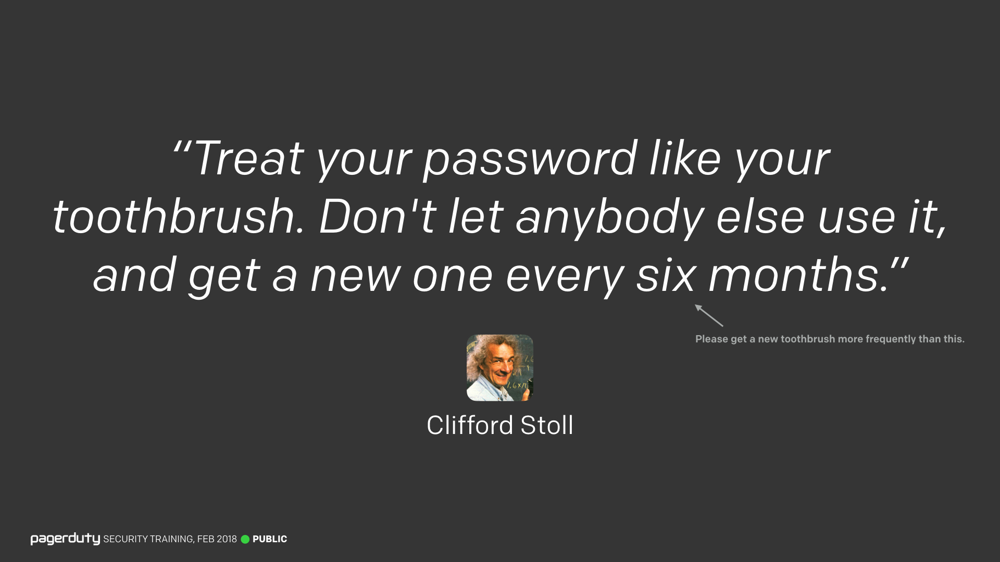</label>
_084. "Treat your password like your toothbrush. Don't let anybody else use it, and get a new one every six months."_

Here's a quote from Clifford Stoll on passwords which I thought was funny. Although I advise you replace your toothbrush a bit more often than six months.

Ok, so now we know what passwords should look like, let's look at a few examples of bad and good passwords.

---

### Bad Passwords

<input type="checkbox" id="085" /><label for="085">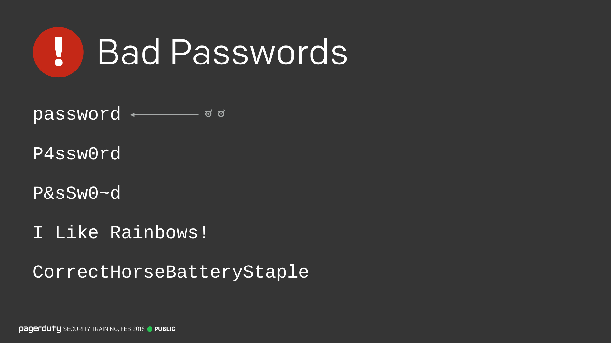</label>
_085. Bad passwords._

Hopefully it's all clear to you why `password` is a really bad password to use. Please don't ever use it, or any dictionary word. What about the next one though, `P4ssw0rd`? The "a" has been replaced with a "4" and the "o" a "0". This can also be trivially broken, as these are standard letter replacements and are a widely known technique. This might add a few minutes to the amount of time it takes to break.

The next one is better, `P&sSw0~d`, we've got special characters in there now, and not some standard replacements. But the password is only 8 characters long, and as we learned earlier, that's too short.

What about `I Like Rainbows!`. This is going to be much harder to break, but there are password cracking tools specifically designed for sentence based passwords. You can treat each word here like an individual "token", and it becomes similar to a 4 character password (albeit with a _much_ larger alphabet). This will certainly take longer than the others to break, but it can be broken much quicker than you probably realise.

And finally, `CorrectHorseBatteryStaple`. This was featured in an [XKCD webcomic](https://xkcd.com/936/) a while back as a method for choosing good passwords. Unfortunately, it's not a great password. Mainly because it's already been featured in the comic and is public information. But this is another known technique, and there are tools that can break passwords which are composed of normal words like this. It will take much longer to break, don't get me wrong, but there are much better passwords you can use.

OK, so what are some good passwords then?

---

### Good Passwords

<input type="checkbox" id="086" /><label for="086">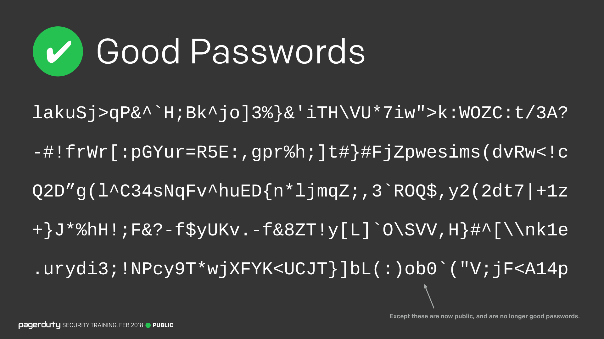</label>
_086. Good passwords._

These are good passwords. They're long, unique, and random. Although obviously they're no longer private because they're on this slide and you've all seen them, but this gives you an idea of what your passwords should be looking like.

Anyone want to take a shot at memorizing these?

Yeah, that's going to be tricky.

---

### Elephant in the Room

<input type="checkbox" id="087" /><label for="087"></label>
_087. Let's talk about the elephant in the room._

Which brings me to the elephant in the room. The thing a lot of you have been thinking for the last few minutes.

---

### I can't remember that

<input type="checkbox" id="088" /><label for="088">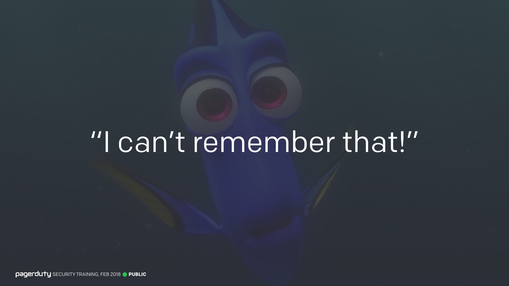</label>
_088. "I can't remember that."_

There's not a chance in hell we can remember those types of passwords.

That's the point. Any password that's easy for a human to remember is going to be even easier for a computer to break. Like I said before, computers are going to be breaking your passwords, so they have to be suitably complex in order to stand up.

So how do you remember all the passwords? You don't.

---

### Use a Password Manager

<input type="checkbox" id="089" /><label for="089">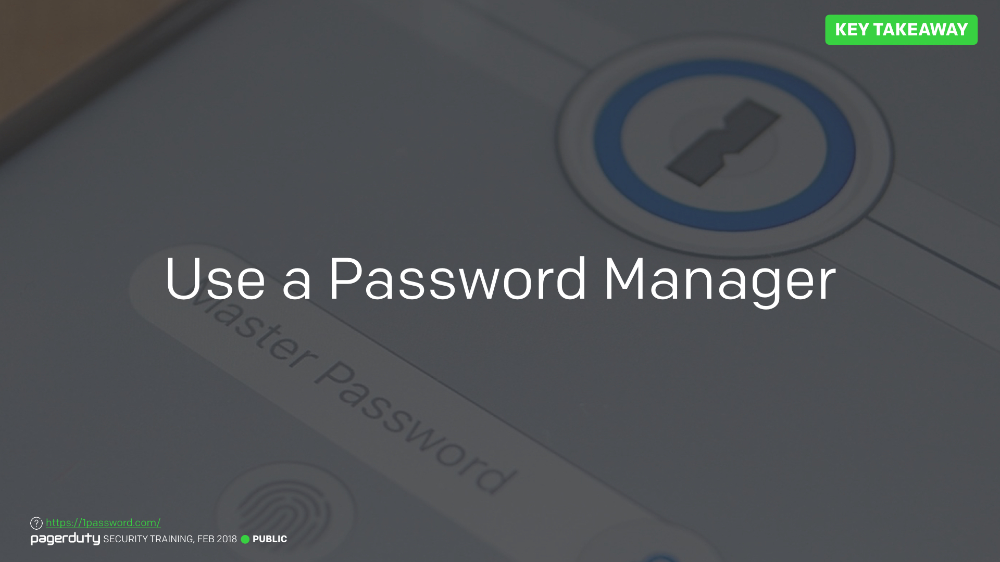</label>
_089. Use a password manager. [Reference](https://1password.com/)_

You need to use a tool called a "Password Manager". There are lots out there, and you've probably heard of a lot of them. "[LastPass](https://www.lastpass.com/)", "[1Password](https://1password.com/)", "[KeePass](https://keepass.info/)", etc. They each have their own pros and cons depending on how you prefer to operate. Most have browser plugins to automatically enter your passwords for you (although there have been some security issues there in the past). But they're all designed to do pretty much one thing. Store a lookup of all your usernames and passwords, protected by a single "master password", which is the one password (hey, that's the name of one of the tools) you need to remember. The idea is that it'll be the last password (hey, that's the name of another one!) you need to remember.

We use 1Password here at PagerDuty, so if you can't decide on a tool, then you may as well go with that one. One quick thing to note, make sure to use a different tool or vault for your personal vs work passwords. We revoke access to the PagerDuty ones when you leave, so you don't want all your personal ones to disappear too!

If there's only one thing you take away from today's training, please make it this: Using a password manager is the single most effective thing you can do to enhance your security online. Actually, maybe two-factor authentication too, we'll get to that later though.

Let's talk a bit more about password managers.

---

### Password Managers

<input type="checkbox" id="090" /><label for="090">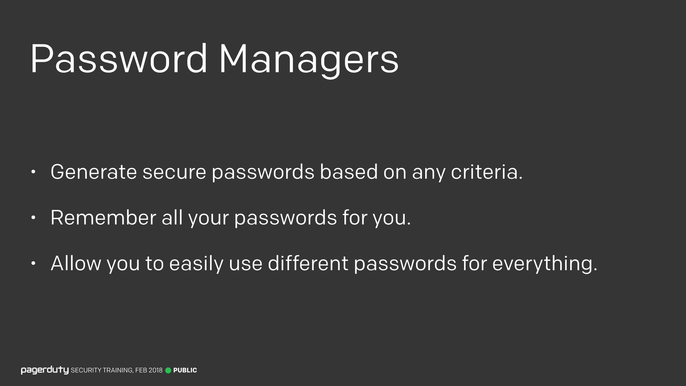</label>
_090. Password managers._

Password managers are designed to remember all of your passwords for you, in a secure way. They can also generate completely random passwords for you, and you can typically change the criteria associated with this generation. So if a website doesn't let you use special symbols, you can exclude those and still get a strong password.

???+ comment "Presenter's Comment"
    Rich's "Fun" Tidbit: One of the (many) password restrictions on The US Citizenship and Immigration Service website is "Your Password cannot contain the dollar ($) sign". I always thought that seemed a little ironic.

But the most important feature of password managers is that they let you use a completely different password for everything, without having to worry about remembering it yourself.

---

### Password Managers (2)

<input type="checkbox" id="091" /><label for="091">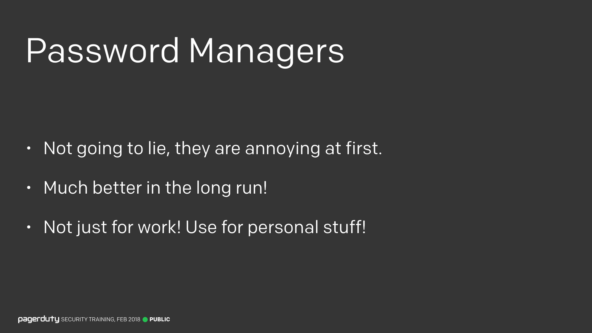</label>
_091. Password managers._

Now, I'm not going to lie to you. Switching from using the same password everywhere, to using a password manager, is reaaally annoying. It's going to slow you down when you want to access websites, and you're going to have to go to every place you have an account and change your password. It really is going to be a pain.

But it gets much easier as you get used to it, and it is so much better in the long run.

I should be clear too, I'm not just advocating for you to use them for all PagerDuty related passwords, you should use one for all your personal accounts too. Amazon, your bank, etc.

---

### Eggs In One Basket

<input type="checkbox" id="092" /><label for="092"></label>
_092. Eggs in a basket._

Some of you may be thinking "aren't we just putting all our eggs in one basket though? What happens if the password manager gets broken into!"

---

### Troy Hunt Quote

<input type="checkbox" id="093" /><label for="093">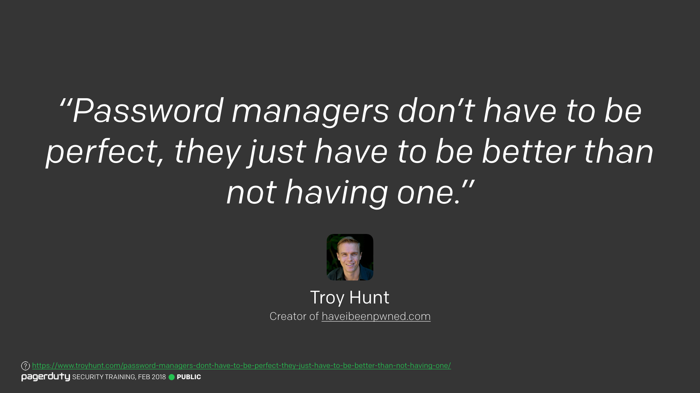</label>
_093. Password managers don't have to be perfect. [Reference](https://www.troyhunt.com/password-managers-dont-have-to-be-perfect-they-just-have-to-be-better-than-not-having-one/)_

And you're right, that is a concern. But we're playing the odds. It is much more likely that you will get compromised if you use the same password everywhere, than it is that an attacker can physically take your password manager _AND_ break your master password. This is why it's important to choose a strong master password.

This quote from Troy Hunt explains it well. Password managers don't have to be perfect, they just have to be better than not having one.

---

### Pick a Good Master Password

<input type="checkbox" id="094" /><label for="094">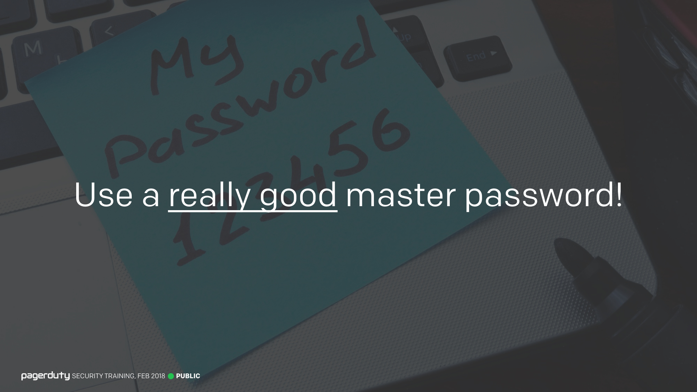</label>
_094. Pick a good master password._

But your password manager is only as good as the master password you pick. So you need to pick a good one, and you need to memorize it. Unfortunately this is one password you can’t store in your password manager.

---

### Memory Tips

<input type="checkbox" id="095" /><label for="095">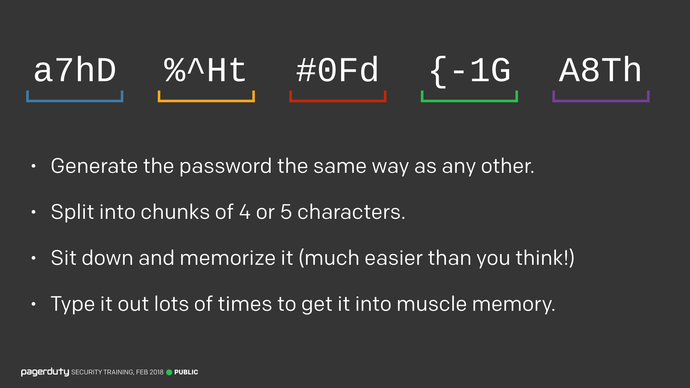</label>
_095. Memory tips._

I have some tips for memorizing a complex password that you may find useful.

First of all though, make sure you generate a password based on the guidelines we’ve already talked about. It's no good having awesome passwords stored in your password manager if the master password is `letmein`.

To have an easier time of memorizing it, try splitting it into chunks of 4 or 5 characters, like you see here. Then remember those chunks. Literally, just sit down and memorize them. You'll be amazed at how quickly you can retain the information. After about 5 minutes, stop and come back to it later, and see how much you can still remember. It'll take a few tries, but it will soon start to stick.

Another tip is to type out the password lots of times in a text editor, in order to get it into your muscle memory. You'll mess it up a few times at first, but quicker than you think, you'll be typing out a 30 character complex password entirely from memory.

---

### But Wait, There's More!

<input type="checkbox" id="096" /><label for="096">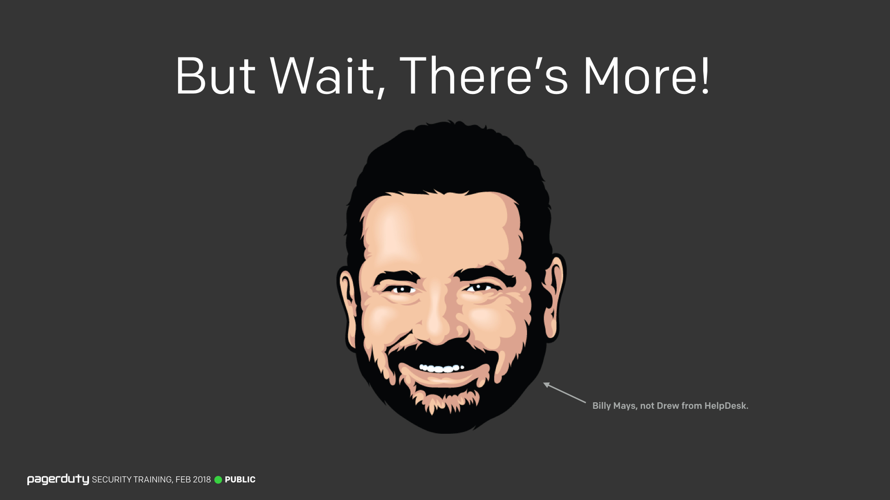</label>
_096. But Wait, There's More!._

But wait, there's more! Just because we now have a good process for passwords, doesn't mean that we're done.

---

### Password Equivalency

<input type="checkbox" id="097" /><label for="097">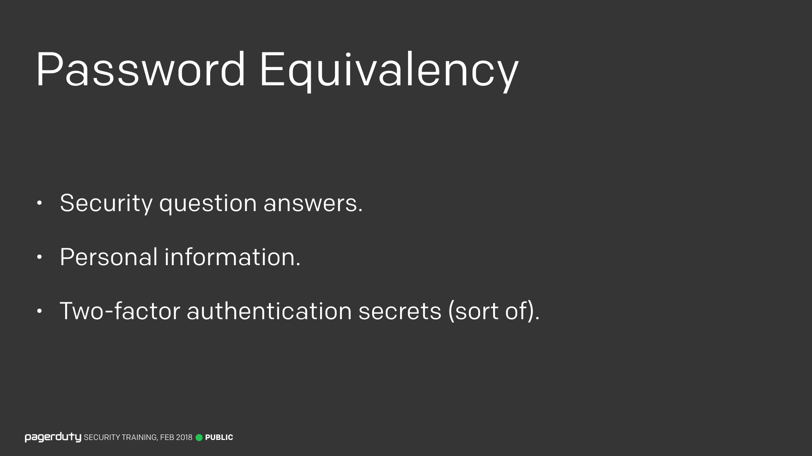</label>
_097. Password equivalency._

There's some things that are basically the same as your password. For example, security question answers. If I have that information, I can likely gain access to your account as if I had your password.

Personal information too, since a lot of websites will allow you to reset your account based on that information. Does that shopping website really need to know your date of birth? Probably not. Use a fake one and put it into your password manager.

Two-factor secrets are different, they're not equivalent to a password, but I've listed them here since they should be treated as such.

---

### Security Questions

<input type="checkbox" id="098" /><label for="098">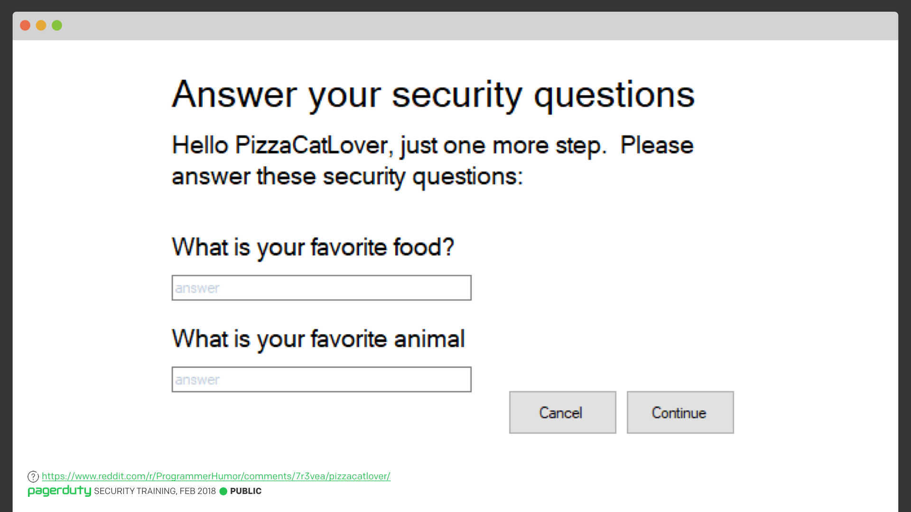</label>
_098. Security Questions. [Reference](https://www.reddit.com/r/ProgrammerHumor/comments/7r3vea/pizzacatlover/)_

I'll be honest, I absolutely hate security questions. They solve a customer support problem, not a security problem. In fact, from a security perspective all they do is weaken it. If you ever have the option not to set security questions at all, take it.

---

### Security Questions

<input type="checkbox" id="099" /><label for="099">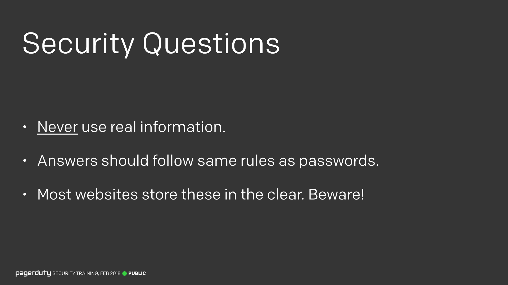</label>
_099. Security Questions._

Unfortunately most websites force you to set security questions and answers, giving you no choice but to enter something.

In which case, you should never, ever, under any circumstances use real information. There's always someone out there who's going to know that information. No matter how strong you make your password, if you use real information for your security questions, your account is going to be easier to compromise. Treat them like passwords, generate them in your password manager and store them there.

Most websites store this information in the clear, despite them being password equivalent, they are not treated as such. Most customer support agents will be able to see them on the screen in front of them.

There's even a slight risk that using randomly generating strings will get you into trouble, as I've been able to convince a support agent in the past that their system must have corrupted the field, which they concurred with since all they saw was random characters. You can't win, so again, we just need to play the odds. It's much more likely that using weak security question answers will get your data stolen.

---

### United Airlines "Security"

<input type="checkbox" id="100" /><label for="100">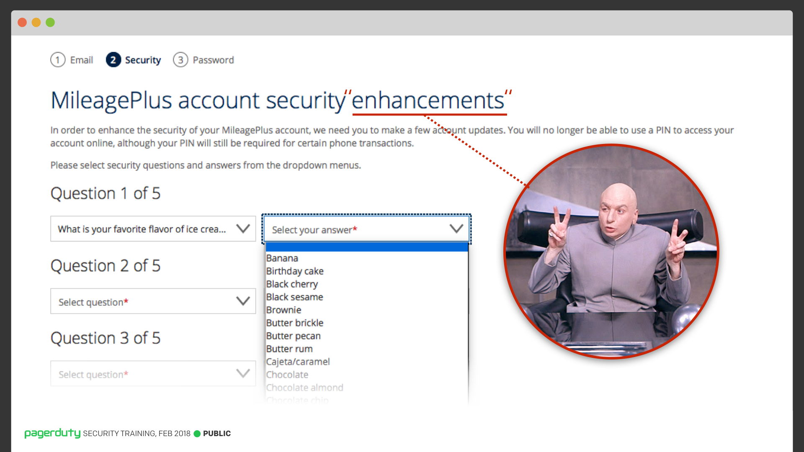</label>
_100. United Airlines "Security"._

Some companies go even further with their security questions. Here's United Airlines recent "improvements" to their security. Not only do they force you to pick 5 security questions, but your answers must be chosen from a dropdown of choices they provide.

Now when you need to reset your password, you are given two of these questions, and the answer drop down for each has 10 possible choices. So that's only 100 possible combinations to guess. The irony here is that they implemented this to replace PIN codes, which were 1,000 possible attempts, for not being secure enough.

But again, they give you no choice here. You can't generate your own answers, and you can't opt-out. Sometimes you just have to play their game and move on.

One thing that stood out about these changes are that United called these security questions "Two-Factor Authentication". But that's not entirely accurate.

---

### Multi-Factor Authentication

<input type="checkbox" id="101" /><label for="101">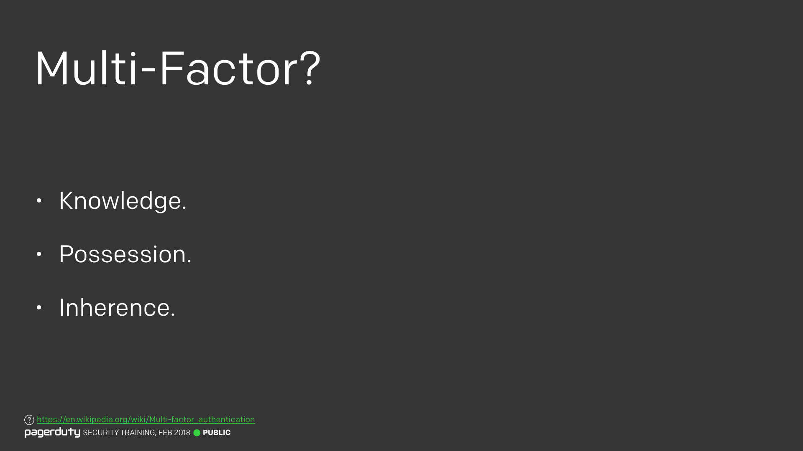</label>
_101. Knowledge, possession, inherence. [Reference](https://en.wikipedia.org/wiki/Multi-factor_authentication)_

You have heard the term "multi-factor authentication", or "two-factor authentication" a lot. But what exactly is it?

In the field of authentication, there are three main types of evidence (or "factors") you can provide. These are called "Knowledge", "Possession", and "Inherence".

---

### Multi-Factor In Plain English

<input type="checkbox" id="102" /><label for="102">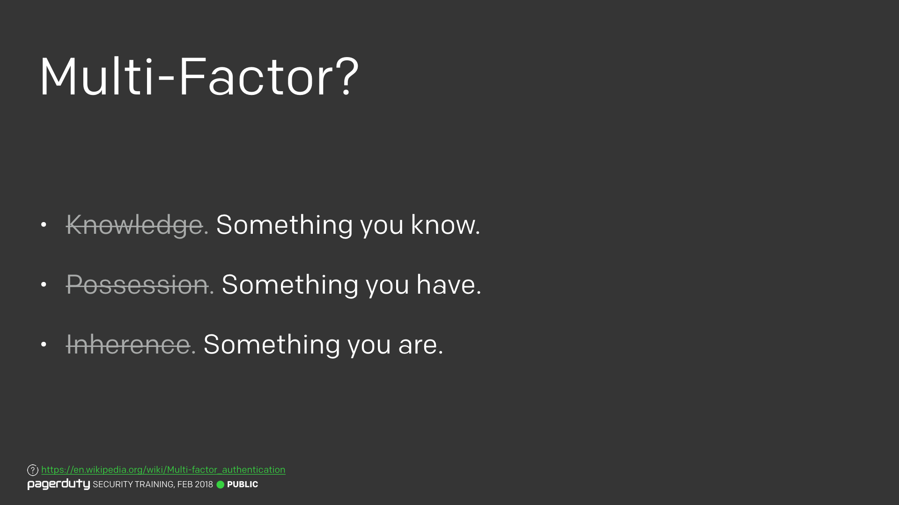</label>
_102. Multi-Factor. [Reference](https://en.wikipedia.org/wiki/Multi-factor_authentication)_

In plain English, that's Something you know, Something you have, and Something you are.

---

### Password, Device, Fingerprint

<input type="checkbox" id="103" /><label for="103">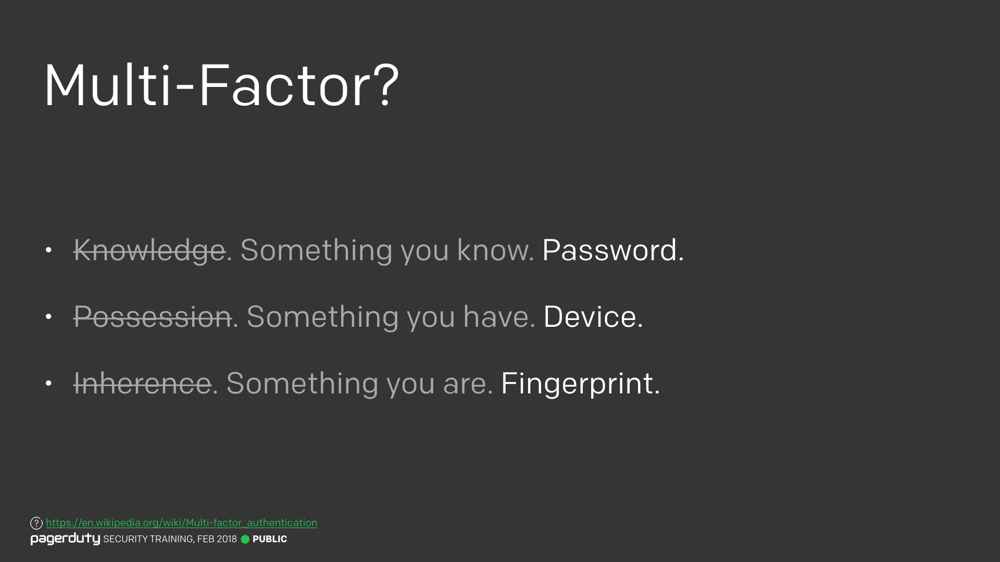</label>
_103. Password, Device, Fingerprint. [Reference](https://en.wikipedia.org/wiki/Multi-factor_authentication)_

So, something you know would be a password. Something you have would be your phone, or a physical object. And something you are would be a fingerprint, or some other form of biometrics.

---

### Two-Factor

<input type="checkbox" id="104" /><label for="104">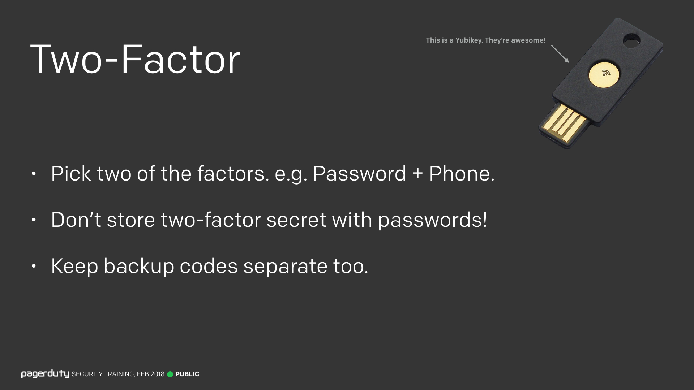</label>
_104. Two-Factor._

The idea of two-factor authentication is that you pick two of these factors, and require them in order to authenticate a user. While an attacker might be able to remotely steal your password, it's pretty unlikely they'd also be able to physically steal your phone or get a fingerprint. Likewise, if an attacker can physically steal your phone, it's unlikely they'd also be able to get your password.

As you can probably now understand, the United Airlines authentication I showed earlier is not two-factor authentication, as security question answers are the same as you password, they're both "Something you know".

In order for two-factor authentication to be most effective, it's important not to store the two-factor codes with your passwords. This goes back to that security vs convenience trade-off I talked about at the start. It's very convenient to have them in the same place, but then if an attacker gets one, it means they get the other too.

Some password managers let you store the two-factor secrets with the passwords. You do still gain some security advantages there. But it's much better to keep your two-factor codes in a separate password manager. Then if your original master password is broken, an attacker only gets one.

This all applies to backup codes too. Typically you should just print those off and put them somewhere safe. They're your absolute failsafe.

---

### Yubikeys

<input type="checkbox" id="105" /><label for="105"></label>
_105. Yubikeys._

We use Yubikeys for the most part, they're a little USB device with a touch sensitive contact on one side. You just plug it in and touch the button to verify the "something you have" factor. The majority of folks find this to be the most convenient two-factor method we offer, although you're welcome to use any of the other two-factor methods available to you if you prefer those. The only one we don't allow is SMS, since there are some security issues with it. But if you prefer to use the 6 digit code from Google Authenticator, you're more than welcome to use those.

All PagerDuty issued Yubikeys are yours to keep, so you can feel free to use them for personal accounts if you like (Google, Facebook, Dropbox, etc). If you have a personal Yubikey already, we're also more than happy to register it in our system so you can use it for your PagerDuty accounts, it may require us to reprogram it and lose some of your existing configuration though. We can work with you to limit the impact.

---

### Use Two-Factor Authentication

<input type="checkbox" id="106" /><label for="106">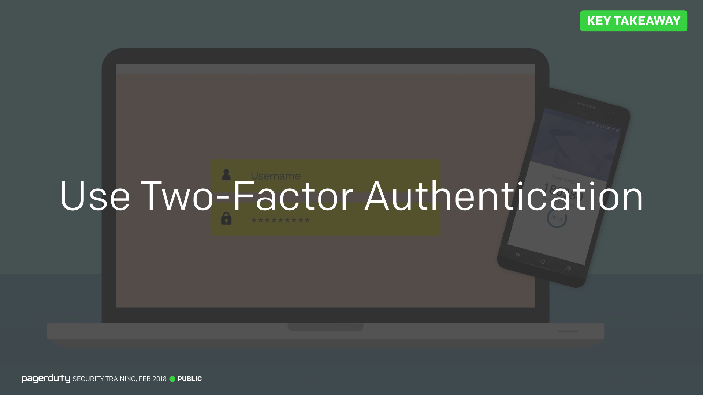</label>
_106. Use two-factor authentication._

The big takeaway from all this, is to make sure you use two-factor authentication wherever it's available. All PagerDuty systems enforce two-factor authentication, so you should already be used to it here. But you should use it for all your personal stuff too. GMail, Facebook, Dropbox, GitHub, Amazon, etc. They all have two-factor authentication options available.

---

### Physical Security

_<input type="checkbox" id="107" /><label for="107">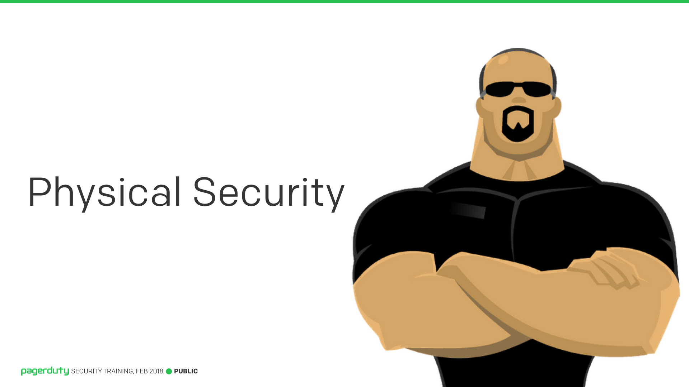</label>_
_107. Physical Security._

These next two sections will go much quicker, I promise. We're now going to talk about physical security. I don't mean bouncers.

---

### What is physical security?

<input type="checkbox" id="108" /><label for="108">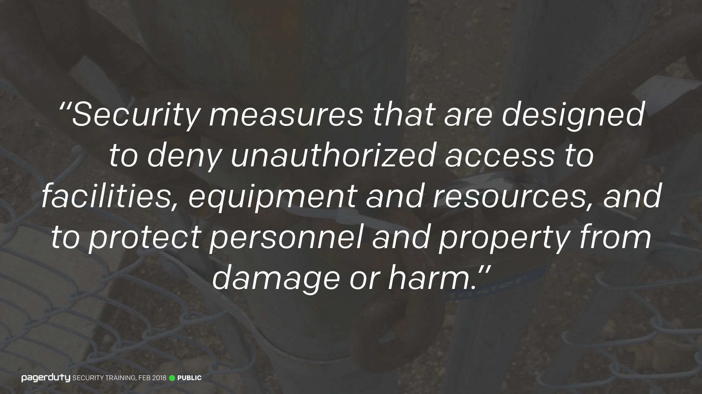</label>
_108. What is physical security?_

I mean security that's designed to protect our office, personnel, and equipment.

---

### Basic Guidelines

<input type="checkbox" id="109" /><label for="109">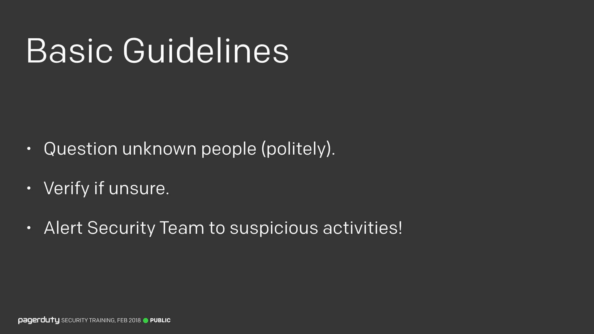</label>
_109. Basic Guidelines._

We're growing really quickly now, and it's very easy to lose track of who works here and who doesn't at any given time. Gone are the days where we could all fit into a single meeting room.

It's important to keep our office environment secure though, we don't want random folks wandering around stealing information or equipment. If you see someone you don't recognize acting suspicious, just ask questions. Introduce yourself and make a new friend, since 99% of the time it's going to be an employee you've simply not met yet.

If their answers don't satisfy you, and you think they're sketchy, alert the security team and we'll take care of it. Don't put yourself in danger, and leave if you feel uncomfortable.

---

### Ask Questions

<input type="checkbox" id="110" /><label for="110">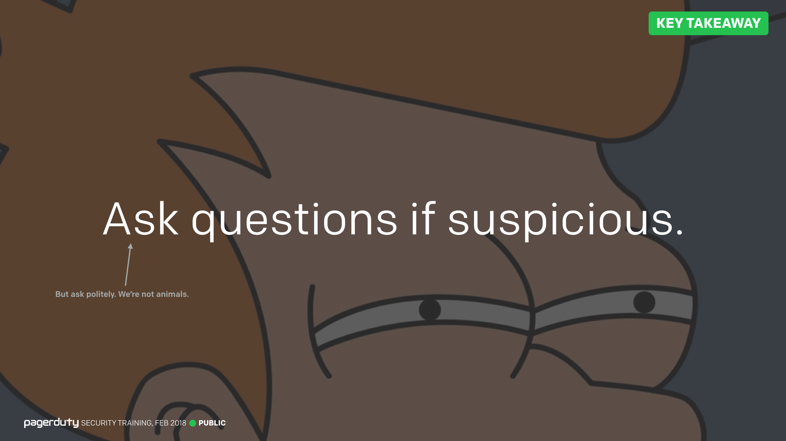</label>
_110. Ask Questions._

If you see something suspicious, ask questions. But be polite, don't shove someone up against the wall shouting "Who do you work for!!?!?!", this isn't a movie. If someone is wandering around looking lost, ask them where they're heading. It's likely just a new employee.

If someone you don't recognize is sitting at your friends desk using their laptop though, that's something you probably want to let the security team know about pretty quickly. Speaking of which...

---

### Lock Your Computers!

<input type="checkbox" id="111" /><label for="111">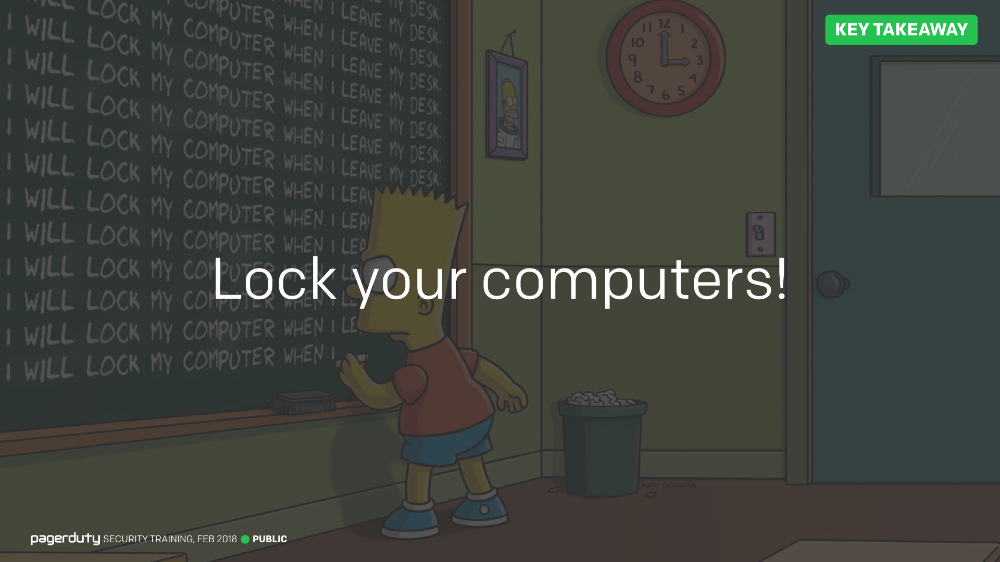</label>
_111. Lock Your Computers!._

Please lock your computers when you're not with them. It literally only takes a few seconds for someone to plug in a USB stick and they've now loaded malware on to your machine.

If you wander around the office and see someone else's computer unlocked, please lock it for them, then send them a private message on Slack letting them know it was unlocked and that you locked it. Resist the urge to troll the user by changing their background or typing as them on Slack. That's not the kind of environment we're trying to foster.

Also we used to do that, and it just makes people feel bad and doesn't give you the results you want.

---

### Piggybacking

<input type="checkbox" id="112" /><label for="112">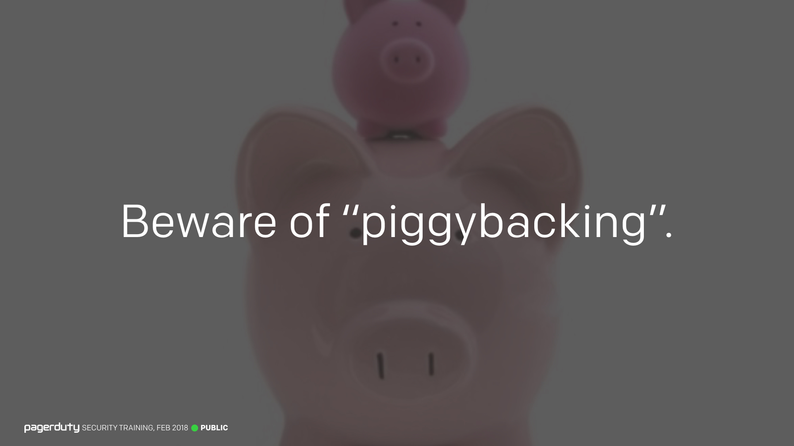</label>
_112. Piggybacking._

Beware of "Piggybacking", this is where someone else follows you through a secure door on your keycard swipe. A common social engineering trick is to just act like you belong and follow people through a door they've opened for you. Usually carrying something heavy with both hands to explain why they can't swipe their own keycard.

Always verify other people coming in on your keycard. If they're co-workers you recognise, then of course let them in. But if you don't recognise them, ask them to tap their own keycard too. Then introduce yourself, and make a new friend, since it's a coworker you'd not met yet.

Likewise, if you're following someone through a door and they ask you to tap your keycard, please don't give them any grief. Tap your keycard, and then introduce yourself and make a friend.

---

### Building Keycards

<input type="checkbox" id="113" /><label for="113">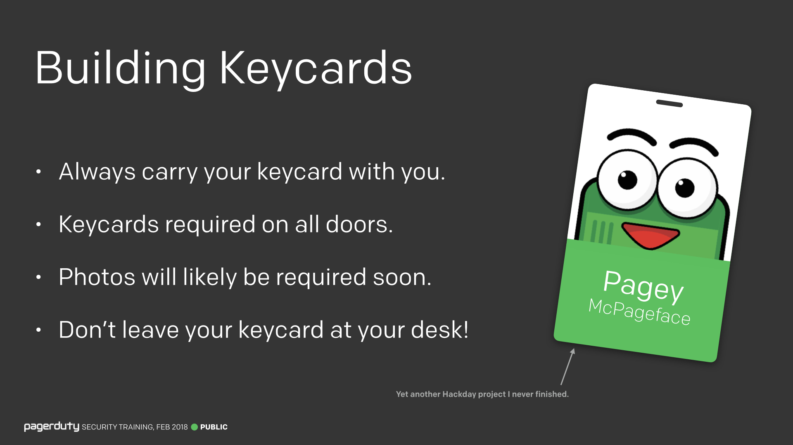</label>
_113. Building Keycards._

Speaking of keycards, please keep them with you at all times. Don't leave them at your desk. You've no doubt noticed that keycards are required on all doors that access the building.

As we grow as a company, we're probably going to need to start putting photos on the keycards too. Although I personally question the effectiveness of that, since most people don't look at name badges anyway. Also we want to make sure not to put the company name on the keycard, otherwise it gives away where the keycard can be used when it gets lost. It'd be like putting your home address on your house key.

I started a hackday a while back to make our keycards nicer, but never followed through. Who knows what they'll eventually look like.

---

### Building Security

<input type="checkbox" id="114" /><label for="114">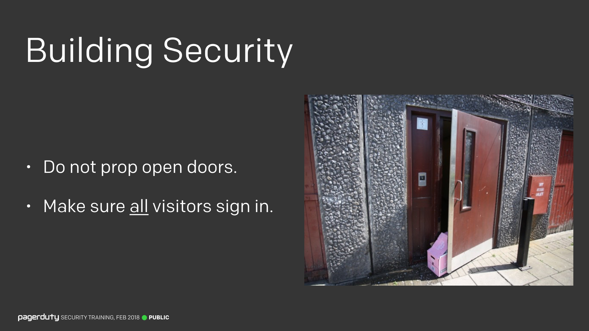</label>
_114. Building Security._

Once you've used your keycard to unlock a door, please don't prop it open. The doors are locked for a reason, and propping them open kind of defeats that. Listen for the sound of the door closing behind you.

Make sure all your visitors sign in at the front desk, and have a name badge. Not only is this good security practice, but it's required for fire safety too, so we know how many people are in the building should we need to evacuate.

---

### Laptop Stolen?!

<input type="checkbox" id="115" /><label for="115">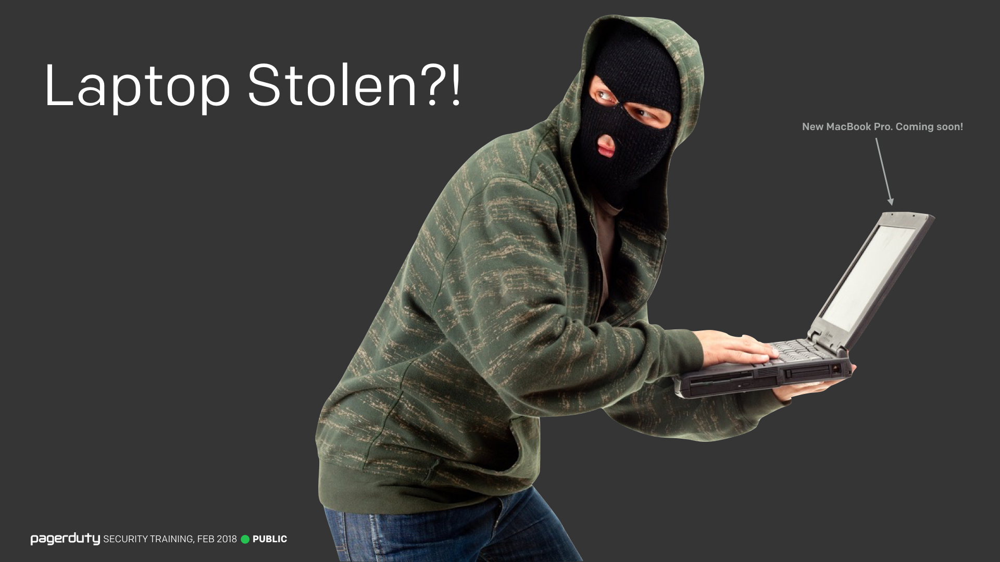</label>
_115. Laptop stolen?!._

So you're at a bar after work, you look down on the floor and see that your backpack has been stolen, and your PagerDuty issued laptop was in there. It was likely stolen by someone wearing a balaclava, since we know that's what all criminals wear based on my stock image searches.

What do you do?

---

### Panic?

<input type="checkbox" id="116" /><label for="116"></label>
_116. Panic?._

Your first instinct is to probably panic. That's OK, it's a natural reaction.

---

### Don't Panic

<input type="checkbox" id="117" /><label for="117">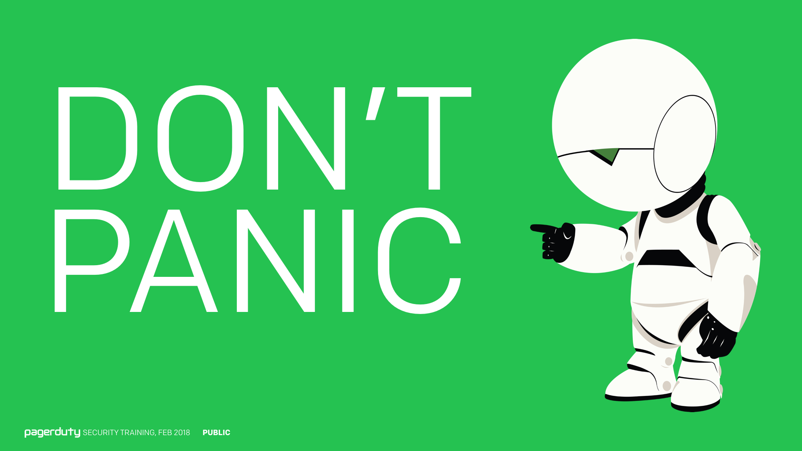</label>
_117. Don't Panic._

But don't panic. Things get stolen, it's just the world we live in. You're not going to get fired, you're not going to get into trouble.

_(Unless you stole the laptop yourself, in which case, yeah.. you'll probably get into trouble)._

---

### Page Security

<input type="checkbox" id="118" /><label for="118">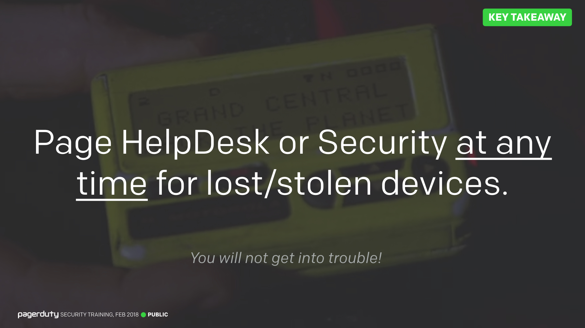</label>
_118. Page us!._

Page security or helpdesk at any time if you have lost or had stolen, any devices that access PagerDuty information. Whether it's your PagerDuty issued laptop, or your personal phone which was logged into your GitHub account. Let us know immediately so we can lock it out from all our systems and get you a new device issued.

This is a high-urgency pageable situation. So if you spot your stolen device at 2am, you page us at 2am. Don't wait until business hours. We always have someone on-call who will respond to these pages and take the necessary action.

If you don't know how to page us via PagerDuty, please come and talk to us as soon as you can so we can show you. Hopefully you've all at least used our product once, but some of you are pretty new and probably haven't had the chance yet, that's OK.

---

### Personally Identifiable Information (PII)

_<input type="checkbox" id="119" /><label for="119">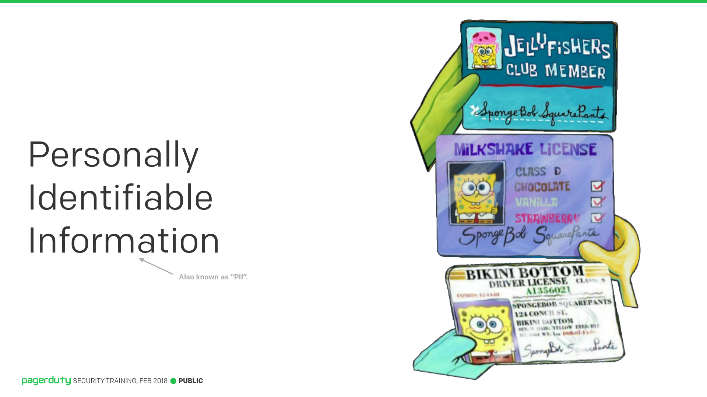</label>_
_119. Personally Identifiable Information (PII)._

The next topic is Personally Identifiable Information, usually abbreviated to PII, or sometimes just PI.

---

### What is PII?

<input type="checkbox" id="120" /><label for="120">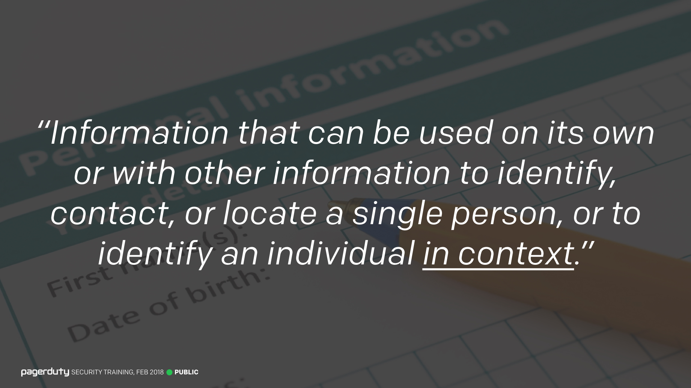</label>
_120. What is PII?_

This is any information that can be used to identify a single person in context. By that I mean, it's no good just to be able to tell that certain data belongs to a single human, you have to be able to identify that particular human out of all the others that exist.

---

### Basic Guidelines

<input type="checkbox" id="121" /><label for="121">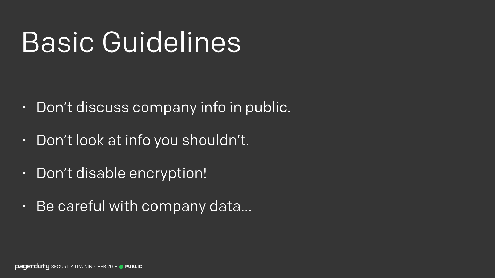</label>
_121. Basic Guidelines._

We have some basic guidelines when it comes to personal information at PagerDuty. First of all, don't discuss company information in public. The number of times I overhear conversations out in the world from folks at other companies discussing things they really shouldn't be is astounding. Please don't do the same.

Don't look at information you shouldn't. Let's say you come across a list of employees and their SSN's. That's pretty bad, and is something we want to know about. Don't just scroll through the data and keep it to yourself. Let us know immediately so we can do something about it. Just like with stolen devices, you won't get into trouble for accessing something you shouldn't have access to if it was an honest mistake. But if you look at that information and don't tell anyone, then later we find out you accessed it, that's going to cause problems.

All company devices are encrypted by default when you get them. Don't turn this off. We give you administrative access to your laptops because we want you to have the ability to do whatever you need with them to get your job done. Turning off encryption is not one of them.

Finally, we need to be careful with company data. What is company data you might ask.

---

### Company Data?

<input type="checkbox" id="122" /><label for="122">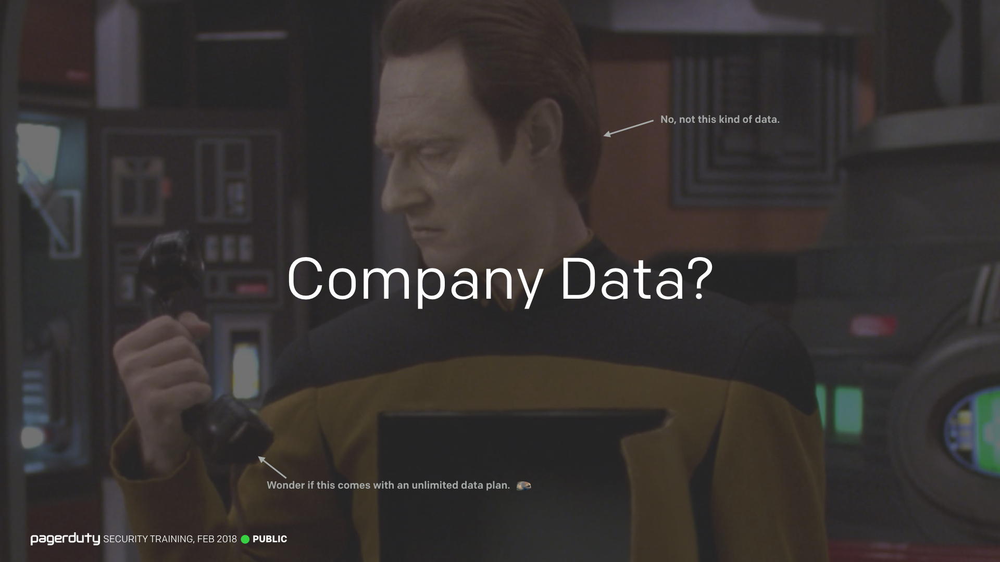</label>
_122. Company Data?_

It's not this type of data. It's the data we store in our systems that allow us to run our business.

---

### Data Classification

<input type="checkbox" id="123" /><label for="123">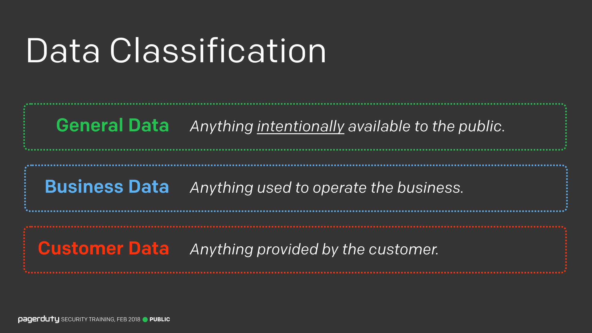</label>
_123. Data classification._

We have three distinct types of data at PagerDuty.

* *General Data* is anything that is _intentionally_ available to the public. The key being intentionally. If something gets leaked, it doesn't automatically become general data.
* *Business data* is anything used to operate our business. Examples would be our employee list, payroll information, etc.
* *Customer data* is any data provided to us by the customer.

Customer data is by far the most valuable and protected data we have at PagerDuty, and is subject to our most stringent security rules.

---

### Data Handling

<input type="checkbox" id="124" /><label for="124">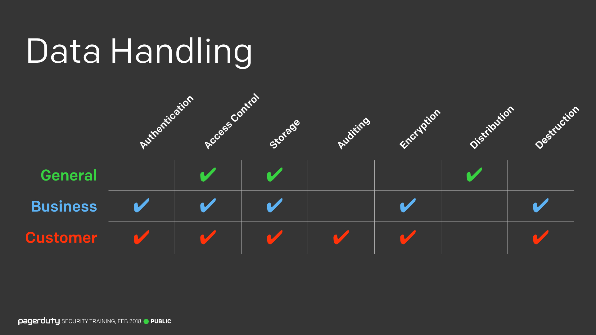</label>
_124. Data handling._

How we handle data depends on what type of data it is. For example, general data does not need to be encrypted, as it's considered public. All other types of data should always be encrypted in transit and at rest however.

You can view a more detailed description of our data handling policies on the wiki.

???+ warning "Redacted Content"
    When originally presented, this slide contained links to our internal wiki with more detailed information. Those internal links have been removed from the public version.

---

### Wiki Page Classifications

<input type="checkbox" id="125" /><label for="125">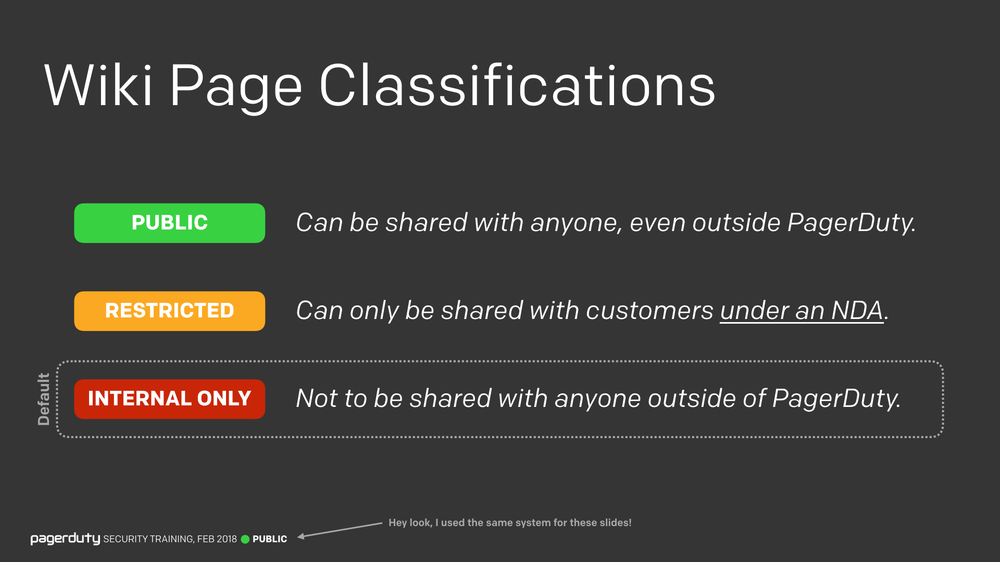</label>
_125. Wiki page classifications.._

Speaking of the wiki, you will notice that every link in the security wiki has a coloured label next to it which identifies which classification that particular link or file is subject to, and how it can be disseminated.

* *Public* can be shared with anyone.
* *Restricted* is only to be shared with customers who are under an NDA.
* *Internal only* are not to be shared with anyone outside of PagerDuty.

If any link does not have a classification, it is to always be considered internal only.

You'll also notice that these classifications exactly match the ones used for these slides!

---

### Personal Devices

<input type="checkbox" id="126" /><label for="126">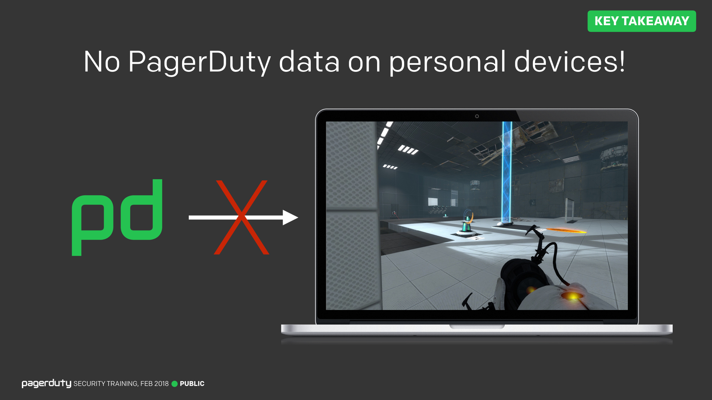</label>
_126. No PagerDuty data on personal devices._

When it comes to handling data, it's important to make sure that certain data never leaves our secured environments.

We do not allow any PagerDuty data to be stored on your personal devices. This means you do not clone a PagerDuty git repository to your personal device, and you do not download sales contracts or employee lists to your personal devices.

This does not mean you can't check your email from your phone. Any website or hosted platform is perfectly fine to access from your personal devices. You should never be downloading and storing anything on your phone that is PagerDuty related however.

If you're unsure what counts as a hosted platform, just ask us!

This is also why it's important for you to let us know if your personal device is lost or stolen, so we can lock it out from all our services.

---

### PagerDuty Devices

<input type="checkbox" id="127" /><label for="127">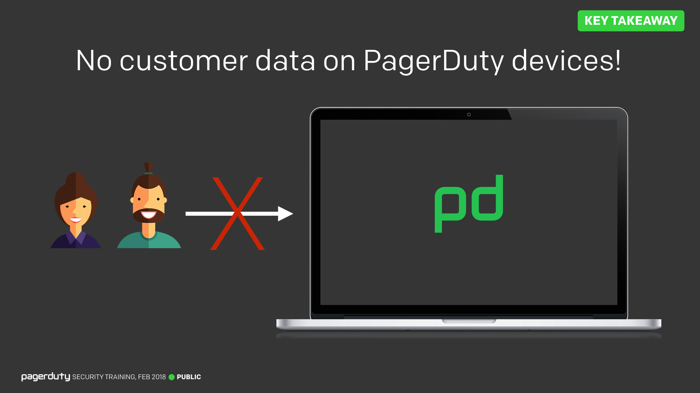</label>
_127. No customer data on PagerDuty devices._

Likewise, you should never store customer data, even on PagerDuty devices! Customer data is never to leave our production environment under any circumstances.

That means you do not download parts of our production database to your PagerDuty laptops, you do not transfer real production data to our staging or sandbox environments to run some tests, etc. Our production environment has strict security controls and audit logging in place. If you transfer data away from those environments, we  lose those abilities.

We have analytics mechanisms available to you in our production environment to run these types of things. If you need something different or special set up for a specific project, please let us know and we're more than happy to guide and help you set that up.

---

### Be Mindful

<input type="checkbox" id="128" /><label for="128">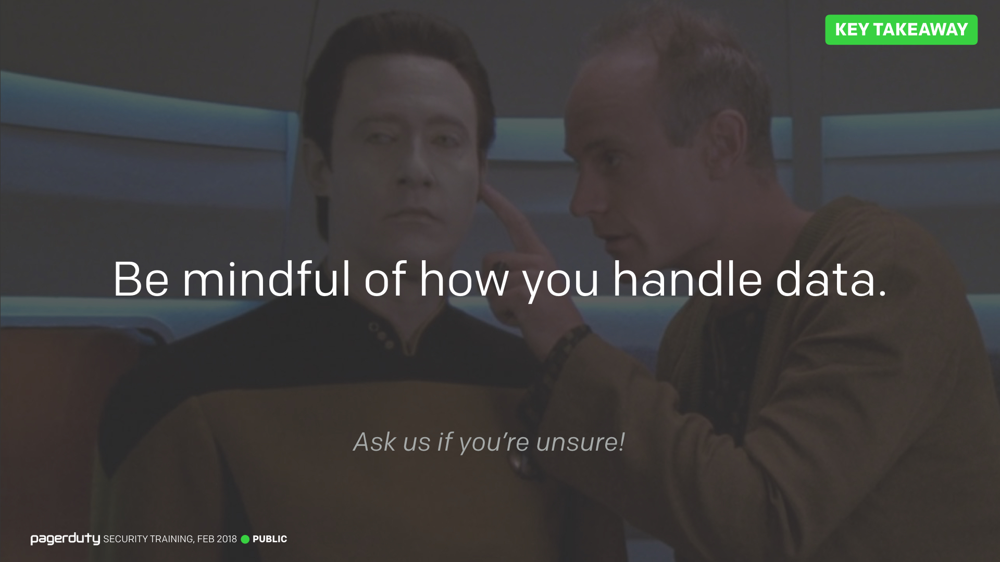</label>
_128. Be Mindful._

The takeaway from all of this is that you should be mindful of how you handle data. Treat customer data as you would want your own data to be treated. Like I said earlier, customer data is our most valuable asset, and customers are trusting us with it. Breaching that trust is unacceptable, and so we all need to make sure we follow the rules.

If you’re not sure how to treat certain data, just ask us! Maybe it’s a case we hadn’t considered yet, and something we need to create a policy for.

---

### Compliance

_<input type="checkbox" id="129" /><label for="129">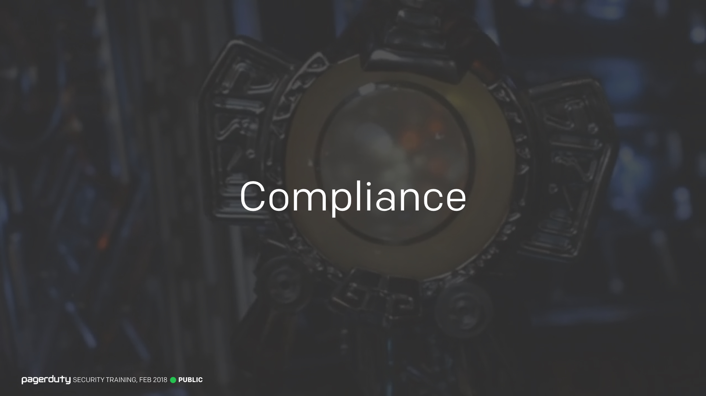</label>_
_129. Compliance._

OK, we're on to our final topic. Compliance.

???+ comment "Presenter's Comment"
    If you don't know what that background image is about, go and watch a cheesy 80's sci-fi movie called "[Flight of the Navigator](https://www.imdb.com/title/tt0091059/)".

We have a variety of compliance restrictions that affect how we operate, so I want to spend a bit of time talking about each of them.

---

### GDPR

<input type="checkbox" id="130" /><label for="130">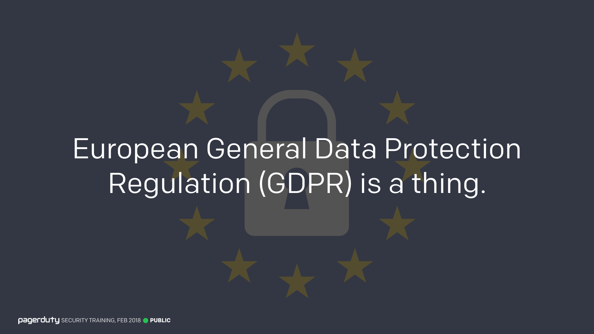</label>
_130. GDPR._

The first one is GDPR. This stands for General Data Protection Regulation and is a new European law coming into effect later this year. I'm required to tell you that this exists, and is a thing.

...

Just kidding, of course I'm going to go into more detail.

---

### GDPR

<input type="checkbox" id="131" /><label for="131">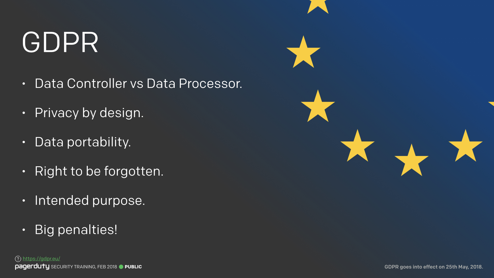</label>
_131. GDPR. [Reference](https://www.eugdpr.org/)_

GDPR goes into effect on 25th May 2018, and has very strict rules for how personal information should be handled, with big fines for those who don't follow the rules. We will be subject to GDPR, as we handle data for users who are EU citizens.

We are mostly considered a "Data Processor" under GDPR, rather than a Data Controller. Our customers are the data controller (they control the data of their employees), and we process their data on their behalf. Any customers who are subject to GDPR as controllers will need to execute a Data Processing Agreement (DPA) with us if we are to continue processing their data. Since we also have third-parties which process customer data on _our_ behalf (for example, our notification and telephony providers), we will also need to execute DPA's with them. It's worth noting that there are also a few cases where we would be considered a Data Controller, such as for our UK based employees.

We'll need to include extra steps in our development processes to include data protection from the onset of designing our systems, rather than something that's added on later.

Data portability is the right for a data subject (i.e. our users) to receive the personal data we have stored which concerns them. We need to provide this in a "commonly used and machine readable format". The user also has the right to transmit that data to another controller. Our current API satisfies this constraint, since it allows users to retrieve all the information we have on them, and they can export it and send it to another provider as they see fit.

Another thing GDPR requires is the "Right to be Forgotten", also known as Data Erasure, this entitles the data subject to have the data controller erase his/her personal data, cease further dissemination of the data, and potentially have third parties halt processing of the data. We already allow customers to purge their information from PagerDuty on request, so again, we already satisfy this constraint.

One very important part is that we have to specify the intended purpose of all personal data we will process, and cannot use that data for any other purpose. For example, if we specify the intended purpose of collecting email addresses is to send PagerDuty notifications, we cannot then use that email address to send the user marketing material.

And there are very hefty penalties for any breach of GDPR. 4% of annual global turnover, or €20 Million, whichever is greater.

There are more things involved with GDPR that I’ve gone over here, such as “Consent” and “Profiling”, etc. The link at the bottom has more information if you’re interested.

---

### Dear Santa

<input type="checkbox" id="132" /><label for="132">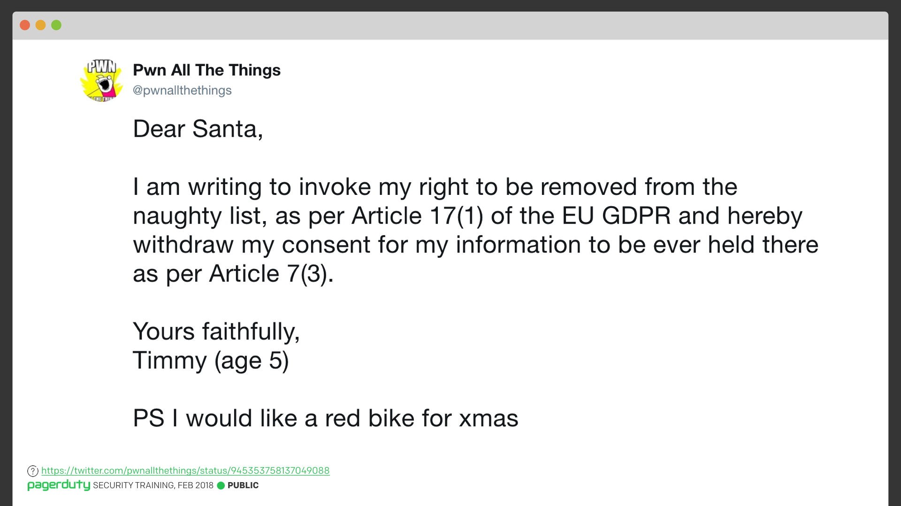</label>
_132. Dear Santa... [Reference](https://twitter.com/pwnallthethings/status/945353758137049088)_

The bottom line is that GDPR is going to lead to a lot of interesting situations in the industry.

---

### More Compliance

<input type="checkbox" id="133" /><label for="133"></label>
_133-135. Redacted slides._

???+ warning "Redacted Content"
    A series of slides here went into detail on our other compliance initiatives. These initiatives are still being worked on and so we're unable to share the information publicly.

---

### Would you like to know more?

_<input type="checkbox" id="136" /><label for="136">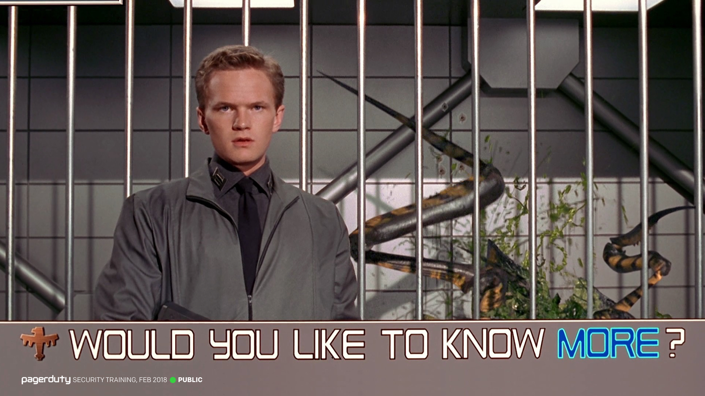</label>_
_136. Would you like to know more?_

And that's it! All of the topics I had. I hope you all learned something useful, and if not, I hope you at least had a laugh at some of the jokes. If you want to know more about any of the material here, or anything security related that I didn't get a chance to cover, here are some ways you can find out more.

---

### Contact Security Team

<input type="checkbox" id="137" /><label for="137"></label>
_137-139. Redacted slides._

???+ warning "Redacted Content"
    These slides gave an overview of how folks can reach the security team, and links to our internal wiki pages, Slack rooms, and details on when we run office hours.

---

### Llama

<input type="checkbox" id="140" /><label for="140"></label>
_140. Llama._

And for all of you waiting for the animal to go with the colour from the start, it's a Llama. So you'll be getting a feedback survey in a few moments, just enter the colour from the start, and this animal, and that will "prove" that you attended the security training for this year.

You'll also have a chance to provide feedback on the training, which will shape how we change it next year. I will assume any negative feedback about my jokes are all in jest.

---

### Questions?

<input type="checkbox" id="141" /><label for="141">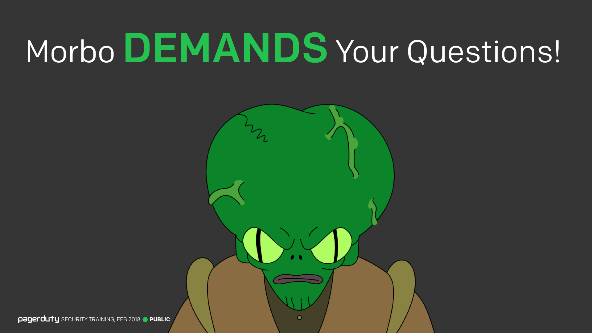</label>
_141. Questions?_

So with that, I'll open it up to questions. Thanks very much!

???+ comment "Presenter's Comment"
    If you have questions about this training material, feel free to ask me on Twitter, I'm [@r_adams](https://twitter.com/r_adams).

---

### Image Credits

<input type="checkbox" id="142" /><label for="142">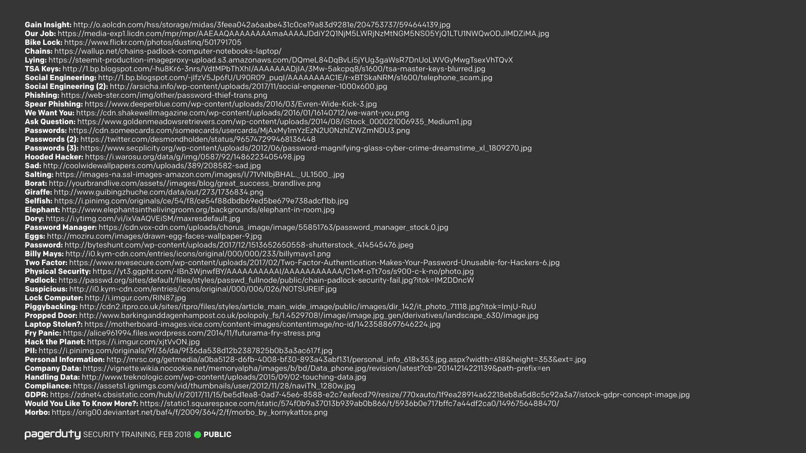</label>
_142. Image credits._

???+ info "Information"
    Here are the credits for all the images used throughout this training.

---

!!!question "Spotted a Problem?"
    Security is hard, and we're not perfect. There may be mistakes or misunderstandings in this training material. If you find a problem, please help us correct it! This project is [open-source on GitHub](https://github.com/pagerduty/security-training) and we appreciate all friendly contributions.

*[SRE]: Site Reliability Engineering
*[NDA]: Non-Disclosure Agreement
*[ISP]: Internet Service Provider
