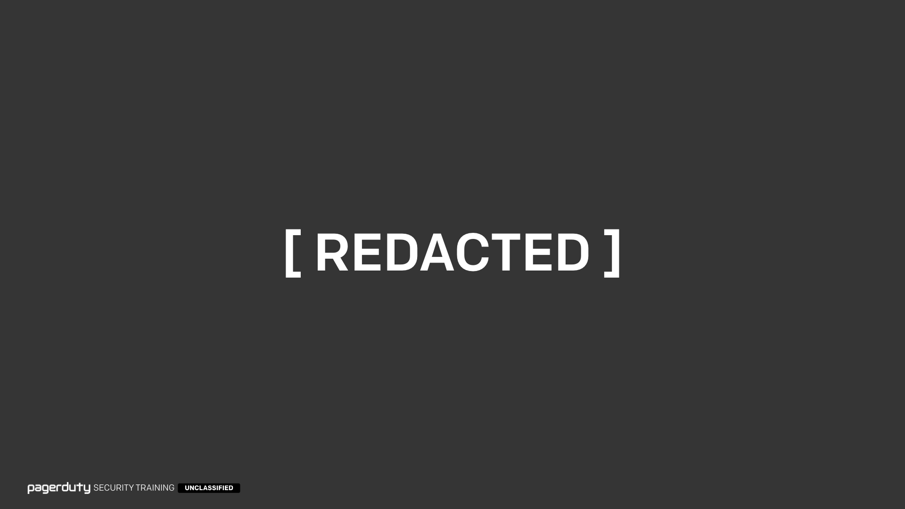

!!! info "Security Training for Everyone  (Part II)"
    This is an [open-source](https://github.com/pagerduty/security-training) version of "Security Training for Everyone (Part II)", the second installment of PagerDuty's internal employee security training, given to all PagerDuty employees as part of our annual security training program. This training was first delivered to our employees in 2019.

    As with our [previous training](/for_everyone), we designed this course to not only cover common security topics relevant to all staff, but also to teach staff new skills and methods of bypassing security in order to try and give insight into the perspective of the attacker. We feel strongly that learning about security is more fun when you're shown how attackers break things instead of just blindly listing rules to follow.

    The main topics covered in this training are,

      * **[Cyber Threats](#cyber-threats)** - _The types of threats we focus our efforts on. Primarily phishing attacks and how to spot them._
      * **[Passwords](#passwords)** - _A quick recap on how to handle passwords. This is discussed in more detail in our [previous training](/for_everyone#passwords)._
      * **[Two-Factor Authentication](#two-factor-authentication)** - _An overview of what 2FA is, and the good (and not so good) ways of using it._
      * **[Identity](#identity)** - _Why ID badges might not be as secure as you think, and other topics related to physical security._
      * **[Data Handling](#data)** - _The different types of data we have and how to properly handle that data._
      * **[Compliance](#compliance)** - _What compliance is, and how it can improve our lives._

    While some of the material we present internally contains sensitive PagerDuty information, the majority consists of generic security lessons, presented in a light-hearted and informative way. Many employees asked for a version of the training they could share with friends and family. This site is the culmination of our efforts to do just that.

    Some slides have been modified from those originally presented internally so that we could lower the classification and release them without redacting entire slides. Any substantive modifications are called out in the notes, but most of the changes were simply to remove links to internal documentation and tooling.

    The text presented here is a semi-accurate transcription of how the training was delivered to staff internally.

---

### Introduction

<input type="checkbox" id="001" /><label for="001"></label>
_001. "Security Training for Everyone Part II: Attack of the Clones"._

Welcome to "Security Training for Everyone"! Not only the most enjoyable training we offer, but also the most mandatory. As most of you are aware, all PagerDuty employees, contractors, and interns are required to undergo annual security training in order to understand the threats we face and how to protect us from them. Doing the same training each year would quickly get tedious (as those of you who went through our old training a few times will attest to), so you'll be pleased to know that this is not a repeat of [last year's session](/for_everyone). While we will be going over some of the same topics in order to refresh your knowledge, and some of the takeaways will be the same, the content is all new. Topics that we paid a lot of attention to last year will only be skimmed over this time around, and we're going to dig a bit deeper on the topics we only briefly touched on last time.

So this is part two of "Security Training for Everyone", which I'm calling "Part II: Attack of the Clones".

I came up with that title entirely on my own. It's definitely [not stolen from something else](https://www.imdb.com/title/tt0121765/).

---

### Classifications

<input type="checkbox" id="002" /><label for="002"></label>
_002. Slide classifications._

Before we jump into the main content, we're going to get started with some slide classifications. Hopefully these are pretty self explanatory, but I do have to go over them anyway. Every slide in this training has one of these three classifications. Please respect the classifications!

* If it's **public**, you can take a photo, tweet it out, do whatever you want with it.

* It it's **restricted**, you can only share it with customers under an NDA, or with folks internally.

* If it's **internal only**, then please keep it internal to PagerDuty and not share it anywhere else.

Similarly to last year, I'll be producing three versions of the training slides. For the restricted and public versions I will be redacting certain information on various slides so that we can lower the classification rather than redacting the slides entirely. That way it's more useful when sharing.

---

### Tracking Attendance

<input type="checkbox" id="003" /><label for="003"></label>
_003. A blue llama plush toy that was promptly claimed by Rich's daughter._

As with previous years, we do have to track attendance for this, and I'm going to continue to do that in the silliest way possible: the colour and animal quiz. For those of you who don't know about this, on the next slide I'll be showing you a colour. Remember that colour. At the end of this session, there will be a slide with an animal on it. Remember that animal. After the training you'll get a form with two questions to fill in, where you'll need to answer with the colour and the animal. That will prove you were here at the training at the start and at the end... and hopefully throughout as well.

It's a bit silly, but hey, it's either that or 20 questions about security and I think you'll all agree that this is much more fun.

Last year's combination was [Blue](/for_everyone#tracking-attendance) [Llama](/for_everyone#llama), which is why you see **Blue Llama** being associated with security things around the office. I wanted to give a quick shoutout to one of the folks from our Toronto office who got my daughter a little Blue Llama plush toy after last year's training! Well... they got it to for me, but it was very quickly claimed by my daughter. But seriously, she loves it, thank you so much!

Of course now that a precedent has been set I was going to make this year's answer "Green - Big Bag of Cash", but eventually decided against it.

---

### Purple

<input type="checkbox" id="004" /><label for="004"></label>
_004. Purple._

This year's colour is purple. So please remember purple. You'll be tested on this and I can't believe I have to say this, but spelling is important. If you get the spelling wrong I have to go and manually approve your answers so please at least try to spell it properly.

???+ comment "Presenter's Comment"
    Predictably, employees decided to fill in the answers by misspelling "purple" as creatively as possible. My favourite was someone who responded `#A020F0`. Of course we failed them for getting the wrong shade of purple. They're now undergoing our very special week-long security training, which consists mainly of unskippable cringeworthy videos and tedious quizzes.

---

### The Security Team

<input type="checkbox" id="005" /><label for="005"></label>
_006. Redacted slide._

???+ warning "Redacted Content"
    This slide showed the PagerDuty security team, who they are, and how to contact them (Slack, email, carrier pigeon, etc). We'd rather not provide a lookup table of the security team for the world to see, so this slide is not available in the public version of our training. If you want to see the complete slide, you'll just need to [get a job at PagerDuty](https://www.pagerduty.com/careers).

---

### Never Shame

<input type="checkbox" id="006" /><label for="006"></label>
_006. We will never shame you._

Never ever be afraid to come to us if you've done something silly. If you've clicked a link in an email that you shouldn't have. If you've been scammed out of some money. If you've put PagerDuty at risk in any way, we want to know about it. We will not shame you, we will not name you in any post-mortem, we will not call you an idiot. You're already going to be feeling pretty bad if you've been scammed, and we're not going to add on top of that.

We may mention that the incident happened, that "an employee did x", but we're never going to badmouth anyone. We're also not going to let your boss know, and you're not going to get fired or anything like that. Unless you actually stole something or committed a crime of course. So y'know... please don't do that.

But you should never be afraid to bring anything to us.

---

### Here to Help

<input type="checkbox" id="007" /><label for="007"></label>
_007. We're here to help._

Our job is that we're here to **help you**. That's the whole purpose of the PagerDuty Security Team.

Throughout the industry, the relationship between employees and a company's Security team is often considered to be adversarial. That's not the case at PagerDuty. We're on your side, we're here to help you to get your job done in a secure way, and we're here to help you stay secure in all parts of your lives.

We're not here to punish you for clicking a wrong link, and we're not here to say "No" to everything. That said, we do have to say "No" to some things though, I'm sorry, that's just the way it is. But even if we're forced to say "No", we'll work with you to reach a solution that is acceptable for both of us. We're not just going to tell you to go away and leave us alone or anything like that.

We're not just here for work related things either. If you have questions about security and your personal internet usage, such as how to secure your Facebook account, or you got an email saying an account of yours was hacked, etc. We're happy to help with that stuff too. Obviously we'll need to prioritize work related things, but you can always feel free to come to us with any type of security questions you may have.

---

### Goal

<input type="checkbox" id="008" /><label for="008"></label>
_008. Goal of the training._

The goal of this training hasn't changed from previous years. You're all here to gain insights into the threats we face and to help learn to protect us from those threats. So I'm going to be discussing today various different threats we face as a company, some more important than others, and how to go about protecting yourself from them, and what you can do to help to protect PagerDuty from them.

---

### Cyber Threats

_<input type="checkbox" id="009" /><label for="009"></label>_

So we're going to start off by talking about cyber threats. What is a "cyber threat"? It's a term that's thrown about in the media a lot. But what actually is one?

---

### The Cyber Threat

<input type="checkbox" id="010" /><label for="010"></label>
_010. "The Cyber Threat". [Reference](https://www.cnbc.com/video/2019/04/11/watch-cnbcs-full-interview-with-pagerduty-ceo-jennifer-tejada.html)_

We have some help from CNBC who've very helpfully highlighted what a "cyber threat" is for us.

This isn't Photoshopped by the way. I know I would normally edit this type of stuff, but this is a genuine screenshot from [an interview our CEO Jennifer Tejada did](https://www.cnbc.com/video/2019/04/11/watch-cnbcs-full-interview-with-pagerduty-ceo-jennifer-tejada.html) a few months back. I'm still not sure why they had a banner saying "The Cyber Threat", but it made for a good screenshot.

Now you may be thinking that they're saying Jenn is the cyber threat here, but I'm not entirely convinced that's true...

---

### Pagey Threat

<input type="checkbox" id="011" /><label for="011"></label>
_011. Is Pagey our biggest threat?_

...because look at Pagey in the background there. Obviously shoulder surfing and trying to steal some passwords. Very sneaky!

---

### Pagey

<input type="checkbox" id="012" /><label for="012"></label>
_012. Pagey is here to help._

But no, our beloved mascot Pagey is not a cyber threat. Pagey is in fact here today to help us along and point out some of the key lessons and takeaways from today's training. In very [Clippy](https://en.wikipedia.org/wiki/Office_Assistant) fashion. There are going to be several slides with "Pagey's Key Takeaways". If you only pay attention to certain slides, please pay attention to those ones. I mean, I'd appreciate you paying attention to all of them, but the Pagey slides are the key ones.

OK, so if Pagey isn't a cyber threat, what are some of the threats we care about as a company?

---

### Nation States

<input type="checkbox" id="013" /><label for="013"></label>
_013. Nation states?_

Nation States? Russia, China, North Korea, etc. Do we really care about them hacking us?

Well, kind of, but they have so many resources at their disposal that if we are specifically targeted by them there's not a lot we're going to be able to do to defend ourselves.

The silver lining there is that we're probably not going to be the ultimate target for those types of threat actors. We don't store financial information, we don't store state secrets or classified information, there's not going to be a lot of value in breaking into PagerDuty for them.

It's more likely that one of our customers is specifically targeted and that they would try to use PagerDuty to get to them. We're unlikely to be the first choice there though, since things like a direct phishing attack on the target customer are going to be much easier to pull off.

The other silver lining here is that if a nation state does manage to break in and steal every bit of data we have, they're unlikely to leak any of that data in the wild. They don't want others to know about the capabilities they have or that they've broken into somewhere.

So while nation states are a real threat, and we do have some protections in place (for example, we use a [Zero Trust approach](https://www.oreilly.com/library/view/zero-trust-networks/9781491962183/) to our networking whereby all information in transit is encrypted, even internally), we don't focus our efforts on defending against nation state actors, preferring to focus on other more likely threats instead.

---

### Hacking Groups

<input type="checkbox" id="014" /><label for="014"></label>
_014. Hacking groups?_

What about organized hacking groups? Well, unless we put out a press release saying we're "unhackable" or something like that (pro tip: there's no such thing), we're unlikely to be a focus for these groups either. These groups tend to be in it for the money, and as before, we don't store any financial information. Like nation states, they're more likely only going to want to use us to pivot to one of our customers.

One difference though is that if these groups managed to break in and steal our data, they definitely would leak it online. They'd try and blackmail us first no doubt, but then would eventually leak it online anyway. So there is that side to the threat too.

Most of our defenses will protect us against this type of threat, but if they're persistent enough and advanced enough, there's not a lot we're going to be able to do to protect ourselves here. It's likely to be a big game of Whack-a-mole. Given enough money and resources, they'd likely be able to steal _something_. The silver lining here is that it would generally cost more to get any data from us than that data would be worth, which hopefully makes us a less likely target.

---

### Lone Hacker

<input type="checkbox" id="015" /><label for="015"></label>
_015. Lone hacker with a grudge?_

OK, so that about a loan hacker with a grudge?

We're pretty well set up here to defend against this type of threat actor, but they can potentially cause a lot of damage, and will tend to go for more denial of service (DoS) type of attacks rather than outright stealing information. They tend be less motivated by financial gain and more about causing reputation damage or gaining notoriety for themselves. Most of our controls are in place to protect against this type of threat, so we hopefully do a pretty good job of keeping loan hackers out.

As far as we know of course. We only know about the threats we know about. If someone is in our system and we don't know it, that's just as bad. And if that thought keeps you up at night, welcome to the party!

You can never be 100% secure or 100% confident you're not being hacked. All you can do is try your best to keep attackers out and to add monitoring to detect if they get through. The other side is to not store data we don't need. If we don't have any data worth stealing, then we're not as much of a target. We'll be talking more about what data we should be storing and things like GDPR later.

---

### Bored Engineer

<input type="checkbox" id="016" /><label for="016"></label>
_016. Bored engineer?_

So the threat we _really_ care about is the bored engineer with $30, an Amazon account, and some free time. You'd be amazed at the damage that could be done by such a person, as I'll demonstrate today.

But in all seriousness, we can never be 100% secure, instead it's all about risk. We look at which types of attacks are the most likely, and could cause the most damage, and focus most of our defensive efforts there. The aim is to make it not worth the effort for an attacker to come after us, whether it's by making it take too much time, cost too much money, or because we don't have anything worth stealing in the first place.

So with that in mind, let's talk a bit more about "cyber threats"...

---

### Another Cyber Threat

<input type="checkbox" id="017" /><label for="017"></label>
_017. "The Cyber Threat" again. [Reference](https://www.cnbc.com/video/2018/09/06/pagerduty-ceo-want-to-represent-future-tech-not-past.html)_

Yep, two separate interviews, two separate dates, CNBC put "The Cyber Threat" banner up for Jenn. Why?! I have no idea.

But they're not wrong. Jennifer is our biggest cyber threat.

I don't mean this Jennifer of course...

---

### Mustached Cyber Threat

<input type="checkbox" id="018" /><label for="018"></label>
_018. The cyber threat has a mustache now._

...I mean this Jennifer.

Place you bets now on whether I'll be fired for making this slide.

???+ comment "Presenter's Comment"
    I wasn't.

---

### "Jennifer Tejada"

<input type="checkbox" id="019" /><label for="019"></label>
_019. "Jennifer Tejada"._

Of course, I'm talking about _this_ Jennifer Tejada. By far and away the most phishing scams we get are people pretending to be Jennifer Tejada. Over 50% of our phishing attacks are claiming to be Jenn, and almost always from really obvious email addresses that aren't Jenn.

---

### Unique Phishing Attempts

<input type="checkbox" id="020" /><label for="020"></label>
_020-021. Unique phishing attempts reported to us._

???+ warning "Redacted Content"
    Two slides were redacted here. They showed time-based graphs of the number of phishing attacks we detected last year, and then how many of them were from folks pretending to be our CEO. The figures on the graphs are considered internal-only information, and so these slides have been redacted.

---

### Half of Phishing Emails

<input type="checkbox" id="022" /><label for="022"></label>
_022. Over half of phishing emails claim to be from the CEO._

Over half of our phishing emails claim to be from Jenn. And yes, I did Photoshop a ski mask onto Jenn here. If I didn't get fired for the last slide, maybe this one will do it.

That's a pretty big thing if 50% of our phishing emails are claiming to be from the CEO. Hopefully what you take away from this is that if you think you've got an email from Jenn, you probably didn't. It's not just Jenn either, the rest of the phishing emails usually end up being someone from our exec team or legal counsel.

So if you get an email from any of our execs that you're not expecting, it's highly likely to be a phishing attack.

---

### Phishing is Easy

<input type="checkbox" id="023" /><label for="023"></label>
_023. Phishing is one of the easiest attacks._

Phishing is still the easiest attack someone can launch against us. They don't need any prerequisite knowledge. They just need a burner email account and some contact information which they can no doubt grab from LinkedIn and they're good to go.

---

### Easy to Spot

<input type="checkbox" id="024" /><label for="024"></label>
_024. Some will be easy to spot... [Reference](https://www.reddit.com/r/therewasanattempt/comments/bix795/to_scam_19_people/)_

They used to be pretty easy to spot, like when someone tries to scam 18 people at once. We've literally had phishing emails where a bunch of our staff were in CC. These are always easy to spot. But we have to be careful now that we're a public company, as we have a larger target on our backs.

People are going to be doing more research before launching these attacks, they'll be able to get better information from our public filings, and be able to launch much more targeted and legitimate seeming attacks against us.

---

### Phishing Email

<input type="checkbox" id="025" /><label for="025"></label>
_025. A phishing email we received._

So we're going to look at a much more targeted email now. This was an email sent to an employee in our London office and I love it because it has an example of pretty much every red flag and technique that phishing scammers love to use. It's almost as if they knew I was doing this training soon and wanted to give me a great single example of everything.

???+ warning "Redacted Content"
    Sensitive information from the email has been redacted with black boxes as opposed to redacting the entire slides. The redacted content is the name of the employee this email was sent to, and the name of legal counsel. All other information remains unaltered.

---

### Wrong Email

<input type="checkbox" id="026" /><label for="026"></label>
_026. Wrong email address._

Hopefully you've immediately spotted that this is a phishing attack before even reading the content, as the from address is completely wrong.

Unfortunately Gmail no longer puts the address in the top bar anymore, it's hidden away "for your convenience", so you have to click some extra arrows to see it. They will sometimes put up a big yellow banner if the name matches someone in our organization, but that doesn't always appear so you can't rely on it. So for now you'll always need to click the arrow to see the real email address.

But do check the from address if you're suspicious of emails. It is a 100% indicator that it's a scam email if the address is incorrect. If the address looks correct though, it doesn't mean that it is, it could have been spoofed. But if the address is wrong, it's definitely phishing.

---

### Always Check From Address

<input type="checkbox" id="027" /><label for="027"></label>
_027. Always check the "from" address._

So that makes this our first Pagey's Key Takeaway! Always check the "from" address in emails. If it's wrong, it's definitely phishing. If it's correct, it _might_ be phishing.

---

### Limiting Interactions

<input type="checkbox" id="028" /><label for="028"></label>
_028. Limiting interactions with other teams._

What else is suspicious in this email? They have this great line,

> "No one else except us must be informed at this time."

What they're trying to do here is to scare you into not contacting the security or legal teams internally in order to check the validity of the message. They're trying to say it's a legal matter to scare you into not talking to anyone about it, since everyone is afraid of lawyers. This is a very common tactic by scammers to try and limit who you can communicate with to verify the authenticity of something. It's trying to isolate you so you can only make the decision for yourself.

You can always check any email that has been sent to your PagerDuty account with our legal team at the very least. Always. You can also share it with the security team, but if you're hesitant to do that since maybe it's financial information, then share it with our legal team first. **There is absolutely no situation where anything that comes to your company email account cannot be shared with company counsel.** So don't fall for that trick.

---

### Forcing Language

<input type="checkbox" id="029" /><label for="029"></label>
_029. Forcing and limiting language being used._

Another common tactic is a forced sense of urgency.

> "This is a high priority situation"

<!-- -->

> "We're losing $100,000s a minute"

Those kinds of things. They love to try and get you to make quick actions without having chance to think it through.

Another one is forcing you into specific communication channels. This might present itself as these types of phrases,

> "I'm in meetings all day and can only communicate via email"

<!-- -->

> "I can't speak on my phone right now"

And so on. An attacker may have compromised one of the methods of communication and wants to make sure you don't try to validate it any other way. They know if you spoke on the phone with them that you'd know it's not real, so they're forcing you into text communication only.

So be very wary of any language which forces a sense of urgency on you, or tries to limit the communication channels you can use to verify the authenticity.

---

### Beware of Language

<input type="checkbox" id="030" /><label for="030"></label>
_030. Beware of forcing or limiting language._

That's our next Pagey Key Takeaway. Forcing or limiting language will weed out about 20% of the phishing emails we get. So after checking the from address, this type of language becomes the next strongest indicator for us.

---

### Validating Compliance

<input type="checkbox" id="031" /><label for="031"></label>
_031. Validating your willingness to comply._

Another common tactic, but not quite as common, and not always a solid indicator but something I wanted to point out anyway. An attacker will often send an initial email that isn't asking for anything sensitive. They might just say something like,

> "Hey, can you send me your phone number? I need to talk to you quickly about something important"

On the surface that's not really sensitive information, you're not being asked to transfer any money, and it sounds like they want to actually speak to you on the phone, so you might comply with that action.

Then they'll text you to say,

> "Actually, I can't speak right now, let's just do this over text, can you go and do X for me?"

At the back of your mind it's very easy for that to trick you into thinking that you've already verified who they are on two separate channels, email and voice, even though you never really did verify it both times.

The first message they send is validating your willingness to comply. They're validating that you're someone who follows instructions without really looking at things too deeply. If you do comply, they're more likely to hit you with a more important or sensitive question later once they've built up a rapport with you. It might be the next email, it might be five emails later, then they'll drop the big bomb on you and ask you to send them money and so on.

All that time they've been building up a rapport with you and in the back of your mind it's easy to convince yourself that you're speaking to a legitimate person. So that's something to keep and eye out for, but it's not a 100% indicator.

---

### Real Information

<input type="checkbox" id="032" /><label for="032"></label>
_032. Real information can also be used._

Then there's factual information. The attacker here did their homework. The law firm they mention is indeed a real law firm that we use. So they added that to the email to sound more legitimate. So as you're reading the email, you might think "Oh, they know this piece of information so they must be who they say they are". Don't get fooled.

It works both ways too though, they screwed it up a little bit by mentioning the Financial Markets Authority, which is a New Zealand entity, not something in the UK (where it's the FSA, Financial Services Authority). They were emailing one of our London employees at the time, so they tipped their hand with some bad information.

They can get factual information correct which may sound convincing, they can get factual information wrong, which is a good way to show that they're a scammer. So don't just assume if they drop some facts you think only they could know that they're a legitimate person, they might not be.

---

### Spelling and Grammar

<input type="checkbox" id="033" /><label for="033"></label>
_033. Speeling and grammar._

And finally, grammar and spelling mistakes. I would expect one or two mistakes in an email if someone is particularly rushed, but this one is just incredibly sloppy and not something that Jennifer would write. No one on our exec team is this bad at writing emails... to my knowledge anyway.

So if there's plenty of grammar or spelling mistakes, take that as a sign to look at the email more closely.

---

### Suspicious Emails

<input type="checkbox" id="034" /><label for="034"></label>
_034. Report suspicious emails to us._

Bottom line with all of this is that if you're suspicious of emails, please send them to the Security Team and we'll be able to validate if it's legitimate or not.

Even if you're 100% confident it is a phishing email, don't just delete it, please do send it to us. Even though you've spotted it, others in the company may have received it and not spotted it. If you let us know straight away we have a chance to delete it from everyone's inbox before anyone even has a chance to click any links inside it.

We'd rather get 300 duplicate reports than no report at all. So don't be afraid to bombard us with emails of any phishing that you get, even if you're not 100% sure it is phishing.

---

### Reporting Phishing

<input type="checkbox" id="035" /><label for="035"></label>
_035. Reporting phishing._

This is all documented on the wiki, so I'm going to go through this pretty quickly, but to report phishing to us please don't just forward the email. If you do, we're just going to reply with a link to the wiki and ask you to follow these instructions anyway.

???+ warning "Redacted Content"
    Links to our internal wiki have been redacted from these slides with a black box. No other information was altered.

---

### Reporting Phishing (2)

<input type="checkbox" id="036" /><label for="036"></label>
_036. Reporting phishing._

Instead we need some hidden information from the email in order to block it properly. To do that you click the arrow in the corner and select "Show Original".

---

### Reporting Phishing (3)

<input type="checkbox" id="037" /><label for="037"></label>
_037. Reporting phishing._

It pops up with a new screen. Click the big blue "Copy to clipboard" button.

---

### Reporting Phishing (4)

<input type="checkbox" id="038" /><label for="038"></label>
_038. Reporting Phishing._

Then write a new email to the security team and paste in the contents. No need to add any introductory sentence or even a subject, we'll know that you're reporting phishing when we get the email.

---

### Keep Reporting

<input type="checkbox" id="039" /><label for="039"></label>
_039. Keep reporting phishing to us!_

That graph I showed earlier of all the phishing attempts that we detected last year, I'm pretty sure 100% of those were reported to us by you folks. We may have detected some of them first ourselves, but you still reported them to us too. For most of them, you folks even spotted them before us!

That's not to say we would never have detected them of course, but it might have been too late by the time we did if you hadn't been so good at reporting them.

So please keep reporting them to us, you are all doing a fantastic job. Whenever we give these stats to customers when they ask about our employee training and phishing mitigations, they're always astonished that we have this level of well trained staff, who can report this amount of phishing to us. So please keep it up!

---

### Summary of Phishing

<input type="checkbox" id="040" /><label for="040"></label>
_040. Pagey's Summary of Phishing._

So that's all I'm going to say about phishing. Here's a quick summary of what we talked about:

Always check the "from" addresses in emails, and beware of forcing or limiting language.

Verify people on another channel if you're not sure it's really them. If someone contacts you via email and you're not sure it's them, reach out on Slack and say "Hey, did you send this?", or call them on the phone and ask.

If someone gives you their phone number via email, don't just call/text that number. Look it up in another system to confirm it's really their number, or ping them on Slack first, etc. Don't let someone else dictate where you contact them.

That goes for your personal life too. If your bank sends you a letter saying you owe them money and give you a number to call, don't call the number on the letter. Find out the number for your bank from another source first. Same for letters from the IRS and so on. It's really easy to send a fake letter with a scammers phone number on instead.

And send emails to the security team if you're even a little suspicious and we'll be more than happy to take a look at any potential phishing emails you have.

---

### Passwords

_<input type="checkbox" id="041" /><label for="041"></label>_

The next topic we're going to talk about is passwords. I talked about passwords in immense detail in [the last training](/for_everyone#passwords), so we're not going to spend too much time on this.

Last time I showed you how attackers will crack passwords and why you should pick good passwords because of that. Hopefully you all found that fun and convincing.

---

### Password Best Practices

<input type="checkbox" id="042" /><label for="042"></label>
_042. Best practices for passwords._

The main points of that were that your passwords need to be,

* Long
* Random
* Unique
* Private

So make them as long as you can possible make them. Unfortunately some websites don't allow you to make them too long, so you'll just need to play by their rules. They should be as random as you can make it. Have a computer generate the password for you. A different password for every single login you have, and never ever share them without anyone. No one here is ever going to ask for your password, and if they do you can safely ignore the request.

---

### Password Manager

<input type="checkbox" id="043" /><label for="043"></label>
_043. Use a password manager. [Reference](https://1password.com)_

The key takeaway was to use a password manager. Hopefully me showing you how to crack passwords very easily last time was a good convincer of that.

If you're not sure which one to use, [1Password](https://1password.com) is what we use here. So you may as well use that. [LastPass](https://lastpass.com) is another popular one.

[KeePass](https://keepass.info/) is one that some folks use too, but a word of caution there is that `keepass.com` is **NOT** the legitimate website. The real website is [`keepass.info`](https://keepass.info/). The `.com` one actually has download links that contain malware, and unfortunately the website looks more legit than the real one.

I would stick with 1Password or LastPass if I were you, but don't get tricked by the bad KeePass website.

---

### Security Questions

<input type="checkbox" id="044" /><label for="044"></label>
_044. Security questions aren't good for security._

I also showed how security question answers are basically the same as a password. Never answer them honestly, and always treat them like passwords. It is not a police interrogation, you are under no obligation to answer security questions truthfully under any circumstance.

It's the same with personal information. A shopping website doesn't need to know your date of birth, give them a fake one and store it in your password manager's "Notes" section.

---

### Support PIN

<input type="checkbox" id="045" /><label for="045"></label>
_045. Be aware of backdoors to your account._

These are often used as backdoors into your account. Support PIN is another one that I've seen various websites use. A four digit PIN that will get you back into your account. It doesn't matter how good your password is, 10,000 attempts and anyone can get into your account. There's not a lot you can do in these situations, you've just got to play their game. Just be aware of what's happening and try not to store any sensitive information with any website that does it.

Unfortunately, in my experience, banks and finance related websites tend to be the worst when it comes to these things. You just need to play their game and hope that they'll give you your money back if someone breaks into your account. Small comfort, I know.

---

### Two-Factor Authentication

_<input type="checkbox" id="046" /><label for="046"></label>_

So let's now talk about two-factor authentication instead. I touched on this last time, but now I'm going to go into a lot more detail. 2FA, also called Two-Factor Authentication, is one of the best things you can do to improve your security online from an authentication point of view.

---

### Three Factors

<input type="checkbox" id="047" /><label for="047"></label>
_047. The three types of evidence. [Reference](https://en.wikipedia.org/wiki/Multi-factor_authentication#Authentication_factors)_

It comes down to three types of evidence that you can provide, called factors of authentication. It's basically a fancy way of saying "Types of evidence to prove you are who you say you are".

---

### Knowledge, Possession, Inherence

<input type="checkbox" id="048" /><label for="048"></label>
_048. Knowledge, Possession, and Inherence. [Reference](https://en.wikipedia.org/wiki/Multi-factor_authentication#Authentication_factors)_

So there's three types, and they each have technical terms, called Knowledge, Possession, and Inherence.

---

### In Plain English

<input type="checkbox" id="049" /><label for="049"></label>
_049. In plain English. [Reference](https://en.wikipedia.org/wiki/Multi-factor_authentication#Authentication_factors)_

In plain English, that is "Something you know", "Something you have", and "Something you are". Those are the three types of evidence you can provide to prove that you're you.

---

### Factor Examples

<input type="checkbox" id="050" /><label for="050"></label>
_050. Examples of the different factors._

It could be something you know, like a password or security question answers. Something that's stored in your head essentially.

It could be a physical thing, like a USB stick or a phone.

Or it could be something you are, some form of biometrics, a fingerprint or iris scan for example.

One of the ways to tell if something is "Something you are" is that you can't really change it. You can't change your fingerprint, or your face, for example. Well... I guess you could with surgery. Let's just say it's very difficult to change those things. Unless you're [Nicolas Cage and John Travolta](https://www.imdb.com/title/tt0119094/) of course.

---

### 2FA or Not 2FA

<input type="checkbox" id="051" /><label for="051"></label>
_051. 2FA or not 2FA, that is the question._

So we're going to play a quick game now, called "2FA or not 2FA". I'm going to show you some factors of authentication and you shout out if it's 2FA or not 2FA.

---

### Password + TOTP

<input type="checkbox" id="052" /><label for="052"></label>
_052. Password + TOTP = ?_

Let's start with a password and putting in a six digit number from your phone. 2FA or not 2FA?

???+ comment ""
    Audience shouts "Yes" with great enthusiasm!

---

### Password + TOTP = 2FA

<input type="checkbox" id="053" /><label for="053"></label>
_053. Password + TOTP = 2FA._

Yes, this is 2FA. It's something you know, your password, and something you have, your phone. This is good authentication as it's verifying you based on two different types of evidence.

---

### Password + Yubikey

<input type="checkbox" id="054" /><label for="054"></label>
_054. Password + Yubikey = ?_

What about a password and a USB key (such as a [YubiKey](https://www.yubico.com/products/yubikey-hardware/) or [SoloKey](https://solokeys.com/))?

???+ comment ""
    Audience begrudgingly shouts "Yes".

---

### Password + Yubikey = 2FA

<input type="checkbox" id="055" /><label for="055"></label>
_055. Password + Yubikey = 2FA._

Yes, this is the same thing. Something you know and something you have.

---

### Fingerprint + FaceID

<input type="checkbox" id="056" /><label for="056"></label>
_056. Fingerprint + FaceID = ?_

OK, so what about fingerprint and FaceID?

???+ comment ""
    Some "Yes"'s, some grumbles, a few looks of confusion.

---

### Fingerprint + FaceID = Not 2FA

<input type="checkbox" id="057" /><label for="057"></label>
_057. Fingerprint + FaceID = Not 2FA._

This is not 2FA. Both of these factors are something you are, so this is not two-factor authentication. This is two different checks against the same type of evidence. It could be considered more secure than only checking one of them, but it is not as strong as checking different factors.

---

### Password + Security Question

<input type="checkbox" id="058" /><label for="058"></label>
_058. Password + Security Question = ?_

What about a password and an answer to some security questions?

???+ comment ""
    Enthusiastic shouts of "NO!" from the audience.

---

### Password + Security Question = Not 2FA

<input type="checkbox" id="059" /><label for="059"></label>
_059. Password + Security Question = Not 2FA._

Correct, this is not 2FA.

As with the previous one, this might be considered a stronger form of one-factor authentication, but this is **absolutely not** two-factor authentication, as they're both the same type of evidence.

I'll admit that it's a bit of a pet peeve of mine when companies claim to implement "two-factor authentication" when they really don't.

---

### Password + SMS

<input type="checkbox" id="060" /><label for="060"></label>
_060. Password + SMS = ?_

OK, final one, what about password and an SMS text message?

???+ comment ""
    "YES!" from the audience. Falling right into my trap!

---

### Password + SMS = Not Good

<input type="checkbox" id="061" /><label for="061"></label>
_061. Password + SMS = Not Good_

Correct, it is 2FA, but it's also not good, and now we're going to talk about why.

I know, trick question, that wasn't very fair.

---

### Avoiding SMS

<input type="checkbox" id="062" /><label for="062"></label>
_062. We want to avoid SMS._

Using SMS as a second factor, while technically two-factor authentication, is something we want to avoid whenever possible.

---

### Why Avoid SMS

<input type="checkbox" id="063" /><label for="063"></label>
_063. "Why can't we use SMS for 2FA?"_

We recently disabled SMS as an allowed method of authentication across all of our tools, and _literally everyone_ asked "Hey! Why can't we use SMS for 2FA?".

OK, so some of you asked. But it's a perfectly valid question and one that I wanted to give you a better answer on than just "Because we say so".

---

### SMS Can Be Intercepted

<input type="checkbox" id="064" /><label for="064"></label>
_064. SMS can be intercepted. [Reference](https://www.youtube.com/watch?v=BfCoiZRHTbk)_

The reason is because SMS can be intercepted and read by anyone.

Well, maybe not _anyone_, that's a bit of an exaggeration, but it's certainly not considered a secure method of authentication by modern standards.

---

### Demo Banned

<input type="checkbox" id="065" /><label for="065"></label>
_065. Demo banned._

What I was going to do at this point was show you a cool demo with this antenna I brought with me and some software that lets me control it. I was going to live intercept and decrypt SMS messages out of thin air for you all to see.

But on the advice of legal counsel... the demo was banned for being far too awesome... and quite probably illegal. So I'm sorry about that.

???+ comment "Presenter's Comment"
    I really did bring in an antenna and some SDR software on my laptop. While I didn't do a live demo, I did let people come up after the training to play with it to see the types of things you can do with it.

---

### RTL SDR

<input type="checkbox" id="066" /><label for="066"></label>
_066. Need fancy electronics... [Reference](https://www.rtl-sdr.com/buy-rtl-sdr-dvb-t-dongles/)_

But an average person of the street definitely couldn't do it. You need quite a lot of technical things. You need some super expensive and fancy chips and electronics that costs thousands and thousands of dollars...

---

### RTL SDR on Amazon

<input type="checkbox" id="067" /><label for="067"></label>
_067. RTL-SDR on Amazon. [Reference](https://www.amazon.com/RTL-SDR-Blog-RTL2832U-Software-Telescopic/dp/B011HVUEME)_

You absolutely can't just go to somewhere like Amazon and buy something for say, $30. That's definitely not possible.

---

### gr-gsm

<input type="checkbox" id="068" /><label for="068"></label>
_068. gr-gsm on GitHub. [Reference](https://github.com/ptrkrysik/gr-gsm)_

You definitely can't then download some code from a [GitHub repository](https://github.com/ptrkrysik/gr-gsm). That's also not possible.

---

### RTL-SDR Blog Post

<input type="checkbox" id="069" /><label for="069"></label>
_069. RTL-SDR blog post. [Reference](https://www.rtl-sdr.com/receiving-decoding-decrypting-gsm-signals-rtl-sdr/)_

Then you can't spend 30 minutes or so reading some [blog posts](https://www.rtl-sdr.com/receiving-decoding-decrypting-gsm-signals-rtl-sdr/) about how to decrypt SMS messages...

---

### Wireshark

<input type="checkbox" id="070" /><label for="070"></label>
_070. Wireshark reading SMS. [Reference](https://www.ckn.io/blog/2015/11/29/gsm-sniffing-sms-traffic/)_

...and then be live intercepting SMS messages with a tool called [Wireshark](https://www.wireshark.org/) in about another 30 minutes. None of that is possible at all.

I'm obviously not encouraging any of you to go and try that out, and definitely won't be providing any of those links you just saw.

???+ comment "Presenter's Comment"
    It's probably becoming clear why I'm not a lawyer.

Although, I'm sorry, I've lied to you a little bit there, you can't actually decrypt messages out of the air without a decryption key, which you can only get from the SIM card.

---

### SIM Card Reader

<input type="checkbox" id="071" /><label for="071"></label>
_071. SIM card reader from Amazon. [Reference](https://www.amazon.com/Multi-Function-Smart-Reader-Memory-Windows/dp/B01JS2HSAA)_

So you definitely can't just go and buy a SIM card reader from Amazon.

---

### SIMspy

<input type="checkbox" id="072" /><label for="072"></label>
_072. SIMspy. [Reference](https://domonkos.tomcsanyi.net/?p=369)_

And then use a tool called [SIMspy](http://www.nobbi.com/simspy/simspy.html) to extract the encryption key. Definitely also not possible.

???+ comment "Presenter's Comment"
    While this is all very possible, it's only for GSM signals that use frequencies within the range of whatever SDR device you have. Europeans are likely to have more luck in trying this out for themselves, since GSM is more ubiquitous there than in North America (GSM was developed in Europe after all).

    The weakness here is merely that the encryption key can be extracted from the SIM card. Once you have the key, it shouldn't really surprise anyone that you can decrypt the signals. This "demo" was chosen as the result is more compelling to see than other more serious vulnerabilities in mobile communications.

    There are certainly vulnerabilities in the encryption methods used by GSM (the A5 algorithms), but those are not the subject of this discussion. You can [read more about GSM security (and history) from the Wikipedia article](https://en.wikipedia.org/wiki/GSM#GSM_security).

---

### I Lied

<input type="checkbox" id="073" /><label for="073"></label>
_073. I lied a little bit._

OK, so I've lied to you again. That all would've made a fun and compelling demo had I actually done it live. Seeing a message pop up on screen that one of you sent would've been quite the eye-opener I'm sure.

But the more security minded of you in the audience are probably thinking, "Wait a minute, you just grabbed the encryption key from the SIM card. Of course you can decrypt the signals!". And you're absolutely right, what I just showed requires you to have physical access to someone's phone and SIM card in order to be able to perform those steps. If you have physical access to a victim's phone, then there's plenty of other things you could do first. Not to mention that a lot of modern phones don't have physical SIM cards any more anyway, they use [eSIM](https://en.wikipedia.org/wiki/SIM_card#Embedded-SIM_(eSIM)) now.

So while that was just a bit of fun, the method I showed isn't the real reason why SMS is insecure. Don't get me wrong, there are other ways you can try to decode GSM signals, but even then, that's just GSM. There are other technologies such as [CDMA](https://en.wikipedia.org/wiki/Code-division_multiple_access) that work differently.

???+ comment "Presenter's Comment"
    There are also methods such as using an [IMSI-catcher](https://en.wikipedia.org/wiki/IMSI-catcher), where you essentially set up a fake mobile tower in between your target's device and the real towers for the phone company. Your target then connects to your tower instead of the real one, and you can eavesdrop on all their communications.

---

### Signalling System 7

<input type="checkbox" id="074" /><label for="074"></label>
_074. Signalling System #7. [Reference](https://en.wikipedia.org/wiki/Signalling_System_No._7)_

The real reason we don't want to use SMS for two-factor authentication is because of a vulnerability in something called ["Signalling System 7"](https://en.wikipedia.org/wiki/Signalling_System_No._7). This is a set of protocols which all phone carriers throughout the world use to communicate with one another.

---

### Intercepting Calls with CAMEL

<input type="checkbox" id="075" /><label for="075"></label>
_075. Intercepting calls with CAMEL. [Reference](https://berlin.ccc.de/~tobias/31c3-ss7-locate-track-manipulate.pdf)_

Unfortunately, SS7 has vulnerabilities which can allow attackers to intercept your messages and voice calls without either side (you or your phone company) knowing that it's happening. I'm not going to expect you to read everything on this slide here, this is a screenshot from a [talk by Tobias Engel of the Chaos Computer Club from 2014](https://www.youtube.com/watch?v=-wu_pO5Z7Pk) which goes into much more detail on it.

But essentially, someone can sit between your phone and the phone company and intercept all voice communication and SMS, and get your location, without either side knowing that they're doing it.

???+ comment "Presenter's Comment"
    There are methods you can use to detect if these vulnerabilities are being exploited. But unless you actually look for them, you wouldn't know that they're being exploited.

This isn't just a theoretical attack either, this has actually been exploited in the real world. In [May 2017](https://thehackernews.com/2017/05/ss7-vulnerability-bank-hacking.html), O2 (a mobile provider in Europe) confirmed that SS7 vulnerabilities had been used and exploited to bypass two-factor authentication in order to withdraw money from bank accounts.

In a lot of cases, you don't even need to go down the route of exploiting SS7 vulnerabilities. Sometimes a much easier path is to simply social engineer the phone company in order to perform a [SIM swap](https://en.wikipedia.org/wiki/SIM_swap_scam). I call your mobile provider and pretend to be you, telling them I've bought a new SIM card. They transfer your service to my SIM card and now I can get all of your two-factor codes.

SMS is not a secure method for the purposes of two-factor authentication.

---

### Avoid SMS for 2FA

<input type="checkbox" id="076" /><label for="076"></label>
_076. Avoid SMS for 2FA._

Pagey's Key Takeaway is to avoid using SMS for two-factor authentication. I've resisted saying "Never use SMS" here, and rather just say "Avoid". **SMS two-factor authentication is still better than not using any two-factor authentication at all**. If you have a choice of SMS 2FA or no 2FA, then definitely use SMS 2FA. It will still add an extra layer of protection. It's just not as secure as other methods if you have the choice.

---

### TOTP Codes

<input type="checkbox" id="077" /><label for="077"></label>
_077. TOTP codes._

Speaking of other methods. TOTP codes, Time-based One Time Password codes. These are those 6 digit numbers you get on your phone that always...

---

### TOTP Codes (2)

<input type="checkbox" id="078" /><label for="078"></label>
_078. TOTP codes._

...seem to have about 3 seconds left so by the time you open up your phone and start to type the number into the website it disappears so you have to start again...

---

### TOTP Codes (3)

<input type="checkbox" id="079" /><label for="079"></label>
_079. TOTP codes._

...then by the time you've actually entered the next one you realize you got a number wrong so you have to type it in again and then the codes have changed yet another time. Eventually when you've got it done, you're stressed out and things are all going wrong and you don't know what to do any more and you just want to give up.

No? Just me then. I personally don't like TOTP codes.

To be clear before anyone panics, we're not getting rid of them, if you like to use them you're more than welcome to continue using them. But we strongly recommend something called U2F instead.

---

### We Recommend U2F

<input type="checkbox" id="080" /><label for="080"></label>
_080. We recommend U2F keys. [Reference](https://en.wikipedia.org/wiki/Universal_2nd_Factor)_

This is a very rare moment in security where one of the more convenient methods is also more secure. We almost never see something which combines both security and convenience.

U2F stands for Universal Two-Factor, and is a physical device you can use for authentication, usually a USB device of some kind.

---

### All Shapes and Sizes

<input type="checkbox" id="081" /><label for="081"></label>
_081. U2F keys come in all shapes and sizes._

They come in all shapes and sizes. There are bluetooth ones, lightning ones, USB-A, USB-C, you name it. Even NFC ones.

---

### No More Fiddling

<input type="checkbox" id="082" /><label for="082"></label>
_082. No more fiddling with phones._

One of the main benefits is that there's no more fiddling with your phones and typing things in manually. You typically just need to insert the device into a USB port and tap a button on it (or just have it near your device for bluetooth and NFC versions).

There are even ones that are low profile, which you can just always keep plugged into the side of your laptop. Then you simply touch the side of your laptop to login to things.

Much more convenient than 6 digit codes.

???+ comment "Presenter's Comment"
    It's worth noting that you sacrifice a little bit of security by using the ones which are always plugged in. In that if your laptop is stolen by an attacker, they also have your two-factor key. But as with most things, it will depend on your threat model. U2F keys primarily defend against malware-based attacks, or attacks where an attacker was able to steal your password. For the majority of folks, having one always plugged in and ready to tap isn't going to be a severe downgrade in security posture.

---

### Just Tap It

<input type="checkbox" id="083" /><label for="083"></label>
_083. Just tap it. [Reference](https://www.blog.google/products/google-cloud/bolstering-security-across-google-cloud/)_

And it really is just the tap of a button. Insert the key, tap the button, you're done. Simple!

---

### Self Enrollment

<input type="checkbox" id="084" /><label for="084"></label>
_084. You can self enroll the keys._

What's more, you can also self-enroll them so you don't need to go to our HelpDesk or Security teams. You can add them to Duo or Okta entirely on your own. We love self-service solutions, since it saves everyone time and frustration.

---

### Mix Business and Personal

<input type="checkbox" id="085" /><label for="085"></label>
_085. You can mix business and personal._

And even better, you can mix business and personal on the same device. So you don't have to have a PagerDuty key and a personal key. They can all be on the same device. If you ever leave PagerDuty we have no ability to revoke any of your personal stuff, we just block your key from being used in our systems.

So you can absolutely mix personal and work as well.

---

### Any U2F Key Will Work

<input type="checkbox" id="086" /><label for="086"></label>
_086. Any U2F key will work. [Reference](https://solokeys.com/)_

And any key that says it's "U2F compatible" will work. There are open-source ones, this one here is called the [SoloKey](https://solokeys.com/), you can even [build your own U2F key](https://github.com/conorpp/u2f-zero/wiki/Building-a-U2F-Token) if you're so inclined. You can get them for $5, or you can get ones for $70 will all sorts of extra features.

We like [YubiKeys](https://www.yubico.com/products/yubikey-hardware/) ourselves, and most of you were probably issued with those ones if you're in engineering, but don't feel like those are the only ones you can use.

A quick warning for those on engineering teams, if you want to use a key to access our infrastructure with SSH, you will need a key that supports "OTP" mode (One Time Password) as well as U2F. A U2F-only key will not work with SSH. You'll also need to work with Security or HelpDesk teams to get them set up for SSH access, that is not self-service. If none of those acronyms mean anything to you, come and speak to Security or HelpDesk afterwards and we can go into more detail on it. If you're not in engineering, then you don't need to worry about that, just look for a U2F key.

---

### Big Players

<input type="checkbox" id="087" /><label for="087"></label>
_087. All the big players support them. [Reference](https://www.yubico.com/works-with-yubikey/catalog/#protocol=universal-2nd-factor-(u2f)&usecase=all&key=all)_

All major players support U2F keys now: Facebook, Google, Dropbox, even the US and UK governments.

---

### Use U2F

<input type="checkbox" id="088" /><label for="088"></label>
_088. Use U2F for all your two-factor needs._

So we **strongly** recommend U2F keys for all your two-factor needs. They are extremely convenient, and get a big thumbs up from your Security team.

---

### You Can Still Use TOTP

<input type="checkbox" id="089" /><label for="089"></label>
_089. You can still use TOTP and push notifications._

And again, to be very clear, we're not getting rid of push notifications or 6 digit codes. If you prefer those methods of authentication, you're welcome to continue using them. We have absolutely no plans to get rid of them as they're still perfectly secure methods of authentication.

But we encourage you to at least give U2F keys a try, as we think you'll immediately agree that they are more convenient.

---

### Always Use 2FA

<input type="checkbox" id="090" /><label for="090"></label>
_090. Always use two-factor authentication._

The big takeaway here is to **always always always use two-factor authentication**. We enforce it everywhere at PagerDuty, so you won't have a choice here, but you should be using it for all your personal things as well.

It really is one of the biggest single things you can do to improve the security of your online accounts. We've been protected by two-factor authentication a few times over the years, as attackers were blocked from getting into our systems as they couldn't get past the second factor of authentication. This is a big deal!

---

### Pagey's Summary Two-Factor Authentication

<input type="checkbox" id="091" /><label for="091"></label>
_091. Pagey's summary of 2FA._

So a quick summary of all the stuff I just talked about. Passwords should be long, random, unique, and private. Use a password manager. Always use two-factor authentication. Avoid using SMS if you can. And we strongly recommend U2F keys.

---

### Identity

_<input type="checkbox" id="092" /><label for="092"></label>_

We're going to switch gears now and talk about physical security and identity. Hopefully this will be a fun section, because just like last year when I [taught you all how to crack passwords](/for_everyone#passwords), this year I'm going to teach you all how to break into our offices.

But first let's start by talking about badges.

---

### Badges Aren't Perfect

<input type="checkbox" id="093" /><label for="093"></label>
_093. Just because they have a badge, doesn't mean they're authorized._

Just because someone has a badge, it doesn't mean they're meant to be there. As an example, the badge I'm wearing right now says my name is our Director of Infrastructure, Arup Chakrabarti. It looks nothing like our real badges, but it does have our company logo on it, and I'm wearing it on a PagerDuty branded lanyard that I picked up at a conference. It even has a little gold star that says "100% secure", so that you can tell it's legit.

---

### Badge Photos

<input type="checkbox" id="094" /><label for="094"></label>
_094. Badge photos aren't massively useful._

Even though it doesn't look like our real badges, it has my photo on it though, so it must be fine, right?

Photos on badges are like the "from" address in emails. Just because it looks correct doesn't mean that it's the right person. Anyone can print their own badge with their own photo on it.

Case in point, my _real_ company ID badge says my name is that of our CEO, Jennifer Tejada. This isn't just a sticker I've put over the badge either (which would also work to be honest), this is a real plastic card.

???+ comment "Presenter's Comment"
    I may have had access to our actual badge printer for a little while.

You can print whatever you want on these badges, so just because someone is walking around with one that looks correct and the photo matches them, it doesn't mean you should ignore them if they're doing something sketchy. If someone is sitting at your friends desk and using their computer and it's not your friend, don't ignore that just because they have a badge. Come and tell security straight away!

???+ warning "Redacted Content"
    This slide was changed from the one originally presented to use Pagey as the image and to change the color we use for our badges. Originally it was my real badge. I'd rather not end up like that [LifeLock CEO](https://www.wired.com/2010/05/lifelock-identity-theft/) so figured it should at least be a bit harder to impersonate me than just printing this slide onto a badge and putting on an over-the-top British accent.

---

### RFID Badges

<input type="checkbox" id="095" /><label for="095"></label>
_095. RFID badges are secure, right?_

OK, so photos on badges aren't foolproof. But our badges use RFID (Radio-frequency Identification), and those are definitely secure. Those cards that say ProxCard II on them. There's no way you could clone or steal one of them, right?

---

### Proxmark 3

<input type="checkbox" id="096" /><label for="096"></label>
_096. Proxmark3 DevKit. [Reference](https://store.ryscc.com/collections/proxmark-3/products/elechouse-proxmark3)_

Well, if you have $250 to spare, you can get one of [these cool kits](https://store.ryscc.com/collections/proxmark-3/products/elechouse-proxmark3) that let you clone cards just by getting near them.

---

### Keysy

<input type="checkbox" id="097" /><label for="097"></label>
_097. Keysy RFID duplicator. [Reference](http://tinylabs.io/store/)_

You definitely couldn't just spend say, $40, on an RFID duplicator like [this one here](http://tinylabs.io/store/), and clone your ID badge to a writeable RFID card and then get into the office with it. Definitely not possible.

???+ comment "Presenter's Comment"
    At this point I showed folks my work badge cloned to both a key fob and a writable RFID card.

---

### Staff Doors

<input type="checkbox" id="098" /><label for="098"></label>
_098. Only staff can open our doors, right?_

OK fine, so someone could clone our badges if they get close enough with one of those devices. But we have cameras, we have security on our front desk, only legitimate staff can get through our doors, right? You can't get through our doors unless you know codes or secrets or something.

Well that depends on how secure the doors are.

---

### Code 2861

<input type="checkbox" id="099" /><label for="099"></label>
_099. Code 2861. [Reference](https://twitter.com/willmanduffy/status/1073242549807144962)_

And doors are only as secure as the humans using them.

Thankfully we don't do things like this (as far as I know), and if you do see something like this please let us know straight away. I have seen things like this out in the wild before.

---

### Push Button to Exit

<input type="checkbox" id="100" /><label for="100"></label>
_100. Push button to exit. [Reference](https://twitter.com/_MG_/status/1021808530787946496)_

But this looks familiar. We have these same signs and setup in our own offices. Do you think the door will open if you push this button?

Well, yes, yes it will. Ours do too.

We have to have those buttons by law, since there are no fire exits in the non-secure part of our offices. We can't have someone trapped in the elevators if there's a fire just because they don't have an access card.

But if you push the button in our offices it sets off a very big and loud alarm, and the door doesn't open right away. It gives us enough time to go and see what's going on and make sure someone doesn't just hit the alarm and then walk in and disappear in the panic.

For other places, it may not be the case. You can push the button and then the door opens and no alarm goes off.

---

### Keep Out

<input type="checkbox" id="101" /><label for="101"></label>
_101. Keep out._

At that point it's basically the equivalent of a "Keep Out" sign and isn't going to change anything, people will just use it to get in.

I've visited data centers before where they will have all sorts of biometric security to get in the front door, but once you're inside there's an emergency door to the parking lot that's propped open so people can go and have a smoke break more easily. Which door do you think an attacker would end up using?

---

### Door Bypass with Air

<input type="checkbox" id="102" /><label for="102"></label>
_102. Door bypass with can of compressed air. [Reference](https://www.youtube.com/watch?v=xcA7iXSNmZE)_

So what if we don't have a badge, don't want to set off an alarm, but we still want to get through our doors? You've probably noticed that our doors have sensors on our side of them, so that when you walk up to the door from the inside they'll open for you. There's a little sensor at the top, where maybe a little red light turns on and the door clicks open.

???+ comment "Presenter's Comment"
    At this point I held up a [compressed air duster](https://www.amazon.com/Falcon-Compressed-Disposable-Cleaning-DPSXL4T/dp/B002ZB6LZA). You've probably seen them around your own offices, mainly used to clean keyboards and things like that.

Have you ever seen these before around the office? Little cans of compressed air to clean keyboards. Have you ever tried turning them upside down when you spray them?

???+ comment "Presenter's Comment"
    I held it upside down and sprayed it towards the ceiling (making sure to avoid any smoke detectors).

It shoots out a cloudy jet of very cold air. This will open most of those door sensors from the other side. You can just put the nozzle in the gap between the doors, or even underneath the door, spray it for a second and the sensor will trigger and the door will open. You don't look too out of place walking around an office with a keyboard cleaner either, as demonstrated by the fact I was walking around with this can earlier today and just like with my "100% secure" legit looking ID badge, no one really took any notice.

The screenshot here is from [a video by Samy Kamkar](https://www.youtube.com/watch?v=xcA7iXSNmZE), who you might know posts a lot of videos online about penetration testing, electronics, and things like that. In the video it shows him bypassing the request-to-exit sensor (REX sensor) of a door and showing this technique working out in the wild. After this session I'd be happy to show it working on our own office doors too if you don't believe me that it works.

---

### Door Bypass with Whiskey

<input type="checkbox" id="103" /><label for="103"></label>
_103. Door bypass with some whiskey. [Reference](https://www.youtube.com/watch?v=SDl4AO4ancI)_

There are other fun ways to do this too. This is a screenshot from [a video of Deviant Ollam breaking into a bank](https://www.youtube.com/watch?v=SDl4AO4ancI) by spit-taking some whiskey through the gap in the doors. It really is just like it sounds, he takes a sip of whiskey and spits it through the gap, then the doors open. Deviant Ollam has [lots of other videos](https://www.youtube.com/results?search_query=Deviant+Ollam+Talks) of things like penetration testing and lock picking, and are well worth checking out.

---

### Door Sensors Aren't Perfect

<input type="checkbox" id="104" /><label for="104"></label>
_104. Door sensors aren't perfect._

So door sensors, they're great right? The key takeaway here is that door sensors aren't perfect. Don't assume people are authorized to be there just because they're walking around the office or wearing a badge. It doesn't mean their badge is legitimate, or that they came through a door by legitimate means. Still stay on alert and stay suspicious.

---

### Following

<input type="checkbox" id="105" /><label for="105"></label>
_105. Check who's following you._

When you do walk through the doors, check who's following you. Tailgating (also called Piggybacking) is one of the easier ways to get into an office building. This is when someone follows you through a door without swiping or tapping their badge. So just be aware of who's following you in on your card swipe and try not to let others follow you unless you know who they are.

---

### Don't Let Others Follow

<input type="checkbox" id="106" /><label for="106"></label>
_106. Don't let someone follow on your entry._

If it's someone you don't recognize, ask them to tap their card. If you get asked by someone else to tap your card, please don't give them a hard time and just tap your card. Don't be offended, say hello and make a new friend!

If you're uncomfortable asking a stranger to tap their badge, or you ask and they refuse to tap their badge, come and tell security at the front desk. Don't put yourself into a situation where you feel uncomfortable, and under no circumstances should you ever try to physically stop or restrain someone from entering our offices.

---

### Suspicious

<input type="checkbox" id="107" /><label for="107"></label>
_107. If you're suspicious of someone, tell us._

If you're walking around our offices and see something sketchy or suspicious, see someone pretending to be someone else, etc. Please come and tell security and we'll come and sort it out. Either tell security at the front desk, or anyone from our facilities team, security, or even HR. Again, don't put yourself in danger or any situation where you feel uncomfortable.

---

### Desk Drawers

<input type="checkbox" id="108" /><label for="108"></label>
_108. Desk drawers are secure, right?_

OK, so our doors aren't very secure. Our badges aren't very secure. Surely our desk drawers are secure? We can lock things in those and they're safe, right?

I think you can probably tell where this is going.

---

### Lockpicks Aren't Hard

<input type="checkbox" id="109" /><label for="109"></label>
_109. Lockpicks aren't as hard to use as you may think._

Lockpicks aren't as hard to use as you might think and desk drawers can be pretty easy to get in to.

---

### Lockpicks Are Legal

<input type="checkbox" id="110" /><label for="110"></label>
_110. Lockpicks are legal (mostly). [Reference](https://toool.us/laws.html#CA)_

A lot of people seem to think you need a license to use lockpicks, that you need some sort of locksmith license. Not true, they're perfectly legal in most places.

???+ comment "Presenter's Comment"
    I'm not a lawyer, this is not legal advice, please don't go and start using lockpicks on things just because someone on the internet said it was OK.

---

### Intent

<input type="checkbox" id="111" /><label for="111"></label>
_111. The need to show criminal intent. [Reference](https://leginfo.legislature.ca.gov/faces/codes_displaySection.xhtml?lawCode=PEN&sectionNum=466.)_

In California at least, you need to show intent to commit a felonious act with them. If you're just walking around with some lockpicks, you're not doing anything wrong. If you're putting them into someone else's locks, then you're maybe going to get arrested.

---

### Lockpicks on eBay

<input type="checkbox" id="112" /><label for="112"></label>
_112. Lockpicks on eBay. [Reference](https://www.ebay.com/sch/i.html?_nkw=lock+picks)_

OK, but these are professional tools used by locksmiths, surely they must be really expensive? Well, for some of the professional ones probably. But you can _pick_ up (get it?) some cheap ones on eBay for about $10 and they'll work well enough for things like our desk drawers.

---

### Practical Lock Picking

<input type="checkbox" id="113" /><label for="113"></label>
_113. "Practical Lock Picking" on Amazon. [Reference](https://www.amazon.com/Practical-Lock-Picking-Physical-Penetration-dp-1597499897/dp/1597499897/)_

Then for $30 on Amazon you can get [a book that teaches you how to do it](https://www.amazon.com/Practical-Lock-Picking-Physical-Penetration-dp-1597499897/dp/1597499897/) (Written by the same Deviant Ollam from the opening-a-bank-door-with-whiskey video earlier). Again, this takes us back to our "bored engineer with $30 and an Amazon account" threat actor.

Now it's all well and good me telling you this is possible, but I feel like I cheated you a bit with not being able to do the SMS demo earlier, so I thought it would be fun to teach you all how to pick locks.

After the training, I'll also have a bunch of locks and picks up here on stage if you'd like to come and play with them. Some of them are transparent so you can see what's going on inside them, and some are regular chunky padlocks you'd probably use to lock things up yourself.

---

### Lock Internals

<input type="checkbox" id="114" /><label for="114"></label>
_114. Lock construction. [Reference](https://en.wikipedia.org/wiki/Pin_tumbler_lock)_

So let's start by looking at the inside of a lock, specifically a [cylinder pin tumbler](https://en.wikipedia.org/wiki/Pin_tumbler_lock#Cylinder_locks) lock. There are lots of other types of locks, but this is the one you'll probably be most familiar with. This diagram shows the lock from the side.

There are some technical names for the various parts, but you don't really need to know them to understand how the lock works. All you really need to know is that there are some springs which push down some pins into the cylindrical part of the lock that turns (called the "plug").

---

### Shear Line

<input type="checkbox" id="115" /><label for="115"></label>
_115. Shear line of a lock. [Reference](https://en.wikipedia.org/wiki/Pin_tumbler_lock)_

One important concept is something called the "Shear Line". When all the pins line up on that line, the drive pins (the blue ones in this diagram) are outside of the bit that turns, while the key pins (the yellow ones in the diagram) are entirely within the bit that turns. This means that the plug (the brown section in the diagram) is free to turn and the lock can open.

If the pins do not line up on the shear line, then the lock is mechanically stopped from opening, as the pins will block the plug from turning.

---

### Correct Key

<input type="checkbox" id="116" /><label for="116"></label>
_116. The correct key._

So when you have the correct key, all of those pins line up along the shear line. The impressions on the key match the pattern of the key pins (this is why they're called the key pins), and the lock is free to turn and open.

You may also notice that there's a number on the key here, you'll sometimes see this on your own keys. That's called the "bitting code", and is a numerical representation of the pattern on the key. So if I have that number, I can copy your key. If you look at your house keys for example, they'll probably have a 6 digit bitting code on them, that's basically the code to get into your house.

???+ comment "Presenter's Comment"
    It's true that you will need to know the brand of key too (Schlage, Kwikset, etc), but there are only so many and they're easy to identify at a quick glance once you know what to look for.

So it's a good idea not to leave your keys out where someone can take a photo of them. Even if I don't quite get the pattern in my photo, or the angle is wrong, if I can get that number then that's all I'll really need.

---

### Incorrect Key

<input type="checkbox" id="117" /><label for="117"></label>
_117. An incorrect key._

If you use the wrong key, the pins don't line up on the shear line and the lock physically can't open.

So that's typically how a lock of this style works. Now let's look at how we can open it without the correct key.

---

### Tension Wrench

<input type="checkbox" id="118" /><label for="118"></label>
_118. Tension wrench. [Reference](https://en.wikipedia.org/wiki/Lock_picking#Pin_tumbler_lock_picking)_

In order to pick a lock, we need two tools. The first is something called a "Tension Wrench", or a "Torsion Wrench". It's a small L-shaped piece of metal. The intention is that you stick the short part into the lock and then use the longer part to try and turn the lock as if there was a key in there.

It has the same effect as if you put the wrong key in and tried to turn it. But with a key in there you wouldn't be able to put anything else in the lock. With a tension wrench, there's plenty of room for you to put another tool into the lock as well. A tool such as...

---

### Pick

<input type="checkbox" id="119" /><label for="119"></label>
_119. A pick._

...the pick itself, which is just a piece of metal with a part on the end that sticks out. There are all sorts of shapes of lockpick with various different patterns on the end, and they can all be used for different things. Here I'm just going to show a basic one (called a "Short Hook").

And yes, you can even use paper clips for this if you want to be just like MacGyver! That's not a made-up Hollywood thing. You'll need two paperclips to pick a lock, but you can indeed do it with paperclips if they're strong enough.

OK, so we have our tension wrench trying to turn the lock, and we've put a pick inside the lock. What's next?

---

### Push Pins

<input type="checkbox" id="120" /><label for="120"></label>
_120-124. Push pins up._

While applying gentle pressure to try and turn the lock with the tension wrench, use the pick to push up the pins one at a time.

---

### Pin Moves Freely

<input type="checkbox" id="124" /><label for="124"></label>
_124. Some pins move freely._

If the pin drops back down freely, that means nothing has changed. That pin isn't doing anything right now, and we can move on to the next pin instead.

---

### Pin Getting Stuck

<input type="checkbox" id="125" /><label for="125"></label>
_125-127. One pin will get stuck._

Eventually you'll get to one pin where after you push it up, you'll hear a little click, and you'll feel the lock turn ever so slightly. Keep applying gentle pressure to the tension wrench when this happens, don't let go otherwise the pin will drop back down.

The reason one pin will stay up is because there are always going to be some tolerances in the machining of the lock itself. Because you are applying pressure with the tension wrench, the pin stays up as the plug turns just a little bit and blocks the pin from dropping back down. If you were to let go of the tension wrench the plug would return to it's original position and the pin would drop back down.

---

### First Pin Held

<input type="checkbox" id="127" /><label for="127"></label>
_127. First pin is now held._

You'll now have one pin held in place above the shear line. So what do we do next?

---

### Repeat

<input type="checkbox" id="133" /><label for="133"></label>
_128-135. Repeat on other pins._

We now repeat the process with all the other pins. You may find some drop back down again, if that happens just move on to the next one. Eventually you'll reach another one that stays up and you'll feel the plug turn slightly.

If you do everything correctly (and it's not a lock with special pins that make picking the lock harder), you'll reach a point where all the pins are now held above the shear line.

---

### Lock Open

<input type="checkbox" id="136" /><label for="136"></label>
_136. Once all are done, the lock will open._

When all the pins are stuck above the shear line, the plug will turn and the lock will open (thanks to the pressure being applied with the tension wrench). You've just picked a lock!

???+ comment "Presenter's Comment"
    I did a quick live demo of this using a lock to demonstrate that you can do it from feel alone in about a second with some types of locks.

It can be very easy to do, and great if you like puzzles. Each lock is a new challenge. So feel free to come up to me afterwards if you want to play with various locks and picks to try it out for yourself. I have big chunky locks, transparent locks, various different picks and so on. I'll think you'll be amazed at how easy it is.

???+ comment "Presenter's Comment"
    You can also [view the full animation of the lockpicking section (20MB GIF)](/slides/for_everyone_part_ii/animations/full_lockpicking_example.gif).

---

### Three Laws of Lockpicking

<input type="checkbox" id="137" /><label for="137"></label>
_137. The three laws of lockpicking._

I should mention that there are a few rules to follow if you do want to start playing with lockpicking. You can't just go around opening locks everywhere.

1. Please never pick or attach a lock you don't own yourself, or that you do not have explicit permission to pick. All of the ones on stage here are mine, and you have my permission to pick them.

1. And don't pick a lock that's actually being used to lock something up. Because if you damage the lock, you've now got to cut it off to get to the thing being locked.

And the third law there is the third law of robotics... because I have to have a little fun with the slides.

---

### Locks Are Still Good

<input type="checkbox" id="138" /><label for="138"></label>
_138. Locks are still worth using._

So what am I saying with all of this? **I am absolutely not saying don't use locks**. That is not the key takeaway here. **Locking things is better than not locking them**.

I just wanted to point out that all of these things are not foolproof, and they're not designed to be. Our ID badge photos, RFID badges, door sensors, cloning cards, the locks on your drawers, etc. All of these can be overcome by a sufficiently advanced attacker... or sometimes a bored person with $30.

But all of these things together are what we call ["defense in depth"](https://en.wikipedia.org/wiki/Defence_in_depth). If I'm going to break into an office in order to steal a bunch of laptops, am I going to go and pick the lock on everyone's desk drawer to hunt for laptops? No, I'm just going to walk around and take the ones I can see out in the open and walk off with them.

In that scenario, we have successfully defended against this attack by using the crappy locks on our desk drawers.

My point is that I'm not trying to say these things are completely ineffective, but together they can present an effective solution to the most likely scenarios.

The corollary is that if you are specifically targeted, then things can start to fall apart. Let's say you put $10,000 in cash in your office drawer and someone knows that, they're not going to have a hard time picking your lock and getting it. These controls would be ineffective against that very specific targeted attack. So it always depends on your threat model.

The idea of defense in depth is to have multiple layers of defenses, not necessarily there to completely prevent an attack, but rather to slow down an attack enough for it to either be spotted or to frustrate the attacker enough to give up.

---

### Always Lock Computers

<input type="checkbox" id="139" /><label for="139"></label>
_139. Always lock your computer._

Speaking of locks, always lock your computers. Lock picks do not work on computers... I don't think they do anyway.

When you're away from your desk, please please please lock your computers. We've all done it, we've walked away and left our computer unlocked. I've done it too. Just try and remember not to do it.

Everyone makes mistakes, so if you see someone else's computer unlocked please resist the urge to troll them. We used to go on Slack and type "I don't care about security" in the #security channel, but that doesn't really set the working environment we want. In the past people have also gone and changed various desktop background images and so on. It's all well meaning, but please don't do any of that stuff. If you do find someone's computer unlocked, just lock it for them and then ping them on Slack to say

> "Hey, I locked your computer for you, you'd left it unlocked".

That's the nice thing to do. Shaming people because they made a mistake is never going to be an outcome we want.

---

### Report Lost/Stolen Items

<input type="checkbox" id="140" /><label for="140"></label>
_140. Immediately report lost/stolen items._

Speaking of laptops, if you lose any of your company equipment, even your badges, report it to us immediately. If you lose your laptop on a Friday night out, don't wait until Monday morning to let us know. Page us on Friday as soon as you see it's gone. If you're not sure how to page us, there's this great tool called PagerDuty that can help with that. I think our sales team can set you up with an account for a reasonable price.

You can also send us an email, but those page with a lower priority, so paging is the best bet. But if you've just lost your device then you may not be set up for that. So just contact us in any way you're able to do so and we'll all do our best to get on it as quickly as possible.

Even if you lose your personal device, and that device had access to any PagerDuty things such as email, let us know and we can remotely block it from all our systems. We can also help you to protect your phone and walk you through the steps on how to get things back up and running and secure on a new device and protect any other accounts you may have had on your device.

As I said before, we're not just here to keep PagerDuty safe, but to help you all stay safe too.

---

### Pagey's Summary - Physical Security and Identity

<input type="checkbox" id="141" /><label for="141"></label>
_141. Pagey's summary of identity and physical security._

So that was a lot of information on identity and physical security. I hope you learned something interesting. Here's Pagey's quick recap of the important points,

* Don't let people piggyback or tailgate your entry into our offices.
* If you're suspicious of someone, please report it to us.
* Use locks, but remember they only keep honest people out.
* Do lock your computers when you're not at your desk. (You can even get apps that do it for you, they detect when you walk away with your phone and lock your computer for you, so that could be worth looking in to).
* If you lose anything, even if you think you just misplaced it and it wasn't necessarily stolen, please still let us know. We can always re-activate things later if you end up finding them.

---

### Data

_<input type="checkbox" id="142" /><label for="142"></label>_

The next section is all about data, and brace yourselves for lots of Data from Star Trek puns. I'm not sorry.

Data is very important at PagerDuty, especially now that we're a public company any kind of data loss or data leakage can be very damaging and embarrassing.

---

### General Data

<input type="checkbox" id="143" /><label for="143"></label>
_143. General data._

We have three different flavours of data at PagerDuty, the first is **General Data**. This is anything intentionally available to the public. Our bog standard data that you can share freely with anyone. Ironically this slide isn't classified as public due to the internal wiki link.

???+ warning "Redacted Content"
    When originally presented, these slides all contained links to our internal wiki with more detailed information. Those internal links have been removed from the public version. If you were to give this training in your own organization, we encourage you to provide links to your own documentation where employees can find more information.

---

### Business Data

<input type="checkbox" id="144" /><label for="144"></label>
_144. Business data._

Then we have **Business Data** which is anything used to operate the business. Employee payroll, lists of social security numbers, things like that.

---

### Customer Data

<input type="checkbox" id="145" /><label for="145"></label>
_145. Customer data._

And the finally, our most protected asset is **Customer Data**. This is anything that the customer gives us.

It's worth noting that even though it's called "Customer" data, a user doesn't have to be a paying customer of our service for their data to be classified as such. Customer Data is any data given to us by a user of our product, whether they're a paying user, a trial user, or a prospect reaching out to ask questions.

---

### Data Handling Policies

<input type="checkbox" id="146" /><label for="146"></label>
_146. Follow our data handling policies._

Please please please follow all our data handling policies.

You have all agreed to follow these policies when you signed our employee handbook. If you don't know what our policies are, then you should go and read them today, because you have legally agreed to follow them and signed documents saying as much. Hopefully that's not a surprise to anyone.

If you have any questions about our policies, or something isn't clear in them (or even worse, you find contradictory information), please let us know. If there's a case that's not covered by our policies, we want to know about it. If you find our policies too restrictive and want to understand the reasonings behind them, or have suggestions for how to change them, we want to know that too.

The official handbook version can be a bit wordy and difficult to parse, so we've tried to make the internal wiki version a more plain English description.

---

### Data Handling Pricing Plan

<input type="checkbox" id="147" /><label for="147"></label>
_147. Our data handling pricing plan._

I'm not going to just read a wiki page to you right now, so I'll present it quickly here in a format that might be a bit more familiar to you if you've ever seen our pricing page.

We have our **General** pricing plan, where you can access information, store it, and share it widely with anyone.

We have our **Business Data** plan, only $29 per user per month. This has a lot more protections in place, as we require things like encryption and privacy controls.

And then we have our most popular plan, the **Customer Data** plan. Unfortunately this plan can be a bit more expensive, anywhere up to about $23 million if we violate GDPR, or if we were to lost or leak any customer data. So as you can imagine, we have a few more restrictions in place there. So please please please protect our customer data.

If you're not sure what type of data something is, please don't hesitate to ask us. It's also a best practice to treat something as if it were customer data until you know for sure that it's not.

---

### Copying Data

<input type="checkbox" id="148" /><label for="148"></label>
_148. Don't copy data to other systems._

A couple of things you can do to help protect our data. First, don't copy data to other systems. If you're on a production system, don't copy that information to staging or sandbox/developer/test accounts. This would involve a lot of cleanup and stress for everyone involved.

Definitely don't copy data to systems we don't own or control. This is especially important in AWS, where our infrastructure has a lot of controls and auditing in place, we have lots of automated checks and the ability to perform forensics and so on. If you were to move data outside of those controls, we lose that visibility.

---

### Data Protections

<input type="checkbox" id="149" /><label for="149"></label>
_149. Don't turn off data protections._

Also don't turn off any of our data protection mechanisms. We run various tools and agents on our hosts which are all doing important things, please don't just turn them off. We have all sorts of audit tools running where if data gets leaked, we're able to see exactly who did it and where the data got transferred to and so on.

In most cases you won't even be able to turn off the controls, especially in AWS where even administrators can't turn these features off. But there's always going to be at least some folks with that level of access, so please be sure to use your permissions wisely. If anything, please think of the poor Security team on-call engineer, who will get paged immediately if you turn any of our protections off.

---

### Be Mindful

<input type="checkbox" id="150" /><label for="150"></label>
_150. Be mindful of how you treat data._

The key takeaway here is to always be mindful of how you treat data. Treat data as if it were your own. If you're logged in as an administrator somewhere, it can be easy to misclick something and then you've suddenly leaked data somewhere you shouldn't have.

If you do that, don't be embarrassed to come to us. We will always help you to fix it.

But things like that are why we practice something called the ["Principle of least privilege"](https://en.wikipedia.org/wiki/Principle_of_least_privilege), where every user only has the permissions needed to perform their job, and no more. For example, an engineer on our pipeline team doesn't need the ability to create S3 buckets in AWS, so they won't have that permission granted to them.

This is also why most engineers will have the ability to use "read only" roles for their services, for when you need to debug things. It allows you to view the data you need, without worrying about an accidental click doing something wrong. It's always a good idea to login with the lowest set of permissions you need to do your current task. For example, I have the ability to login as an administrator to our AWS accounts, but I rarely login with those permissions. If I'm just trying to look up some logs, then I would typically log in with "read only" permissions instead.

---

### Discussing in Public

<input type="checkbox" id="151" /><label for="151"></label>
_151. Don't discuss company information in public._

Another way to protect our data is to not discuss company information in public. The number of times I would be out at bars of restaurants and overhear people talking about things they shouldn't be, their company's financial information, or big deals they just signed, and so on. A lot of information that shouldn't be discussed. Please don't do that with any PagerDuty information.

---

### Insider Trading

<input type="checkbox" id="152" /><label for="152"></label>
_152. Familiarize yourself with our insider trading policy._

Similarly, familiarize yourself with our insider trading policy. We have one of those now. It's not the most thrilling read, but it is very important. So please do make sure you know what's going on, as you really don't want to get into trouble with the SEC, the IRS, or any other three letter agency. Remember that very few people at PagerDuty are authorized to share certain information publicly. If you're not sure whether you're one of those people, then you're probably not.

---

### Shouldn't Have Access

<input type="checkbox" id="153" /><label for="153"></label>
_153. Report things you shouldn't have access to._

If you find something you don't think you should have access to, like a big bag of cash marked "employee wages", or a list of employee payroll information and so on, please report it to us promptly.

You're not going to get into trouble for accessing something you shouldn't have, since our access controls shouldn't have let you in in the first place, so it's our fault not yours. You might get into murky waters if you don't tell us though, as we may find out months later and start performing forensics. We'd see that you accessed the data and didn't tell anyone, which makes it look like you were stealing the information and trying to hide it.

So please do let us know if it happens, and we'll be able to help you out. **You're never going to get into trouble for reporting security issues to us. Ever.**

---

### Another Company

<input type="checkbox" id="154" /><label for="154"></label>
_154. How would you want someone else to treat your data?_

It all really comes down to, how would you want your personal information to be treated by another company? How would you want Facebook to treat your data? How would you want Dropbox to treat your data? and so on. Treat our customers data the same way, because they're people too. It shouldn't surprise you to learn that our customers want us to treat their data appropriately.

---

### Data Sharing

<input type="checkbox" id="155" /><label for="155"></label>
_155. What about sharing data?_

A question we get a lot is "How do I share data?" How do I share data with someone else in the company?, how do I share data with a third-party vendor?, how do I share data with a customer when they request data from their account?, and things like that.

---

### Google Drive or Box

<input type="checkbox" id="156" /><label for="156"></label>
_156. Use Google Drive or Box._

This isn't a hard requirement, but a strong recommendation is to use Google Drive or Box. Both tools that we have available to all employees. They allow you to restrict access to specific people you want to be able to access the files, even external people. We have an audit trail of who accesses the files and when, and can revoke access at any time.

So it's very convenient from our point of view, and gives us a lot of extra visibility into how the data is being used. So please use those wherever possible.

---

### Restrict Access

<input type="checkbox" id="157" /><label for="157"></label>
_157. Restrict access to only those who need it._

And try to ensure you're restricting access only to the people who need access to the file. Don't make it where anyone who knows the link can access the file. Because if that link gets leaked everyone's going to be able to view it. If someone tweets that link out and it'll be copied very quickly.

---

### Confirm Account

<input type="checkbox" id="158" /><label for="158"></label>
_158. Confirm which account you're on._

And please confirm which account you're on. I have embarrassingly emailed a customer from my personal email account by mistake before. So you know, anyone can do this, please don't fall into the trap of thinking "Well, I'd never do something that silly!".

So please verify which account you're on when you use these tools.

One tip you can do is to use a different avatar or userpic for your personal and work accounts, or change the background theme colour and so on. Some big visual representation of which account you're on will make it much easier to not accidentally send things from the wrong account.

---

### Pagey's Summary - Data Handling

<input type="checkbox" id="159" /><label for="159"></label>
_159. Pagey's summary of data handling._

That's everything I had on data classification and handling. A quick recap from Pagey,

* Make sure you know the classification of any data you handle. If you're not sure, assume it's customer data until you find out otherwise.
* Don't move data between systems.
* Don't discuss company info in public
* Don't bypass our security controls.
* If you need to share files, please use Google Drive or Box.

I should point out a caveat for support teams when you want to share files. It's the customer's data, if they want you to share it with them in a certain way, then they are authorized to allow you to do that. You can caution them against certain ways, but if they insist, and you've verified you are actually talking to the customer, then just make the customer happy and share the data with them however they want.

---

### Socks

_<input type="checkbox" id="160" /><label for="160"></label>_

For our final topic of the day, let's talk about socks. Yes, we have company socks, they're very comfortable. But that's not the type of socks I'm going to talk about.

---

### SOC2 Type 1

<input type="checkbox" id="161" /><label for="161"></label>
_161. SOC2 Type 1. [Reference](https://www.pagerduty.com/security/)_

Good news, [we are SOC 2 Type 1 compliant](https://www.pagerduty.com/security/)!

What does that mean exactly? SOC is a type of certification companies go through in order to prove to their customers that they practice what they preach when it comes to security, and that they follow security best practices. It stands for "Service Organization Control"... I don't know what it means either. But it's a standard within the industry.

Some of you have probably heard about all the SOC work we've been doing over the last year and wondering what it's all about and why it's important. You may not get an insight into all the processes that go on behind the scenes, so I thought I'd give you a sneak peak at what usually happens when a customer wants to use PagerDuty.

---

### Sales Process

<input type="checkbox" id="162" /><label for="162"></label>
_162. Sales process without compliance._

The customer will come to us and ask us about security. We tell them that we're secure, but they come back saying "We don't believe you. Please fill out this billion page questionnaire". These questionnaires will contain really far reaching and in-depth questions like,

> What is the name of your company?

and deeply relevant questions such as,

> What is your business continuity plan in the event of a global pandemic?

Not joking by the way, those are genuine questions we get on these vendor security questionnaires from customers. A global pandemic? Really?! I'm going to be home and hiding. Or I'll work remote that day.

So then of course, we get frustrated that we have to spend a week answering these obtuse and barely relevant questions, only for the customer to come back with a huge number of followup questions asking things like why we don't use a firewall appliance in our data center. Now we have to spend more time to explain that we don't have a data center and describe what AWS is and so on. Basically the process takes a really long time and gets extremely frustrating for everyone involved. The security team, the sales team, the customer, everyone.

You'd think there's be a standard format for these questionnaires, so you can provide your answers once and share them with everyone. And there is! Except there are 20-30 different standards and everyone seems to use a different one or a different version. And some just send you a spreadsheet to fill in.

So this takes a long time and it can be a few weeks before we've been able to properly respond to the questions. When the customer comes back with followup questions, it adds even more time as we need to then justify why we do things the way we do, which may go counter to how they do things. For example, a lot of financial institutions ask why we don't force password rotations every 90 days for our staff, and we then have to spend time justifying why we don't do that, etc.

???+ comment "Presenter's Comment"
    The reason we don't force password rotations on a timed schedule is because it's considered a bad practice by modern standards. For example, it's specifically recommended against by both [NIST](https://pages.nist.gov/800-63-3/sp800-63b.html#memsecretver) and [NCSC](https://www.ncsc.gov.uk/collection/passwords). Users are more likely to chose a password that's a minor variation on the previous one, rather than unique secure passwords each time. One of the arguments for forced rotations used to be that it limited the window of opportunity for an attacker to use stolen credentials, but most attackers will use a password straight away so it's not really a solid argument any more. We force the rotation of passwords under only one circumstance, which is whenever they're suspected of being compromised, as recommended in [NIST Special Publication 800-63B (10.2.1)](https://pages.nist.gov/800-63-3/sp800-63b.html).

---

### Sales Process With Compliance

<input type="checkbox" id="163" /><label for="163"></label>
_163. Sales process with compliance._

Well, with SOC2, the process becomes much easier! We just give them our SOC2 report and the customer asks where they sign. Simple!

OK, so that's a bit of a dramatization. As is probably clear, I don't work in sales. But you get the idea. Having SOC2 certification greatly speeds up the efficiency of our sales process, and builds a lot more trust with customers.

A SOC2 report shows that we've been independently vetted by auditors that came onsite to validate we do what we say we do from a security point of view, and aren't just saying it for the sake of appearances. It's all done by independent external auditors, so you can't fake it.

---

### Type 1 vs Type 2

<input type="checkbox" id="164" /><label for="164"></label>
_164. Type 1 vs Type 2._

I mentioned earlier that we have a Type 1 report. There are actually two types of SOC2 report you can have, a Type 1 (sometimes "Type I") and a Type 2 (sometimes "Type II").

The one we have at the time of this presentation is Type 1, which essentially asks "Did we do what we said we did at a particular point in time". So an auditor came onsite, looked at all the things we do, and evaluated all the evidence we provided, and as long as we did all of those things at that particular point in time, we got the compliance.

That's all well and good, but what customers really want to know is can we do all these things continuously. It's no good having strong security practices on the day of an audit if you then just turn around and do things insecurely the very next day.

That's where the Type 2 report comes in. That's asking "Do you do all these things continuously for six months" (there can be other durations, it doesn't need to be six months, but that's the standard). So auditors come onsite for six months, and make sure we do everything we say we do every single day and that it's not just for show. As you can imagine, this one is a bit harder to achieve, but it's the one that most customers want.

At this point in time, we have our Type 1 report, which no exceptions noted, and we're currently in the middle of our audit for the Type 2 report. We can't promise a date for that report to customers yet, but you're welcome to tell customers that we're in the middle of the audit if they ask.

---

### Controls

<input type="checkbox" id="165" /><label for="165"></label>
_165. What are controls?_

I've mentioned "controls" a few times throughout this talk. At last when I started looking into this stuff I had no idea what a "control" was, so I figured I'd try and define it for you.

From my experience, a control is just a fancy word for "this is a description of something we say we do from a security point of view". So you can see why it's shortened.

For example, one of our controls might be "We encrypt all information in transit".

---

### Follow Controls

<input type="checkbox" id="166" /><label for="166"></label>
_166. We must follow all controls._

The idea is that we have to follow all our controls. We can't say we do something and then not do it. That will flag up in the report, and we can't hide a certain bit of the report. Then every customer is going to see that we say we do something but really don't. Which obviously wouldn't reflect very well on us.

---

### Provide Evidence

<input type="checkbox" id="167" /><label for="167"></label>
_167. We must provide evidence we follow our controls._

Importantly we have to provide evidence to the auditors that we follow all our controls. They're not just going to take our word for it. For example, one of our controls is that all of our employees go through annual security training.

We have to provide evidence to prove this. So when you answer the quiz with the colour and animal, which last year was Blue and Llama, the auditors will want to see that. And yes, for our Type 1 report our auditor really did go and check that everyone replied with "blue" and "llama" and that we had 100% coverage of all staff.

---

### Six Months

<input type="checkbox" id="168" /><label for="168"></label>
_168. We have six months to comply._

And we have six months to comply with all these controls. But that's just for the audit, we need to always be following our controls at all times, whether we're in an audit period or not. Otherwise what's the point?

So don't think that this compliance stuff is just a one time thing, and that once we've passed the test we can just forget everything and go out partying. There may be partying, but we will always need to keep up our controls.

So enough about SOC2...

---

### What Happened With GDPR

<input type="checkbox" id="169" /><label for="169"></label>
_169. What happened with GDPR?_

...I know you're all sitting there thinking "Whatever happened with that GDPR thing from last year?"

No one? Just me then.

---

### GDPR Still A Thing

<input type="checkbox" id="170" /><label for="170"></label>
_170. GDPR is still a thing._

I'm once again required to tell you that GDPR is still a thing.

It stands for General Data Protection Regulation. It is in effect now, as of last year, and it's not just some imaginary thing. We've had requests from customers to delete their data per GDPR and so on.

---

### GDPR

<input type="checkbox" id="171" /><label for="171"></label>
_171. GDPR. [Reference](https://www.eugdpr.org/)_

There are so many things involved in GDPR though, and I'm not going to go through them all. I'm just going to show you this really cute animated slide that I spent far too long on.

We have to get consent to use customer's data. We have to appoint a Data Protection Officer. Customers have the right to access their data whenever they want. They have a right to get that data deleted. They need to be able to extract data and move it to a competitor if they want, and on and on.

And the penalties are huge. It's 20 million Euros, or 4% of your annual global turnover, whichever is higher. So y'know, that's a lot of coin.

---

### Pagey's Summary - Compliance

<input type="checkbox" id="172" /><label for="172"></label>
_172. Pagey's summary of compliance._

Bottom line here, our second SOC2 audit is underway right now. It's going to make our sales process much smoother. It's very important. And so is GDPR I guess... No, of course I'm kidding, GDPR is very important too.

---

### Would you like to know more?

<input type="checkbox" id="173" /><label for="173"></label>
_173. Would you like to know more?_

So that's everything I had today. Yes, I always need to get a Starship Troopers reference in somewhere. If you want to know more about anything security related, here are some resources you can use...

---

### Contact Security Team

<input type="checkbox" id="174" /><label for="174"></label>
_174-177. Redacted slides._

???+ warning "Redacted Content"
    These slides gave an overview of how folks can reach the security team, links to our internal wiki pages, Slack rooms, and details on when we run office hours.

---

### Llama

<input type="checkbox" id="178" /><label for="178"></label>
_178. Different spellings of "llama"._

So you're all waiting for the animal, I can see it in your eyes. You want to know what the animal is this year. But no, first I want to talk about spelling. Because some of you can't spell "llama".

These are genuinely some of the submissions to last year's training completion form. I don't know where you all learned to spell llama from. One spelling was just way out. Come on folks, I put the correct spelling in big letters on the slide itself!

---

### Alpaca?

<input type="checkbox" id="179" /><label for="179"></label>
_179. Alpaca?_

Some people even argued over what animal it actually was. Maybe it was an alpacca, I'm not even sure anymore.

So this year I was _gently encouraged_ to pick an animal that would be easy to spell.

---

### Xoloitzcuintli

<input type="checkbox" id="180" /><label for="180"></label>
_180. Xoloitzcuintli._

So this year's animal is a [xoloitzcuintli](https://en.wikipedia.org/wiki/Mexican_Hairless_Dog).

---

### Dog

<input type="checkbox" id="181" /><label for="181"></label>
_181. Dog._

Just kidding. It's "Dog".

So the colour was at the start, this year's animal is "Dog". Enter those in the completion from after you leave and that will prove you've attended the training for this year.

---

### Questions?

<input type="checkbox" id="182" /><label for="182"></label>
_182. Questions?_

And with that, thanks for listening. I know you didn't have a choice of whether to attend this, but I hope it was at least a little bit informative and entertaining.

If anyone wants to come and play with software-defined radio, lockpicks, or compressed air dusters, feel free to come up and play with these once we're finished.

Finally, I'll open it up to any questions.

???+ comment "Presenter's Comment"
    If you have questions about this training material, feel free to ask me on Twitter, I'm [@r_adams](https://twitter.com/r_adams).

---

### Image Credits

<input type="checkbox" id="183" /><label for="183"></label>
_183. Image credits._

???+ info "Information"
    Here are the credits for all the images used throughout this training.

---

!!!question "Spotted a Problem?"
    Security is hard, and we're not perfect. There may be mistakes or misunderstandings in this training material. If you find a problem, please help us correct it! This project is [open-source on GitHub](https://github.com/pagerduty/security-training) and we appreciate all friendly contributions.

*[GDPR]: General Data Protection Regulation
*[2FA]: Two-Factor Authentication
*[SOC]: Service Organization Control
