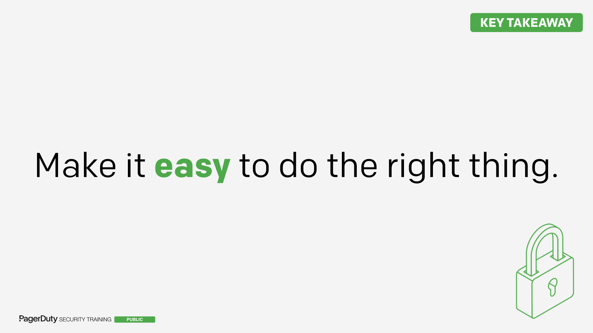
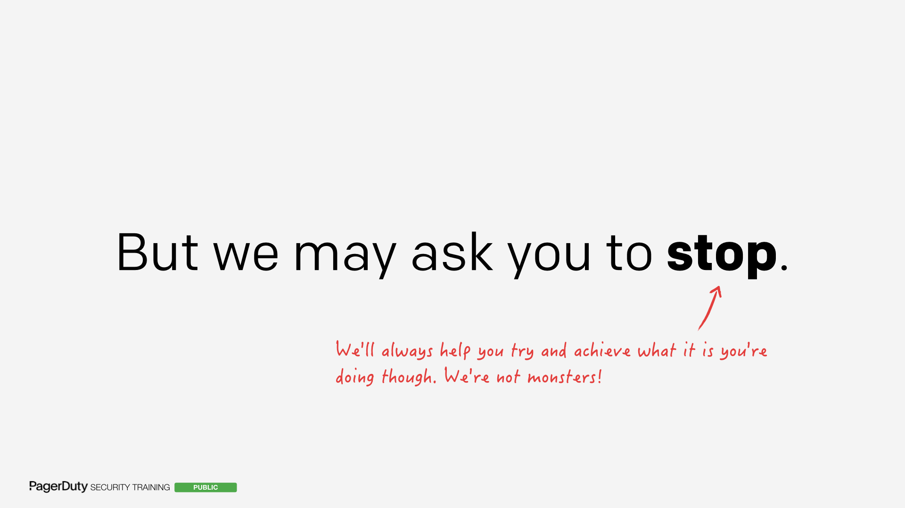
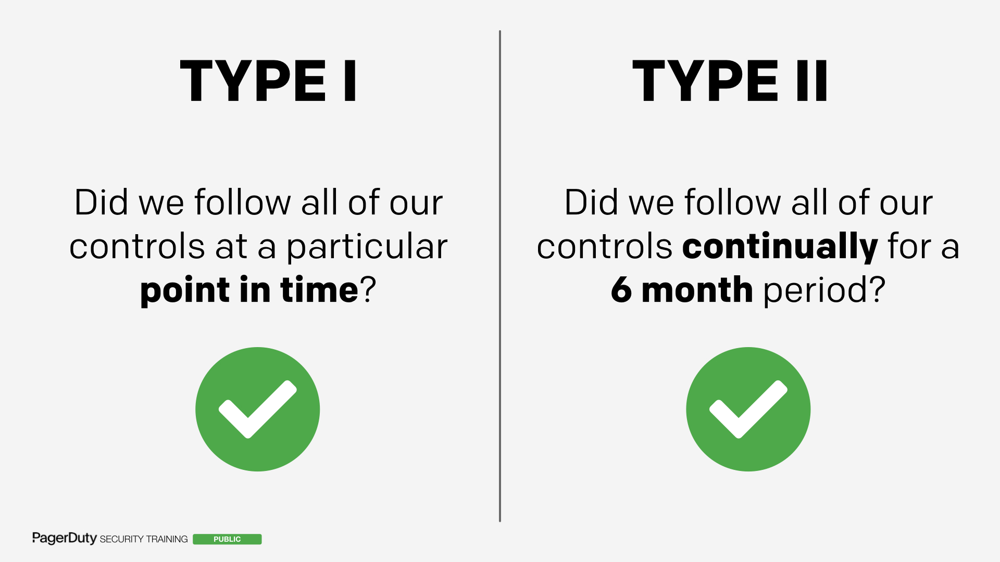
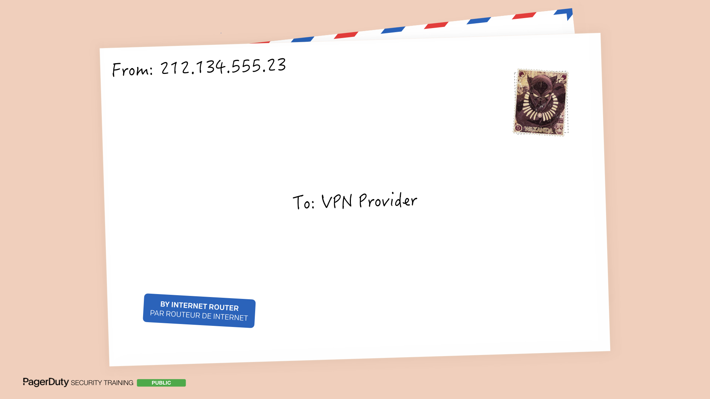
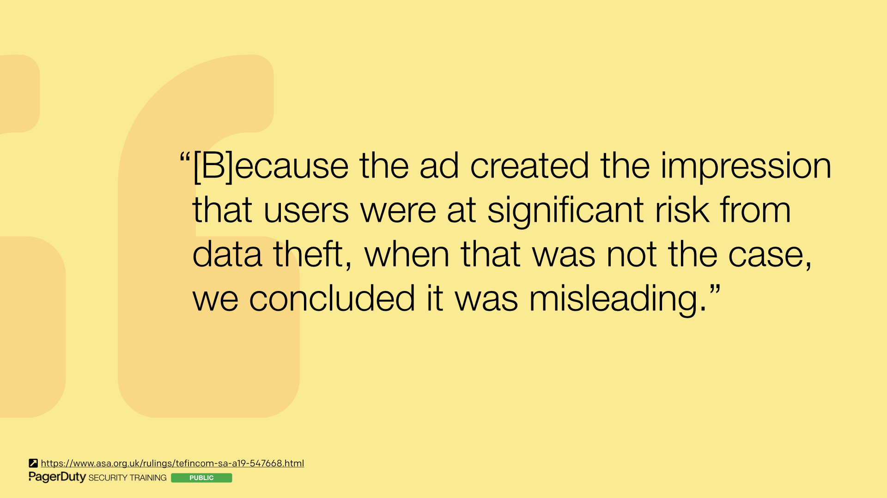
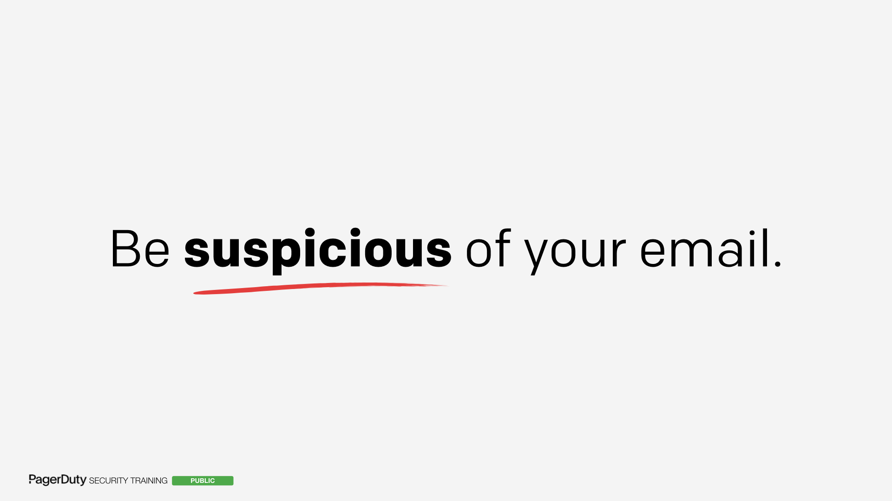
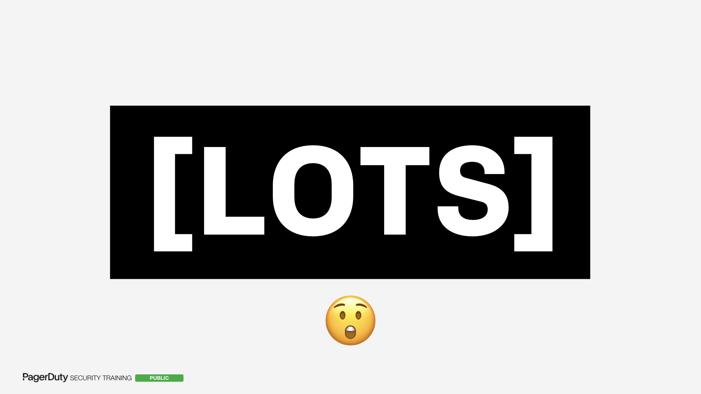
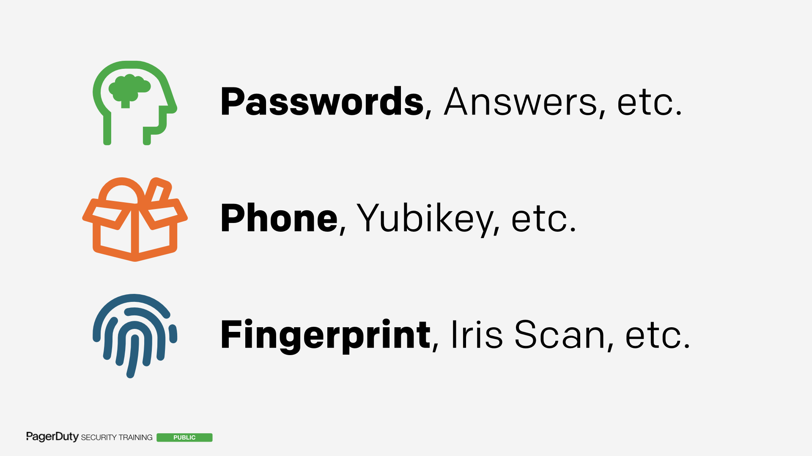
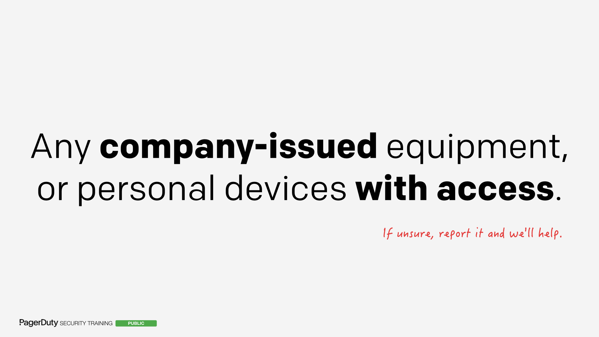

!!! info "Security Training for Everyone  (Part III)"
    This is an [open-source](https://github.com/pagerduty/security-training) version of "Security Training for Everyone (Part III)", the third major installment of PagerDuty's internal employee security training, given to all PagerDuty employees as part of our annual security training program. This training was first delivered to our employees in 2020.

    As with our [previous](/for_everyone) [trainings](/for_everyone_part_ii), we designed this course to not only cover common security topics relevant to all staff, but also to teach staff new skills and methods of bypassing security in order to try and give insight into the perspective of the attacker. We feel strongly that learning about security is more fun when you're shown how attackers break things instead of just blindly listing rules to follow.

    The main topics covered in this training are,

      * **[Compliance](#compliance)** - _An overview of what compliance is, why it's important, and why it will never end._
      * **[Securely Working From Home](#securely-working-from-home)** - _How you can stay safe while working from home, and why you don't need a VPN to keep your passwords secure._
      * **[Threat Models](#threat-models)** - _How we decide what to work on._
      * **[Phishing](#phishing)** - _More examples of phishing from the last year and the types of things to look out for._
      * **[Authentication](#authentication)** - _Why we recommend using a U2F key for all your authentication needs._
      * **[Physical Security](#physical-security)** - _How to keep our offices and physical environments secure._
      * **[Data Handling](#data-handling)** - _What is data? Should I post that data publicly? We play a game to find out the answers!_

    While some of the material we present internally contains sensitive PagerDuty information, the majority consists of generic security lessons, presented in a light-hearted and informative way. Many employees asked for a version of the training they could share with friends and family. This site is the culmination of our efforts to do just that.

    Some slides have been modified from those originally presented internally so that we could lower the classification and release them without redacting entire slides. Any substantive modifications are called out in the notes, but most of the changes were simply to remove links to internal documentation and screenshots of internal tooling.

    The text presented here is a semi-accurate transcription of how the training was delivered to staff internally.

---

### Introduction

<input type="checkbox" id="001" /><label for="001"></label>
_001. "Security Training for Everyone Part III: Rise of the Machines"._

Welcome to another round of "Security Training for Everyone"! The most fun, informative, well-delivered, humble, and non-optional training you'll attend within the next hour.

As I'm sure you're aware by now (since you're here), all PagerDuty employees, contractors, and interns are required to undergo annual security training in order to understand the threats we face and how to protect us from them. Doing the same training each year would quickly get tedious (as those of you who went through our old training a few times will attest to), so you'll be pleased to know that this is not a repeat of [last year's session](/for_everyone_part_ii), or even [the year before's session](/for_everyone). While we will be going over some of the same topics in order to refresh your knowledge, and some of the takeaways will be the same, the content is all new. Topics that we paid a lot of attention to in the last few years will only be skimmed over this time around, and we're going to dig a bit deeper on the topics we only briefly touched on in the past.

So this is part three of "Security Training for Everyone", which I'm calling "Part III: Rise of the Machines".

Just like last year, I came up with that title entirely on my own. It's definitely [not stolen from something else](https://www.imdb.com/title/tt0181852/).

---

### Classifications

<input type="checkbox" id="002" /><label for="002"></label>
_002. Slide classifications._

We'll start with a quick reminder of our slide classifications. We have three main classifications, Public, Restricted, and Internal Only. Every one of the slides in this talk will have one of these classifications shown in the bottom left. Please make sure to follow the rules for each classification type:

* If it's **public**, you can take a photo, tweet it out, do whatever you want with it.

* It it's **restricted**, you can only share it with customers under an NDA, or with folks internally.

* If it's **internal only**, then please keep it internal to PagerDuty and not share it anywhere else.

Similarly to previous years, I'll be producing three versions of the training slides. For the restricted and public versions I will be redacting certain information on various slides so that we can lower the classification rather than redacting the slides entirely. That way it's more useful when sharing.

---

### Goal

<input type="checkbox" id="003" /><label for="003"></label>
_003. Goal of the training._

The goal of the training hasn't changed from previous years. It's still that we want to give you insight and visibility in to the threats we face as a company, and to teach you how to protect us against those threats. It's not just to give you a bunch of rules to follow, the intent here is to arm you with knowledge so that you understand the reasons behind those rules as well.

---

### Agenda

<input type="checkbox" id="004" /><label for="004"></label>
_004. Agenda._

So we have quite a jam-packed agenda today, and there's a lot of topics we'd like to cover. I'm going to deep-dive on some and just touch on others. We tend to pick one or two topics each year that we deep dive on and then the next year they don't get quite as much visibility.

But hopefully you'll get some useful information you can all take away.

---

### Colours and Animals

<input type="checkbox" id="005" /><label for="005"></label>
_005. Colours and animals._

A note on colours and animals. For those who don't know about this, in previous years the way we track attendance to this is at the start there will be a slide with a colour. At the end there will be a slide with an animal. It will be very obvious which slides, as the colour or animal will be the only thing being called out on it.

The colours and animals you see here are for previous years. They are **NOT** the answers for this year. Please don't put in previous year answers on the form, as we'll just ask you to watch the training again.

---

### Completion Form

<input type="checkbox" id="006" /><label for="006"></label>
_006. The training completion form._

At the end of this training, you're going to get this form in your inbox. You put in the colour, you put in the animal, and that "proves" that you attended the training. Of course, this can be gamed, any attendance tracking can be, we're using the honor system really.

If you don't complete the form, you will get nagging emails from the security team. If you _STILL_ don't fill in the form, we are required to revoke your access to all PagerDuty systems until we have evidence of you completing the training. That's a compliance requirement, and we have had to do that a few times, so please don't be that person.

---

### Green

<input type="checkbox" id="007" /><label for="007"></label>
_007. Green._

So with that, I can tell you that this year's colour is **GREEN**. Remember green, and when you get the form at the end of this training, fill in green as the colour. This will demonstrate to us that you were here at the start of the training. Hopefully everyone will be able to spell that correctly too.

---

### Source for Colour and Animals

<input type="checkbox" id="008" /><label for="008"></label>
_008. The source of the colour and animal combinations._

People have asked me where I come up with the colours and animals each year, and really it comes from my daughter. She's been watching me put together this talk over the last few months at home, and she keeps asking me if she can help with my "meeting about the aminals".

???+ comment "Presenter's Comment"
    That's not a typo, she really says "aminals", it's very cute.

You can see here that she has a blue llama, and a purple dog, both of which she likes very much. So she chose the colour and animals this year too.

---

### Choose Your Aminal

<input type="checkbox" id="009" /><label for="009"></label>
_009. Choose your aminal._

I'm going to do something a bit different this year and let you see the choices ahead of time. It's going to be one of these five animals that is the answer. Have a quick game, see if you can guess what it is.

---

### The Security Team

<input type="checkbox" id="010" /><label for="010"></label>
_010. The PagerDuty Security Team._

With that out of the way, I'd like to introduce you to the PagerDuty Security Team. Who are the Security Team? All of these lovely faces you see right now are our current security team. I'm going to talk a bit about who we are, what we do, what our philosophy is, and how you can reach out to us if you ever need help with anything.

We've grown quite a bit in the last few years, so we've had to change our ways a bit. We're no longer silly.

???+ warning "Redacted Content"
    This slide showed headshots of the entire PagerDuty security team. We'd rather not provide a lookup table of the security team for the world to see, so this slide has been redacted for the public version. If you want to see the real slide, you'll just need to [come work with us](https://www.pagerduty.com/careers).

---

### The Security Team Is Not Silly

<input type="checkbox" id="011" /><label for="011"></label>
_011. The PagerDuty Security Team are always serious, never silly._

We now have to be 100% serious 100% of the time. There are definitely no moments where we're not a serious security team. So yeah, please don't come to use with silly things. Always be professional.

???+ warning "Redacted Content"
    This slide showed the same headshots as before, but now with various silly accoutrements added to each person. Fake mustaches, top hats, balaclavas, you get the idea. The faces were still identifiable however, so this slide is redacted for the same reason as the previous one.

---

### Our Mission

<input type="checkbox" id="012" /><label for="012"></label>
_012. Mission for the Security Team._

Our mission is twofold. We want to increase customer confidence in our product, and we need to protect our company brand and reputation. It's worth noting that employees are part of that too, you are part of the company, so one of our goals is to protect you.

---

### Make it Easy to do the Right Thing

<input type="checkbox" id="013" /><label for="013"></label>
_013. Make it easy to do the right thing._

And one of our own overwhelming principles is we want to **make it easy for you to do the right thing**. There's always going to be a security and convenience trade off.

The goal we have is to make those less of an either/or situation. We want to try and make the most secure way also one of the easiest paths forward. That's definitely not always possible, but it's what we're striving for.

---

### What if I do something stupid?

<input type="checkbox" id="014" /><label for="014"></label>
_014. What if I do something stupid?._

A question we get a lot is,

> What if I do something stupid?

---

### Adversarial Relationship

<input type="checkbox" id="015" /><label for="015"></label>
_015. We won't speak to you in a condescending tone, amongst other things._

There are a lot of companies out there where the Security Team has an adversarial relationship with the rest of the company. If you do something wrong, you're going to reprimanded, demoted, or possibly even fired. At the very least you'll likely be forced to take additional training of some sort.

That could not possibly be more counter to how the security team operates at PagerDuty. We will not do any of that. Ever.

---

### Assume Good Intentions

<input type="checkbox" id="016" /><label for="016"></label>
_016. Assume good intentions._

We always assume good intentions when security issues are reported to us. If you clicked a link you shouldn't have by mistake, or if you copied customer data somewhere you shouldn't have, we're not going to come down on your like a ton of bricks. We're going to work with you to fix the problem. And we're not going to make you feel bad just because you got scammed.

We're here to help. We're not here to punish people for clicking a wrong link. That's not what we're here for. That's not what we do.

---

### Never Shame

<input type="checkbox" id="017" /><label for="017"></label>
_017. Never shame._

We will also never shame you if you come to us with a problem. Anyone who's come to us with a problem or saying that you've clicked a link you shouldn't have will already know this. Your name isn't going to appear on any report, it won't appear in any post-mortem or after-action-review. We keep it private within the security team.

We also don't go around behind your back. There is no hidden `#security-shaming` channel on Slack or anything like that.

You'll see a lot of companies out there who will do phishing tests and things like that, where they send you a fake email and if you fall for it then you have to resit the training and do a bunch of other stuff. In other cases you may even get fired, as [one particularly egregious example demonstrates](https://twitter.com/justin_fenton/status/1308851669397053440). We will never, under any circumstances, as long as I'm still here and breathing, ever allow any of those types of tests against our employees. They go completely against what we stand for, and creates an environment of fear rather than one of trust.

???+ comment "Presenter's Comment"
    We feel incredibly strongly about this. If you're just starting to develop your own information security programs, we encourage you not to fall into the trap of doing these types of tests. It can be tempting as it's easy to set up and seems to get you results. But there's a (not so hidden) cost, in that you're going to make your staff fearful and resentful of the security team. They won't come to you when they find issues, they'll just keep it to themselves.

---

### Stop

<input type="checkbox" id="018" /><label for="018"></label>
_018. We may ask you to stop._

Having said all that, we may come to you and abruptly ask you to stop what you're doing. Sometimes in the middle of the security incident we will need to be brief and it may come across like we're being mean or adversarial. That's not the case.

Especially with security incidents, there are strict deadlines of when we have to report issues, and the clock starts ticking the second we discover an issue. So if we're abrupt, that will be why.

We will always come back to you after the fact and help you achieve whatever it is that you were trying to do when we asked you to stop. We're not just going to leave you hanging or anything like that.

---

### Contacting the Security Team

<input type="checkbox" id="019" /><label for="019"></label>
_019. Contacting the Security Team._

If you need to reach out to us, there are a couple of different ways. If you just need to ask us a question or you're curious about something, the `#security` Slack room is the best method. We also have our email address. But if you need to get us urgently for anything, there's this cool product called [PagerDuty](https://www.pagerduty.com) that can do it for you. Choose the "Security Team Manual Escalation" service and that will immediately page the security team on-call engineer.

Response will be within a minute or two, so this really is just for urgent requests. Things like, you see someone called `hacker` logged in on one of our servers, you've found a security vulnerability being exploited, that kind of thing.

Examples of non-urgent issues are a customer wanting to ask a question about security. That's not an urgent request, please send those to email.

???+ comment "Presenter's Comment"
    We've redacted the email address here, even though it's pretty obvious what it is. The reason we've redacted it as that as we've open-source these slides in the past, we found some companies were using them verbatim, without changing the address in them. So we'd get phishing reports from other companies coming to our mailing list. We always reply and redirect the users to the correct place (and applaud them for being on top of phishing). But since it caused a non-zero amount of work for us (and I'm sure the other companies), we're redacting it here in the hopes it prevents that from happening in future.

---

### Security Team at PagerDuty

<input type="checkbox" id="020" /><label for="020"></label>
_020. Using PagerDuty to raise a security incident._

For those who aren't familiar with PagerDuty, although you really should be, this is what the manual escalation service looks like. We also put the words "Security Incident" and "Emergency" in there for easier searching. The big button over on the right is the one you want to press.

???+ warning "Redacted Content"
    This slide showed a screenshot of the internal service. There wasn't really a good way to selectively redact parts of the image without it just being a tiny bit of text left, so we've redacted the entire slide.

---

### Compliance

_<input type="checkbox" id="021" /><label for="021"></label>_

Okay, with all the intro stuff out of the way, let's get stuck into our main first topic of the day, which is Compliance.

Compliance is a really important initiative at PagerDuty. Because by obtaining and maintaining these industry compliances, we not only make our sales cycle so much faster, but we also help to gain the confidence and trust of our customers.

---

### SOC 2 Type II Compliant

<input type="checkbox" id="022" /><label for="022"></label>
_022. We are SOC 2 Type II compliant._

The good news is that as of December 2019, [we have achieved SOC 2 Type II compliance](https://www.pagerduty.com/blog/soc-2-type-2-compliance/). This is a huge achievement and a lot of effort and work when into this from almost every team in the company. So well done!

---

### Type I vs Type II

<input type="checkbox" id="023" /><label for="023"></label>
_023. SOC2 Type I vs Type II._

If you were here least year, you probably remember that at this part of the training we were Type I compliant, and now we're Type II compliant.

The difference is that Type I is a point-in-time snapshot of how we behaved on a specific day. So an auditor would come in for a day, and said "Okay, you do everything you say you do, you're all good".

For Type II, we were audited for a six month period, where auditors assessed whether we do all the things we say we do continually for six months. So as you can imagine, that was a much bigger undertaking.

---

### So We're Done?

<input type="checkbox" id="024" /><label for="024"></label>
_024. So we're done, right?_

So cool, we're done right? There's nothing else left for SOC 2 compliance for us to ever worry about?

---

### Not Quite

<input type="checkbox" id="025" /><label for="025"></label>
_025. Not quite._

I'm afraid not quite.

---

### SOC2 is Forever

<input type="checkbox" id="026" /><label for="026"></label>
_026-029. SOC2 is forever...and ever...and ever..._

SOC2 is forever...

...and ever...

...and ever...

...and ever.

---

### Stay Compliant

<input type="checkbox" id="030" /><label for="030"></label>
_030. We need to stay compliant._

The key now is that we have to **stay** compliant. Every six months we'll have another audit period and will be audited at the end of it. We have to maintain all of the same policies, practices, and procedures that we already have. We can't just let up because we're not in an initial crunch period any more.

SOC2 audits are always happening, so if we let up, even for a moment, that's going to end up on the report. The SOC2 reports go to customers, so it can be really embarrassing if things show up on them.

---

### Other Compliances

<input type="checkbox" id="031" /><label for="031"></label>
_031. What about other compliances?._

We also receive a lot of questions about other compliances we're looking to achieve, since it's not all about SOC2.

---

### Other Compliances Redacted

<input type="checkbox" id="032" /><label for="032"></label>
_032-033. Redacted._

???+ warning "Redacted Content"
    These slides discussed compliance initiatives that are currently on our roadmap to achieve, but that we're not able to talk about publicly yet. We talked about what a "gap assessment" is, and what the current state of those is for the compliances we're looking to achieve.

    A "gap assessment" is when a team goes through our current practices and policies, and determines where we fall short of achieving the compliance we're after (i.e. where the gaps in our processes are). At the end of this, we will hopefully have a list of all the things we need to do or change in order to get us in line with what auditors will be expecting to see for the specific compliances we're after.

---

### GDPR

<input type="checkbox" id="034" /><label for="034"></label>
_034. GDPR. [Reference](https://gdpr.eu/)_

Not really compliance, but more of a privacy framework and regulation is GDPR, the [General Data Protection Regulation](https://gdpr.eu) from Europe.

Just like SOC2, we cannot give up on maintaining these privacy frameworks, policies, and protections that we have in place. Especially when it comes to GDPR, the fines are ridiculous. Even though we're not a European company, we have a presence there, and have customers there, so we're obligated to maintain the same level of privacy controls.

This is the reason why we have to let users delete all of their information when requested and things like that. I mean, we should do that anyway because it's the right thing to do, but if that wasn't a good enough reason, there's GDPR to help make the decision for us.

---

### CCPA

<input type="checkbox" id="035" /><label for="035"></label>
_035. CCPA. [Reference](https://oag.ca.gov/privacy/ccpa)_

There's also a new one now, the CCPA, or [California Consumer Privacy Act](https://oag.ca.gov/privacy/ccpa), which is essentially California's version of GDPR.

Which again we are going to fall under as well, and there will be some stringent privacy requirements there too.

California has lots of extra protections when it comes to business that operate online, and not just related to privacy too. So it's important we ensure we follow all those rules.

???+ comment "Presenter's Comment"
    Fun fact: If you create an online account with a company and they won't let you delete your account without phoning them and things like that, just change your address to California. Then they have to let you delete your account in the same way you created it, by law.

    This rule is defined in [section 17602 of the California Business and Professions Code](https://leginfo.legislature.ca.gov/faces/selectFromMultiples.xhtml?lawCode=BPC&sectionNum=17602C) if you're interested.

---

### Compliance Roadmap

<input type="checkbox" id="036" /><label for="036"></label>
_036. An example compliance roadmap._

So when is all this stuff coming? Are we doing all of it? Are we only doing some of it?

Our compliance roadmap is available on the wiki, it is internal only, please never share dates with customers as they can change at any time, so we don't want to start making promises we can't keep.

???+ warning "Redacted Content"
    The dates, timelines, and names of compliances have all been redacted here, as we're not able to share that information externally. This was left in just to give you an idea of how we would display our internal roadmaps during these trainings.

---

### How Does This Affect Me?

<input type="checkbox" id="037" /><label for="037"></label>
_037. How does this affect me?_

So one of the questions you're probably asking yourself is,

> How does this affect me?

---

### Compliance Checklists

<input type="checkbox" id="038" /><label for="038"></label>
_038. Compliance checklists._

Well, as we start gaining more and more of these compliances, you're going to start seeing more stringent policies in effect throughout the organization. You'll see things like checklists and changes to our software development lifecycle that add more reviews before systems go into production and things like that.

Just something to be on the lookout for in future as we mature as an organization.

---

### Where Can I Find The Controls?

<input type="checkbox" id="039" /><label for="039"></label>
_039. Where can I find the controls?_

Another question we get a lot is,

> Where can I find a list of the controls?

Folks are very interested in self-discovering what's involved with SOC2 so they can figure out what they need to do to stay compliant.

---

### SOC2 Report

<input type="checkbox" id="040" /><label for="040"></label>
_040. Redacted._

The best place is probably the SOC2 report itself, which is available internally (and to customers under an NDA). They're a bit difficult to understand, I won't lie, and there's some interpretation and wiggle room involved. But it should give you a general idea of the types of rules that we have to follow.

???+ warning "Redacted Content"
    This slide showed our internal wiki and where staff can find the SOC2 report.

    If you're a customer and want to get our latest report, you can request a copy using the link on the [PagerDuty Security](https://www.pagerduty.com/security/) section of our website.

---

### Compliance Summary

<input type="checkbox" id="041" /><label for="041"></label>
_041. Compliance summary._

So a quick summary of all that:

* SOC2 is never going to end, don't think that it's over.
* We have _other compliances_ on the roadmap.
* GDPR and CCPA privacy regulations are important and we need to keep those in mind when we're building new things.
* Keep in mind that compliance may start to impact your team priorities and roadmaps as we get further along in the processes.

???+ warning "Redacted Content"
    The names of the other compliances have been redacted on this slide for the same reason as earlier. We're unable to share internal roadmap publicly.

---

### Securely Working From Home

_<input type="checkbox" id="042" /><label for="042"></label>_

Our next topic is working from home, which is pretty timely given the current situation in the world. This will be our main deep-dive topic for this year, so we'll be spending most of our time on this.

---

### Office, Hotel, Anywhere...

<input type="checkbox" id="043" /><label for="043"></label>
_043-045. Office, Hotel, Anywhere._

Whether you're working from home, the office, a hotel, or anywhere really, the same things are going to apply for all four situations.

---

### Do I Need to Use a VPN?

<input type="checkbox" id="046" /><label for="046"></label>
_046. Do I need to use a VPN?_

One of the questions we've been getting a lot since folks have started working remotely is,

> Do I need to use a VPN?

There's a lot of advertisements for Virtual Private Network (VPN) services right now, and we've been getting this question a lot.

Unfortunately it's not a simple yes or no answer. So I'm going to try and explain what a VPN actually is in as much detail as I can, so that you'll understand the tradeoffs involved and whether it makes sense for you.

---

### Explain How The Internet Works

<input type="checkbox" id="047" /><label for="047"></label>
_047. Let me explain how the internet works..._

But first I need to step back, and tell you a bit about how the internet works.

You may feel like this is going off the rails, but I assure you we'll come back to the question of VPNs.

---

### Post Office

<input type="checkbox" id="048" /><label for="048"></label>
_048. The internet is like a post office._

So when talking about the internet, I'm going to use the analogy of the Post Office. But instead of having distribution centers and sortation centers, the internet uses "routers". They essentially do the same thing, but with electronic messages instead of physical messages.

---

### HTTP vs HTTPS

<input type="checkbox" id="049" /><label for="049"></label>
_049. HTTP vs HTTPS._

When you're going to a website in your browser, you've probably seen one of these two things. You will likely have seen HTTP (which now gets flagged as "not secure"), or HTTPS (which shows a nice green padlock next to it if it's secure).

But what do they actually mean? What's the difference between these two methods of using the internet?

---

### Not Secure

<input type="checkbox" id="050" /><label for="050"></label>
_050. Not secure._

We're going to look at the "Not Secure" one first, which would be HTTP.

???+ comment "Presenter's Comment"
    What HTTP stands for doesn't really matter for the purposes of this discussion, but for those who are interested in learning more, you can read about it on [the Wikipedia page for Hypertext Transfer Protocol](https://en.wikipedia.org/wiki/Hypertext_Transfer_Protocol).

---

### Postcard

<input type="checkbox" id="051" /><label for="051"></label>
_051. Sending a postcard._

Keeping our postal analogy, this is going to be the equivalent of sending a postcard.

Say you want to login to a website. You can write a postcard saying "this is my username, this is my password, please log me in".

Then you're going to send this postcard over the internet (or over the postal system in our analogy).

---

### Movies

<input type="checkbox" id="052" /><label for="052"></label>
_052. Just like the movies._

It's kind of like how you see in the movies, with fancy graphics showing computers talking to each other and things like that, and your message jumps between them.

It's the same thing, just without the fancy graphics.

---

### Sending a Postcard

<input type="checkbox" id="053" /><label for="053"></label>
_053-057. Sending a postcard over the internet._

So, imagine you're here on the left (you're a little Pagey), and you want to login to PagerDuty. You write your postcard and need to find a path to send it over the internet.

It goes between multiple "sortation centers" or routers, and your message gets sent over.

The problem is that because it's just a postcard, anyone along that path can just look at the message and read it as it's going by. So they can steal your information, your username and passwords, without having to do anything. They can just sit there and watch it go past.

That's not great.

---

### Anyone Can Read It

<input type="checkbox" id="058" /><label for="058"></label>
_058. Anyone along the path can read it._

More than that, not only can they read your message, they can also _change it_ without either side of the conversation knowing that it's been changed, or what about it changed.

---

### Received Postcard

<input type="checkbox" id="059" /><label for="059"></label>
_059. "Thanks, you're logged in"._

So let's say you login to your bank or a website, and you'll get a postcard back essentially saying "Thanks, you're logged in". But you can't trust any of the content of that message.

---

### Suspicious Postcard Edit

<input type="checkbox" id="060" /><label for="060"></label>
_060. Suspiciously edited postcard._

It could have been modified by anyone along the path, it could have been tampered with, and you would have absolutely no way of knowing.

---

### Cannot Trust Anything

<input type="checkbox" id="061" /><label for="061"></label>
_061. You cannot trust anything._

The key here is what when using the "Not Secure" method, the reason it's not secure is because you cannot trust anything when communicating over that channel. Anyone can read your messages, and anyone can change your messages.

---

### Comcast

<input type="checkbox" id="062" /><label for="062"></label>
_062. Comcast injecting code. [Reference](https://thenextweb.com/insights/2017/12/11/comcast-continues-to-inject-its-own-code-into-websites-you-visit/)_

This isn't some theoretical thing either, Comcast were actually doing this back in 2017. They would modify your requests to [inject ads onto every site you visited](https://thenextweb.com/insights/2017/12/11/comcast-continues-to-inject-its-own-code-into-websites-you-visit/) to try and upsell you on new modems. Very not cool.

---

### The Secure Method

<input type="checkbox" id="063" /><label for="063"></label>
_063. The secure method._

Okay, so how do we stop this? We need to use the secure method of accessing the internet, or HTTPS.

---

### Another Postcard

<input type="checkbox" id="064" /><label for="064"></label>
_064. Another postcard being sent._

This is actually not too different from what we were looking at before. It's still a postcard, only now the data is encrypted.

---

### Encrypted Postcard

<input type="checkbox" id="065" /><label for="065"></label>
_065. An encrypted postcard._

The message we're sending is encrypted, along with a few other bits and pieces. But you can still see who the message is going from, and who it's going to. Otherwise how would you deliver the postcard?

---

### Encrypted Response

<input type="checkbox" id="066" /><label for="066"></label>
_066. An encrypted response._

The message back is going to be the same in that the contents will be encrypted so only you know how to read them.

---

### A Secure Path

<input type="checkbox" id="067" /><label for="067"></label>
_067. A secure communication path._

The upshot of this is now no one along the path of this message can read your message, as they have no way of decrypting the contents. More so, if they try to modify you message, you'll know, because you won't be able to decrypt it when it gets to the other end. So not only do we know the contents of our messages are secure, we know they can't be tampered with.

We call this being secure or being encrypted "in-transit", as your message cannot be read or tampered with while it's moving across the internet.

???+ comment "Presenter's Comment"
    You may have also seen the term "at-rest", as in "encrypted at-rest". This is when your data is secure while it's not moving over the internet, so for example while it's stored on your hard drive.

---

### Password Are Safe

<input type="checkbox" id="068" /><label for="068"></label>
_068. Your passwords and personal information are safe._

So this is great, your passwords and personal information are encrypted and safe, even if you're on public WiFi, even if you're connecting from an insecure location! As long as you're doing it over HTTPS, your passwords and personal information are safe.

But...

---

### Information Leakage

<input type="checkbox" id="069" /><label for="069"></label>
_069. An attacker can still see the sender and receiver though._

...anyone can still see the sender and receiver of the message. Otherwise there would be no way to deliver the messages.

So there's a little bit of [information leakage](https://en.wikipedia.org/wiki/Information_leakage) there, but it's not the end of the world.

---

### Not Where

<input type="checkbox" id="070" /><label for="070"></label>
_070. But not where on a website._

It's worth noting that when I talk about the sender and receiver, this doesn't mean that people can see the entire path to the website you're vising. They can only see the domain, not the exact page on that site. It's like they can see the building the letter goes to, but not the specific room inside the building.

So all someone would be able to see is that you visit `amazon.com`, not what product you were looking at, or which user you are, for example.

---

### Why Don't We Always Use HTTPS?

<input type="checkbox" id="071" /><label for="071"></label>
_071. Why don't we always use HTTPS?_

This is a huge step up from HTTP, so why don't we always use this?

---

### We Do!

<input type="checkbox" id="072" /><label for="072"></label>
_072. We do!_

Well, PagerDuty does! Along with the vast majority of the websites out there. It's getting harder and harder to find websites that don't use HTTPS by default nowadays.

---

### HSTS on PagerDuty

<input type="checkbox" id="073" /><label for="073"></label>
_073. You cannot visit pagerduty.com without HTTPS. [Reference](https://hstspreload.org/?domain=pagerduty.com)_

In fact you can try this yourself, you cannot visit [pagerduty.com](https://www.pagerduty.com) without HTTPS, your browser will refuse to do it^*^.

???+ comment "Presenter's Comment"
    ^*^ For most modern browsers, but probably not all. I'm sure one of you will find a browser which doesn't and email me about it 🙂

---

### HSTS Preloading

<input type="checkbox" id="074" /><label for="074"></label>
_074. pagerduty.com is preloaded into Chrome. [Reference](https://github.com/chromium/chromium/blob/master/net/http/transport_security_state_static.json)_

This is because we are hardcoded into a lot of browsers out there. This is a screenshot of the Google Chrome source code, with `pagerduty.com` listed in there. Website owners are able to add themselves to this list to ensure that users of the browser can only visit over secure connections.

So even if you try to visit via that original plaintext postcard method I showed before, the browser won't let you send the postcard. It'll just say no.

???+ comment "Presenter's Comment"
    The way this happens is with something called [HTTP Strict Transport Security (HSTS) Preloading](https://hstspreload.org/).

---

### All Sites for PagerDuty Use HTTPS

<input type="checkbox" id="075" /><label for="075"></label>
_075. All sites for PagerDuty business use HTTPS._

This is true for every service we use for PagerDuty business too. This is one of the reasons that when you want to use a new vendor at PagerDuty, we have to do those security reviews and risk assessments. One of the things we're checking for is whether the vendor encrypts all of their information while it is in transit over the internet.

---

### How Do We Know HTTPS is Safe?

<input type="checkbox" id="076" /><label for="076"></label>
_076. How do we know HTTPS is safe?_

But how do we _know_ this is safe? How do we know that our message is reaching the correct place and that it's not some fake site pretending to be PagerDuty just to steal your information?

---

### SSL Certificates

<input type="checkbox" id="077" /><label for="077"></label>
_077. SSL certificates._

For this, we need to talk about something called [certificates](https://en.wikipedia.org/wiki/Public_key_certificate). You've probably heard about "SSL Certificates" before...

---

### TLS Certificates

<input type="checkbox" id="078" /><label for="078"></label>
_078. TLS certificates._

...or really "TLS Certificates". The term "[certificates](https://en.wikipedia.org/wiki/Public_key_certificate)" is all we really care about for this discussion.

---

### I Am PagerDuty

<input type="checkbox" id="079" /><label for="079"></label>
_079. I am PagerDuty. Signed: Me._

When you visit a website, it shows you a digital certificate saying "I am `pagerduty.com`. Signed: me".

OK, great. How can we trust that though? They've just printed the certificate and signed it themselves, right?

---

### Certificate Authority

<input type="checkbox" id="080" /><label for="080"></label>
_080. Certificate authority certifies PagerDuty._

In reality, these certificates will be signed by something called a [Certificate Authority (CA)](https://en.wikipedia.org/wiki/Certificate_authority).

This is an entity that has signed the certificate and is vouching for the authenticity of it. They are saying "Yes, I confirm that it is really `pagerduty.com`. Signed: Certificate Authority".

It's not like a physical signature, really it's going to be some [fancy mathematics](https://en.wikipedia.org/wiki/Digital_signature), a digital cryptographic signature that can't be faked.

---

### Root CA

<input type="checkbox" id="081" /><label for="081"></label>
_081. Root CA certifies the certificate authority._

But how do we know the certificate authority is trustworthy? Well, they have a certificate themselves, and _their_ certificate will be signed by yet another certificate authority. There can be many certificate authorities in this chain (and the chain can get pretty large).

Ultimately however, you will reach something called a [root certificate authority (Root CA)](https://en.wikipedia.org/wiki/Root_certificate).

Root CA's are heavily vetted and audited, and are generally globally recognized as being trustworthy. Your operating system will have a pre-vetted list of these available to use. So Apple and Microsoft, etc. will vet these root certificate authorities for you.

---

### Trust the Authority

<input type="checkbox" id="082" /><label for="082"></label>
_082. "I trust the root authority"._

So your operating system will trust one of these root authorities, which in turn signed an intermediary certificate, which in turn signed the `pagerduty.com` certificate.

---

### Trust PagerDuty

<input type="checkbox" id="083" /><label for="083"></label>
_083. "Which means I also trust PagerDuty"._

The ultimate upshot of this is that through this whole [chain of trust](https://en.wikipedia.org/wiki/Chain_of_trust) you know you're speaking to the real `pagerduty.com`.

---

### Saul Goodman

<input type="checkbox" id="084" /><label for="084"></label>
_084. Saul Goodman knows a guy, who knows a guy, who knows another guy._

I like to equate it to Saul Goodman saying, "I know a guy, who knows a guy, who knows another guy".

---

### Driver License

<input type="checkbox" id="085" /><label for="085"></label>
_085. Driver license._

Looking at this from another point of view, one way I like to think about this idea is to use the example of driving licenses.

Let's say you're at an airport, and you need to prove your identity to an agent there. You might use your drivers license to do that.

So you show them your drivers license. But how can they trust that document?

---

### DMV

<input type="checkbox" id="086" /><label for="086"></label>
_086. DMV certifies driver license._

It will have been issued by some authority, usually the DMV (in the United States at least). That authority has vetted things like your social security number and other forms of identity.

???+ comment "Presenter's Comment"
    This will be different in other countries of course, but the concept will be roughly the same.

---

### Government

<input type="checkbox" id="087" /><label for="087"></label>
_087. Government certifies DMV._

But then why should they trust the DMV? Well, they've probably been vetted by some higher authority. Usually the Federal or State Government.

---

### Trust Root Authority

<input type="checkbox" id="088" /><label for="088"></label>
_088. "I trust the root authority"._

Ultimately the agent trusts that higher authority...

---

### Trust Drivers License

<input type="checkbox" id="089" /><label for="089"></label>
_089. "So I also trust your driver license"._

...which in turn means they trust your driving license as a valid form of identification.

---

### MITM

<input type="checkbox" id="090" /><label for="090"></label>
_090. Beware of man-in-the-middle attacks._

One thing to be careful of with all this certificate stuff is something called a ["man-in-the-middle attack"](https://en.wikipedia.org/wiki/Man-in-the-middle_attack) (often abbreviated to MITM).

This is when someone (despite the name, it doesn't have to be a man) sits in the middle of a connection between two parties and can eavesdrop or alter the communication.

---

### Honest Rich's CA

<input type="checkbox" id="091" /><label for="091"></label>
_091. Honest Rich's Certificate Authority._

The way this usually presents itself is that you try to visit a site, and it says "I'm `pagerduty.com`", but their certificate is signed by some certificate authority you've never heard of, "Honest Rich's CA" for example.

---

### Browser Warning

<input type="checkbox" id="092" /><label for="092"></label>
_092. A typical browser warning._

At this point your browser will say "Hrm, this looks suspicious. I had better stop what I'm doing and warn someone". So you'll see something like this error here.

I'm sure you've all seen errors like this in your browser before. This particular one is from Chrome, so it'll look slightly different in other browsers, but the concept is the same.

When this happens, you very much want to click the button that says "Back to safety".

You don't ignore browser warnings and just click whatever gets the page to load, right? RIGHT?

---

### Loki

<input type="checkbox" id="093" /><label for="093"></label>
_093. Loki has never met this certificate authority before._

Your browser is essentially saying "I've never heard of the certificate authority before", or more correctly "I don't trust that this communication is secure". It has found a problem when trying to verify the certificates, and it cannot 100% say for sure that your connection is secure and someone isn't sitting in the middle of your connection and listening in.

There are other reasons to get an error like this, for example if the certificate is out of date (they usually have to be renewed annually), but in every case your browser is warning you that something is wrong and you likely can't fully trust that your connection is as secure as you want it to be.

???+ comment "Presenter's Comment"
    One common time you see errors like this are when you're using in-flight wi-fi. Because you usually need to pay for the service before you can use it, so they will purposefully perform a MITM attack on your connection so they can redirect you to a website where you can find information about your flight and pay for the service whenever you try to visit another site.

    But if you're trying to visit a website over `https://` then they will be unable to redirect you, because the in-flight wifi won't have the correct certificate for the site you're trying to visit. So when they try to intercept your request and redirect you, the certificate won't match what your browser expects, and it'll show an error.

    This is a good thing, because it means attackers also can't intercept your connection. However, it can be frustrating when you just want to get to the payment screen. Rather then bypassing the warnings though, I would recommend trying to visit [http://neverssl.com/](http://neverssl.com/) instead, which will usually allow the wi-fi payment redirect to be picked up since that site will never be over a secure connection (as the name suggests).

---

### No Trust

<input type="checkbox" id="094" /><label for="094"></label>
_094. Don't trust Rich's Honest CA._

So your browser says "I'm outta here, I'm not trusting this". And you shouldn't either.

It is possible to bypass these warnings, but you really really really shouldn't do that unless you very much know what you're doing and the full implications of doing it.

???+ comment "Presenter's Comment"
    Why would you ever want to ignore these warnings? Well there are certain cases where you don't necessarily care that the certificate is invalid. Perhaps you're trying to test something locally on your computer, so you used a certificate you signed yourself but which hasn't been signed by a certificate authority. You know it's safe, but your browser doesn't. In cases like that you would want to bypass the warning.

    There is a way to bypass these warnings in Chrome at least, by typing a "secret" phrase. I'm not going to provide it here, but you can find it easily online if you really want to bypass these warnings.

---

### Don't Ignore Browser Warnings

<input type="checkbox" id="095" /><label for="095"></label>
_095. Don't ignore browser warnings._

So the key takeaway of all this is to not ignore browser warnings. They're there to protect you. If you ignore them, then the security of your connection cannot be guaranteed.

---

### So What's a VPN?

<input type="checkbox" id="096" /><label for="096"></label>
_096. So what's a VPN then?_

Ok, so why am I going on about all this? What does any of this have to do with a VPN? I promised I'd get back to what a VPN is. So let's go back to our postal analogy now and talk about what a VPN does differently than just normal HTTPS.

---

### VPN Postcard

<input type="checkbox" id="097" /><label for="097"></label>
_097. Postcard, but the "from" address is blank._

We're sending the same postcard that we sent before, but now we're going to leave the "from" address blank. And rather than mailing it ourselves...

---

### Put In An Envelope

<input type="checkbox" id="098" /><label for="098"></label>
_098. Put it in an envelope to the VPN provider._

...we're going to pop it into an envelope and send it to someone else, our VPN provider.

OK.. so why are we doing that? That's weird, right?

---

### First Connection

<input type="checkbox" id="099" /><label for="099"></label>
_099. The first connection is only to the VPN provider._

We're essentially making two connections. We're going to make one connection where we send this envelope to the VPN provider. So anyone looking at that connection only sees us sending something to the VPN provider, and they don't know what it is.

---

### VPN Mails the Postcard

<input type="checkbox" id="100" /><label for="100"></label>
_100. VPN mails your postcard the rest of the way._

When the VPN provider gets it, they're going to write **their** name in the "from" address and they're going to mail it the final leg of the way to the end website.

---

### Second Connection

<input type="checkbox" id="101" /><label for="101"></label>
_101. The second connection is only from VPN provider to destination._

So anyone looking at this connection now only sees that this message came from the VPN provider to the final website.

---

### Mailing Back

<input type="checkbox" id="102" /><label for="102"></label>
_102. On the way back, VPN mails you the postcard._

It's the same when it goes in reverse as well. The website sends the postcard back to the VPN provider.

---

### Return Envelope

<input type="checkbox" id="103" /><label for="103"></label>
_103. You receive envelope from VPN provider._

And the VPN provider pops it into an envelope and sends that envelope back to you.

---

### Two Connections

<input type="checkbox" id="104" /><label for="104"></label>
_104. There are two separate connections._

The upshot is that neither end of the connection is speaking directly to the other end. So as far as the people on the left are concerned, you're only talking to the VPN provider. As far as the website on the right is concerned, the only thing talking to them is the VPN provider.

So now we've gotten rid of that little bit of information leakage that was still there. The "From" and "To" addresses on our postcard.

---

### ISP

<input type="checkbox" id="105" /><label for="105"></label>
_105. You ISP only sees your connection to the VPN provider._

If you're in a cafe and using a VPN, they can now only see your connection to that VPN provider and not which particular sites you are visiting. The same is true if you're at home, your ISP would now only see your connection to the VPN provider and not which sites you're visiting.

---

### Website VPN

<input type="checkbox" id="106" /><label for="106"></label>
_106. Website thinks the request came from the VPN provider._

The website you're visiting doesn't know where you're coming from either. They only see the connection from the VPN provider. So it can provide a level of anonymity.

OK, that sounds great! But it's not without some caveats...

---

### VPN Sees Everything

<input type="checkbox" id="107" /><label for="107"></label>
_107. VPN provider now sees everything._

The VPN provider can now see everything your ISP used to see. They're sitting right in the middle of your connection. It's essentially a man-in-the-middle attack, but one that you've allowed to happen.

You're moving your trust from the ISP to the VPN provider. So if you do use a VPN provider, you have to really trust that provider because they can see the information that's going between the connections that previously only the ISP would have seen.

---

### Are VPNs Useful?

<input type="checkbox" id="108" /><label for="108"></label>
_108. Why are VPNs useful then?_

Why are VPNs useful then? Hopefully you can start to see why these things would be useful from a security point of view.

---

### Streaming Service

<input type="checkbox" id="109" /><label for="109"></label>
_109. Streaming service in another country._

One of the main use cases you see is that, hypothetically of course, you want a stream service to think you're in another country. Using a VPN provider can mask your true location or identity.

I'm sure people would never really do that though.

---

### Downloading Things

<input type="checkbox" id="110" /><label for="110"></label>
_110. Downloading things without ISP knowing._

Or maybe, hypothetically, you don't want your ISP to see certain downloads that you're making.

Of course, I'm sure someone would never really have a need for that though.

---

### Whistleblowers

<input type="checkbox" id="111" /><label for="111"></label>
_111. Vital for journalists, whistleblowers, persecuted groups, etc._

It may sound like VPNs are only used to provide anonymity while attempting to do something nefarious, but that's definitely not the case. They are an absolutely vital tool for journalists, whistleblowers, persecuted groups in unfriendly countries, etc.

They are also used all over the corporate world to ensure a baseline level of connection security when access internal networks.

---

### Guarantees Trusted Communication

<input type="checkbox" id="112" /><label for="112"></label>
_112. Guarantees trusted communication._

Because they guarantee (within reason, assuming you trust the provider) that you have **trusted communication over an untrusted network**. So if you're somewhere where you can't trust the normal connection, you can use a trusted VPN provider to enable secure communication.

---

### Need to Use VPN?

<input type="checkbox" id="113" /><label for="113"></label>
_113. Do I need to use a VPN?_

So we finally, eventually, get back to the original question.

> Do I need to use a VPN?

---

### It Depends

<input type="checkbox" id="114" /><label for="114"></label>
_114. It depends..._

It depends! And I know that's a bit of a wishy-washy answer, but it's true. It depends on what your personal [threat model](https://en.wikipedia.org/wiki/Threat_model) is. What do you consider to be a significant amount of risk to justify the time and energy on using one.

---

### HTTPS Already Safe

<input type="checkbox" id="115" /><label for="115"></label>
_115. HTTPS is already safe._

Remember, if you're using HTTPS, your passwords and personal information are already safe. As long as you don't ignore browser warnings, that information is already safe. The only thing anyone could see is that you're visiting, say `amazon.com`, not what items you're looking at or anything about who you are.

---

### Care About ISP?

<input type="checkbox" id="116" /><label for="116"></label>
_116. Do you care about your ISP seeing the sites you visit?_

What the question really boils down to is, do you care if your ISP, hotel, or airport sees what sites you visit?

For me, I _personally_ tend not to really care about that. But if I were a reporter researching government corruption, I would very much care about it.

It depends on the level of risk you're willing to accept, and every situation is going to be different.

---

### PagerDuty VPN

<input type="checkbox" id="117" /><label for="117"></label>
_117. A PagerDuty VPN?_

It may be surprising to learn that we don't currently have a corporate VPN at PagerDuty. The reason we don't provide one is because we don't explicitly need one, and the effort to benefit ratio doesn't currently make sense.

We'd have to built it, maintain it, it would become a single point of failure, we'd have to start troubleshooting issues on it, etc.

One of the reasons other organizations tend to use VPNs is that they trust traffic from the VPN network more than other traffic. We don't, because we use something called a "[Zero Trust](https://en.wikipedia.org/wiki/Zero_trust_security_model)" approach to our networking at PagerDuty. The network you're coming from gives you no special privileges, everything is treated as untrusted and requires authentication.

In a typical environment, you might authenticate to a VPN, and after that point you'd be able to access all internal systems since you're within the private network. It's like a secure campus with a big fence around it. Once you get through the guards at the fence, you're free to roam around inside the wall as much as you like. At PagerDuty, every internal system is protected directly, so you have to authenticate to it no matter where you're coming from. So rather than a wall around the campus, every single building has it's own fence and security guards. Just because you can access one, doesn't mean you can access another.

So a VPN wouldn't provide us any real benefit considering the model we currently use. It would be useful for travelling employees who wanted a trusted connection, but there's no reason a PagerDuty-specific VPN would be needed for that, as any commercial VPN provider would provide the same benefit.

???+ warning "Redacted Content"
    This slide is redacted because it showed information about internal systems and some future roadmap items.

---

### VPN Advert

<input type="checkbox" id="118" /><label for="118"></label>
_118. A typical VPN advertisement._

Be careful out there as you see ads from VPN providers, as they're really trying to sell you hard on their product, especially nowadays with everyone working from home. They position themselves as the "only secure way" to access the internet.

---

### Already True

<input type="checkbox" id="119" /><label for="119"></label>
_119. Most is already true with HTTPS._

Most of what they claim in ads that a VPN protects you from is already true with HTTPS and you already get the benefits today. They're not lying, it is all technically correct, but it's very misleading.

There's a lot of fear around it, so don't get forced into using one without understanding what they do (and don't) provide when it comes to security.

---

### Misleading Advert

<input type="checkbox" id="120" /><label for="120"></label>
_120. Some ads can be misleading. [Reference](https://www.asa.org.uk/rulings/tefincom-sa-a19-547668.html)_

In fact, one VPN provider got in trouble in the United Kingdom by the Advertising Standards Authority for [creating the misleading impression of risk](https://www.asa.org.uk/rulings/tefincom-sa-a19-547668.html).

---

### Virtual Private Networks

<input type="checkbox" id="121" /><label for="121"></label>
_121. Virtual Private Networks video from Tom Scott. [Reference](https://www.youtube.com/watch?v=WVDQEoe6ZWY)_

So that's all I'm going to say about VPNs. If you want to know more about VPNs, there's a [great video from Tom Scott](https://www.youtube.com/watch?v=WVDQEoe6ZWY) that I recommend on YouTube. It talks about them in non-technical terms, and why the claims of many VPN providers are perhaps exaggerated.

But hopefully now you understand what a VPN is, what protections it provides, what protections you already have without a VPN, and the rationale for why we don't have a corporate VPN at PagerDuty.

---

### Is Zoom Safe?

<input type="checkbox" id="122" /><label for="122"></label>
_122. Is Zoom safe for us to use?_

Another question we've been hearing a lot lately is,

> Is Zoom safe for us to use?

---

### Yes

<input type="checkbox" id="123" /><label for="123"></label>
_123. Yes._

Yes. It is. This one I actually have a direct answer for.

There have been a lot of [stories](https://citizenlab.ca/2020/04/move-fast-roll-your-own-crypto-a-quick-look-at-the-confidentiality-of-zoom-meetings/) recently about Zoom and their security posture, things like using [ECB-mode encryption](https://en.wikipedia.org/wiki/Block_cipher_mode_of_operation#Electronic_codebook_(ECB)) (which to my understanding is not terrible for compressed audio/video communication, I'm nothing close to a cryptography expert though so take that view with a **giant** grain of salt).

But there's a lot of concern along the lines of "They have so many vulnerabilities!!".

---

### Vulnerabilities

<input type="checkbox" id="124" /><label for="124"></label>
_124. Vulnerabilities on chat/video software. [Reference](https://www.cvedetails.com)_

Well, so do everyone. Zoom have just been put under more scrutiny lately, so more things are being found. But every single chat and video solution out there has vulnerabilities. In fact, every piece of software out there has vulnerabilities. I would be immediately suspicious of any software that's been around for a while without a single vulnerability being found.

Zoom actually come out better than the others here, but they also haven't been around as long. So there's lots of factors to consider.

We trust Zoom, we still use Zoom, we're not planning on changing to something else.

---

### Goodnight Moon

<input type="checkbox" id="125" /><label for="125"></label>
_125. Goodnight sense of impending doom. [Reference](https://twitter.com/teachergoals/status/1254575248516808705)_

So say "Goodnight sense of impending doom".

---

### Threat Models

<input type="checkbox" id="126" /><label for="126"></label>
_126. Thread models are important._

But this brings me nicely to another point, in that [threat models](https://en.wikipedia.org/wiki/Threat_model) are important. When we're trying to consider whether to move to a new product, or to change the way we do things, we need to consider what our threat model is.

What is the threat are we trying to defend against? What is the likelihood that threat is going to happen? How devastating would it be if that threat were exploited?

Our customers will be doing this to us too, they're going to be analyzing if PagerDuty presents a significant risk to them or not. For some organizations, using a third-party for their incident response might present too high of a risk for them.

---

### We Are Not Google

<input type="checkbox" id="127" /><label for="127"></label>
_127. We are not Google._

So it's worth remembering. We are not a government agency. We are not a defense contractor. We are not Facebook or Google. We do not have the same problems or risks those entities have. We do not have to defend against the same threats they do.

When you read stories in the news about how a piece of software isn't secure because company X isn't using it any more, think about the threat models involved before you worry about if you should also stop using the same software.

If we were the NSA, we probably would not use Zoom for example. But we're PagerDuty, using Zoom is fine for our threat models.

---

### FUD

<input type="checkbox" id="128" /><label for="128"></label>
_128. Fear, uncertainty, and doubt._

The upshot of all of this is that there's a lot of security news out there. There's a lot of fear, uncertainty, and doubt floating around, especially as everyone has switched to working remotely.

People are rightly concerned when they read about a security issue, and we see this a lot on the security team so we are a bit jaded towards it. But if you're concerned about any of this, perhaps you see some vulnerability announced and you're worried if there's a risk (whether for business or personal), just come and ask us. We'll be happy to point you in the right direction or explain more about it.

---

### Working From Home Summary

<input type="checkbox" id="129" /><label for="129"></label>
_129. Pagey's summary of working remotely._

That was a long section, and our main deep-dive topic of the day, so don't worry, the others will be shorter. Here's a quick summary of what we talked about.

HTTPS is more than enough to protect you in most cases. VPNs are good, if you want to use one and you trust it, go right ahead. We don't have a corporate VPN. Zoom is safe for us to use. And threat models are important. They're how we decided what to work on.

We're never going to get rid of all threats out there, so we have to focus our attention appropriately.

---

### Phishing

_<input type="checkbox" id="130" /><label for="130"></label>_

Next topic, phishing!

---

### Be Suspicious

<input type="checkbox" id="131" /><label for="131"></label>
_131. Be suspicious of your email._

If I could sum up phishing in a single sentence, I would probably use "Be suspicious of your email".

---

### Not Sure If

<input type="checkbox" id="132" /><label for="132"></label>
_132. Not sure if..._

If I could do it in a single slide it would just be this.

Every email you get, you should be looking at suspiciously. We get quite a few phishing attacks, and they're getting more and more targeted.

---

### Phishing Statistics

<input type="checkbox" id="133" /><label for="133"></label>
_133. Phishing statistics for the last few years._

Last year I showed some statistics on the phishing attacks we received. Here's the comparison for this year.

???+ warning "Redacted Content"
    This showed graphs of the number of phishing attacks we've detected and prevented at PagerDuty over the last two years. We consider the exact information to be sensitive, but putting in fake/example graphs for the open-source version seemed misleading so we've chosen to remove this entire slide.

I did want to discuss some other statistics, but first...

---

### We Never Fall For Phishing

<input type="checkbox" id="134" /><label for="134"></label>
_134. We never fall for phishing, right?_

...I wanted to address a piece of feedback from last year's training that troubled me a little. There was a similar sentiment from a few other pieces of feedback essentially saying:

> We never fall for phishing so why do we bother spending so much time on it?

I realized that we don't really talk about when people do fall victim to phishing. So let's look at the numbers.

---

### Phishing Victims

<input type="checkbox" id="135" /><label for="135"></label>
_135. We've had phishing victims._

We've had more than 𝑥 employees in the last two years that have fallen victim to phishing scams at PagerDuty.

It's difficult to get an exact number here, because how do you count it? If they clicked a link, do you can that as falling for it?

But however you count it, it is a very non-zero number.

???+ warning "Redacted Content"
    The exact number has been redacted here and replaced with `0+`, the only important piece of information is that the number was non-zero.

---

### Real Money

<input type="checkbox" id="136" /><label for="136"></label>
_136. Real money was lost._

Real money has been lost. In one instance an employee lost quite a bit of their own personal money due to a phishing attack 😬

???+ warning "Redacted Content"
    The exact dollar amount has been redacted here and replaced with `$$$` in the slide. As before, the only important piece of information is that the number was non-zero.

---

### Engineering Too

<input type="checkbox" id="137" /><label for="137"></label>
_137. It happens to engineers too, you are not immune._

A lot of the feedback came from the Engineering department as well. I'm not sure if engineers just think that because they see this more that they're more immune to it. But that's not the case. Around 20% (plus or minus a few percent) of the victims were in the engineering department.

There could be many reasons for this of course, maybe engineers just report it more, so take all of these numbers with a grain of salt. The main takeaway should be less about the actual figures, and more about the fact that they are definitely not 0. People have fallen for phishing, and will continue to fall for phishing.

---

### Money, Access, or Sensitive Info

<input type="checkbox" id="138" /><label for="138"></label>
_138. Money, access, or sensitive information._

Engineers can be specifically targeted just like anyone else. When someone attempts a phishing scam, they're usually after one of three things: money, access, or sensitive information. Which means they're going to be targeting our finance team, or engineering teams, or HR, etc.

But anyone can be targeted for this stuff.

---

### Anyone Can Fall For It

<input type="checkbox" id="139" /><label for="139"></label>
_139. Anyone can fall for phishing._

And anyone can fall for it. Don't get complacent thinking you're immune to phishing. You're not. **Anyone can fall victim to it**.

---

### Only One

<input type="checkbox" id="140" /><label for="140"></label>
_140. It only takes one._

It only takes **one**. One successful phishing attack, and malware gets installed on someone's laptop, and then an attacker can access a variety of sensitive information about PagerDuty.

So stay vigilant. We do a really good job of reporting phishing here, and that's something we should be proud of. But it doesn't mean none ever get through. That's unfortunately just the nature of the game.

---

### How Did They Get My Email?

<input type="checkbox" id="141" /><label for="141"></label>
_141. How did they get my email?_

One question we've gotten a lot is,

> How did the attacker even get my email address?

---

### It's Not You

<input type="checkbox" id="142" /><label for="142"></label>
_142. It's not you._

Well, you don't need to have fallen for an attack for that to happen. There are many ways for attackers to get ahold of your email address.

Emails can be guessed from names of employees from LinkedIn, or they can appear on lists of leads when your badge is scanned at conferences, and so on. There are many ways to get (or guess) an email address, so you shouldn't be too surprised when it happens.

One other way attackers can get your email address is when you use that email on another website, and _that_ website gets breached.

---

### Have I Been Pwned

<input type="checkbox" id="143" /><label for="143"></label>
_143. Have I Been Pwned. [Reference](https://haveibeenpwned.com)_

There's a great website called [Have I Been Pwned (HIBP)](https://haveibeenpwned.com/) from [Troy Hunt](https://www.troyhunt.com/). It's a legit website, I assure you. But the idea is that you enter your email address and it will show you a list of all the known breaches that email address has appeared in.

It doesn't tell you the password that was potentially leaked, but it gives you a heads up that your personal data may have been leaked.

---

### HIBP Comparison

<input type="checkbox" id="144" /><label for="144"></label>
_144. Unleaked email vs a leaked email. [Reference](https://haveibeenpwned.com)_

For example, `example@pagerduty.com` doesn't show up in any breaches, but the security mailing list does show up in at least one breach.

This is a service we use on the security team here at PagerDuty. We will get a notification any time an email on the `pagerduty.com` domain appears in a breach, so that we can get a start on taking action such as forcing a password rotation and informing the user.

???+ comment "Presenter's Comment"
    If that's something you want to do too, you can use the [domain search](https://haveibeenpwned.com/DomainSearch) feature that HIBP provides. If you want to get PagerDuty alerts for it, setup a new PagerDuty service using an [email integration](https://support.pagerduty.com/docs/email-integration-guide), then use the email address as the notification address in HIBP.

---

### How Many Emails?

<input type="checkbox" id="145" /><label for="145"></label>
_145. How many PagerDuty addresses are leaked?_

But I thought it would be fun for you all to take a guess at how many PagerDuty email addresses you think have appeared in known breaches. Bare in mind the number of employees we currently have.

???+ warning "Redacted Content"
    The exact count of current employees was redacted here.

---

### Lots

<input type="checkbox" id="146" /><label for="146"></label>
_146. Lots._

If you're thinking it's a trick question, and the answer is "it's the number of employees" because all email addresses are guessable, well, you'd be right, that does sound like something I would do. But in this case, you're wrong! It's actually about twice the number of employees we currently have!

???+ warning "Redacted Content"
    This slide just had the number of email addresses appearing in breaches, it's been replaced with the word `LOTS` for the public version. The raw number isn't really important, it's more that the number was about 2x of our employee count at the time the training was delivered.

---

### All Emails

<input type="checkbox" id="147" /><label for="147"></label>
_147. The list of leaked email addresses._

That's a _lot_ of email addresses.

Why more than the current number of employees? Well, because it will include a lot of past employee email addresses too.

You should always assume that an attacker already knows your email address. But if you were wondering how they got it, this might be how.

???+ warning "Redacted Content"
    This slide was a very long screenshot from Have I Been Pwned showing the full list of PagerDuty email addresses that have appeared in breaches. It scrolled down in an animation to emphasize just how many there are.

---

### Interesting Phishing

<input type="checkbox" id="148" /><label for="148"></label>
_148. Any interesting phishing lately?_

OK, let's look at some recent phishing attacks now.

---

### GoDaddy Phishing

<input type="checkbox" id="149" /><label for="149"></label>
_149. GoDaddy phishing example._

I'm going to start with a fun one we got to our email list that handles our domain registrations.

It says that `pagerdutysummit.org` is about to expire. It does look a little legit, like it comes from GoDaddy.

A couple of things to point out though:

1. There's a _literal_ red flag in the subject 🚩. Which I thought was kind of funny.
2. The key thing here though is that the `from` address isn't the correct GoDaddy domain.
3. Even more, when you hover over the button, the link goes to a completely different domain.

Those are the big key indicators on this one. But there was another fun indicator we spotted, which is that the support phone number that's listed is actually for the [US Naval Observatory talking clock](https://en.wikipedia.org/wiki/United_States_Naval_Observatory#Time_service).

Now, we're not expecting you to go and check all the phone numbers in the emails you get of course, but we just thought this was a funny little extra thing.

---

### Very Close

<input type="checkbox" id="150" /><label for="150"></label>
_150. I was very close to falling for it._

The reason I'm pointing this out though is because I came very, very, very close to falling for this one. In fact, I think it's fair to say I _did_ fall for it, I just happened to get lucky because another employee spotted it first.

When this came in, I wasn't really paying attention. I saw it arrive, saw that a domain was expiring, and thought "I'll check that after lunch".

By the time I got back from lunch there was an email reporting it to us as "some pretty good phishing". Of course, then I looked a little closer and thought "Oh yeah, that is pretty good".

I'm relatively convinced that had I not been hungry, I would have almost definitely clicked that link.

So like I said before, **_anyone_** can fall for this stuff, it just takes a momentary lapse.

???+ comment "Presenter's Comment"
    At the time we used GoDaddy, but we don't any more. Just in case you get any crafty ideas about trying to trick me again. 😛

---

### W2 Phishing

<input type="checkbox" id="151" /><label for="151"></label>
_151. A W-2 phishing attempt._

The targeted ones we get nowadays though seem to be more after employee information than information on our customers.

Ones like this tend to be fairly obvious, where it's claiming to be Jennifer (our CEO), but the email is very much not a `pagerduty.com` one.

They're pretty brazen though. Send all the W-2's for the last two years... that's never going to happen even if it really did come from the CEO, let's be honest.

???+ warning "Redacted Content"
    The employee email address and name have been redacted.

---

### Payroll Phishing

<input type="checkbox" id="152" /><label for="152"></label>
_152. A payroll phishing attempt._

A really good one we got appeared to be from an employee to our Payroll department, asking about how to make changes to their direct deposit information.

But look at that domain, it's not our real PagerDuty domain, it's pretty close though and easy to miss.

Props to the payroll team for spotting this straight away and sending it to the Security team.

What I liked about this though was that they're not directly asking you to change any information yet, they're just asking what the process is. This is a really good tactic from phishers, as it's laying the groundwork without raising alarm bells immediately.

???+ warning "Redacted Content"
    The information of the employees involved have been redacted from this slide.

---

### Operational Security Fail

<input type="checkbox" id="153" /><label for="153"></label>
_153. Oops._

The attacker for this one made some mistakes though, in that they leaked their real email and IP address. We were able to use this information to find reports from other organizations of similar phishing campaigns that they'd been receiving from (presumably) the same attacker.

???+ warning "Redacted Content"
    We've redacted the full email and IP addresses here since there's always the possibility that they belong to a _victim_ of the attacker rather than the attacker themselves.

---

### Hard to Block

<input type="checkbox" id="154" /><label for="154"></label>
_154. Some phishing can be harder to block._

And finally, this one. It's pretty obvious phishing, and I think almost everyone at the company reported this to us at some point.

But the reason I'm calling this out is because while it was low effort, it was surprisingly difficult to block at first because there were so many variations. They changed pretty much everything about this email every time it was sent. The from address, the subject, the content, the name, etc.

They specifically used things like "Microsoft Word", knowing that we wouldn't be able to block things based on that alone without causing legitimate emails that mentions that to also be blocked.

---

### How Do You Block?

<input type="checkbox" id="155" /><label for="155"></label>
_155. How do we actually block them?_

Which brings me to a question we get a lot, which is how do we actually block these types of things?

---

### IOCs

<input type="checkbox" id="156" /><label for="156"></label>
_156. Indicators of Compromise._

We document it on the wiki so you can see for yourself!

For each attack we get we look at something called the [indicators of compromise](https://en.wikipedia.org/wiki/Indicator_of_compromise), also called "IOCs". These are essentially key indicators or signatures we use to distinguish these messages from all the other ones that would be coming in.

For example, as mentioned before we couldn't just filter every message with the words "Microsoft Word" in, as that would be disastrous and cause mayhem by blocking a wide variety of legitimate emails. So we have to chose the indicators we will use to filter malicious messages carefully.

We use the key indicators to determine the detection pattern we put in place, whether it's a specific bit of text we look for, specific range of IP addresses, or other more advanced (and frankly really annoying) methods.

???+ warning "Redacted Content"
    This slide listed out the key indicators for this particular attack, along with the specific remediations we put in place. We've redacted this slide because otherwise we're telling the attacker exactly what they'd need to do to work around it. Fool us once...

---

### Email Checklist

<input type="checkbox" id="157" /><label for="157"></label>
_157. An email checklist._

When you get an email, you should go through a quick checklist in your head.

Is it really from `pagerduty.com`? Is it trying to force me into some action? Is it trying to impose a sense of urgency? And so on.

Are the links going to the right place? And if it's asking for information, confirm with the sender via a separate channel. So if someone emails you asking for all the W-2's, ping them on Slack and ask if it really came from them.

And if you get any emails that you're suspicious of, report them to us and we'll take a look.

---

### How Do I Report Phishing?

<input type="checkbox" id="158" /><label for="158"></label>
_158. How do I report phishing?_

Which brings us to, how do you actually report phishing to us?

---

### Forward It

<input type="checkbox" id="159" /><label for="159"></label>
_159. Forward it to us._

No more do you need to worry about headers or viewing the original message or any of that stuff. From now on, just forward the email to the security team and we'll take it from there. We have some lovely new tooling which makes it much easier for us to deal with phishing and we can make everyone's lives a bit easier because of it.

???+ warning "Redacted Content"
    The email is redacted here only because in past open-source trainings we found other companies were presenting our training verbatim (which is totally fine!), but their own employees would end up reporting phishing to _us_ instead of their own security team. So we've redacted the email here just to make it less likely for that to happen.

---

### Report Phishing Button

<input type="checkbox" id="160" /><label for="160"></label>
_160. A fancy new "Report Phishing" button._

Coming soon will even be a fancy new "Report Phishing" button in Gmail which will make this _even easier_. You'd just click that, and our tooling will go and quarantine the email from everyone's inbox once enough people have flagged it.

I'm told it will be "lit" 🔥 as I think the kids say these days.

???+ comment "Presenter's Comment"
    Shoutout to [Material Security](https://material.security/), which is the tool we use for this, specifically the [Phishing Herd Immunity feature](https://material.security/phishing-herd-immunity). At the time this training was originally presented, we were just getting started with it. At the time of writing this comment it is two years later and we are still very happy with it.

---

### Phishing Changes

<input type="checkbox" id="161" /><label for="161"></label>
_161. Changes to our phishing processes._

Some new email changes you're also going to see soon are a new category called "Sensitive ⚑", where any email containing sensitive information will be automatically categorized and flagged.

---

### Phishing Changes Redacted

<input type="checkbox" id="162" /><label for="162"></label>
_162-164. Changes to our phishing processes._

After 30 days of it being in your account, the email will get locked away and you'll be prompted to tap your Yubikey (or use whatever secondary authentication device you've specified) to unlock it. The only exception to this are password reset emails, which will be locked immediately.

We've been using it for a while on the security team to test it, and it's awesome. It's a very seamless experience and 99% of the time you won't even notice it's there.

But if an attacker ever gets access to your email, one of the first things they're likely to do is search for sensitive information so they can steal it. So this really limits their ability to do that.

This is something called [DLP or "Data Loss Prevention"](https://en.wikipedia.org/wiki/Data_loss_prevention_software) in case you were wondering.

???+ warning "Redacted Content"
    These slides are redacted as they showed screenshots of our systems and the prompts users can expect which had some personal information in them.

---

### Phishing Summary

<input type="checkbox" id="165" /><label for="165"></label>
_165. Pagey's summary of phishing._

So to summarize all that:

* Be vigilant, check `from` addresses.
* Confirm all link destinations in emails.
* Be suspicious of urgent language and confirm in Slack if you're unsure.
* And report all phishing to us, even if it's "obvious", as it helps us to track this stuff.

---

### Authentication

_<input type="checkbox" id="166" /><label for="166"></label>_

The next topic is authentication. We covered this topic in immense detail the last few times, so this one is going to be a quick topic this year.

---

### Password Checklist

<input type="checkbox" id="167" /><label for="167"></label>
_167. A password checklist._

Hopefully I convinced you all previously that all your passwords should be long, random, unique, and private.

---

### Shameless Plug (1)

<input type="checkbox" id="168" /><label for="168"></label>
_168. Shameless plug #1. [Reference](https://sudo.pagerduty.com/for_everyone/#passwords)_

If you need (re-)convincing of that, our previous trainings are all open-sourced on [sudo.pagerduty.com](https://sudo.pagerduty.com/), so you can go and check those out. We have a great detailed analysis of [how attackers crack passwords](https://sudo.pagerduty.com/for_everyone/#passwords).

???+ comment "Presenter's Comment"
    If you're reading this, then you're probably already on that site 😉

---

### Use a Password Manager

<input type="checkbox" id="169" /><label for="169"></label>
_169. Use a password manager._

The upshot of all of it really is to **use a password manager**.

Normally I'd give you a list of different ones you can use, but we're now changing that advice to just...

---

### Use 1Password

<input type="checkbox" id="170" /><label for="170"></label>
_170. Use 1Password. [Reference](https://1password.com)_

...use [1Password](https://1password.com). So if you're not sure which one to use, just use 1Password.

We're not sponsored by them or anything, although maybe I should've asked them to sponsor this talk now I think about it. But the reason we recommend them specifically is more in the interest of keeping things simple.

1Password is already provisioned for everyone at PagerDuty, so you might as well use the one we know you have access to, and for which we have all sorts of documentation on how to use.

---

### 1Password

<input type="checkbox" id="171" /><label for="171"></label>
_171. 1Password._

What a password manager does, is it takes all of your passwords, stores them for you, and keeps them behind one single "master password". So this is then that one password you have to remember, hence the name.

---

### Nuclear Launch Codes

<input type="checkbox" id="172" /><label for="172"></label>
_172. Nuclear launch codes stored in 1Password._

You can store all of your information there, even things like your driving license info or credit card numbers and so on. I do that and consider it safe enough, but your personal threat model might be different.

---

### Notifies Two-Factor

<input type="checkbox" id="173" /><label for="173"></label>
_173. Notifies about two-factor authentication._

They're really helpful too because they'll warn you about things like enabling two-factor authentication if you don't currently have it enabled and the website you're using supports it.

---

### Notifies Breaches

<input type="checkbox" id="174" /><label for="174"></label>
_174. Notifies about breaches._

They'll even integrate with [Have I Been Pwned](https://haveibeenpwned.com/), that site I talked about earlier (more specifically the [Pwned Passwords](https://haveibeenpwned.com/Passwords) feature), and will warn you if your account has been breached so you know to rotate the password. They have lots of incredibly useful features.

---

### Creating a Really Good Master Password

<input type="checkbox" id="175" /><label for="175"></label>
_175. How do I create a really good master password?_

One question we get a lot is, how can you create a really good master password? Because it is very important that the password protecting your password manager isn't something simple, as otherwise that kind of defeats the whole point.

---

### a7hD%^Ht#0Fd{-1GA8Th

<input type="checkbox" id="176" /><label for="176"></label>
_176. a7hD%^Ht#0Fd{-1GA8Th_

Well, we have some tips for that! The way we tend to recommend doing it is, first of all, to generate a random password. There are websites that will do this for you, your password manager will do it too (although obviously you can't store this particular one in there, as you have a bit of a chicken/egg problem).

???+ comment "Presenter's Comment"
    It's common to hear advice to use passphrases instead of passwords. You either pick some random words to mash together, or pick a favourite quote and chose just the first letter of each word and add some punctuation, etc. This makes it easier to remember.

    While this _can_ work, and is absolutely better than just using a normal word, nothing is going to beat a password completely randomly generated by a computer. Your master password is going to be protecting all your other passwords, so it's in your best interest to make it as random as it can possibly be.

---

### Split Into Chunks

<input type="checkbox" id="177" /><label for="177"></label>
_177. Split into chunks._

You want to type it out, and split it into chunks of four characters.

---

### Remember Chunks

<input type="checkbox" id="178" /><label for="178"></label>
_178. Remember the chunks._

Then try and remember each of those chunks one at a time. Literally, just sit down and memorize them. You'll be amazed at how quickly you can retain the information. After about 5 minutes, stop and come back to it later. You'll find it's much much easier to remember them in chunks.

---

### PageyBank

<input type="checkbox" id="179" /><label for="179"></label>
_179. Just like a credit card._

This is kind of like the idea of the numbers on a credit card. They're split into four characters so that you don't get lost when you're reading it out, similarly for phone numbers and things like that. It's the same principal, you're just breaking it down into smaller components to make it easier to digest.

---

### Repeat

<input type="checkbox" id="180" /><label for="180"></label>
_180. Repeat it over and over._

And then you just start typing it out in full. Putting those chunks back together and repeat it, repeat it, repeat it. Type it out over and over again in a text editor and build up the muscle memory.

You'll be surprised how quickly this will stick after you've done that.

---

### Chalkboard

<input type="checkbox" id="181" /><label for="181"></label>
_181. Like lines on a chalkboard._

I won't like, it can seem like a bit of a chore at first, it might feel like you're writing lines on a chalkboard. But you'll be amazed at how quickly you're able to remember really complicated passwords this way. Soon enough muscle memory will kick in and you'll have it perfectly memorized. And remember, you only have to do this for one password, your master password. Every other password will be protected by your password manager.

Please don't use this exact password though, because obviously this one is now public.

---

### Use Two-Factor Authentication

<input type="checkbox" id="182" /><label for="182"></label>
_182. Use two-factor authentication._

Another part of authentication is that you need to use [two-factor authentication](https://en.wikipedia.org/wiki/Multi-factor_authentication) everywhere you possibly can. We enforce it for everything at PagerDuty.

---

### Something You...

<input type="checkbox" id="183" /><label for="183"></label>
_183. Something you know, have, and are._

There are three main factors you can provide when you authenticate with a service. Something you **know**, something you **have**, and something you **are**.

---

### 2FA Examples

<input type="checkbox" id="184" /><label for="184"></label>
_184. Examples of each factor._

An example would be that a password is something you know, a phone is something you have, and a fingerprint is something you are.

Two-factor authentication is the concept of providing two **different** ones of those factors, as it massively improves security.

???+ comment "Presenter's Comment"
    See our fun game of ["2FA or Not 2FA" from our previous training](https://sudo.pagerduty.com/for_everyone_part_ii/#two-factor-authentication) if you want to learn more about this.

---

### Don't Use SMS

<input type="checkbox" id="185" /><label for="185"></label>
_185. Don't use SMS (unless you have to)._

One important point here is to not use SMS for two-factor authentication. Well, if you literally have no other choice, SMS two-factor is better than no two-factor at all, but you're going to be really hard-pressed to find a situation where only SMS is available.

It's much easier to bypass than other methods, and there are various low-skill attacks that make it particularly vulnerable, such as [SIM swapping](https://en.wikipedia.org/wiki/SIM_swap_scam).

---

### Shamesless Plug (2)

<input type="checkbox" id="186" /><label for="186"></label>
_186. Shameless plug #2. [Reference](https://sudo.pagerduty.com/for_everyone_part_ii/#why-avoid-sms)_

If you want to know more about why, another shameless plug for our previous training which has a [section on this](https://sudo.pagerduty.com/for_everyone_part_ii/#why-avoid-sms), talking about how to intercept and decode SMS messages.

---

### What Can I Use?

<input type="checkbox" id="187" /><label for="187"></label>
_187. So what can I use?_

OK, so you can't use SMS, but what can you use?

---

### TOTP

<input type="checkbox" id="188" /><label for="188"></label>
_188. Time-Based One-Time Password (TOTP)._

TOTP, or [Time-Based One-Time Password](https://en.wikipedia.org/wiki/Time-based_one-time_password), is one that you can use. These are those six digit numbers that change every 30 seconds that always seem to expire just as you're about to use them.

Using these is perfectly acceptable, no problems if you want to continue to use them.

---

### Push

<input type="checkbox" id="189" /><label for="189"></label>
_189. Push notification._

Push notifications are also perfectly fine. People like these because it works with smart watches and so on.

---

### U2F Key

<input type="checkbox" id="190" /><label for="190"></label>
_190. Universal Two-Factor (U2F) Key._

The one we really recommend though is something called a U2F key, which stands for [Universal 2nd Factor](https://en.wikipedia.org/wiki/Universal_2nd_Factor). This is, in our opinion, by far the best two-factor method in both convenience and security.

It's literally just a USB stick that you plug in, tap a metal contact on it, and that's your authentication.

---

### U2F Key Nano

<input type="checkbox" id="191" /><label for="191"></label>
_191. Itty bitty tiny U2F key._

There are even small ones that can stay plugged in to your laptop all the time, and you just tap it to let you in. They are really convenient.

???+ comment "Presenter's Comment"
    You may be wondering why one being always plugged isn't a security risk. It comes down to threat models again. If you're trying to defend against an attacker in physical control of an unlocked device, then yes, one always plugged in is probably a bad idea. But that's not the threat model we're optimizing for here. We're more worried about protecting against remote attackers, and the convenience of having a security key always plugged in far outweighs any potential security risk for our use cases.

---

### U2F Examples

<input type="checkbox" id="192" /><label for="192"></label>
_192. Examples of U2F key sizes._

They come in all shapes and sizes, although a word of warning, I would avoid the particular USB-c one you see here, because they seem to crack and break far more than any of the other types we've used.

It's worth noting while we're only showing [Yubikey's](https://www.yubico.com/products/) here, there are other brands out there. U2F is a standard and not just one company's implementation.

---

### Using U2F

<input type="checkbox" id="193" /><label for="193"></label>
_193-197. How to use U2F at PagerDuty._

But login is very easy! You enter your password as normal, then at the two-factor prompt you just tap your finger on the U2F device and you're in. That's it!

So much more convenient than trying to pull out your phone and enter the six digit number, or getting an SMS message and things like that. It really is that simple.

???+ warning "Redacted Content"
    This series of slides showed screenshots of our single-sign-on platform, the prompts our internal users get, and the list of applications they have access to. While not super secret information necessarily, we've chosen to redact those screenshots from this public version.

---

### U2F is Best

<input type="checkbox" id="198" /><label for="198"></label>
_198. U2F is the best._

So while U2F keys are by far the best method (in our opinion), it is still perfectly acceptable to use the other ones we've mentioned, we are not taking those away. But we would highly encourage you to use U2F keys. Seriously, did I mention yet how U2F keys are the most convenient two-factor method? I feel like I might have missed mentioning that.

---

### How Do I Set Up U2F?

<input type="checkbox" id="199" /><label for="199"></label>
_199. How do I set up my U2F key?_

This is on the wiki as well, so I'm not going to spend too much time on this. But you're probably wondering how you set these U2F keys up. Well, it's self-service so you can do it yourselves!

---

### Setting Up U2F Key

<input type="checkbox" id="200" /><label for="200"></label>
_200-203. How to configure your U2F key at PagerDuty._

???+ warning "Redacted Content"
     This series of slides gave instructions and screenshots on how internal users can register their own U2F keys into our internal authentication system. It also provided relevant links to our internal documentation.

---

### Losing U2F Key

<input type="checkbox" id="204" /><label for="204"></label>
_204. What if I lose my security key?_

Something you might be thinking of,

> What happens if I lose my security key?

---

### Backup Methods

<input type="checkbox" id="205" /><label for="205"></label>
_205. Have backup methods._

Well, it's kind of the same as if you lose your phone and you're using TOTP codes. Make sure you have some backup authentication mechanism. It could be the same method, maybe you have two U2F keys. It could be one of the other methods. Or it could be some backup codes that you physically print out and keep somewhere safe.

If you only have one method and you lose it, you will be locked out of your account. And that's by design, that's security.

If you're using a PagerDuty system, then you may be in luck as one of our HelpDesk administrators will probably be able to unlock your account. But for your personal accounts, if you don't want to potentially lose access, make sure to set up a backup authentication method.

---

### Work and Personal

<input type="checkbox" id="206" /><label for="206"></label>
_206. You can combine work and personal U2F keys._

One thing worth mentioning is that if you do use U2F keys, you can use the same key for work as well as personal sites. The key identifies you, not your specific employer or anything like that.

And yes, your PagerDuty-issued Yubikeys are yours to keep. You do not return those when you leave, so feel free to use them for personal accounts too. It doesn't grant PagerDuty access to your personal accounts or anything like that.

???+ comment "Presenter's Comment"
    If you want to learn more about how U2F works, the [Yubico developer documentation](https://developers.yubico.com/U2F/) has a nice explanation along with some diagrams.

---

### Authentication Summary

<input type="checkbox" id="207" /><label for="207"></label>
_207. Pagey's summary of authentication._

To summarize: Keep your passwords long, random, unique, and private. Use a password manager because they are great. Always use two-factor authentication (but not SMS unless it's your only option). And we strongly encourage you to use U2F security keys.

Did we mention U2F security keys? You should use those.

---

### Physical Security

_<input type="checkbox" id="208" /><label for="208"></label>_

Physical security now! This one might be a bit different than previous years, since everyone is working from home now.

---

### Lock Your Computer

<input type="checkbox" id="209" /><label for="209"></label>
_209. Lock your computer._

But even though you're working from home, you should still lock your computer when you're not at it.

You might be thinking "_But Rich, that's crazy, do we really care about an attacker breaking into our homes at the exact time we happen to leave our computer unlocked?_"

And you're right, we don't really consider that a high priority threat model.

---

### Little Attackers

<input type="checkbox" id="210" /><label for="210"></label>
_210. There are little attackers everywhere._

However, for any of you who have kids or pets, you have little attackers in your house right now. They will tap buttons on your laptop and delete things without you even knowing it. Ask me how I know.

So it's still a good practice to get into the habit of locking your laptop whenever you're not at it.

???+ warning "Redacted Content"
    This slide showed a short video clip of my young daughter tapping keys on my laptop, with `rm -rf /` slowly being typed out on the display in big letters. It is redacted for privacy reasons.

---

### Hot Corners

<input type="checkbox" id="211" /><label for="211"></label>
_211. Hot corners._

So one of the things I like to recommend is to use the feature in MacOS called "[Hot Corners](https://support.apple.com/guide/mac-help/use-hot-corners-mchlp3000/mac)". I have the top-right of my screen set to put my display to sleep (which locks the device). So now it's essentially muscle memory that whenever I get up from my computer, I throw my cursor into the top-right of the screen and everything locks. It's pretty convenient, and once you have the muscle memory of it you don't really think about it.

There are some apps which can use bluetooth and things like that to detect when your smart watch gets far enough away from your computer and lock it for you too, so there are other options out there. But hot corners have been my preferred method for a while, so I wanted to pass that information on.

---

### Losing Laptop

<input type="checkbox" id="212" /><label for="212"></label>
_212. What do I do if I lose my laptop?_

OK, so what happens if you lose your laptop (or even worse, it's stolen!)?

If you lose your laptop, whether at home or the office, you need to let our HelpDesk team know immediately.

---

### Lost Laptop Form

<input type="checkbox" id="213" /><label for="213"></label>
_213. The form for reporting a lost device._

They will direct you to a special link which gives you a quick form to fill in with all the information they need. They have a big checklist of things they'll work through to get things nice and secure, and so they can issue and ship you a new device as quickly as possible.

We have a custom short URL for this form, so it might be worth making a note of this somewhere. But don't worry if you can't remember it, our HelpDesk team can walk you through it if ever happens.

???+ warning "Redacted Content"
    We've redacted the link for hopefully obvious reasons.

---

### Company Issued Devices

<input type="checkbox" id="214" /><label for="214"></label>
_214. Any company-issued equipment._

While this is definitely the case for any company-issued equipment, you should let us know for any personal devices that had access to things like Slack too, because we can help you protect those and make sure they're locked out from continued access and so on.

Even if you lose a personal device that is completely unrelated to work, feel free to reach out to us and we'll be happy to guide you through what precautions you should take.

---

### Back at Office?

<input type="checkbox" id="215" /><label for="215"></label>
_215. What about when we're back?_

What about when we're back at our offices?

---

### Three Llama Distance

<input type="checkbox" id="216" /><label for="216"></label>
_216. Stay at least three llamas away._

First of all, we'll want to maintain a good physical distance of at least three small llamas. If you're not sure how wide a llama is, they're about the same width as a Pagey. Hopefully that clears things up for you.

---

### Tailgating

<input type="checkbox" id="217" /><label for="217"></label>
_217. Watch for tailgaters._

But also all the other usual precautions should be taken. One of which is to stay vigilent to check who's following you through doors. I mean, you should do this at home too to be fair.

If people refuse to show or tap their badge, contact building security. Do not get in their way or attempt to stop them yourselves. It's not your job to put yourself in danger like that.

---

### Carry Your Badge

<input type="checkbox" id="218" /><label for="218"></label>
_218. Always wear and carry your badge._

You should also always wear and carry your badge, and report it to HelpDesk if you lose it. Even if you think you just left it at home that day, they can revoke it just for the day to be sure and re-enable it again when you find it. It's not a big deal, and we'd rather err on the side of caution.

---

### Report Suspicious

<input type="checkbox" id="219" /><label for="219"></label>
_219. Report anything suspicious._

And if you see anything suspicious, report it to building security. Remember, it's not your job to confront people or to put yourself in harms way. Just report it if you're unsure.

---

### Shamesless Plug (3)

<input type="checkbox" id="220" /><label for="220"></label>
_220. Shameless plug #3. [Reference](https://sudo.pagerduty.com/for_everyone_part_ii/#identity)_

I'm not going to talk any more about physical security, as that was our deep-dive topic last year when [I went through how to bypass all the physical controls at our offices](https://sudo.pagerduty.com/for_everyone_part_ii/#identity) and things like that.

Once again, another shameless plug for [sudo.pagerduty.com](https://sudo.pagerduty.com).

---

### Physical Security Summary

<input type="checkbox" id="221" /><label for="221"></label>
_221. Pagey's Summary._

So in summary,

* Always lock your computer, even at home.
* Don't let people tailgate your entry into our offices, and report it to building security if that happens.
* Report anything suspicious.
* Report lost or stolen devices immediately to HelpDesk.

It's also worth noting that if you do lose a personal device and it has nothing to do with PagerDuty, you can still let us know and we'll help you out.

---

### Data Handling

_<input type="checkbox" id="222" /><label for="222"></label>_

Our final topic of the day, but no less important, is data handling. No more [Data from Star Trek puns](https://sudo.pagerduty.com/for_everyone_part_ii/#data) this year, I promise.

---

### Keep Data Safe

<input type="checkbox" id="223" /><label for="223"></label>
_223. We need to keep data safe._

The main purpose of our data handling policies are because we need to keep our data safe.

---

### No Secrets Here

<input type="checkbox" id="224" /><label for="224"></label>
_224. This cabinet does not contain classified information._

Not just the illusion of safety, like putting it in a drawer marked "nothing secret in here, we promise" or something like that. We need to really keep our data safe.

???+ comment "Presenter's Comment"
    While it may seem suspicious to call out that a filing cabinet has no classified information in it, in this particular case it's a good idea. When you're in a facility that deals with that type of information, you want to be very sure you don't accidently put classified information somewhere it shouldn't be. So calling out the places it shouldn't be is an extra little check before you file it away.

---

### Types of Data

<input type="checkbox" id="225" /><label for="225"></label>
_225. What are the types of data?_

So the big question is, how do we know what types of information are sensitive? Which information needs protecting, and which doesn't?

This comes down to data classifications, which are very similar to our slide classifications, which you've definitely been checking and looking at on every slide, right?

---

### General Data

<input type="checkbox" id="226" /><label for="226"></label>
_226. General data._

The main one is **general data**. This is anything that is _intentionally_ available to the public. The key word there being "intentionally". Just because something might leak to the public, doesn't automatically make it general data.

???+ warning "Redacted Content"
    The link to our internal wiki was redacted from this and the following few slides.

---

### Business Data

<input type="checkbox" id="227" /><label for="227"></label>
_227. Business data._

The next is **business data**, which is anything used to operate the business. Lists of employees and that kind of thing.

---

### Customer Data

<input type="checkbox" id="228" /><label for="228"></label>
_228. Customer data._

And finally, there's **customer data**. This is any data that is provided to us by the customer.

---

### Customer Data With PII

<input type="checkbox" id="229" /><label for="229"></label>
_229. Customer data with PII._

There is a subset of that too, which is **customer data with PII**, which stands for [Personally Identifiable Information](https://en.wikipedia.org/wiki/Personal_data). This would be things like names, home addresses, phone numbers, and so on.

---

### Other Types

<input type="checkbox" id="230" /><label for="230"></label>
_230. Other sub-categories of data._

There are various other subtypes of data too, things like trade secrets, financial data, personal data, or employee data, and so on.

---

### Confusing

<input type="checkbox" id="231" /><label for="231"></label>
_231. It can get confusing with so many._

There's a lot of these sub-categories and it can get pretty confusing. Most of these would be in the context of business data. So taking business data as a whole group, you would have trade secrets within that, which would contain things like company strategy or source code.

We might have employee data, then more important would be employee personal data, and even more important would be PII for employees.

If this is confusing, you're not alone. We have a full breakdown of the our data classification levels along with the various sub-types/sub-categories of data on our wiki. In general though, you only really need to worry about the main classifications of general, business, or customer data.

---

### Data Handling Policies

<input type="checkbox" id="232" /><label for="232"></label>
_232. Data handling policies._

Why do we classify data at all? Well, it's to inform how to _handle_ that data appropriately. Each level of data needs to be handled differently,

* **General Data** generally has no limits, you can just share it freely.
* **Business Data** needs to be encrypted, have authentication, and things like that.
* **Customer Data** has very stringent checks, we need to have auditing and so on.
* **Customer Data with PII** has more strict policies around key management, etc.

The fines for mishandling data can be really high, so it's important for us to follow our rules here.

---

### WWTBAGFM

<input type="checkbox" id="233" /><label for="233"></label>
_233. Who wants to be a GDPR-fined millionaire?_

It's often difficult to know what types of data things fall under though, so I thought we could play a fun game of "Who Wants to be a GDPR-Fined Millionaire".

???+ comment "Presenter's Comment"
    As is tradition, there were several groans from the audience at this point thanks to my shameless jokes and puns.

---

### WWTBAGFM Employee's Name

<input type="checkbox" id="234" /><label for="234"></label>
_234. What type of data is an Employee's Name?_

First question, what type of data would an employee's name be?

---

### WWTBAGFM Employee's Name Answer

<input type="checkbox" id="235" /><label for="235"></label>
_235. Business data._

Hopefully this one is pretty clear based on what we talked about before. This would be considered **business data**, as it's data used to run our business.

---

### WWTBAGFM Employee's Home Address

<input type="checkbox" id="236" /><label for="236"></label>
_236. What type of data is an Employee's Home Address?._

What about an employee's home address?

---

### WWTBAGFM Employee's Home Address Answer

<input type="checkbox" id="237" /><label for="237"></label>
_237. Business data._

Well, it's PII (Personally Identifiable Information) for an employee, but that is still considered **business data**. It's a sub-category of business data, but still under the business data umbrella.

---

### WWTBAGFM Customer ARR

<input type="checkbox" id="238" /><label for="238"></label>
_238. What type of data is a Customer's ARR?_

What about a customer's ARR? Which stands for [Annual Recurring Revenue](https://en.wikipedia.org/wiki/Revenue_stream#Recurring_revenue).

---

### WWTBAGFM Customer ARR Answer

<input type="checkbox" id="239" /><label for="239"></label>
_239. Business data._

Even though the word customer is in there, this would still be considered **business data**, because it's data used to run _our_ business, it's not information that the customer has provided and entrusted to us.

---

### WWTBAGFM User's Phone Number

<input type="checkbox" id="240" /><label for="240"></label>
_240. What type of data is a User's Phone Number?._

What about a user's phone number?

---

### WWTBAGFM User's Phone Number Answer

<input type="checkbox" id="241" /><label for="241"></label>
_241. Customer data with PII._

Hopefully this one is pretty clear cut. This is data provided to us by the customer, and it's personally identifiable. So this would be **customer data with PII**.

---

### WWTBAGFM Internal PagerDuty

<input type="checkbox" id="242" /><label for="242"></label>
_242. What type of data is in the internal PagerDuty account?._

What about data in the internal PagerDuty account? Is it customer data? Or is it business data because we use it to run our business?

---

### WWTBAGFM Internal PagerDuty Answer

<input type="checkbox" id="243" /><label for="243"></label>
_243. Customer data or Customer data with PII._

While it might technically be business data, we treat it like **customer data**. This is because it's too easy to make a mistake if we try to treat internal accounts in our product differently than customer accounts. It's much easier and safer to treat all accounts as if they are customer data and not have to worry about one-off exceptions.

---

### WWTBAGFM Aggregated

<input type="checkbox" id="244" /><label for="244"></label>
_244. What type of data is aggregated data?_

What about aggregated data? Metrics and analytics that we merge together from multiple customers?

---

### WWTBAGFM Aggregated Answer

<input type="checkbox" id="245" /><label for="245"></label>
_245. Business or Customer data._

This can be **either business or customer data** depending on the situation. The general rule is that if it can no longer be tied to an individual customer, it's business data. Otherwise it stays as customer data. So really it depends on _how_ the data was aggregated.

---

### WWTBAGFM User IP

<input type="checkbox" id="246" /><label for="246"></label>
_246. What type of data is a User's IP Address?_

What about a user's IP address?

---

### WWTBAGFM User IP Answer

<input type="checkbox" id="247" /><label for="247"></label>
_247. Business, Customer, or Customer with PII._

This one comes up a lot, and it's very difficult to answer because it could be one of three different categories. It depends on a lot of variables, and even the jurisdiction you're in. [Search Google for "Is an IP address PII?"](https://www.google.com/search?q=Is+an+IP+address+PII%3F) and you'll find plenty of nuance without a direct clear answer.

---

### Depends on Context and Jurisdiction

<input type="checkbox" id="248" /><label for="248"></label>
_248. Data classification depends on context and jurisdiction._

What you'll find with a lot of these things is that it depends on context and the jurisdiction you're operating in. Some are very clear cut, and others require reading laws and interpreting them. This is generally when we'll involve our legal team for an opinion on the matter.

So if you're unsure about any of this, come and ask us, and we'll figure it out!

---

### Safely Share Data

<input type="checkbox" id="249" /><label for="249"></label>
_249. How can I safely share data?_

And the final question to answer today, how do you safely share data?

---

### Google Drive

<input type="checkbox" id="250" /><label for="250"></label>
_250. Use Google Drive or Box._

For us, you want to use Google Drive or Box. Both of these are tools we have that we have vetted for sharing data both within PagerDuty and externally to customers when needed. Please be sure to limit who has access to the files, don't make them available to the public.

We have checks in place for files which are shared with very wide access, so you can expect a member of the Security Team to reach out if that happens to make sure it wasn't a mistake.

---

### Be Careful

<input type="checkbox" id="251" /><label for="251"></label>
_251. Be careful when sharing data outside PagerDuty._

So be very very careful when sharing data. We have guardrails in place, but they're not foolproof. If you're copying things or sharing with specific people, make sure you share with the _correct_ people and don't rely on email autocompletion to get the correct group. You don't want to share sensitive information with the wrong people by mistake for example.

---

### Data Sharing Checklist

<input type="checkbox" id="252" /><label for="252"></label>
_252. A data sharing checklist._

As with the other things, think about a checklist when you're going to share data. Know the classification, make any redactions, identify who to share it with, and things like that.

---

### Don't Discuss in Public

<input type="checkbox" id="253" /><label for="253"></label>
_253. Don't discuss company information in public._

And remember, don't discuss company information in public! If you start discussing material non-public information in public, you're going to get the SEC after you, and that's something you probably don't want.

???+ warning "Redacted Content"
    The internal link to our insider trading policy has been redacted here.

---

### See Something, Say Something

<input type="checkbox" id="254" /><label for="254"></label>
_254. If you see something, say something (to the security team)._

One final piece of advice for today: If you see something, say something. If you find you have access to information you shouldn't, please let us know. You're not going to get in trouble, and we'll be happy to help close any potential security holes that have been found.

If you have access to a system you shouldn't, that's never going to be your fault, it's our fault for configuring the system in a way that lets you access the information.

---

### Data Handling Summary

<input type="checkbox" id="255" /><label for="255"></label>
_255. Pagey's summary of data handling._

So a summary of all that:

* Know the classification of the data you're handling, if you're unsure, come and ask us!
* Don't move data between system types. No production data on staging or things like that.
* Don't discuss company information in public.
* Share files via vetted tools only.
* Restrict access to shared files, don't make them public.

---

### I Want to Know More

_<input type="checkbox" id="256" /><label for="256"></label>_

So that's all the topics I had for us today! You're probably now wondering where you can find out more about all this stuff, right?

---

### Slack Security

<input type="checkbox" id="257" /><label for="257"></label>
_257. The #security channel in Slack._

If you want to know more about any of this, come and join us in Slack in the `#security` room. Feel free to ask us any questions you have. If you have an important question, the current on-call is always listed in the topic, so you can feel free to `@-mention` them.

Please follow good Slack etiquette though and don't use `@here`, because you will notify 100s of people who will be upset about it.

---

### Slack Security Watercooler

<input type="checkbox" id="258" /><label for="258"></label>
_258. The #security-watercooler channel in Slack._

We also have a `#security-watercooler` room, which is where you can post general security conversation, funny tidbits, links to articles, or any memes you've found.

---

### Internal Wiki

<input type="checkbox" id="259" /><label for="259"></label>
_259. Our internal wiki has lots of useful information._

We also have our internal wiki with lots of information, best practices, design documents, recommended reading, and things like that. It's full of useful information, so definitely check it out if you want to know more about the things we do.

???+ warning "Redacted Content"
    This slide was a screenshot of our internal wiki, so has been redacted entirely.

---

### Office Hours

<input type="checkbox" id="260" /><label for="260"></label>
_260. Office hours._

We also have office hours, every Wednesday! Come and say hi and ask any pressing security questions you may have.

---

### The Team, Again

<input type="checkbox" id="261" /><label for="261"></label>
_261. Lovely faces of the security team._

And here's a quick reminder of who everyone on the security team is and all their lovely faces.

???+ warning "Redacted Content"
    Sorry folks, you'll have to just imagine what our lovely faces look like. They've been redacted from the open-source version.

---

### Animal Choices

<input type="checkbox" id="262" /><label for="262"></label>
_262. The choices for the animal._

The time has now come. I know you're all waiting for the animal. Remember that it was going to be one of these this year, so think about what your guess was at the start and see if you're right.

---

### Giraffe

<input type="checkbox" id="263" /><label for="263"></label>
_263-267. Giraffe!_

For this year, the animal is **GIRAFFE**!

Any reasonable spelling will be fine. I actually got it wrong myself the first time (fine, the first three times).

---

### That's All Folks

<input type="checkbox" id="268" /><label for="268"></label>
_268. That's all folks!_

And that's all we have for you!

I know you didn't have a choice of whether to attend this, but I hope you got something useful out of it. If you have any questions feel free to reach out to us via Slack.

Now get back to work!

???+ comment "Presenter's Comment"
    If you have questions about this training material, feel free to ask me on Twitter, I'm [@r_adams](https://twitter.com/r_adams).

---

### Image Credits

<input type="checkbox" id="269" /><label for="269"></label>
_269. Image credits._

???+ info "Information"
    Here are the credits for all the images used throughout this training.

---

!!!question "Spotted a Problem?"
    Security is hard, and we're not perfect. There may be mistakes or misunderstandings in this training material. If you find a problem, please help us correct it! This project is [open-source on GitHub](https://github.com/pagerduty/security-training) and we appreciate all friendly contributions.

*[GDPR]: General Data Protection Regulation
*[CCPA]: California Consumer Privacy Act
*[TOTP]: Time-Based One-Time Password
*[2FA]: Two-Factor Authentication
*[SOC]: Service Organization Control
*[HTTP]: Hypertext Transfer Protocol
*[HTTPS]: Hypertext Transfer Protocol Secure
*[SSL]: Secure Sockets Layer
*[TLS]: Transport Layer Security
*[CA]: Certificate Authority
*[MITM]: Man-in-the-Middle
*[DMV]: Department of Motor Vehicles
*[VPN]: Virtual Private Network
*[ISP]: Internet Service Provider
