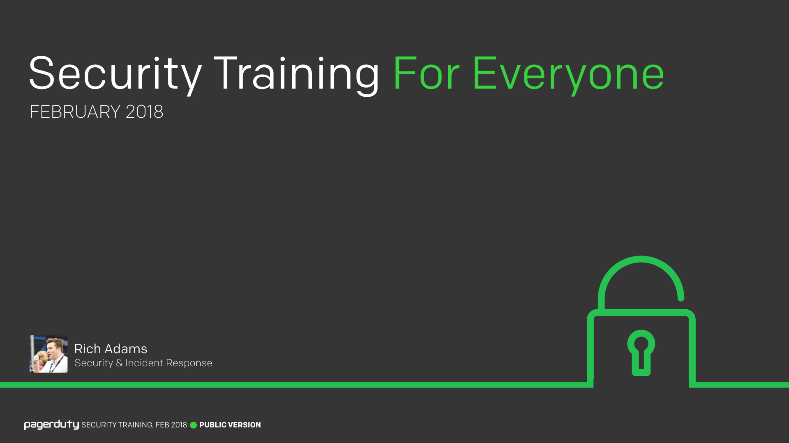
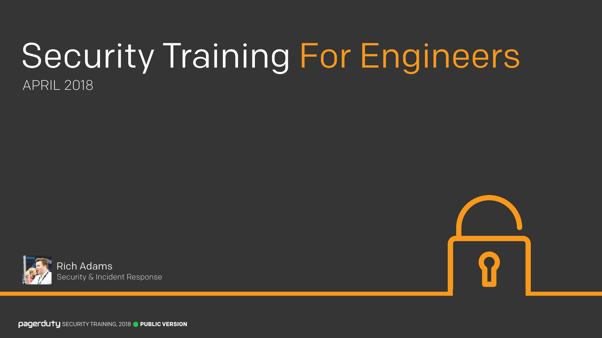

We run two internal employee security training courses at PagerDuty; one [for everyone](/for_everyone/) covering a variety of general security topics relevant to all employees, and one [for engineers](/for_engineers/) covering more technical security concepts relevant to those in our engineering department. This site provides all of the public material for both of these courses.

To learn more about the philosophy behind our security training program, and why we decided to build our own, you can read "[Our Approach to Employee Security Training](https://www.pagerduty.com/blog/security-training-at-pagerduty)", which provides more insights and background into our training program. To jump straight in, click one of the images below to view the relevant training course.

_These are training sessions that we have developed in-house and deliver ourselves. Your mileage may vary as to how useful they are for your own organizations. It is our hope that at the very least they can provide some insight into how we deliver our internal training and help you to develop your own training programs._

!!!question "Spotted a Problem?"
    Security is hard, and we're not perfect. There may be mistakes or misunderstandings in this training material. If you find a problem, please help us correct it! This project is [open-source on GitHub](https://github.com/pagerduty/security-training) and we appreciate all friendly contributions.
