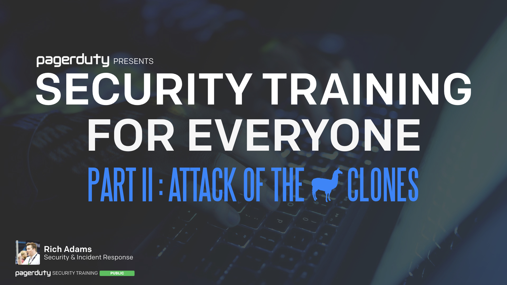

This site contains the open-source versions of PagerDuty's internal employee security training courses. It contains all of the public materials for our courses, including PDF exports of the slides, and the original [Keynote](https://www.apple.com/keynote/) files so you can adapt them more easily for your own organizations.

We run two types of internal employee security training courses; one [for everyone](#security-training-for-everyone) covering a variety of general security topics relevant to all employees, and one [for engineers](#security-training-for-engineers) covering more technical security concepts relevant to those in our engineering org.

To learn more about the philosophy behind our security training program, and why we decided to build our own, you can read "[Our Approach to Employee Security Training](https://www.pagerduty.com/blog/security-training-at-pagerduty)", which provides more insights and background into our training program.

???+ standalone ""
    _These are training sessions that we have developed in-house and deliver ourselves. Your mileage may vary as to how useful they are for your own organizations. It is our hope that at the very least they can provide some insight into how we deliver our internal training and help you to develop your own training programs._

## Security Training For Everyone

Our "For Everyone" course covers a variety of general security topics relevant to all employees. It is delivered annually to all PagerDuty employees, contractors, and interns. Since 2018 we have produced a new "part" each year in order to keep the material fresh for employees who have already been through the training. The overall lessons are the same, but we dive deeper into different topics each year. Click the slides below to view the relevant course,

## Security Training For Engineers

Our "For Engineers" course covers more technical security concepts relevant to those in the PagerDuty engineering department. While the topics are more technical in nature, the training is designed to be understood by anyone, whether you're a seasoned engineer or just starting out in your career. Click the slide below to view the course,

---

!!!question "Spotted a Problem?"
    Security is hard, and we're not perfect. There may be mistakes or misunderstandings in our training material. If you find a problem, please help us correct it! This project is [open-source on GitHub](https://github.com/pagerduty/security-training) and we appreciate all friendly contributions.

## Posters

To add a little more fun to our trainings, we like to advertise them around the PagerDuty offices with some custom movie posters. Everyone usually gets a kick out of them, so we thought it would be fun to share them here too. These are the US versions of the posters. We also make localized ones for our global offices, usually just to misspell "humo(u)r" for each region so that no one feels left out. We haven't gone as far as making a French language version for our Toronto office just yet, but maybe next year.

